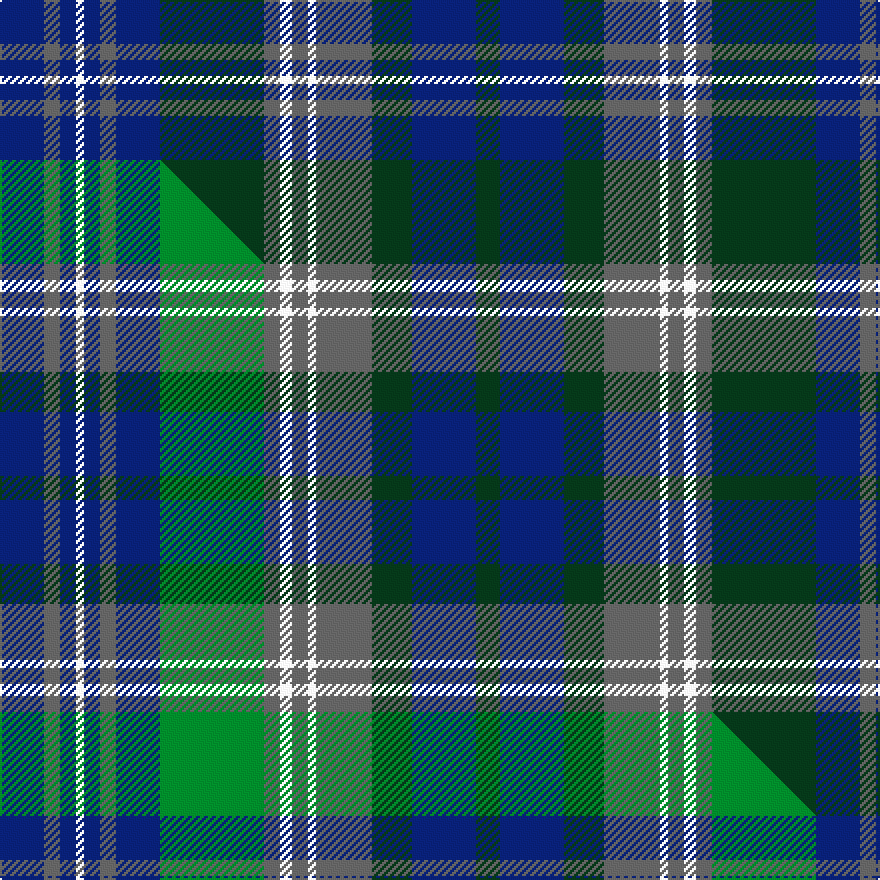

This is one **variant** — a specific cloth: this exact thread count and colourway, with its own
provenance below. It is one weaving of the [sett](/setts/db11n4db4w2db4n4db11dg26n4w3n4w2n14dg10db16dg6/) (the scale-free proportion — the
same cloth at any scale or shade), whose colour order is pattern [BBBWBBBGBWBWBGBG](/stripes/bbbwbbbgbwbwbgbg/).

Part of the [Stuart-Houghton Hunting](/tartans/stuart-houghton-hunting/) tartan — the named design grouping this sett with its other cloths.

Sourced from tartans-authority.  It is a [16 stripe tartan](/stripes/stripes16/).

Original link [https://www.tartanregister.gov.uk/tartanDetails.aspx?ref=11086](https://www.tartanregister.gov.uk/tartanDetails.aspx?ref=11086)

Dataset <small>— provenance for this record, inherited from the source manifest</small>

<dl class="dataset-prov">
<dt>source</dt><dd><a href="/sources/tartans-authority/">Scottish Tartans Authority</a></dd>
<dt>data captured from</dt><dd><a href="https://github.com/thetartan/tartan-database/blob/master/data/tartans-authority/data.csv">https://github.com/thetartan/tartan-database/blob/master/data/tartans-authority/data.csv</a></dd>
<dt>data date</dt><dd>2014 <small>(this record)</small></dd>
<dt>licence</dt><dd><a href="https://creativecommons.org/licenses/by-nc-nd/4.0/">CC BY-NC-ND 4.0</a></dd>
</dl>

Capture chain <small>— the hands this data passed through, oldest first; each capture carries its own licence</small>

<ol class="capture-chain">
<li><a href="https://www.tartansauthority.com/">Scottish Tartans Authority</a> <small>the heritage body's archive — its tartan-ferret record browser is retired (links repaired to the SRT, above)</small></li>
<li><a href="https://github.com/thetartan/tartan-database">thetartan/tartan-database</a> <small>2016-2017</small> · <a href="https://creativecommons.org/licenses/by-nc-nd/4.0/">CC BY-NC-ND 4.0</a> <small>Levko Kravets's frozen compilation — the capture we vendored, and where its CC licence text came from</small></li>
<li>this dictionary <small>captured 2026-06-10 · commit 5bf86c7566</small> <small>each re-capture is a git commit to data/sources</small></li>
</ol>

## Register references

External register numbers recorded for this tartan.

- Scottish Register of Tartans: [11086](https://www.tartanregister.gov.uk/tartanDetails?ref=11086)
- Scottish Tartans Authority (ITI): 11086

## Thread count
DB/22 N8 DB8 W4 DB8 N8 DB22 DG52 N8 W6 N8 W4 N28 DG20 DB32 DG/12

One full sett is **466 threads**.

## Palette
<table><thead><tr><th>Colour</th><th>Shade</th><th>OKLCh</th></tr></thead><tbody><tr><td>DB</td><td><code style="background-color:#082077;">#082077</code> <small style="color:#888">#082077</small></td><td><small style="color:#888">oklch(30.0% 0.149 265.1)</small></td></tr><tr><td>DG</td><td><code style="background-color:#053819;">#053819</code> <small style="color:#888">#053819</small></td><td><small style="color:#888">oklch(30.0% 0.075 151.3)</small></td></tr><tr><td>N</td><td><code style="background-color:#636363;">#636363</code> <small style="color:#888">#636363</small></td><td><small style="color:#888">oklch(50.0% 0.000 89.9)</small></td></tr><tr><td>W</td><td><code style="background-color:#F7F7F7;">#F7F7F7</code> <small style="color:#888">#F7F7F7</small></td><td><small style="color:#888">oklch(97.6% 0.000 89.9)</small></td></tr></tbody></table>

# Sample pattern

## Compared to the master

This cloth is one sett of its design; the master sett (the exemplar the design is anchored on) is below for comparison.

Its **ΔTartan distance** from the master is **1.20** — the same measure the nearest-tartans table ranks by (0 is identical; a re-scale of the same cloth is near 0, a recolour or a different proportion further).

<figure class="master-compare" style="margin:0">

this sett
master sett ★

<figcaption style="color:#888;font-size:smaller">One weave of this sett against the <a href="/setts/db11n4db4w2db4n4db11g26n4w3n4w2n14dg10db16dg6/">master sett ★</a>, split on the diagonal: a shared proportion runs seamlessly across it with only the shades shifting; a different proportion breaks on it.</figcaption>
</figure>

## Nearest tartan variants

The nearest existing variants by ΔTartan distance, with this cloth at the top so the swatches line up against it.

ΔTartan

Threads

Variant

Sett

—

466

<a href="/variants/s16/db11n4db4w2db4n4db11dg26n4w3n4w2n14dg10db16dg6~x2/">Stuart-Houghton Hunting (Personal)</a>

<a href="/ttd/edit/#slug=db11n4db4w2db4n4db11g26n4w3n4w2n14dg10db16dg6~x2&amp;base=db11n4db4w2db4n4db11dg26n4w3n4w2n14dg10db16dg6~x2" title="compare in the TTD">1.20</a>

466

<a href="/variants/s16/db11n4db4w2db4n4db11g26n4w3n4w2n14dg10db16dg6~x2/">Stuart-Houghton Hunting (Personal)</a>

<a href="/ttd/edit/#slug=dt4g2db10y1db2g13dt11g13db13y2~x2~dt1204274-db1406275&amp;base=db11n4db4w2db4n4db11dg26n4w3n4w2n14dg10db16dg6~x2" title="compare in the TTD">2.63</a>

272

<a href="/variants/s10/db4g2dbi10y1dbi2g13db11g13dbi13y2~x2~db1204274-dbi1406275/">Pinney's of Scotland</a>

<a href="/ttd/edit/#slug=db11do1db1do1db1do8g8do1g8do8db8do1db1~x2&amp;base=db11n4db4w2db4n4db11dg26n4w3n4w2n14dg10db16dg6~x2" title="compare in the TTD">2.67</a>

208

<a href="/variants/s13/db11do1db1do1db1do8g8do1g8do8db8do1db1~x2/">Tyneside Scottish District Tartan</a>

<a href="/ttd/edit/#slug=db21g2db3g2db2g14dy15g4dy15g14db14g2db3~x2&amp;base=db11n4db4w2db4n4db11dg26n4w3n4w2n14dg10db16dg6~x2" title="compare in the TTD">2.96</a>

396

<a href="/variants/s13/db21g2db3g2db2g14dy15g4dy15g14db14g2db3~x2/">Montmorency Family Tartan</a>

<a href="/ttd/edit/#slug=lo2db3dy3db4g16db3dy3db4g3db3dy16db4g3db3lo2~x2&amp;base=db11n4db4w2db4n4db11dg26n4w3n4w2n14dg10db16dg6~x2" title="compare in the TTD">3.01</a>

280

<a href="/variants/s15/lo2db3dy3db4g16db3dy3db4g3db3dy16db4g3db3lo2~x2/">Kerry, County</a>

<a href="/ttd/edit/#slug=y7db32dp4db4dp8db4dp8g32y3~x2&amp;base=db11n4db4w2db4n4db11dg26n4w3n4w2n14dg10db16dg6~x2" title="compare in the TTD">3.04</a>

388

<a href="/variants/s9/y7db32dp4db4dp8db4dp8g32y3~x2/">Children 1st (Corporate)</a>

<a href="/ttd/edit/#slug=dp23g2dp2g2dp2g12db16g1lb3g1db16g12dp16g1dy3~x2&amp;base=db11n4db4w2db4n4db11dg26n4w3n4w2n14dg10db16dg6~x2" title="compare in the TTD">3.08</a>

396

<a href="/variants/s15/dp23g2dp2g2dp2g12db16g1lb3g1db16g12dp16g1dy3~x2/">Pitlochry</a>

<a href="/ttd/edit/#slug=dy8g20db15dy6g4dy8db4dy6g20dy8db6dy4lb2dy4db6&amp;base=db11n4db4w2db4n4db11dg26n4w3n4w2n14dg10db16dg6~x2" title="compare in the TTD">3.15</a>

228

<a href="/variants/s15/dy8g20db15dy6g4dy8db4dy6g20dy8db6dy4lb2dy4db6/">Unidentified Fragment Artifact Tartan</a>

<a href="/ttd/edit/#slug=db10dr3db3dr6db26g12dr6g2dr3g6lo2~x2&amp;base=db11n4db4w2db4n4db11dg26n4w3n4w2n14dg10db16dg6~x2" title="compare in the TTD">3.26</a>

292

<a href="/variants/s11/db10dr3db3dr6db26g12dr6g2dr3g6lo2~x2/">Law of Atholl (Personal)</a>

<a href="/ttd/edit/#slug=dp23g2dp2g2dp2g12db16g1lb3g1db16g12dp16g1ly3~x2&amp;base=db11n4db4w2db4n4db11dg26n4w3n4w2n14dg10db16dg6~x2" title="compare in the TTD">3.27</a>

396

<a href="/variants/s15/dp23g2dp2g2dp2g12db16g1lb3g1db16g12dp16g1ly3~x2/">Pitlochry (District)</a>

## Neighbour map

Every grey dot is one of 13621 variants placed by the first two principal components of the ΔTartan feature space (42% of its variance). Red is this tartan; blue dots are its nearest — click one to open its page.

<svg viewBox="0 0 640 380" role="img" style="max-width:100%;height:auto;border:1px solid #e0e0e0;border-radius:4px;display:block" xmlns="http://www.w3.org/2000/svg"><image href="/nn/cloud.v1.png" width="640" height="380"/><a href="/variants/s16/db11n4db4w2db4n4db11g26n4w3n4w2n14dg10db16dg6~x2/"><circle cx="197.6" cy="184.3" r="4" fill="#3465a4"><title>Stuart-Houghton Hunting (Personal)</title></circle></a><a href="/variants/s10/db4g2dbi10y1dbi2g13db11g13dbi13y2~x2~db1204274-dbi1406275/"><circle cx="273.5" cy="233.6" r="4" fill="#3465a4"><title>Pinney's of Scotland</title></circle></a><a href="/variants/s13/db11do1db1do1db1do8g8do1g8do8db8do1db1~x2/"><circle cx="294.3" cy="228.8" r="4" fill="#3465a4"><title>Tyneside Scottish District Tartan</title></circle></a><a href="/variants/s13/db21g2db3g2db2g14dy15g4dy15g14db14g2db3~x2/"><circle cx="277.3" cy="233.1" r="4" fill="#3465a4"><title>Montmorency Family Tartan</title></circle></a><a href="/variants/s15/lo2db3dy3db4g16db3dy3db4g3db3dy16db4g3db3lo2~x2/"><circle cx="215.8" cy="209.2" r="4" fill="#3465a4"><title>Kerry, County</title></circle></a><a href="/variants/s9/y7db32dp4db4dp8db4dp8g32y3~x2/"><circle cx="263.0" cy="211.7" r="4" fill="#3465a4"><title>Children 1st (Corporate)</title></circle></a><a href="/variants/s15/dp23g2dp2g2dp2g12db16g1lb3g1db16g12dp16g1dy3~x2/"><circle cx="260.2" cy="149.7" r="4" fill="#3465a4"><title>Pitlochry</title></circle></a><a href="/variants/s15/dy8g20db15dy6g4dy8db4dy6g20dy8db6dy4lb2dy4db6/"><circle cx="235.6" cy="225.8" r="4" fill="#3465a4"><title>Unidentified Fragment Artifact Tartan</title></circle></a><a href="/variants/s11/db10dr3db3dr6db26g12dr6g2dr3g6lo2~x2/"><circle cx="311.3" cy="197.1" r="4" fill="#3465a4"><title>Law of Atholl (Personal)</title></circle></a><a href="/variants/s15/dp23g2dp2g2dp2g12db16g1lb3g1db16g12dp16g1ly3~x2/"><circle cx="251.1" cy="147.7" r="4" fill="#3465a4"><title>Pitlochry (District)</title></circle></a><circle cx="250.7" cy="202.0" r="5" fill="#c00000"/><text x="320" y="376" text-anchor="middle" font-size="11" fill="#999">ground</text><text x="11" y="190" text-anchor="middle" font-size="11" fill="#999" transform="rotate(-90 11 190)">complexity</text></svg>

ID: /variants/s16/db11n4db4w2db4n4db11dg26n4w3n4w2n14dg10db16dg6~x2/
