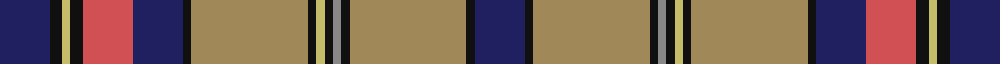

This page is one **sett** — a single exact thread-count. It belongs to the [tartan](/setts/db12k3ly2k3r12db12k2lo28k2ly2k2o2k2lo28k2db12/)
(the same proportion at any scale), whose colour order is pattern [BKYKRBKYKYKRKYKB](/stripes/bkykrbkykykrkykb/).

Part of the [Oneness](/tartans/oneness/) tartan — the named design grouping this sett with its other cloths.

Sourced from tartans-authority.  It is a [16 stripe tartan](/stripes/stripes16/).

Original link http://www.tartansauthority.com/tartan-ferret/display/11102/

## Register references

External register numbers recorded for this tartan.

- Scottish Register of Tartans: [11102](https://www.tartanregister.gov.uk/tartanDetails?ref=11102)
- Scottish Tartans Authority (ITI): 11102

## Thread count
DB/24 K6 LG4 K6 DO24 DB24 K4 LT56 K4 LG4 K4 N4 K4 LT56 K4 DB/24

One full sett is **456 threads**.

## Palette

Palette: <strong>Tartan Register</strong> <small style="color:#888">(5 of 6 colours)</small>
<table><thead><tr><th>Colour</th><th>Threads</th><th>Shade</th><th>Base</th><th>OKLCh</th></tr></thead><tbody><tr><td>DB/</td><td style="text-align:right;font-variant-numeric:tabular-nums">24</td><td><code style="background-color:#202060;">#202060</code> <small style="color:#888">#202060</small></td><td>B <code style="background-color:#2A418A;">#2A418A</code></td><td><small style="color:#888">oklch(28.9% 0.111 276.9)</small></td></tr><tr><td>K</td><td style="text-align:right;font-variant-numeric:tabular-nums">6</td><td><code style="background-color:#101010;">#101010</code> <small style="color:#888">#101010</small></td><td>K <code style="background-color:#000000;">#000000</code></td><td><small style="color:#888">oklch(17.3% 0.000 89.9)</small></td></tr><tr><td>LG</td><td style="text-align:right;font-variant-numeric:tabular-nums">4</td><td><code style="background-color:#C4BC68;">#C4BC68</code> <small style="color:#888">#C4BC68</small></td><td>Y <code style="background-color:#F2BF00;">#F2BF00</code></td><td><small style="color:#888">oklch(78.4% 0.107 103.7)</small></td></tr><tr><td>K</td><td style="text-align:right;font-variant-numeric:tabular-nums">6</td><td><code style="background-color:#101010;">#101010</code> <small style="color:#888">#101010</small></td><td>K <code style="background-color:#000000;">#000000</code></td><td><small style="color:#888">oklch(17.3% 0.000 89.9)</small></td></tr><tr><td>DO</td><td style="text-align:right;font-variant-numeric:tabular-nums">24</td><td><code style="background-color:#D05054;">#D05054</code> <small style="color:#888">#D05054</small></td><td>R <code style="background-color:#CC0000;">#CC0000</code></td><td><small style="color:#888">oklch(60.2% 0.162 21.5)</small></td></tr><tr><td>DB</td><td style="text-align:right;font-variant-numeric:tabular-nums">24</td><td><code style="background-color:#202060;">#202060</code> <small style="color:#888">#202060</small></td><td>B <code style="background-color:#2A418A;">#2A418A</code></td><td><small style="color:#888">oklch(28.9% 0.111 276.9)</small></td></tr><tr><td>K</td><td style="text-align:right;font-variant-numeric:tabular-nums">4</td><td><code style="background-color:#101010;">#101010</code> <small style="color:#888">#101010</small></td><td>K <code style="background-color:#000000;">#000000</code></td><td><small style="color:#888">oklch(17.3% 0.000 89.9)</small></td></tr><tr><td>LT</td><td style="text-align:right;font-variant-numeric:tabular-nums">56</td><td><code style="background-color:#A08858;">#A08858</code> <small style="color:#888">#A08858</small></td><td>Y <code style="background-color:#F2BF00;">#F2BF00</code></td><td><small style="color:#888">oklch(63.7% 0.071 84.0)</small></td></tr><tr><td>K</td><td style="text-align:right;font-variant-numeric:tabular-nums">4</td><td><code style="background-color:#101010;">#101010</code> <small style="color:#888">#101010</small></td><td>K <code style="background-color:#000000;">#000000</code></td><td><small style="color:#888">oklch(17.3% 0.000 89.9)</small></td></tr><tr><td>LG</td><td style="text-align:right;font-variant-numeric:tabular-nums">4</td><td><code style="background-color:#C4BC68;">#C4BC68</code> <small style="color:#888">#C4BC68</small></td><td>Y <code style="background-color:#F2BF00;">#F2BF00</code></td><td><small style="color:#888">oklch(78.4% 0.107 103.7)</small></td></tr><tr><td>K</td><td style="text-align:right;font-variant-numeric:tabular-nums">4</td><td><code style="background-color:#101010;">#101010</code> <small style="color:#888">#101010</small></td><td>K <code style="background-color:#000000;">#000000</code></td><td><small style="color:#888">oklch(17.3% 0.000 89.9)</small></td></tr><tr><td>N</td><td style="text-align:right;font-variant-numeric:tabular-nums">4</td><td><code style="background-color:#888888;">#888888</code> <small style="color:#888">#888888</small></td><td>R <code style="background-color:#CC0000;">#CC0000</code></td><td><small style="color:#888">oklch(62.7% 0.000 89.9)</small></td></tr><tr><td>K</td><td style="text-align:right;font-variant-numeric:tabular-nums">4</td><td><code style="background-color:#101010;">#101010</code> <small style="color:#888">#101010</small></td><td>K <code style="background-color:#000000;">#000000</code></td><td><small style="color:#888">oklch(17.3% 0.000 89.9)</small></td></tr><tr><td>LT</td><td style="text-align:right;font-variant-numeric:tabular-nums">56</td><td><code style="background-color:#A08858;">#A08858</code> <small style="color:#888">#A08858</small></td><td>Y <code style="background-color:#F2BF00;">#F2BF00</code></td><td><small style="color:#888">oklch(63.7% 0.071 84.0)</small></td></tr><tr><td>K</td><td style="text-align:right;font-variant-numeric:tabular-nums">4</td><td><code style="background-color:#101010;">#101010</code> <small style="color:#888">#101010</small></td><td>K <code style="background-color:#000000;">#000000</code></td><td><small style="color:#888">oklch(17.3% 0.000 89.9)</small></td></tr><tr><td>DB/</td><td style="text-align:right;font-variant-numeric:tabular-nums">24</td><td><code style="background-color:#202060;">#202060</code> <small style="color:#888">#202060</small></td><td>B <code style="background-color:#2A418A;">#2A418A</code></td><td><small style="color:#888">oklch(28.9% 0.111 276.9)</small></td></tr></tbody></table>

## Compared to the master

This cloth is one sett of its design; the master sett (the exemplar the design is anchored on) is below for comparison.

<figure style="margin:0"><figcaption style="color:#888;font-size:smaller">this sett</figcaption></figure>
<figure style="margin:0"><figcaption style="color:#888;font-size:smaller"><a href="/setts/db12k2loi28k2lr2k2lo2k2loi28k2db12r12k3lo2k3r12/">master sett →</a></figcaption></figure>

## Nearest tartans

The nearest existing variants by ΔTartan distance, with this tartan at the top so the swatches line up against it.

ΔTartan

Tartan

Sett

—

<a href="/ttd/edit/#slug=db12k3ly2k3r12db12k2lo28k2ly2k2o2k2lo28k2db12~x2">Oneness</a> <a class="nn-out" href="/variants/s16/db12k3ly2k3r12db12k2lo28k2ly2k2o2k2lo28k2db12~x2/" title="open its dictionary page">↗</a>

0.64

<a href="/variants/s18/lo16k2lo6k2r2k2db15g1db1w2~x2/">Otago</a>

0.75

<a href="/ttd/edit/#slug=db12k2loi28k2lr2k2lo2k2loi28k2db12r12k3lo2k3r12~x2&amp;base=db12k3ly2k3r12db12k2lo28k2ly2k2o2k2lo28k2db12~x2">Oneness</a> <a class="nn-out" href="/variants/s16/db12k2loi28k2lr2k2lo2k2loi28k2db12r12k3lo2k3r12~x2/" title="open its dictionary page">↗</a>

0.97

<a href="/ttd/edit/#slug=t30y8r2k8ly2k8r2y8db11r2t10r3t2r2db3~x2&amp;base=db12k3ly2k3r12db12k2lo28k2ly2k2o2k2lo28k2db12~x2">Mungall Family Tartan</a> <a class="nn-out" href="/variants/s15/t30y8r2k8ly2k8r2y8db11r2t10r3t2r2db3~x2/" title="open its dictionary page">↗</a>

1.02

<a href="/ttd/edit/#slug=r4g1r1g5k1lo1k1lo1k6t1k1t15w1t1w1~x4&amp;base=db12k3ly2k3r12db12k2lo28k2ly2k2o2k2lo28k2db12~x2">Estes</a> <a class="nn-out" href="/variants/s15/r4g1r1g5k1lo1k1lo1k6t1k1t15w1t1w1~x4/" title="open its dictionary page">↗</a>

1.06

<a href="/ttd/edit/#slug=g15r1g8m3dp1m3w1m3dp1m3dp12r1g7ly1~x2&amp;base=db12k3ly2k3r12db12k2lo28k2ly2k2o2k2lo28k2db12~x2">Recycled Lamb, The</a> <a class="nn-out" href="/variants/s14/g15r1g8m3dp1m3w1m3dp1m3dp12r1g7ly1~x2/" title="open its dictionary page">↗</a>

1.09

<a href="/ttd/edit/#slug=db62lo3k3r15db18w3lo28o12k3o5lo5o5db6k12w8&amp;base=db12k3ly2k3r12db12k2lo28k2ly2k2o2k2lo28k2db12~x2">Clare County Crest (Fashion)</a> <a class="nn-out" href="/variants/s15/db62lo3k3r15db18w3lo28o12k3o5lo5o5db6k12w8/" title="open its dictionary page">↗</a>

1.12

<a href="/ttd/edit/#slug=dp5w1k1b14k1r12k1b14k1r5k1ly3~x2&amp;base=db12k3ly2k3r12db12k2lo28k2ly2k2o2k2lo28k2db12~x2">Saltcoats (Fashion)</a> <a class="nn-out" href="/variants/s12/dp5w1k1b14k1r12k1b14k1r5k1ly3~x2/" title="open its dictionary page">↗</a>

1.12

<a href="/ttd/edit/#slug=n31k4n4k4n4k4n6w5k4o3dp19o3n4r3~x2&amp;base=db12k3ly2k3r12db12k2lo28k2ly2k2o2k2lo28k2db12~x2">Sydney Academy</a> <a class="nn-out" href="/variants/s14/n31k4n4k4n4k4n6w5k4o3dp19o3n4r3~x2/" title="open its dictionary page">↗</a>

1.13

<a href="/ttd/edit/#slug=db2g6db27r2k2w2db2r24g23db2r2k2ly2~x2&amp;base=db12k3ly2k3r12db12k2lo28k2ly2k2o2k2lo28k2db12~x2">Olympic</a> <a class="nn-out" href="/variants/s13/db2g6db27r2k2w2db2r24g23db2r2k2ly2~x2/" title="open its dictionary page">↗</a>

1.13

<a href="/ttd/edit/#slug=lo16k2lo6k2r2k2db15g1db1w2~x2&amp;base=db12k3ly2k3r12db12k2lo28k2ly2k2o2k2lo28k2db12~x2">Otago (District)</a> <a class="nn-out" href="/variants/s10/lo16k2lo6k2r2k2db15g1db1w2~x2/" title="open its dictionary page">↗</a>

## Neighbour map

Every grey dot is one of 14360 variants placed by the first two principal components of the ΔTartan feature space (44% of its variance). Red is this tartan; blue dots are its nearest — click one to open its page.

<svg viewBox="0 0 640 380" role="img" style="max-width:100%;height:auto;border:1px solid #e0e0e0;border-radius:4px;display:block" xmlns="http://www.w3.org/2000/svg"><image href="/nn/cloud.v1.png" width="640" height="380"/><a href="/variants/s18/lo16k2lo6k2r2k2db15g1db1w2~x2/"><circle cx="177.3" cy="84.0" r="4" fill="#3465a4"><title>Otago</title></circle></a><a href="/variants/s16/db12k2loi28k2lr2k2lo2k2loi28k2db12r12k3lo2k3r12~x2/"><circle cx="171.2" cy="86.3" r="4" fill="#3465a4"><title>Oneness</title></circle></a><a href="/variants/s15/t30y8r2k8ly2k8r2y8db11r2t10r3t2r2db3~x2/"><circle cx="174.2" cy="110.5" r="4" fill="#3465a4"><title>Mungall Family Tartan</title></circle></a><a href="/variants/s15/r4g1r1g5k1lo1k1lo1k6t1k1t15w1t1w1~x4/"><circle cx="173.9" cy="81.5" r="4" fill="#3465a4"><title>Estes</title></circle></a><a href="/variants/s14/g15r1g8m3dp1m3w1m3dp1m3dp12r1g7ly1~x2/"><circle cx="247.7" cy="121.2" r="4" fill="#3465a4"><title>Recycled Lamb, The</title></circle></a><a href="/variants/s15/db62lo3k3r15db18w3lo28o12k3o5lo5o5db6k12w8/"><circle cx="203.3" cy="80.0" r="4" fill="#3465a4"><title>Clare County Crest (Fashion)</title></circle></a><a href="/variants/s12/dp5w1k1b14k1r12k1b14k1r5k1ly3~x2/"><circle cx="217.1" cy="114.1" r="4" fill="#3465a4"><title>Saltcoats (Fashion)</title></circle></a><a href="/variants/s14/n31k4n4k4n4k4n6w5k4o3dp19o3n4r3~x2/"><circle cx="229.0" cy="124.0" r="4" fill="#3465a4"><title>Sydney Academy</title></circle></a><a href="/variants/s13/db2g6db27r2k2w2db2r24g23db2r2k2ly2~x2/"><circle cx="166.2" cy="101.2" r="4" fill="#3465a4"><title>Olympic</title></circle></a><a href="/variants/s10/lo16k2lo6k2r2k2db15g1db1w2~x2/"><circle cx="206.5" cy="106.0" r="4" fill="#3465a4"><title>Otago (District)</title></circle></a><circle cx="194.2" cy="98.9" r="5" fill="#c00000"/></svg>

ID: /variants/s16/db12k3ly2k3r12db12k2lo28k2ly2k2o2k2lo28k2db12~x2/
