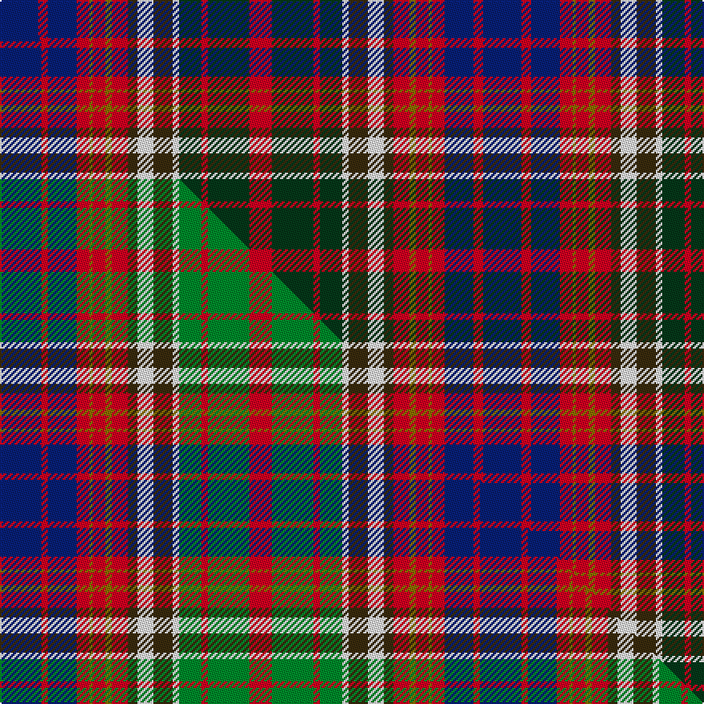

This is one **variant** — a specific cloth: this exact thread count and colourway, with its own
provenance below. It is one weaving of the [sett](/tartans/r/ri/riley-utter-union/) (the scale-free proportion — the
same cloth at any scale or shade), whose colour order is pattern [BRBRGRGRGWGWGRGR](/stripes/brbrgrgrgwgwgrgr/).

Part of the [Riley-Utter Union](/tartans/r/ri/riley-utter-union/) tartan — the named design grouping this sett with its other cloths.

Sourced from tartans-authority.  It is a [16 stripe tartan](/stripes/stripes16/).

Original link <code>http://www.tartansauthority.com/tartan-ferret/display/10842/</code> — retired · [Internet Archive copy](https://web.archive.org/web/*/http://www.tartansauthority.com/tartan-ferret/display/10842/*)

Dataset <small>— provenance for this record, inherited from the source manifest</small>

<dl class="dataset-prov">
<dt>source</dt><dd><a href="/sources/tartans-authority/">Scottish Tartans Authority</a></dd>
<dt>data captured from</dt><dd><a href="https://github.com/thetartan/tartan-database/blob/master/data/tartans-authority/data.csv">https://github.com/thetartan/tartan-database/blob/master/data/tartans-authority/data.csv</a></dd>
<dt>data date</dt><dd>2013 <small>(this record)</small></dd>
<dt>licence</dt><dd><a href="https://creativecommons.org/licenses/by-nc-nd/4.0/">CC BY-NC-ND 4.0</a></dd>
</dl>

Capture chain <small>— the hands this data passed through, oldest first; each capture carries its own licence</small>

<ol class="capture-chain">
<li><a href="https://www.tartansauthority.com/">Scottish Tartans Authority</a> <small>the heritage body’s archive — its tartan-ferret record browser is retired; dead record links are shown unlinked, with an Internet Archive copy (ITI numbers are not SRT references)</small></li>
<li><a href="https://github.com/thetartan/tartan-database">thetartan/tartan-database</a> <small>2016-2017</small> · <a href="https://creativecommons.org/licenses/by-nc-nd/4.0/">CC BY-NC-ND 4.0</a> <small>Levko Kravets's frozen compilation — the capture we vendored, and where its CC licence text came from</small></li>
<li>this dictionary <small>captured 2026-06-10 · commit 5bf86c7566</small> <small>each re-capture is a git commit to data/sources</small></li>
</ol>

## Register references

External register numbers recorded for this tartan.

- Scottish Register of Tartans: [10842](https://www.tartanregister.gov.uk/tartanDetails?ref=10842)
- Scottish Tartans Authority (ITI): 10842

## Thread count
DB/24 R6 DB18 R8 Y2 R8 Y4 R10 DY6 W10 DY12 W4 DG14 R4 DG26 R/14

One full sett is **302 threads**.

## Palette
<table><thead><tr><th>Colour</th><th>Shade</th><th>OKLCh</th></tr></thead><tbody><tr><td>DB</td><td><code style="background-color:#082077;">#082077</code> <small style="color:#888">#082077</small></td><td><small style="color:#888">oklch(30.0% 0.149 265.1)</small></td></tr><tr><td>DG</td><td><code style="background-color:#053819;">#053819</code> <small style="color:#888">#053819</small></td><td><small style="color:#888">oklch(30.0% 0.075 151.3)</small></td></tr><tr><td>R</td><td><code style="background-color:#D60020;">#D60020</code> <small style="color:#888">#D60020</small></td><td><small style="color:#888">oklch(55.2% 0.224 25.5)</small></td></tr><tr><td>DY</td><td><code style="background-color:#3A2B0D;">#3A2B0D</code> <small style="color:#888">#3A2B0D</small></td><td><small style="color:#888">oklch(30.0% 0.049 82.0)</small></td></tr><tr><td>W</td><td><code style="background-color:#F7F7F7;">#F7F7F7</code> <small style="color:#888">#F7F7F7</small></td><td><small style="color:#888">oklch(97.6% 0.000 89.9)</small></td></tr><tr><td>Y</td><td><code style="background-color:#8B6E00;">#8B6E00</code> <small style="color:#888">#8B6E00</small></td><td><small style="color:#888">oklch(55.1% 0.113 90.4)</small></td></tr></tbody></table>

# Sample pattern

## Compared to the master

This cloth is one sett of its design; the master sett (the exemplar the design is anchored on) is below for comparison.

Its **ΔTartan distance** from the master is **0.19** — the same measure the nearest-tartans table ranks by (0 is identical; a re-scale of the same cloth is near 0, a recolour or a different proportion further).

<figure class="master-compare" style="margin:0">

this sett
master sett ★

<figcaption style="color:#888;font-size:smaller">One weave of this sett against the <a href="/setts/db13r2db9r4y1r4y2r5dy3w5dy6w2g7r2g13r7/">master sett ★</a>, split on the diagonal: a shared proportion runs seamlessly across it with only the shades shifting; a different proportion breaks on it.</figcaption>
</figure>

## Nearest tartan variants

The nearest existing variants by ΔTartan distance, with this cloth at the top so the swatches line up against it.

ΔTartan

Threads

Variant

Sett

—

302

<a href="/variants/s16/db12r3db9r4y1r4y2r5dy3w5dy6w2dg7r2dg13r7~x2/">Riley-Utter Union (Personal)</a>

<a href="/ttd/edit/#slug=db13r2db9r4y1r4y2r5dy3w5dy6w2g7r2g13r7~x2&amp;base=db12r3db9r4y1r4y2r5dy3w5dy6w2dg7r2dg13r7~x2" title="compare in the TTD">0.19</a>

300

<a href="/variants/s16/db13r2db9r4y1r4y2r5dy3w5dy6w2g7r2g13r7~x2/">Riley-Utter Union (Personal)</a>

<a href="/ttd/edit/#slug=db12dg4r2y3g4dg4r20w4r14dg4g4y3r2dg4db12y2db8y2~x2~dg1503152-g2407139&amp;base=db12r3db9r4y1r4y2r5dy3w5dy6w2dg7r2dg13r7~x2" title="compare in the TTD">2.26</a>

404

<a href="/variants/s18/db12dg4r2y3g4dg4r20w4r14dg4g4y3r2dg4db12y2db8y2~x2~dg1503152-g2407139/">Béguinot, Stéphane (Personal)</a>

<a href="/ttd/edit/#slug=r26lb7dp8y3r3w3g20dp10w2~x2&amp;base=db12r3db9r4y1r4y2r5dy3w5dy6w2dg7r2dg13r7~x2" title="compare in the TTD">2.39</a>

272

<a href="/variants/s9/r26lb7dp8y3r3w3g20dp10w2~x2/">Wilson's No.227</a>

<a href="/ttd/edit/#slug=db24g4dg2g8dg2g4db12g3r22dy3lb8g3r22dy6~x2&amp;base=db12r3db9r4y1r4y2r5dy3w5dy6w2dg7r2dg13r7~x2" title="compare in the TTD">2.42</a>

432

<a href="/variants/s14/db24g4dg2g8dg2g4db12g3r22dy3lb8g3r22dy6~x2/">Devon 2000</a>

<a href="/ttd/edit/#slug=db24g4dg2g8dg2g4db12g3r22y3b8g3r22y6~x2&amp;base=db12r3db9r4y1r4y2r5dy3w5dy6w2dg7r2dg13r7~x2" title="compare in the TTD">2.59</a>

432

<a href="/variants/s14/db24g4dg2g8dg2g4db12g3r22y3b8g3r22y6~x2/">Devon 2000</a>

<a href="/ttd/edit/#slug=r6w1r6db2r6g12ly1db8t4r4~x4~r2109032-db1406275-ly3307090-t2405244&amp;base=db12r3db9r4y1r4y2r5dy3w5dy6w2dg7r2dg13r7~x2" title="compare in the TTD">2.65</a>

688

<a href="/variants/s18/r4t4db8ly1g12r6db2r6w1r6w1r6db2r6g12ly1db8t4~x4~r2109032-t2405244-db1406275-ly3307090/">Norwich No.057</a>

<a href="/ttd/edit/#slug=r5db1r5g13db8lb5r5w1db3~x2&amp;base=db12r3db9r4y1r4y2r5dy3w5dy6w2dg7r2dg13r7~x2" title="compare in the TTD">2.78</a>

168

<a href="/variants/s9/r5db1r5g13db8lb5r5w1db3~x2/">Norwich No.056</a>

<a href="/ttd/edit/#slug=r22y3db5ly2r2w2dg11db4w3~x2&amp;base=db12r3db9r4y1r4y2r5dy3w5dy6w2dg7r2dg13r7~x2" title="compare in the TTD">2.84</a>

166

<a href="/variants/s9/r22y3db5ly2r2w2dg11db4w3~x2/">Norwich No.014</a>

<a href="/ttd/edit/#slug=dt6r3dt10db14ly6lr18ly6db4ly2db4ly6lr18ly6db14dt10r3dt6lr4~x2&amp;base=db12r3db9r4y1r4y2r5dy3w5dy6w2dg7r2dg13r7~x2" title="compare in the TTD">3.09</a>

540

<a href="/variants/s18/dt6r3dt10db14ly6lr18ly6db4ly2db4ly6lr18ly6db14dt10r3dt6lr4~x2/">Gray, Hamilton John</a>

<a href="/ttd/edit/#slug=dg12g24db48r23w8r23db24y4g12dg12&amp;base=db12r3db9r4y1r4y2r5dy3w5dy6w2dg7r2dg13r7~x2" title="compare in the TTD">3.09</a>

356

<a href="/variants/s10/dg12g24db48r23w8r23db24y4g12dg12/">Swiss Highlander</a>

## Neighbour map

Every grey dot is one of 13657 variants placed by the first two principal components of the ΔTartan feature space (42% of its variance). Red is this tartan; blue dots are its nearest — click one to open its page. The map is a flat projection of a many-dimensional space — [how to read it](/posts/neighbourhood-maps/).

<svg viewBox="0 0 640 380" role="img" style="max-width:100%;height:auto;border:1px solid #e0e0e0;border-radius:4px;display:block" xmlns="http://www.w3.org/2000/svg"><image href="/nn/cloud.v1.png" width="640" height="380"/><a href="/variants/s16/db13r2db9r4y1r4y2r5dy3w5dy6w2g7r2g13r7~x2/"><circle cx="83.4" cy="152.2" r="4" fill="#3465a4"><title>Riley-Utter Union (Personal)</title></circle></a><a href="/variants/s18/db12dg4r2y3g4dg4r20w4r14dg4g4y3r2dg4db12y2db8y2~x2~dg1503152-g2407139/"><circle cx="131.5" cy="144.0" r="4" fill="#3465a4"><title>Béguinot, Stéphane (Personal)</title></circle></a><a href="/variants/s9/r26lb7dp8y3r3w3g20dp10w2~x2/"><circle cx="108.0" cy="139.2" r="4" fill="#3465a4"><title>Wilson's No.227</title></circle></a><a href="/variants/s14/db24g4dg2g8dg2g4db12g3r22dy3lb8g3r22dy6~x2/"><circle cx="147.5" cy="142.3" r="4" fill="#3465a4"><title>Devon 2000</title></circle></a><a href="/variants/s14/db24g4dg2g8dg2g4db12g3r22y3b8g3r22y6~x2/"><circle cx="157.3" cy="146.0" r="4" fill="#3465a4"><title>Devon 2000</title></circle></a><a href="/variants/s18/r4t4db8ly1g12r6db2r6w1r6w1r6db2r6g12ly1db8t4~x4~r2109032-t2405244-db1406275-ly3307090/"><circle cx="148.4" cy="156.4" r="4" fill="#3465a4"><title>Norwich No.057</title></circle></a><a href="/variants/s9/r5db1r5g13db8lb5r5w1db3~x2/"><circle cx="127.2" cy="166.5" r="4" fill="#3465a4"><title>Norwich No.056</title></circle></a><a href="/variants/s9/r22y3db5ly2r2w2dg11db4w3~x2/"><circle cx="112.3" cy="127.9" r="4" fill="#3465a4"><title>Norwich No.014</title></circle></a><a href="/variants/s18/dt6r3dt10db14ly6lr18ly6db4ly2db4ly6lr18ly6db14dt10r3dt6lr4~x2/"><circle cx="82.3" cy="179.5" r="4" fill="#3465a4"><title>Gray, Hamilton John</title></circle></a><a href="/variants/s10/dg12g24db48r23w8r23db24y4g12dg12/"><circle cx="137.9" cy="182.3" r="4" fill="#3465a4"><title>Swiss Highlander</title></circle></a><circle cx="90.4" cy="154.7" r="5" fill="#c00000"/><text x="320" y="376" text-anchor="middle" font-size="11" fill="#999">ground</text><text x="11" y="190" text-anchor="middle" font-size="11" fill="#999" transform="rotate(-90 11 190)">complexity</text></svg>

ID: /variants/s16/db12r3db9r4y1r4y2r5dy3w5dy6w2dg7r2dg13r7~x2/
