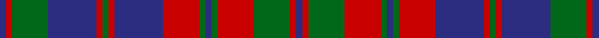

This is one **variant** — a specific cloth: this exact thread count and colourway, with its own
provenance below. It is one weaving of the [sett](/setts/db1r1g6db8r1g1r1db8r6g1db1g1r6g6r1db1/) (the scale-free proportion — the
same cloth at any scale or shade), whose colour order is pattern [BRGBRGRBRGBGRGRB](/stripes/brgbrgrbrgbgrgrb/).

Part of the [Crieff Hydro Hotel](/tartans/c/cr/crieff-hydro-hotel/) tartan — the named design grouping this sett with its other cloths.

Sourced from register-of-tartans.  It is a [16 stripe tartan](/stripes/stripes16/).

Original link [https://www.tartanregister.gov.uk/tartanDetails.aspx?ref=805](https://www.tartanregister.gov.uk/tartanDetails.aspx?ref=805)

2 attestations — the source records this cloth was collapsed from (oldest owns this page)

<ul>
<li>01/01/1990 — Crieff Hydro Hotel (register-of-tartans, <a href="https://www.tartanregister.gov.uk/tartanDetails.aspx?ref=805">record</a>)  <em>Instigated by Brian Wilton of the Scottish Tartans Authority and designed by Peter MacDonald for Crieff Hydro Hotel. Formed by changing the yellow of the Strathearn to blue (Wilsons' purple). Sample in Scottish Tartans Authority's Dalgety Collection.</em></li>
<li>pre 1990 — Crieff Hydro Hotel (Corporate) (tartans-authority, <a href="https://www.tartanregister.gov.uk/tartanDetails.aspx?ref=5166">record</a>)  <em>Instigated by Brian Wilton and designed by Peter MacDonald for Crieff Hydro Hotel. Formed by changing the yellow of the Strathearn to blue (Wilsons' purple). Sample in STA Dalgety Collection.</em></li>
</ul>

Dataset <small>— provenance for this record, inherited from the source manifest</small>

<dl class="dataset-prov">
<dt>source</dt><dd><a href="/sources/register-of-tartans/">Scottish Register of Tartans</a></dd>
<dt>data captured from</dt><dd><a href="https://github.com/thetartan/tartan-database/blob/master/data/register-of-tartans/data.csv">https://github.com/thetartan/tartan-database/blob/master/data/register-of-tartans/data.csv</a></dd>
<dt>data date</dt><dd>1990 <small>(this record)</small></dd>
<dt>licence</dt><dd><a href="https://www.tartanregister.gov.uk/copyright">Crown copyright</a></dd>
</dl>

Capture chain <small>— the hands this data passed through, oldest first; each capture carries its own licence</small>

<ol class="capture-chain">
<li><a href="https://www.tartanregister.gov.uk/">Scottish Register of Tartans</a> · <a href="https://www.tartanregister.gov.uk/copyright">Crown copyright</a> <small>the living register — still published by National Records of Scotland</small></li>
<li><a href="https://github.com/thetartan/tartan-database">thetartan/tartan-database</a> <small>2016-2017</small> · <a href="https://creativecommons.org/licenses/by-nc-nd/4.0/">CC BY-NC-ND 4.0</a> <small>Levko Kravets's frozen compilation — the capture we vendored, and where its CC licence text came from</small></li>
<li>this dictionary <small>captured 2026-06-10 · commit 5bf86c7566</small> <small>each re-capture is a git commit to data/sources</small></li>
</ol>

## Register references

External register numbers recorded for this tartan.

- Scottish Register of Tartans: [805](https://www.tartanregister.gov.uk/tartanDetails.aspx?ref=805)
- Scottish Tartans Authority (ITI): 5166

## Thread count
DB/4 R4 G24 DB32 R4 G4 R4 DB32 R24 G4 DB4 G4 R24 G24 R4 DB/4

One full sett is **392 threads**.

## Palette
<table><thead><tr><th>Colour</th><th>Shade</th><th>OKLCh</th></tr></thead><tbody><tr><td>DB</td><td><code style="background-color:#082077;">#082077</code> <small style="color:#888">#082077</small></td><td><small style="color:#888">oklch(30.0% 0.149 265.1)</small></td></tr><tr><td>DG</td><td><code style="background-color:#053819;">#053819</code> <small style="color:#888">#053819</small></td><td><small style="color:#888">oklch(30.0% 0.075 151.3)</small></td></tr><tr><td>DP</td><td><code style="background-color:#4B0B4F;">#4B0B4F</code> <small style="color:#888">#4B0B4F</small></td><td><small style="color:#888">oklch(30.1% 0.125 325.4)</small></td></tr><tr><td>G</td><td><code style="background-color:#008B2A;">#008B2A</code> <small style="color:#888">#008B2A</small></td><td><small style="color:#888">oklch(55.4% 0.170 145.9)</small></td></tr><tr><td>R</td><td><code style="background-color:#D60020;">#D60020</code> <small style="color:#888">#D60020</small></td><td><small style="color:#888">oklch(55.2% 0.224 25.5)</small></td></tr></tbody></table>

# Sample pattern

## Nearest tartan variants

The nearest existing variants by ΔTartan distance, with this cloth at the top so the swatches line up against it.

ΔTartan

Threads

Variant

Sett

—

392

<a href="/variants/s16/db1r1g6db8r1g1r1db8r6g1db1g1r6g6r1db1~x4/">Crieff Hydro Hotel</a>

<a href="/ttd/edit/#slug=db20r2db2r2g19r18g2r18g19db19r2db2~x2&amp;base=db1r1g6db8r1g1r1db8r6g1db1g1r6g6r1db1~x4" title="compare in the TTD">1.73</a>

456

<a href="/variants/s12/db20r2db2r2g19r18g2r18g19db19r2db2~x2/">Fraser of Stratherrick</a>

<a href="/ttd/edit/#slug=db16r4db4r4db4r29g27r4g27r29db26r4db4~x2&amp;base=db1r1g6db8r1g1r1db8r6g1db1g1r6g6r1db1~x4" title="compare in the TTD">1.78</a>

688

<a href="/variants/s13/db16r4db4r4db4r29g27r4g27r29db26r4db4~x2/">Black Watch (Band Plaid)</a>

<a href="/ttd/edit/#slug=db28r3db3r3g20r30g4r30g20db22r3db3~x2&amp;base=db1r1g6db8r1g1r1db8r6g1db1g1r6g6r1db1~x4" title="compare in the TTD">2.03</a>

614

<a href="/variants/s12/db28r3db3r3g20r30g4r30g20db22r3db3~x2/">Fraser Stewart of Athol</a>

<a href="/ttd/edit/#slug=lb2r3db3r5g14r3db2r5g2r3db14r5g3r3lb2~x2&amp;base=db1r1g6db8r1g1r1db8r6g1db1g1r6g6r1db1~x4" title="compare in the TTD">2.40</a>

268

<a href="/variants/s15/lb2r3db3r5g14r3db2r5g2r3db14r5g3r3lb2~x2/">Glen Orchy #1</a>

<a href="/ttd/edit/#slug=db16r2db2r2g14r13w2r13g14db14r2db2~x2&amp;base=db1r1g6db8r1g1r1db8r6g1db1g1r6g6r1db1~x4" title="compare in the TTD">2.52</a>

348

<a href="/variants/s12/db16r2db2r2g14r13w2r13g14db14r2db2~x2/">Fraser of Lovat</a>

<a href="/ttd/edit/#slug=r3g11r3db2lb2db11r2g2r2db11lb2db2r3g11r3db2~x2&amp;base=db1r1g6db8r1g1r1db8r6g1db1g1r6g6r1db1~x4" title="compare in the TTD">2.53</a>

278

<a href="/variants/s16/r3g11r3db2lb2db11r2g2r2db11lb2db2r3g11r3db2~x2/">Hebrides #6</a>

<a href="/ttd/edit/#slug=db20r2db2r2dg19r18dg2r18dg19db19r2db2~x2&amp;base=db1r1g6db8r1g1r1db8r6g1db1g1r6g6r1db1~x4" title="compare in the TTD">2.63</a>

456

<a href="/variants/s12/db20r2db2r2dg19r18dg2r18dg19db19r2db2~x2/">Fraser - 1800</a>

<a href="/ttd/edit/#slug=db11o1db1o1db1o8g8o1g8o8db8o1db1~x2&amp;base=db1r1g6db8r1g1r1db8r6g1db1g1r6g6r1db1~x4" title="compare in the TTD">2.64</a>

208

<a href="/variants/s13/db11o1db1o1db1o8g8o1g8o8db8o1db1~x2/">Tyneside, Scottish</a>

<a href="/ttd/edit/#slug=lb1r1db1r2g8r1db1r2g1r1db8r2g1r1lb1~x4&amp;base=db1r1g6db8r1g1r1db8r6g1db1g1r6g6r1db1~x4" title="compare in the TTD">2.65</a>

248

<a href="/variants/s15/lb1r1db1r2g8r1db1r2g1r1db8r2g1r1lb1~x4/">MacIntyre of Glenorchy Clan Tartan</a>

<a href="/ttd/edit/#slug=g6r2g2r18db9r3g3r3db9r3g24r2g2r4~x2&amp;base=db1r1g6db8r1g1r1db8r6g1db1g1r6g6r1db1~x4" title="compare in the TTD">2.70</a>

340

<a href="/variants/s14/g6r2g2r18db9r3g3r3db9r3g24r2g2r4~x2/">Stewart of Urrard Clan Tartan</a>

## Neighbour map

Every grey dot is one of 13621 variants placed by the first two principal components of the ΔTartan feature space (42% of its variance). Red is this tartan; blue dots are its nearest — click one to open its page. The map is a flat projection of a many-dimensional space — [how to read it](/posts/neighbourhood-maps/).

<svg viewBox="0 0 640 380" role="img" style="max-width:100%;height:auto;border:1px solid #e0e0e0;border-radius:4px;display:block" xmlns="http://www.w3.org/2000/svg"><image href="/nn/cloud.v1.png" width="640" height="380"/><a href="/variants/s12/db20r2db2r2g19r18g2r18g19db19r2db2~x2/"><circle cx="210.9" cy="203.9" r="4" fill="#3465a4"><title>Fraser of Stratherrick</title></circle></a><a href="/variants/s13/db16r4db4r4db4r29g27r4g27r29db26r4db4~x2/"><circle cx="222.0" cy="210.3" r="4" fill="#3465a4"><title>Black Watch (Band Plaid)</title></circle></a><a href="/variants/s12/db28r3db3r3g20r30g4r30g20db22r3db3~x2/"><circle cx="235.3" cy="200.3" r="4" fill="#3465a4"><title>Fraser Stewart of Athol</title></circle></a><a href="/variants/s15/lb2r3db3r5g14r3db2r5g2r3db14r5g3r3lb2~x2/"><circle cx="183.7" cy="189.3" r="4" fill="#3465a4"><title>Glen Orchy #1</title></circle></a><a href="/variants/s12/db16r2db2r2g14r13w2r13g14db14r2db2~x2/"><circle cx="177.2" cy="201.3" r="4" fill="#3465a4"><title>Fraser of Lovat</title></circle></a><a href="/variants/s16/r3g11r3db2lb2db11r2g2r2db11lb2db2r3g11r3db2~x2/"><circle cx="172.4" cy="198.8" r="4" fill="#3465a4"><title>Hebrides #6</title></circle></a><a href="/variants/s12/db20r2db2r2dg19r18dg2r18dg19db19r2db2~x2/"><circle cx="232.4" cy="207.7" r="4" fill="#3465a4"><title>Fraser - 1800</title></circle></a><a href="/variants/s13/db11o1db1o1db1o8g8o1g8o8db8o1db1~x2/"><circle cx="247.1" cy="204.0" r="4" fill="#3465a4"><title>Tyneside, Scottish</title></circle></a><a href="/variants/s15/lb1r1db1r2g8r1db1r2g1r1db8r2g1r1lb1~x4/"><circle cx="173.4" cy="168.1" r="4" fill="#3465a4"><title>MacIntyre of Glenorchy Clan Tartan</title></circle></a><a href="/variants/s14/g6r2g2r18db9r3g3r3db9r3g24r2g2r4~x2/"><circle cx="260.0" cy="175.7" r="4" fill="#3465a4"><title>Stewart of Urrard Clan Tartan</title></circle></a><circle cx="214.4" cy="192.5" r="5" fill="#c00000"/><text x="320" y="376" text-anchor="middle" font-size="11" fill="#999">ground</text><text x="11" y="190" text-anchor="middle" font-size="11" fill="#999" transform="rotate(-90 11 190)">complexity</text></svg>

ID: /variants/s16/db1r1g6db8r1g1r1db8r6g1db1g1r6g6r1db1~x4/
