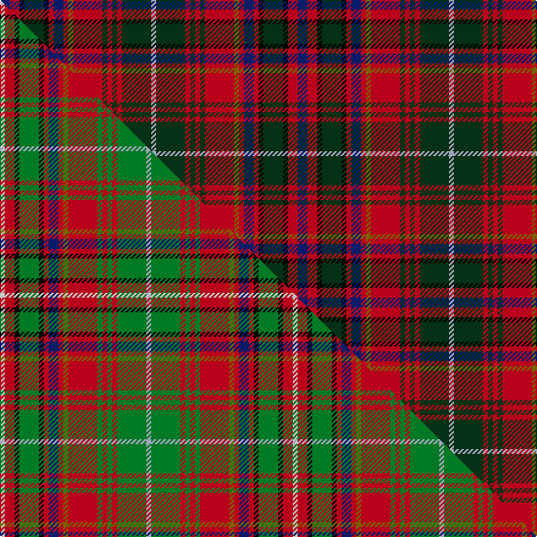

This is one **variant** — a specific cloth: this exact thread count and colourway, with its own
provenance below. It is one weaving of the [sett](/setts/db2r2k1dg4k1r1db2r1y1r6dg1r1dg1r1dg6lb1/) (the scale-free proportion — the
same cloth at any scale or shade), whose colour order is pattern [BRKGKRBRGRGRGRGW](/stripes/brkgkrbrgrgrgrgw/).

Part of the [MacInnes](/tartans/m/ma/macinnes/) tartan — the named design grouping this sett with its other cloths.

Sourced from tartans-authority.  It is a [16 stripe tartan](/stripes/stripes16/).

Original link [https://www.tartanregister.gov.uk/tartanDetails.aspx?ref=189](https://www.tartanregister.gov.uk/tartanDetails.aspx?ref=189)

Dataset <small>— provenance for this record, inherited from the source manifest</small>

<dl class="dataset-prov">
<dt>source</dt><dd><a href="/sources/tartans-authority/">Scottish Tartans Authority</a></dd>
<dt>data captured from</dt><dd><a href="https://github.com/thetartan/tartan-database/blob/master/data/tartans-authority/data.csv">https://github.com/thetartan/tartan-database/blob/master/data/tartans-authority/data.csv</a></dd>
<dt>data date</dt><dd>pre 1950 <small>(this record)</small></dd>
<dt>licence</dt><dd><a href="https://creativecommons.org/licenses/by-nc-nd/4.0/">CC BY-NC-ND 4.0</a></dd>
</dl>

Capture chain <small>— the hands this data passed through, oldest first; each capture carries its own licence</small>

<ol class="capture-chain">
<li><a href="https://www.tartansauthority.com/">Scottish Tartans Authority</a> <small>the heritage body's archive — its tartan-ferret record browser is retired (links repaired to the SRT, above)</small></li>
<li><a href="https://github.com/thetartan/tartan-database">thetartan/tartan-database</a> <small>2016-2017</small> · <a href="https://creativecommons.org/licenses/by-nc-nd/4.0/">CC BY-NC-ND 4.0</a> <small>Levko Kravets's frozen compilation — the capture we vendored, and where its CC licence text came from</small></li>
<li>this dictionary <small>captured 2026-06-10 · commit 5bf86c7566</small> <small>each re-capture is a git commit to data/sources</small></li>
</ol>

## Register references

External register numbers recorded for this tartan.

- Scottish Tartans Authority (ITI): 189

## Thread count
DB/8 R8 K4 DG16 K4 R4 DB8 R4 Y4 R24 DG4 R4 DG4 R4 DG24 LB/4

One full sett is **244 threads**.

## Palette
<table><thead><tr><th>Colour</th><th>Shade</th><th>OKLCh</th></tr></thead><tbody><tr><td>LB</td><td><code style="background-color:#B5BBDE;">#B5BBDE</code> <small style="color:#888">#B5BBDE</small></td><td><small style="color:#888">oklch(79.9% 0.050 277.6)</small></td></tr><tr><td>DG</td><td><code style="background-color:#053819;">#053819</code> <small style="color:#888">#053819</small></td><td><small style="color:#888">oklch(30.0% 0.075 151.3)</small></td></tr><tr><td>K</td><td><code style="background-color:#000000;">#000000</code> <small style="color:#888">#000000</small></td><td><small style="color:#888">oklch(0.0% 0.000 0.0)</small></td></tr><tr><td>DB</td><td><code style="background-color:#082077;">#082077</code> <small style="color:#888">#082077</small></td><td><small style="color:#888">oklch(30.0% 0.149 265.1)</small></td></tr><tr><td>R</td><td><code style="background-color:#D60020;">#D60020</code> <small style="color:#888">#D60020</small></td><td><small style="color:#888">oklch(55.2% 0.224 25.5)</small></td></tr><tr><td>Y</td><td><code style="background-color:#8B6E00;">#8B6E00</code> <small style="color:#888">#8B6E00</small></td><td><small style="color:#888">oklch(55.1% 0.113 90.4)</small></td></tr></tbody></table>

# Sample pattern

## Compared to the master

This cloth is one sett of its design; the master sett (the exemplar the design is anchored on) is below for comparison.

Its **ΔTartan distance** from the master is **0.42** — the same measure the nearest-tartans table ranks by (0 is identical; a re-scale of the same cloth is near 0, a recolour or a different proportion further).

<figure class="master-compare" style="margin:0">

this sett
master sett ★

<figcaption style="color:#888;font-size:smaller">One weave of this sett against the <a href="/setts/w1r2k1g4k1r1db2r1y1r6g1r1g1r1g6lb1/">master sett ★</a>, split on the diagonal: a shared proportion runs seamlessly across it with only the shades shifting; a different proportion breaks on it.</figcaption>
</figure>

## Nearest tartan variants

The nearest existing variants by ΔTartan distance, with this cloth at the top so the swatches line up against it.

ΔTartan

Threads

Variant

Sett

—

244

<a href="/variants/s16/db2r2k1dg4k1r1db2r1y1r6dg1r1dg1r1dg6lb1~x4/">MacInnes (MacGregor Hastie) (Clan)</a>

<a href="/ttd/edit/#slug=w1r2k1g4k1r1db2r1y1r6g1r1g1r1g6lb1~x4&amp;base=db2r2k1dg4k1r1db2r1y1r6dg1r1dg1r1dg6lb1~x4" title="compare in the TTD">0.42</a>

240

<a href="/variants/s16/w1r2k1g4k1r1db2r1y1r6g1r1g1r1g6lb1~x4/">MacInnes (MacGregor-Hastie)</a>

<a href="/ttd/edit/#slug=r14g3r14g13y2k14db6k2db2k2db6r9w2k2r2~x2&amp;base=db2r2k1dg4k1r1db2r1y1r6dg1r1dg1r1dg6lb1~x4" title="compare in the TTD">2.12</a>

340

<a href="/variants/s15/r14g3r14g13y2k14db6k2db2k2db6r9w2k2r2~x2/">MacPherson #8</a>

<a href="/ttd/edit/#slug=r6db1r6g8y1k6db4k1db2k1db4r4w1k1r1~x2&amp;base=db2r2k1dg4k1r1db2r1y1r6dg1r1dg1r1dg6lb1~x4" title="compare in the TTD">2.34</a>

174

<a href="/variants/s15/r6db1r6g8y1k6db4k1db2k1db4r4w1k1r1~x2/">MacPherson Clan Tartan</a>

<a href="/ttd/edit/#slug=db8k1r4k1r4k1r4k1g8k1y1r1w1~x2&amp;base=db2r2k1dg4k1r1db2r1y1r6dg1r1dg1r1dg6lb1~x4" title="compare in the TTD">2.39</a>

126

<a href="/variants/s13/db8k1r4k1r4k1r4k1g8k1y1r1w1~x2/">Unidentified No 158 Silk Fragment</a>

<a href="/ttd/edit/#slug=g8k1ly1r1w1db8k1r4k1r4k1r4k1~x2~db1406275&amp;base=db2r2k1dg4k1r1db2r1y1r6dg1r1dg1r1dg6lb1~x4" title="compare in the TTD">2.40</a>

126

<a href="/variants/s13/g8k1ly1r1w1db8k1r4k1r4k1r4k1~x2~db1406275/">Norwich No.158</a>

<a href="/ttd/edit/#slug=db6ly1db1dg1db1dg1db1dg5k1dg1k1dg1k1dg1k1dg6r5db2r2g1r5~x4~dg1806142-g2408144&amp;base=db2r2k1dg4k1r1db2r1y1r6dg1r1dg1r1dg6lb1~x4" title="compare in the TTD">2.45</a>

316

<a href="/variants/s21/db6ly1db1dg1db1dg1db1dg5k1dg1k1dg1k1dg1k1dg6r5db2r2g1r5~x4~dg1806142-g2408144/">Recovery (Corporate)</a>

<a href="/ttd/edit/#slug=db6k1db1dg1db1dg1db1dg5k1dg1k1dg1k1dg1k1dg6r5db2r2g1r5~x4~dg1806142-g2408144&amp;base=db2r2k1dg4k1r1db2r1y1r6dg1r1dg1r1dg6lb1~x4" title="compare in the TTD">2.46</a>

316

<a href="/variants/s21/db6k1db1dg1db1dg1db1dg5k1dg1k1dg1k1dg1k1dg6r5db2r2g1r5~x4~dg1806142-g2408144/">Recovery</a>

<a href="/ttd/edit/#slug=w5k3g15r3db6r15b3r3b3r3db3r15g15k3~x2&amp;base=db2r2k1dg4k1r1db2r1y1r6dg1r1dg1r1dg6lb1~x4" title="compare in the TTD">2.51</a>

364

<a href="/variants/s14/w5k3g15r3db6r15b3r3b3r3db3r15g15k3~x2/">MacGuire</a>

<a href="/ttd/edit/#slug=w3k12r2k2r2k2r12y2r3db6r3k2g10k2r3w2&amp;base=db2r2k1dg4k1r1db2r1y1r6dg1r1dg1r1dg6lb1~x4" title="compare in the TTD">2.52</a>

131

<a href="/variants/s16/w3k12r2k2r2k2r12y2r3db6r3k2g10k2r3w2/">Innes D</a>

<a href="/ttd/edit/#slug=w7k24r4k4r4k4r24y4r6db12r6k4g20k4r6w4&amp;base=db2r2k1dg4k1r1db2r1y1r6dg1r1dg1r1dg6lb1~x4" title="compare in the TTD">2.57</a>

263

<a href="/variants/s16/w7k24r4k4r4k4r24y4r6db12r6k4g20k4r6w4/">Innes</a>

## Neighbour map

Every grey dot is one of 13621 variants placed by the first two principal components of the ΔTartan feature space (42% of its variance). Red is this tartan; blue dots are its nearest — click one to open its page. The map is a flat projection of a many-dimensional space — [how to read it](/posts/neighbourhood-maps/).

<svg viewBox="0 0 640 380" role="img" style="max-width:100%;height:auto;border:1px solid #e0e0e0;border-radius:4px;display:block" xmlns="http://www.w3.org/2000/svg"><image href="/nn/cloud.v1.png" width="640" height="380"/><a href="/variants/s16/w1r2k1g4k1r1db2r1y1r6g1r1g1r1g6lb1~x4/"><circle cx="98.6" cy="131.3" r="4" fill="#3465a4"><title>MacInnes (MacGregor-Hastie)</title></circle></a><a href="/variants/s15/r14g3r14g13y2k14db6k2db2k2db6r9w2k2r2~x2/"><circle cx="96.9" cy="136.8" r="4" fill="#3465a4"><title>MacPherson #8</title></circle></a><a href="/variants/s15/r6db1r6g8y1k6db4k1db2k1db4r4w1k1r1~x2/"><circle cx="73.8" cy="139.7" r="4" fill="#3465a4"><title>MacPherson Clan Tartan</title></circle></a><a href="/variants/s13/db8k1r4k1r4k1r4k1g8k1y1r1w1~x2/"><circle cx="88.9" cy="132.3" r="4" fill="#3465a4"><title>Unidentified No 158 Silk Fragment</title></circle></a><a href="/variants/s13/g8k1ly1r1w1db8k1r4k1r4k1r4k1~x2~db1406275/"><circle cx="89.7" cy="132.1" r="4" fill="#3465a4"><title>Norwich No.158</title></circle></a><a href="/variants/s21/db6ly1db1dg1db1dg1db1dg5k1dg1k1dg1k1dg1k1dg6r5db2r2g1r5~x4~dg1806142-g2408144/"><circle cx="87.8" cy="139.8" r="4" fill="#3465a4"><title>Recovery (Corporate)</title></circle></a><a href="/variants/s21/db6k1db1dg1db1dg1db1dg5k1dg1k1dg1k1dg1k1dg6r5db2r2g1r5~x4~dg1806142-g2408144/"><circle cx="88.3" cy="139.7" r="4" fill="#3465a4"><title>Recovery</title></circle></a><a href="/variants/s14/w5k3g15r3db6r15b3r3b3r3db3r15g15k3~x2/"><circle cx="102.8" cy="164.2" r="4" fill="#3465a4"><title>MacGuire</title></circle></a><a href="/variants/s16/w3k12r2k2r2k2r12y2r3db6r3k2g10k2r3w2/"><circle cx="61.0" cy="135.0" r="4" fill="#3465a4"><title>Innes D</title></circle></a><a href="/variants/s16/w7k24r4k4r4k4r24y4r6db12r6k4g20k4r6w4/"><circle cx="58.2" cy="135.7" r="4" fill="#3465a4"><title>Innes</title></circle></a><circle cx="119.6" cy="148.2" r="5" fill="#c00000"/><text x="320" y="376" text-anchor="middle" font-size="11" fill="#999">ground</text><text x="11" y="190" text-anchor="middle" font-size="11" fill="#999" transform="rotate(-90 11 190)">complexity</text></svg>

ID: /variants/s16/db2r2k1dg4k1r1db2r1y1r6dg1r1dg1r1dg6lb1~x4/
