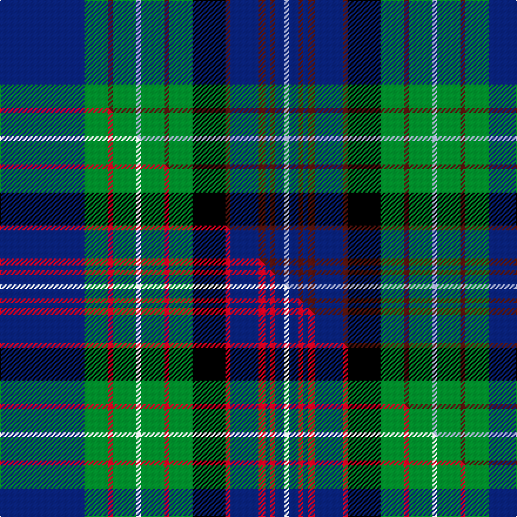

This is one **variant** — a specific cloth: this exact thread count and colourway, with its own
provenance below. It is one weaving of the [sett](/setts/db36g10dr2g10lb2g10dr2g10k14dr2db12dr3db2dr2db4lb2/) (the scale-free proportion — the
same cloth at any scale or shade), whose colour order is pattern [BGBGWGBGKBBBBBBW](/stripes/bgbgwgbgkbbbbbbw/).

Part of the [Rankin](/tartans/r/ra/rankin-2/) tartan — the named design grouping this sett with its other cloths.

Sourced from tartans-authority.  It is a [16 stripe tartan](/stripes/stripes16/).

Original link [https://www.tartanregister.gov.uk/tartanDetails.aspx?ref=188](https://www.tartanregister.gov.uk/tartanDetails.aspx?ref=188)

Dataset <small>— provenance for this record, inherited from the source manifest</small>

<dl class="dataset-prov">
<dt>source</dt><dd><a href="/sources/tartans-authority/">Scottish Tartans Authority</a></dd>
<dt>data captured from</dt><dd><a href="https://github.com/thetartan/tartan-database/blob/master/data/tartans-authority/data.csv">https://github.com/thetartan/tartan-database/blob/master/data/tartans-authority/data.csv</a></dd>
<dt>data date</dt><dd>1998 <small>(this record)</small></dd>
<dt>licence</dt><dd><a href="https://creativecommons.org/licenses/by-nc-nd/4.0/">CC BY-NC-ND 4.0</a></dd>
</dl>

Capture chain <small>— the hands this data passed through, oldest first; each capture carries its own licence</small>

<ol class="capture-chain">
<li><a href="https://www.tartansauthority.com/">Scottish Tartans Authority</a> <small>the heritage body's archive — its tartan-ferret record browser is retired (links repaired to the SRT, above)</small></li>
<li><a href="https://github.com/thetartan/tartan-database">thetartan/tartan-database</a> <small>2016-2017</small> · <a href="https://creativecommons.org/licenses/by-nc-nd/4.0/">CC BY-NC-ND 4.0</a> <small>Levko Kravets's frozen compilation — the capture we vendored, and where its CC licence text came from</small></li>
<li>this dictionary <small>captured 2026-06-10 · commit 5bf86c7566</small> <small>each re-capture is a git commit to data/sources</small></li>
</ol>

## Register references

External register numbers recorded for this tartan.

- Scottish Tartans Authority (ITI): 188

## Thread count
DB/72 G20 DR4 G20 LB4 G20 DR4 G20 K28 DR4 DB24 DR6 DB4 DR4 DB8 LB/4

One full sett is **416 threads**.

## Palette
<table><thead><tr><th>Colour</th><th>Shade</th><th>OKLCh</th></tr></thead><tbody><tr><td>DB</td><td><code style="background-color:#082077;">#082077</code> <small style="color:#888">#082077</small></td><td><small style="color:#888">oklch(30.0% 0.149 265.1)</small></td></tr><tr><td>DR</td><td><code style="background-color:#55120C;">#55120C</code> <small style="color:#888">#55120C</small></td><td><small style="color:#888">oklch(30.0% 0.099 29.3)</small></td></tr><tr><td>G</td><td><code style="background-color:#008B2A;">#008B2A</code> <small style="color:#888">#008B2A</small></td><td><small style="color:#888">oklch(55.4% 0.170 145.9)</small></td></tr><tr><td>K</td><td><code style="background-color:#000000;">#000000</code> <small style="color:#888">#000000</small></td><td><small style="color:#888">oklch(0.0% 0.000 0.0)</small></td></tr><tr><td>LB</td><td><code style="background-color:#B5BBDE;">#B5BBDE</code> <small style="color:#888">#B5BBDE</small></td><td><small style="color:#888">oklch(79.9% 0.050 277.6)</small></td></tr></tbody></table>

# Sample pattern

## Compared to the master

This cloth is one sett of its design; the master sett (the exemplar the design is anchored on) is below for comparison.

Its **ΔTartan distance** from the master is **0.62** — the same measure the nearest-tartans table ranks by (0 is identical; a re-scale of the same cloth is near 0, a recolour or a different proportion further).

<figure class="master-compare" style="margin:0">

this sett
master sett ★

<figcaption style="color:#888;font-size:smaller">One weave of this sett against the <a href="/setts/db36g10r2g10w2g10r2g10k14r2db12r3db2r2db4w2/">master sett ★</a>, split on the diagonal: a shared proportion runs seamlessly across it with only the shades shifting; a different proportion breaks on it.</figcaption>
</figure>

## Nearest tartan variants

The nearest existing variants by ΔTartan distance, with this cloth at the top so the swatches line up against it.

ΔTartan

Threads

Variant

Sett

—

416

<a href="/variants/s16/db36g10dr2g10lb2g10dr2g10k14dr2db12dr3db2dr2db4lb2~x2/">Rankin (1998) (Name)</a>

<a href="/ttd/edit/#slug=db36g10r2g10w2g10r2g10k14r2db12r3db2r2db4w2~x2&amp;base=db36g10dr2g10lb2g10dr2g10k14dr2db12dr3db2dr2db4lb2~x2" title="compare in the TTD">0.62</a>

416

<a href="/variants/s16/db36g10r2g10w2g10r2g10k14r2db12r3db2r2db4w2~x2/">Rankin</a>

<a href="/ttd/edit/#slug=dp4db5dp3db50k15g3k5g32w2g3w2g32k5g5k15db50dp3k5dp3&amp;base=db36g10dr2g10lb2g10dr2g10k14dr2db12dr3db2dr2db4lb2~x2" title="compare in the TTD">1.63</a>

477

<a href="/variants/s19/dp4db5dp3db50k15g3k5g32w2g3w2g32k5g5k15db50dp3k5dp3/">Spirit of Morningside</a>

<a href="/ttd/edit/#slug=g19k1dg3k1g3k9db20k1y1k7y1k1db21k12g2dg1~x2~g2408144-dg1806142&amp;base=db36g10dr2g10lb2g10dr2g10k14dr2db12dr3db2dr2db4lb2~x2" title="compare in the TTD">1.76</a>

372

<a href="/variants/s16/g19k1dg3k1g3k9db20k1y1k7y1k1db21k12g2dg1~x2~g2408144-dg1806142/">Hope Vere Family Tartan</a>

<a href="/ttd/edit/#slug=g30y2g5y2g4k15db29r2db29k15g5y2g4y2g17~x2&amp;base=db36g10dr2g10lb2g10dr2g10k14dr2db12dr3db2dr2db4lb2~x2" title="compare in the TTD">1.79</a>

558

<a href="/variants/s15/g30y2g5y2g4k15db29r2db29k15g5y2g4y2g17~x2/">Unidentified B'gowrie Unknown Tartan</a>

<a href="/ttd/edit/#slug=r1g11k4db2k1db1k1db14k1db1k1db2k4g11w1~x4&amp;base=db36g10dr2g10lb2g10dr2g10k14dr2db12dr3db2dr2db4lb2~x2" title="compare in the TTD">1.82</a>

440

<a href="/variants/s15/r1g11k4db2k1db1k1db14k1db1k1db2k4g11w1~x4/">MacKenzie</a>

<a href="/ttd/edit/#slug=db6k2db24k10g2o2g2o2g10k2lb3~x2&amp;base=db36g10dr2g10lb2g10dr2g10k14dr2db12dr3db2dr2db4lb2~x2" title="compare in the TTD">1.95</a>

242

<a href="/variants/s11/db6k2db24k10g2o2g2o2g10k2lb3~x2/">Scottish Rugby Union</a>

<a href="/ttd/edit/#slug=dr2k2db3lo1db20k1g18k1dr2db2k1db2k1db2k2g2k2dr2~x2&amp;base=db36g10dr2g10lb2g10dr2g10k14dr2db12dr3db2dr2db4lb2~x2" title="compare in the TTD">1.97</a>

256

<a href="/variants/s18/dr2k2db3lo1db20k1g18k1dr2db2k1db2k1db2k2g2k2dr2~x2/">Craig (Personal)</a>

<a href="/ttd/edit/#slug=db2b4r2g24db4g2db4k10b4db2b4g8db1k1db22b4db2r2~x2&amp;base=db36g10dr2g10lb2g10dr2g10k14dr2db12dr3db2dr2db4lb2~x2" title="compare in the TTD">2.02</a>

400

<a href="/variants/s18/db2b4r2g24db4g2db4k10b4db2b4g8db1k1db22b4db2r2~x2/">Couper / Cooper</a>

<a href="/ttd/edit/#slug=db28k4lb4k4db4k4g26k2y5k2g26k4db40k4r10&amp;base=db36g10dr2g10lb2g10dr2g10k14dr2db12dr3db2dr2db4lb2~x2" title="compare in the TTD">2.02</a>

296

<a href="/variants/s15/db28k4lb4k4db4k4g26k2y5k2g26k4db40k4r10/">Bailey, The House of</a>

<a href="/ttd/edit/#slug=db30lo2db2lo2db5g5k15db5g20dr2k3dr2g20db5k15g5db20lo2db2~x2~db1403246&amp;base=db36g10dr2g10lb2g10dr2g10k14dr2db12dr3db2dr2db4lb2~x2" title="compare in the TTD">2.02</a>

584

<a href="/variants/s19/db30lo2db2lo2db5g5k15db5g20dr2k3dr2g20db5k15g5db20lo2db2~x2~db1403246/">Pennsylvania American District Tartan</a>

## Neighbour map

Every grey dot is one of 13621 variants placed by the first two principal components of the ΔTartan feature space (42% of its variance). Red is this tartan; blue dots are its nearest — click one to open its page.

<svg viewBox="0 0 640 380" role="img" style="max-width:100%;height:auto;border:1px solid #e0e0e0;border-radius:4px;display:block" xmlns="http://www.w3.org/2000/svg"><image href="/nn/cloud.v1.png" width="640" height="380"/><a href="/variants/s16/db36g10r2g10w2g10r2g10k14r2db12r3db2r2db4w2~x2/"><circle cx="184.6" cy="102.8" r="4" fill="#3465a4"><title>Rankin</title></circle></a><a href="/variants/s19/dp4db5dp3db50k15g3k5g32w2g3w2g32k5g5k15db50dp3k5dp3/"><circle cx="202.9" cy="80.2" r="4" fill="#3465a4"><title>Spirit of Morningside</title></circle></a><a href="/variants/s16/g19k1dg3k1g3k9db20k1y1k7y1k1db21k12g2dg1~x2~g2408144-dg1806142/"><circle cx="174.9" cy="97.0" r="4" fill="#3465a4"><title>Hope Vere Family Tartan</title></circle></a><a href="/variants/s15/g30y2g5y2g4k15db29r2db29k15g5y2g4y2g17~x2/"><circle cx="167.7" cy="128.0" r="4" fill="#3465a4"><title>Unidentified B'gowrie Unknown Tartan</title></circle></a><a href="/variants/s15/r1g11k4db2k1db1k1db14k1db1k1db2k4g11w1~x4/"><circle cx="168.3" cy="114.9" r="4" fill="#3465a4"><title>MacKenzie</title></circle></a><a href="/variants/s11/db6k2db24k10g2o2g2o2g10k2lb3~x2/"><circle cx="173.4" cy="109.9" r="4" fill="#3465a4"><title>Scottish Rugby Union</title></circle></a><a href="/variants/s18/dr2k2db3lo1db20k1g18k1dr2db2k1db2k1db2k2g2k2dr2~x2/"><circle cx="215.7" cy="78.3" r="4" fill="#3465a4"><title>Craig (Personal)</title></circle></a><a href="/variants/s18/db2b4r2g24db4g2db4k10b4db2b4g8db1k1db22b4db2r2~x2/"><circle cx="176.8" cy="96.5" r="4" fill="#3465a4"><title>Couper / Cooper</title></circle></a><a href="/variants/s15/db28k4lb4k4db4k4g26k2y5k2g26k4db40k4r10/"><circle cx="169.7" cy="92.0" r="4" fill="#3465a4"><title>Bailey, The House of</title></circle></a><a href="/variants/s19/db30lo2db2lo2db5g5k15db5g20dr2k3dr2g20db5k15g5db20lo2db2~x2~db1403246/"><circle cx="177.6" cy="118.9" r="4" fill="#3465a4"><title>Pennsylvania American District Tartan</title></circle></a><circle cx="200.9" cy="110.3" r="5" fill="#c00000"/><text x="320" y="376" text-anchor="middle" font-size="11" fill="#999">ground</text><text x="11" y="190" text-anchor="middle" font-size="11" fill="#999" transform="rotate(-90 11 190)">complexity</text></svg>

ID: /variants/s16/db36g10dr2g10lb2g10dr2g10k14dr2db12dr3db2dr2db4lb2~x2/
