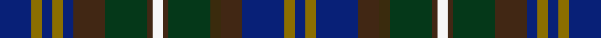

This is one **variant** — a specific cloth: this exact thread count and colourway, with its own
provenance below. It is one weaving of the [sett](/tartans/f/fo/forbes-of-druinnor/) (the scale-free proportion — the
same cloth at any scale or shade), whose colour order is pattern [BGBBGGBWBGBBGBGB](/stripes/bgbbggbwbgbbgbgb/).

Part of the [Forbes of Druinnor](/tartans/f/fo/forbes-of-druinnor/) tartan — the named design grouping this sett with its other cloths.

Sourced from tartans-authority.  It is a [16 stripe tartan](/stripes/stripes16/).

Original link <code>http://www.tartansauthority.com/tartan-ferret/display/592/</code> — retired · [Internet Archive copy](https://web.archive.org/web/*/http://www.tartansauthority.com/tartan-ferret/display/592/*)

Dataset <small>— provenance for this record, inherited from the source manifest</small>

<dl class="dataset-prov">
<dt>source</dt><dd><a href="/sources/tartans-authority/">Scottish Tartans Authority</a></dd>
<dt>data captured from</dt><dd><a href="https://github.com/thetartan/tartan-database/blob/master/data/tartans-authority/data.csv">https://github.com/thetartan/tartan-database/blob/master/data/tartans-authority/data.csv</a></dd>
<dt>data date</dt><dd>1968 <small>(this record)</small></dd>
<dt>licence</dt><dd><a href="https://creativecommons.org/licenses/by-nc-nd/4.0/">CC BY-NC-ND 4.0</a></dd>
</dl>

Capture chain <small>— the hands this data passed through, oldest first; each capture carries its own licence</small>

<ol class="capture-chain">
<li><a href="https://www.tartansauthority.com/">Scottish Tartans Authority</a> <small>the heritage body’s archive — its tartan-ferret record browser is retired; dead record links are shown unlinked, with an Internet Archive copy (ITI numbers are not SRT references)</small></li>
<li><a href="https://github.com/thetartan/tartan-database">thetartan/tartan-database</a> <small>2016-2017</small> · <a href="https://creativecommons.org/licenses/by-nc-nd/4.0/">CC BY-NC-ND 4.0</a> <small>Levko Kravets's frozen compilation — the capture we vendored, and where its CC licence text came from</small></li>
<li>this dictionary <small>captured 2026-06-10 · commit 5bf86c7566</small> <small>each re-capture is a git commit to data/sources</small></li>
</ol>

## Register references

External register numbers recorded for this tartan.

- Scottish Tartans Authority (ITI): 592

## Thread count
DB/12 Y4 DB4 Y4 DB4 DO12 DG16 DO2 W4 DO2 DG16 DY4 DO8 DB16 Y4 DB/4

One full sett is **216 threads**.

## Palette
<table><thead><tr><th>Colour</th><th>Shade</th><th>OKLCh</th></tr></thead><tbody><tr><td>DB</td><td><code style="background-color:#082077;">#082077</code> <small style="color:#888">#082077</small></td><td><small style="color:#888">oklch(30.0% 0.149 265.1)</small></td></tr><tr><td>DG</td><td><code style="background-color:#053819;">#053819</code> <small style="color:#888">#053819</small></td><td><small style="color:#888">oklch(30.0% 0.075 151.3)</small></td></tr><tr><td>Y</td><td><code style="background-color:#8B6E00;">#8B6E00</code> <small style="color:#888">#8B6E00</small></td><td><small style="color:#888">oklch(55.1% 0.113 90.4)</small></td></tr><tr><td>DO</td><td><code style="background-color:#412714;">#412714</code> <small style="color:#888">#412714</small></td><td><small style="color:#888">oklch(30.1% 0.050 55.7)</small></td></tr><tr><td>DY</td><td><code style="background-color:#3A2B0D;">#3A2B0D</code> <small style="color:#888">#3A2B0D</small></td><td><small style="color:#888">oklch(30.0% 0.049 82.0)</small></td></tr><tr><td>W</td><td><code style="background-color:#F7F7F7;">#F7F7F7</code> <small style="color:#888">#F7F7F7</small></td><td><small style="color:#888">oklch(97.6% 0.000 89.9)</small></td></tr></tbody></table>

# Sample pattern

[Sample sheet (PDF)](swatch.pdf) — the woven sample, thread count and palette on one printable A4, rendered on demand (the same sheet the TTD print page downloads).

## Nearest tartan variants

The nearest existing variants by ΔTartan distance, with this cloth at the top so the swatches line up against it.

ΔTartan

Threads

Variant

Sett

—

216

<a href="/variants/s16/db6y2db2y2db2do6dg8do1w2do1dg8dy2do4db8y2db2~x2/">Forbes of Druinnor (Artefact)</a>

<a href="/ttd/edit/#slug=db6ly2db2ly2db2do6g8do1w2do1g8dy2do4db8ly2db2~x2&amp;base=db6y2db2y2db2do6dg8do1w2do1dg8dy2do4db8y2db2~x2" title="compare in the TTD">0.16</a>

216

<a href="/variants/s16/db6ly2db2ly2db2do6g8do1w2do1g8dy2do4db8ly2db2~x2/">Forbes of Druminnor Artifact Tartan</a>

<a href="/ttd/edit/#slug=o8dti8o4dti28dt12n6dt12dr4n8dr4n29lb6~o62-dti2705249-dt22-n47&amp;base=db6y2db2y2db2do6dg8do1w2do1dg8dy2do4db8y2db2~x2" title="compare in the TTD">2.98</a>

244

<a href="/variants/s12/o8dti8o4dti28dt12n6dt12dr4n8dr4n29lb6~o62-dti2705249-dt22-n47/">Kinloch Anderson Granite (Corporate)</a>

<a href="/ttd/edit/#slug=g2dg2db5dg4db10t15dg10dr12dg6g4dg6dr12dg10t18lb2db2t18db1g2&amp;base=db6y2db2y2db2do6dg8do1w2do1dg8dy2do4db8y2db2~x2" title="compare in the TTD">3.44</a>

278

<a href="/variants/s19/g2dg2db5dg4db10t15dg10dr12dg6g4dg6dr12dg10t18lb2db2t18db1g2/">Watkins (Welsh Name)</a>

<a href="/ttd/edit/#slug=db30r6dy16dp8g10dp14g24y4dy10dp3dy28&amp;base=db6y2db2y2db2do6dg8do1w2do1dg8dy2do4db8y2db2~x2" title="compare in the TTD">3.52</a>

248

<a href="/variants/s11/db30r6dy16dp8g10dp14g24y4dy10dp3dy28/">Greyfriars</a>

<a href="/ttd/edit/#slug=dr3db14b14db2dr14db2dr14db2g14db2y3~x2&amp;base=db6y2db2y2db2do6dg8do1w2do1dg8dy2do4db8y2db2~x2" title="compare in the TTD">3.55</a>

324

<a href="/variants/s11/dr3db14b14db2dr14db2dr14db2g14db2y3~x2/">Clare</a>

<a href="/ttd/edit/#slug=db9dt8g1dt1g1dt1g8dg2g8dt1g1dt1g1dt8db9n1~x4&amp;base=db6y2db2y2db2do6dg8do1w2do1dg8dy2do4db8y2db2~x2" title="compare in the TTD">3.70</a>

448

<a href="/variants/s16/db9dt8g1dt1g1dt1g8dg2g8dt1g1dt1g1dt8db9n1~x4/">Cowal Highland Games Corporate Tartan</a>

<a href="/ttd/edit/#slug=dg15g3dr2g3dg8t12db20r2db4~x2~t5211240-db2609279&amp;base=db6y2db2y2db2do6dg8do1w2do1dg8dy2do4db8y2db2~x2" title="compare in the TTD">3.77</a>

238

<a href="/variants/s9/dg15g3dr2g3dg8t12db20r2db4~x2~t5211240-db2609279/">Westbrook (2013)</a>

<a href="/ttd/edit/#slug=dr6db2dg3db3r2g18dr2db16dr18dbi3dr3dbi2dr2db6~x2~db2609279-dbi3514276&amp;base=db6y2db2y2db2do6dg8do1w2do1dg8dy2do4db8y2db2~x2" title="compare in the TTD">3.77</a>

320

<a href="/variants/s14/dr6db2dg3db3r2g18dr2db16dr18dbi3dr3dbi2dr2db6~x2~db2609279-dbi3514276/">Minster</a>

<a href="/ttd/edit/#slug=g4db4r4db2g12db2g12db2r4g4w1ri4dbi2r4db4dbi4db4r4db2dbi12db2~x2~db3409246-r4315012-ri6016021-dbi3514276&amp;base=db6y2db2y2db2do6dg8do1w2do1dg8dy2do4db8y2db2~x2" title="compare in the TTD">3.80</a>

360

<a href="/variants/s21/g4db4r4db2g12db2g12db2r4g4w1ri4dbi2r4db4dbi4db4r4db2dbi12db2~x2~db3409246-r4315012-ri6016021-dbi3514276/">Otago Peninsula Corporate Tartan</a>

<a href="/ttd/edit/#slug=g3dp3n2db14g16dp18n2dp3n14db4y3lo1n2~x2&amp;base=db6y2db2y2db2do6dg8do1w2do1dg8dy2do4db8y2db2~x2" title="compare in the TTD">3.81</a>

330

<a href="/variants/s13/g3dp3n2db14g16dp18n2dp3n14db4y3lo1n2~x2/">ENABLE Scotland</a>

## Neighbour map

Every grey dot is one of 13662 variants placed by the first two principal components of the ΔTartan feature space (42% of its variance). Red is this tartan; blue dots are its nearest — click one to open its page. The map is a flat projection of a many-dimensional space — [how to read it](/posts/neighbourhood-maps/).

<svg viewBox="0 0 640 380" role="img" style="max-width:100%;height:auto;border:1px solid #e0e0e0;border-radius:4px;display:block" xmlns="http://www.w3.org/2000/svg"><image href="/nn/cloud.v1.png" width="640" height="380"/><a href="/variants/s16/db6ly2db2ly2db2do6g8do1w2do1g8dy2do4db8ly2db2~x2/"><circle cx="122.8" cy="188.6" r="4" fill="#3465a4"><title>Forbes of Druminnor Artifact Tartan</title></circle></a><a href="/variants/s12/o8dti8o4dti28dt12n6dt12dr4n8dr4n29lb6~o62-dti2705249-dt22-n47/"><circle cx="188.3" cy="208.8" r="4" fill="#3465a4"><title>Kinloch Anderson Granite (Corporate)</title></circle></a><a href="/variants/s19/g2dg2db5dg4db10t15dg10dr12dg6g4dg6dr12dg10t18lb2db2t18db1g2/"><circle cx="205.6" cy="167.9" r="4" fill="#3465a4"><title>Watkins (Welsh Name)</title></circle></a><a href="/variants/s11/db30r6dy16dp8g10dp14g24y4dy10dp3dy28/"><circle cx="172.0" cy="202.1" r="4" fill="#3465a4"><title>Greyfriars</title></circle></a><a href="/variants/s11/dr3db14b14db2dr14db2dr14db2g14db2y3~x2/"><circle cx="207.8" cy="226.8" r="4" fill="#3465a4"><title>Clare</title></circle></a><a href="/variants/s16/db9dt8g1dt1g1dt1g8dg2g8dt1g1dt1g1dt8db9n1~x4/"><circle cx="234.0" cy="203.5" r="4" fill="#3465a4"><title>Cowal Highland Games Corporate Tartan</title></circle></a><a href="/variants/s9/dg15g3dr2g3dg8t12db20r2db4~x2~t5211240-db2609279/"><circle cx="224.0" cy="208.3" r="4" fill="#3465a4"><title>Westbrook (2013)</title></circle></a><a href="/variants/s14/dr6db2dg3db3r2g18dr2db16dr18dbi3dr3dbi2dr2db6~x2~db2609279-dbi3514276/"><circle cx="208.8" cy="168.6" r="4" fill="#3465a4"><title>Minster</title></circle></a><a href="/variants/s21/g4db4r4db2g12db2g12db2r4g4w1ri4dbi2r4db4dbi4db4r4db2dbi12db2~x2~db3409246-r4315012-ri6016021-dbi3514276/"><circle cx="157.1" cy="162.5" r="4" fill="#3465a4"><title>Otago Peninsula Corporate Tartan</title></circle></a><a href="/variants/s13/g3dp3n2db14g16dp18n2dp3n14db4y3lo1n2~x2/"><circle cx="204.8" cy="167.0" r="4" fill="#3465a4"><title>ENABLE Scotland</title></circle></a><circle cx="189.5" cy="209.8" r="5" fill="#c00000"/><text x="320" y="376" text-anchor="middle" font-size="11" fill="#999">ground</text><text x="11" y="190" text-anchor="middle" font-size="11" fill="#999" transform="rotate(-90 11 190)">complexity</text></svg>

ID: /variants/s16/db6y2db2y2db2do6dg8do1w2do1dg8dy2do4db8y2db2~x2/
