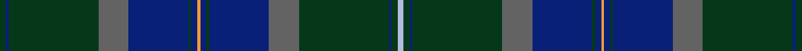

This is one **variant** — a specific cloth: this exact thread count and colourway, with its own
provenance below. It is one weaving of the [sett](/tartans/s/sc/scottish-borderland-2/) (the scale-free proportion — the
same cloth at any scale or shade), whose colour order is pattern [GBGBBGBYBGBBGBGW](/stripes/gbgbbgbybgbbgbgw/).

Part of the [Scottish Borderland](/tartans/s/sc/scottish-borderland-2/) tartan — the named design grouping this sett with its other cloths.

Sourced from register-of-tartans.  It is a [16 stripe tartan](/stripes/stripes16/).

Original link [https://www.tartanregister.gov.uk/tartanDetails.aspx?ref=3709](https://www.tartanregister.gov.uk/tartanDetails.aspx?ref=3709)

## Provenance

Earliest known date: pre 1996 Lochcarron of Scotland. Sample in STA Johnston Collection.

2 attestations — the source records this cloth was collapsed from (oldest owns this page)

<ul>
<li>01/01/1996 — Scottish Borderland (register-of-tartans, <a href="https://www.tartanregister.gov.uk/tartanDetails.aspx?ref=3709">record</a>)  <em>Lochcarron of Scotland. Sample in Scottish Tartans Authority's Johnston Collection.</em></li>
<li>pre 1996 — Scottish Borderland Fashion Tartan (house-of-tartan, <a href="http://www.house-of-tartan.scotland.net/house/TartanViewjs.asp?colr=Def&tnam=5359">record</a>) </li>
</ul>

Dataset <small>— provenance for this record, inherited from the source manifest</small>

<dl class="dataset-prov">
<dt>source</dt><dd><a href="/sources/register-of-tartans/">Scottish Register of Tartans</a></dd>
<dt>data captured from</dt><dd><a href="https://github.com/thetartan/tartan-database/blob/master/data/register-of-tartans/data.csv">https://github.com/thetartan/tartan-database/blob/master/data/register-of-tartans/data.csv</a></dd>
<dt>data date</dt><dd>1996 <small>(this record)</small></dd>
<dt>licence</dt><dd><a href="https://www.tartanregister.gov.uk/copyright">Crown copyright</a></dd>
</dl>

Capture chain <small>— the hands this data passed through, oldest first; each capture carries its own licence</small>

<ol class="capture-chain">
<li><a href="https://www.tartanregister.gov.uk/">Scottish Register of Tartans</a> · <a href="https://www.tartanregister.gov.uk/copyright">Crown copyright</a> <small>the living register — still published by National Records of Scotland</small></li>
<li><a href="https://github.com/thetartan/tartan-database">thetartan/tartan-database</a> <small>2016-2017</small> · <a href="https://creativecommons.org/licenses/by-nc-nd/4.0/">CC BY-NC-ND 4.0</a> <small>Levko Kravets's frozen compilation — the capture we vendored, and where its CC licence text came from</small></li>
<li>this dictionary <small>captured 2026-06-10 · commit 5bf86c7566</small> <small>each re-capture is a git commit to data/sources</small></li>
</ol>

## Register references

External register numbers recorded for this tartan.

- Scottish Register of Tartans: [3709](https://www.tartanregister.gov.uk/tartanDetails.aspx?ref=3709)
- Scottish Tartans Authority (ITI): 5359

## Thread count
DG/4 DB2 DG60 N20 DB40 DG2 DB4 LO2 DB4 DG2 DB40 N20 DG60 DB2 DG4 LB/4

One full sett is **532 threads**.

## Palette
<table><thead><tr><th>Colour</th><th>Shade</th><th>OKLCh</th></tr></thead><tbody><tr><td>LO</td><td><code style="background-color:#FF9C34;">#FF9C34</code> <small style="color:#888">#FF9C34</small></td><td><small style="color:#888">oklch(77.9% 0.161 61.8)</small></td></tr><tr><td>DG</td><td><code style="background-color:#053819;">#053819</code> <small style="color:#888">#053819</small></td><td><small style="color:#888">oklch(30.0% 0.075 151.3)</small></td></tr><tr><td>DB</td><td><code style="background-color:#082077;">#082077</code> <small style="color:#888">#082077</small></td><td><small style="color:#888">oklch(30.0% 0.149 265.1)</small></td></tr><tr><td>N</td><td><code style="background-color:#636363;">#636363</code> <small style="color:#888">#636363</small></td><td><small style="color:#888">oklch(50.0% 0.000 89.9)</small></td></tr><tr><td>LB</td><td><code style="background-color:#B5BBDE;">#B5BBDE</code> <small style="color:#888">#B5BBDE</small></td><td><small style="color:#888">oklch(79.9% 0.050 277.6)</small></td></tr></tbody></table>

# Sample pattern

## Nearest tartan variants

The nearest existing variants by ΔTartan distance, with this cloth at the top so the swatches line up against it.

ΔTartan

Threads

Variant

Sett

—

532

<a href="/variants/s16/dg2db1dg30n10db20dg1db2lo1db2dg1db20n10dg30db1dg2lb2~x2/">Scottish Borderland</a>

<a href="/ttd/edit/#slug=lb2dg2db1dg30n10db20dg1db2lo1~x2&amp;base=dg2db1dg30n10db20dg1db2lo1db2dg1db20n10dg30db1dg2lb2~x2" title="compare in the TTD">2.93</a>

270

<a href="/variants/s9/lb2dg2db1dg30n10db20dg1db2lo1~x2/">Scottish Borderland (Fashion)</a>

<a href="/ttd/edit/#slug=dt47dg14dp5do2dr3dg7~x2~dt1204274-dg1605139-dp1105325&amp;base=dg2db1dg30n10db20dg1db2lo1db2dg1db20n10dg30db1dg2lb2~x2" title="compare in the TTD">2.98</a>

204

<a href="/variants/s6/db47dg14dp5do2dr3dg7~x2~db1204274-dg1605139-dp1105325/">Round Table of Britain and Ire Corporate Tartan</a>

<a href="/ttd/edit/#slug=g10dg2db2dy14dg2g2dg2g2dg2db25dy8g4dg4db3dg1db3dg1db4~x2&amp;base=dg2db1dg30n10db20dg1db2lo1db2dg1db20n10dg30db1dg2lb2~x2" title="compare in the TTD">3.53</a>

336

<a href="/variants/s18/g10dg2db2dy14dg2g2dg2g2dg2db25dy8g4dg4db3dg1db3dg1db4~x2/">Nova Scotia</a>

<a href="/ttd/edit/#slug=y1dbi2dg20r3dbi30y1dbi30lb3db9dg4r3dg4dbi2y1~x2~dbi1404245-lb3203246-db1106275&amp;base=dg2db1dg30n10db20dg1db2lo1db2dg1db20n10dg30db1dg2lb2~x2" title="compare in the TTD">3.82</a>

448

<a href="/variants/s14/y1dbi2dg20r3dbi30y1dbi30lb3db9dg4r3dg4dbi2y1~x2~dbi1404245-lb3203246-db1106275/">Benteau na mara</a>

<a href="/ttd/edit/#slug=y1dbi2dg20r3dbi30y1dbi30lb3db9dg4r3dg4dbi2y1~x2~dbi1404245-db1106275&amp;base=dg2db1dg30n10db20dg1db2lo1db2dg1db20n10dg30db1dg2lb2~x2" title="compare in the TTD">3.84</a>

448

<a href="/variants/s14/y1dbi2dg20r3dbi30y1dbi30lb3db9dg4r3dg4dbi2y1~x2~dbi1404245-db1106275/">Benteau na mara (Name)</a>

## Neighbour map

Every grey dot is one of 13656 variants placed by the first two principal components of the ΔTartan feature space (42% of its variance). Red is this tartan; blue dots are its nearest — click one to open its page. The map is a flat projection of a many-dimensional space — [how to read it](/posts/neighbourhood-maps/).

<svg viewBox="0 0 640 380" role="img" style="max-width:100%;height:auto;border:1px solid #e0e0e0;border-radius:4px;display:block" xmlns="http://www.w3.org/2000/svg"><image href="/nn/cloud.v1.png" width="640" height="380"/><a href="/variants/s9/lb2dg2db1dg30n10db20dg1db2lo1~x2/"><circle cx="393.4" cy="158.7" r="4" fill="#3465a4"><title>Scottish Borderland (Fashion)</title></circle></a><a href="/variants/s6/db47dg14dp5do2dr3dg7~x2~db1204274-dg1605139-dp1105325/"><circle cx="415.7" cy="177.3" r="4" fill="#3465a4"><title>Round Table of Britain and Ire Corporate Tartan</title></circle></a><a href="/variants/s18/g10dg2db2dy14dg2g2dg2g2dg2db25dy8g4dg4db3dg1db3dg1db4~x2/"><circle cx="323.9" cy="157.9" r="4" fill="#3465a4"><title>Nova Scotia</title></circle></a><a href="/variants/s14/y1dbi2dg20r3dbi30y1dbi30lb3db9dg4r3dg4dbi2y1~x2~dbi1404245-lb3203246-db1106275/"><circle cx="406.3" cy="122.6" r="4" fill="#3465a4"><title>Benteau na mara</title></circle></a><a href="/variants/s14/y1dbi2dg20r3dbi30y1dbi30lb3db9dg4r3dg4dbi2y1~x2~dbi1404245-db1106275/"><circle cx="407.9" cy="123.0" r="4" fill="#3465a4"><title>Benteau na mara (Name)</title></circle></a><circle cx="408.0" cy="148.9" r="5" fill="#c00000"/><text x="320" y="376" text-anchor="middle" font-size="11" fill="#999">ground</text><text x="11" y="190" text-anchor="middle" font-size="11" fill="#999" transform="rotate(-90 11 190)">complexity</text></svg>

ID: /variants/s16/dg2db1dg30n10db20dg1db2lo1db2dg1db20n10dg30db1dg2lb2~x2/
