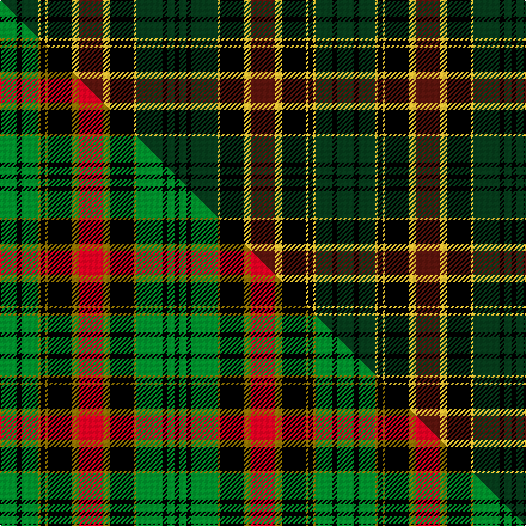

This page is one **sett** — a single exact thread-count. It belongs to the [tartan](/setts/dg7k2dg7ly1k2ly1k10ly3dr10ly3k10ly1dg11k2dg3k2/)
(the same proportion at any scale), whose colour order is pattern [GKGYKYKYBYKYGKGK](/stripes/gkgykykybykygkgk/).

Part of the [Blackburn Appalachian Hunting](/tartans/blackburn-appalachian-hunting/) tartan — the named design grouping this sett with its other cloths.

Sourced from tartans-authority.  It is a [16 stripe tartan](/stripes/stripes16/).

Original link [https://www.tartanregister.gov.uk/tartanDetails.aspx?ref=10703](https://www.tartanregister.gov.uk/tartanDetails.aspx?ref=10703)

Dataset <small>— provenance for this record, inherited from the source manifest</small>

<dl class="dataset-prov">
<dt>source</dt><dd><a href="/sources/tartans-authority/">Scottish Tartans Authority</a></dd>
<dt>data captured from</dt><dd><a href="https://github.com/thetartan/tartan-database/blob/master/data/tartans-authority/data.csv">https://github.com/thetartan/tartan-database/blob/master/data/tartans-authority/data.csv</a></dd>
<dt>data date</dt><dd>14/09/2012 <small>(this record)</small></dd>
<dt>licence</dt><dd><a href="https://creativecommons.org/licenses/by-nc-nd/4.0/">CC BY-NC-ND 4.0</a></dd>
</dl>

Capture chain <small>— the hands this data passed through, oldest first; each capture carries its own licence</small>

<ol class="capture-chain">
<li><a href="https://www.tartansauthority.com/">Scottish Tartans Authority</a> <small>the heritage body's archive — its tartan-ferret record browser is retired (links repaired to the SRT, above)</small></li>
<li><a href="https://github.com/thetartan/tartan-database">thetartan/tartan-database</a> <small>2016-2017</small> · <a href="https://creativecommons.org/licenses/by-nc-nd/4.0/">CC BY-NC-ND 4.0</a> <small>Levko Kravets's frozen compilation — the capture we vendored, and where its CC licence text came from</small></li>
<li>this dictionary <small>captured 2026-06-10 · commit 5bf86c7566</small> <small>each re-capture is a git commit to data/sources</small></li>
</ol>

## Register references

External register numbers recorded for this tartan.

- Scottish Register of Tartans: [10703](https://www.tartanregister.gov.uk/tartanDetails?ref=10703)
- Scottish Tartans Authority (ITI): 10703

## Thread count
DG/14 K4 DG14 LY2 K4 LY2 K20 LY6 DR20 LY6 K20 LY2 DG22 K4 DG6 K/4

One full sett is **282 threads**.

## Palette
<table><thead><tr><th>Colour</th><th>Shade</th><th>OKLCh</th></tr></thead><tbody><tr><td>DG</td><td><code style="background-color:#053819;">#053819</code> <small style="color:#888">#053819</small></td><td><small style="color:#888">oklch(30.0% 0.075 151.3)</small></td></tr><tr><td>DR</td><td><code style="background-color:#55120C;">#55120C</code> <small style="color:#888">#55120C</small></td><td><small style="color:#888">oklch(30.0% 0.099 29.3)</small></td></tr><tr><td>LY</td><td><code style="background-color:#DCBC32;">#DCBC32</code> <small style="color:#888">#DCBC32</small></td><td><small style="color:#888">oklch(80.0% 0.150 95.2)</small></td></tr><tr><td>K</td><td><code style="background-color:#000000;">#000000</code> <small style="color:#888">#000000</small></td><td><small style="color:#888">oklch(0.0% 0.000 0.0)</small></td></tr></tbody></table>

# Sample pattern

## Compared to the master

This cloth is one sett of its design; the master sett (the exemplar the design is anchored on) is below for comparison.

Its **ΔTartan distance** from the master is **0.20** — the same measure the nearest-tartans table ranks by (0 is identical; a re-scale of the same cloth is near 0, a recolour or a different proportion further).

<figure class="master-compare" style="margin:0">

this sett
master sett ★

<figcaption style="color:#888;font-size:smaller">One weave of this sett against the <a href="/setts/g7k2g7y1k2y1k10y3r10y3k10y1g11k2g3k2/">master sett ★</a>, split on the diagonal: a shared proportion runs seamlessly across it with only the shades shifting; a different proportion breaks on it.</figcaption>
</figure>

## Nearest tartan variants

The nearest existing variants by ΔTartan distance, with this cloth at the top so the swatches line up against it.

ΔTartan

Threads

Variant

Sett

—

282

<a href="/variants/s16/dg7k2dg7ly1k2ly1k10ly3dr10ly3k10ly1dg11k2dg3k2~x2/">Blackburn Appalachian Htg (Personal)</a>

<a href="/ttd/edit/#slug=g7k2g7y1k2y1k10y3r10y3k10y1g11k2g3k2~x2&amp;base=dg7k2dg7ly1k2ly1k10ly3dr10ly3k10ly1dg11k2dg3k2~x2" title="compare in the TTD">0.20</a>

282

<a href="/variants/s16/g7k2g7y1k2y1k10y3r10y3k10y1g11k2g3k2~x2/">Blackburn Appalachian Hunting</a>

<a href="/ttd/edit/#slug=dr3g20k2db3k12db3k2dr20g3dr20k2db3k12db3k2g20dr3db2~x2&amp;base=dg7k2dg7ly1k2ly1k10ly3dr10ly3k10ly1dg11k2dg3k2~x2" title="compare in the TTD">2.02</a>

530

<a href="/variants/s18/dr3g20k2db3k12db3k2dr20g3dr20k2db3k12db3k2g20dr3db2~x2/">Matthew Gloag Corporate Tartan</a>

<a href="/ttd/edit/#slug=g13k2g2k2g2k12dp16k1g2k1dp16k12g12k1y2dp1~x2&amp;base=dg7k2dg7ly1k2ly1k10ly3dr10ly3k10ly1dg11k2dg3k2~x2" title="compare in the TTD">2.40</a>

360

<a href="/variants/s16/g13k2g2k2g2k12dp16k1g2k1dp16k12g12k1y2dp1~x2/">Kettles, Ryan &amp; Alan (Personal)</a>

<a href="/ttd/edit/#slug=g13k2g2k2g2k12dp16k1g2k1dp16k12g12k1ly2dp1~x2&amp;base=dg7k2dg7ly1k2ly1k10ly3dr10ly3k10ly1dg11k2dg3k2~x2" title="compare in the TTD">2.42</a>

360

<a href="/variants/s16/g13k2g2k2g2k12dp16k1g2k1dp16k12g12k1ly2dp1~x2/">Kettles, Ryan &amp; Alan (Personal)</a>

<a href="/ttd/edit/#slug=dt8k1dt2k1dt2k6g8k1w2k1g8k6dt8k1dt2~x4&amp;base=dg7k2dg7ly1k2ly1k10ly3dr10ly3k10ly1dg11k2dg3k2~x2" title="compare in the TTD">2.45</a>

416

<a href="/variants/s15/dt8k1dt2k1dt2k6g8k1w2k1g8k6dt8k1dt2~x4/">74th Regiment of Foot (Mil.)</a>

<a href="/ttd/edit/#slug=dp20k2w2k2dp2k10g3k2g20k2g3k10dp8k2~x2&amp;base=dg7k2dg7ly1k2ly1k10ly3dr10ly3k10ly1dg11k2dg3k2~x2" title="compare in the TTD">2.48</a>

308

<a href="/variants/s14/dp20k2w2k2dp2k10g3k2g20k2g3k10dp8k2~x2/">Caithelyn (Personal)</a>

<a href="/ttd/edit/#slug=dr8w2dr22k8dg6k6dg6k6dg8lg3dg3lg3~x2&amp;base=dg7k2dg7ly1k2ly1k10ly3dr10ly3k10ly1dg11k2dg3k2~x2" title="compare in the TTD">2.57</a>

302

<a href="/variants/s12/dr8w2dr22k8dg6k6dg6k6dg8lg3dg3lg3~x2/">Wcwm 1712</a>

<a href="/ttd/edit/#slug=n5lb2n12k21dg12k4dg4k4dr4k4dg4k4dg12k21n12lb2n4~x2&amp;base=dg7k2dg7ly1k2ly1k10ly3dr10ly3k10ly1dg11k2dg3k2~x2" title="compare in the TTD">2.59</a>

506

<a href="/variants/s17/n5lb2n12k21dg12k4dg4k4dr4k4dg4k4dg12k21n12lb2n4~x2/">Psychological Operations Regiment</a>

<a href="/ttd/edit/#slug=k1db1r1k8r1g6r6db1k6r1g8r1k1~x2&amp;base=dg7k2dg7ly1k2ly1k10ly3dr10ly3k10ly1dg11k2dg3k2~x2" title="compare in the TTD">2.59</a>

164

<a href="/variants/s13/k1db1r1k8r1g6r6db1k6r1g8r1k1~x2/">Cumming (d)</a>

<a href="/ttd/edit/#slug=k1db1r1k8r1g6r6db1k6r1g8r1k1&amp;base=dg7k2dg7ly1k2ly1k10ly3dr10ly3k10ly1dg11k2dg3k2~x2" title="compare in the TTD">2.59</a>

82

<a href="/variants/s13/k1db1r1k8r1g6r6db1k6r1g8r1k1/">Cumming</a>

## Neighbour map

Every grey dot is one of 13621 variants placed by the first two principal components of the ΔTartan feature space (42% of its variance). Red is this tartan; blue dots are its nearest — click one to open its page.

<svg viewBox="0 0 640 380" role="img" style="max-width:100%;height:auto;border:1px solid #e0e0e0;border-radius:4px;display:block" xmlns="http://www.w3.org/2000/svg"><image href="/nn/cloud.v1.png" width="640" height="380"/><a href="/variants/s16/g7k2g7y1k2y1k10y3r10y3k10y1g11k2g3k2~x2/"><circle cx="132.7" cy="156.4" r="4" fill="#3465a4"><title>Blackburn Appalachian Hunting</title></circle></a><a href="/variants/s18/dr3g20k2db3k12db3k2dr20g3dr20k2db3k12db3k2g20dr3db2~x2/"><circle cx="147.7" cy="148.1" r="4" fill="#3465a4"><title>Matthew Gloag Corporate Tartan</title></circle></a><a href="/variants/s16/g13k2g2k2g2k12dp16k1g2k1dp16k12g12k1y2dp1~x2/"><circle cx="165.1" cy="130.2" r="4" fill="#3465a4"><title>Kettles, Ryan &amp; Alan (Personal)</title></circle></a><a href="/variants/s16/g13k2g2k2g2k12dp16k1g2k1dp16k12g12k1ly2dp1~x2/"><circle cx="161.8" cy="129.2" r="4" fill="#3465a4"><title>Kettles, Ryan &amp; Alan (Personal)</title></circle></a><a href="/variants/s15/dt8k1dt2k1dt2k6g8k1w2k1g8k6dt8k1dt2~x4/"><circle cx="141.9" cy="177.4" r="4" fill="#3465a4"><title>74th Regiment of Foot (Mil.)</title></circle></a><a href="/variants/s14/dp20k2w2k2dp2k10g3k2g20k2g3k10dp8k2~x2/"><circle cx="150.1" cy="147.8" r="4" fill="#3465a4"><title>Caithelyn (Personal)</title></circle></a><a href="/variants/s12/dr8w2dr22k8dg6k6dg6k6dg8lg3dg3lg3~x2/"><circle cx="140.2" cy="163.2" r="4" fill="#3465a4"><title>Wcwm 1712</title></circle></a><a href="/variants/s17/n5lb2n12k21dg12k4dg4k4dr4k4dg4k4dg12k21n12lb2n4~x2/"><circle cx="164.3" cy="147.2" r="4" fill="#3465a4"><title>Psychological Operations Regiment</title></circle></a><a href="/variants/s13/k1db1r1k8r1g6r6db1k6r1g8r1k1~x2/"><circle cx="133.0" cy="158.5" r="4" fill="#3465a4"><title>Cumming (d)</title></circle></a><a href="/variants/s13/k1db1r1k8r1g6r6db1k6r1g8r1k1/"><circle cx="133.0" cy="158.5" r="4" fill="#3465a4"><title>Cumming</title></circle></a><circle cx="149.7" cy="159.9" r="5" fill="#c00000"/><text x="320" y="376" text-anchor="middle" font-size="11" fill="#999">ground</text><text x="11" y="190" text-anchor="middle" font-size="11" fill="#999" transform="rotate(-90 11 190)">complexity</text></svg>

ID: /variants/s16/dg7k2dg7ly1k2ly1k10ly3dr10ly3k10ly1dg11k2dg3k2~x2/
