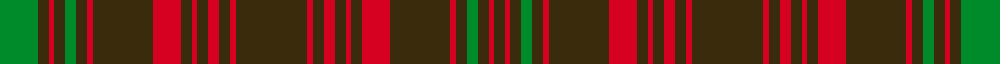

This is one **variant** — a specific cloth: this exact thread count and colourway, with its own
provenance below. It is one weaving of the [sett](/tartans/s/sa/sarna-3/) (the scale-free proportion — the
same cloth at any scale or shade), whose colour order is pattern [GGRGGGRGRGRGRGRG](/stripes/ggrgggrgrgrgrgrg/).

Part of the [Sarna](/tartans/s/sa/sarna-3/) tartan — the named design grouping this sett with its other cloths.

Sourced from house-of-tartan.  It is a [16 stripe tartan](/stripes/stripes16/).

Original link [http://www.house-of-tartan.scotland.net/house/TartanViewjs.asp?colr=Def&tnam=2039](http://www.house-of-tartan.scotland.net/house/TartanViewjs.asp?colr=Def&tnam=2039)

## Provenance

Earliest known date: 1783 Sarna is a town in Sweden.

3 attestations — the source records this cloth was collapsed from (oldest owns this page)

<ul>
<li>1783 — Särna District Tartan (house-of-tartan, <a href="http://www.house-of-tartan.scotland.net/house/TartanViewjs.asp?colr=Def&tnam=2039">record</a>) </li>
<li>01/01/2002 — Sarna (Town) (register-of-tartans, <a href="https://www.tartanregister.gov.uk/tartanDetails.aspx?ref=3655">record</a>)  <em>No details - possible same source as Sarna (Gudrun Joyce sample).</em></li>
<li>pre 2002 — Sarna (District) (tartans-authority, <a href="https://web.archive.org/web/*/http://www.tartansauthority.com/tartan-ferret/display/2039/*">record</a>)  <em>Sarna is a small Swedish town approximately 61degrees north and 13 degrees east.</em></li>
</ul>

Dataset <small>— provenance for this record, inherited from the source manifest</small>

<dl class="dataset-prov">
<dt>source</dt><dd><a href="/sources/house-of-tartan/">House of Tartan</a></dd>
<dt>data captured from</dt><dd><a href="https://github.com/thetartan/tartan-database/blob/master/data/house-of-tartan/data.csv">https://github.com/thetartan/tartan-database/blob/master/data/house-of-tartan/data.csv</a></dd>
<dt>data date</dt><dd>1783 <small>(this record)</small></dd>
<dt>licence</dt><dd><a href="https://creativecommons.org/licenses/by-nc-nd/4.0/">CC BY-NC-ND 4.0</a></dd>
</dl>

Capture chain <small>— the hands this data passed through, oldest first; each capture carries its own licence</small>

<ol class="capture-chain">
<li><a href="http://www.house-of-tartan.scotland.net/">House of Tartan</a> <small>the weaver/retailer's database — the site is now offline; the URL is kept as the ultimate source's identity</small></li>
<li><a href="https://github.com/thetartan/tartan-database">thetartan/tartan-database</a> <small>2016-2017</small> · <a href="https://creativecommons.org/licenses/by-nc-nd/4.0/">CC BY-NC-ND 4.0</a> <small>Levko Kravets's frozen compilation — the capture we vendored, and where its CC licence text came from</small></li>
<li>this dictionary <small>captured 2026-06-10 · commit 5bf86c7566</small> <small>each re-capture is a git commit to data/sources</small></li>
</ol>

## Register references

External register numbers recorded for this tartan.

- Scottish Register of Tartans: [3655](https://www.tartanregister.gov.uk/tartanDetails.aspx?ref=3655)
- Scottish Tartans Authority (ITI): 2039
- Scottish Tartans World Register: 2039

## Thread count
DY/26 R2 DY4 R4 DY4 R2 DY4 R10 DY22 R2 DY4 G4 DY4 R2 DY4 G/14

One full sett is **184 threads**.

## Palette
<table><thead><tr><th>Colour</th><th>Shade</th><th>OKLCh</th></tr></thead><tbody><tr><td>G</td><td><code style="background-color:#008B2A;">#008B2A</code> <small style="color:#888">#008B2A</small></td><td><small style="color:#888">oklch(55.4% 0.170 145.9)</small></td></tr><tr><td>R</td><td><code style="background-color:#D60020;">#D60020</code> <small style="color:#888">#D60020</small></td><td><small style="color:#888">oklch(55.2% 0.224 25.5)</small></td></tr><tr><td>DY</td><td><code style="background-color:#3A2B0D;">#3A2B0D</code> <small style="color:#888">#3A2B0D</small></td><td><small style="color:#888">oklch(30.0% 0.049 82.0)</small></td></tr></tbody></table>

# Sample pattern

## Nearest tartan variants

The nearest existing variants by ΔTartan distance, with this cloth at the top so the swatches line up against it.

ΔTartan

Threads

Variant

Sett

—

184

<a href="/variants/s16/dy13r1dy2r2dy2r1dy2r5dy11r1dy2g2dy2r1dy2g7~x2/">Särna District Tartan</a>

<a href="/ttd/edit/#slug=g4dy14r1dy1g1dy1r1dy14r14dy1r1g1~x4&amp;base=dy13r1dy2r2dy2r1dy2r5dy11r1dy2g2dy2r1dy2g7~x2" title="compare in the TTD">2.60</a>

412

<a href="/variants/s12/g4dy14r1dy1g1dy1r1dy14r14dy1r1g1~x4/">Frame (Ferniegair) (Personal)</a>

<a href="/ttd/edit/#slug=dr12g2dr1g1dr1g1dr6g12dr1k1dr12k1dr1k1dr3~x4&amp;base=dy13r1dy2r2dy2r1dy2r5dy11r1dy2g2dy2r1dy2g7~x2" title="compare in the TTD">2.81</a>

388

<a href="/variants/s15/dr12g2dr1g1dr1g1dr6g12dr1k1dr12k1dr1k1dr3~x4/">MacDonell of Keppoch #3</a>

<a href="/ttd/edit/#slug=dg4dy14r1dy1dg1dy1r1dy14r14dy1r1dg1~x4&amp;base=dy13r1dy2r2dy2r1dy2r5dy11r1dy2g2dy2r1dy2g7~x2" title="compare in the TTD">3.10</a>

412

<a href="/variants/s12/dg4dy14r1dy1dg1dy1r1dy14r14dy1r1dg1~x4/">Frame - Ferniegair (Personal)</a>

<a href="/ttd/edit/#slug=dy3g1dy15r2dy1r2dy1g7w1g2~x4~g2203152&amp;base=dy13r1dy2r2dy2r1dy2r5dy11r1dy2g2dy2r1dy2g7~x2" title="compare in the TTD">3.14</a>

260

<a href="/variants/s10/dy3g1dy15r2dy1r2dy1g7w1g2~x4~g2203152/">Seton Hunting</a>

<a href="/ttd/edit/#slug=g4o2g2o2g2o3db1o1g4o1db1o12db2o3~x2&amp;base=dy13r1dy2r2dy2r1dy2r5dy11r1dy2g2dy2r1dy2g7~x2" title="compare in the TTD">3.51</a>

146

<a href="/variants/s14/g4o2g2o2g2o3db1o1g4o1db1o12db2o3~x2/">MacAlister of Glenbarr</a>

<a href="/ttd/edit/#slug=g22r4g22r22g2r3g2r3g2r3y2~x2&amp;base=dy13r1dy2r2dy2r1dy2r5dy11r1dy2g2dy2r1dy2g7~x2" title="compare in the TTD">3.69</a>

300

<a href="/variants/s11/g22r4g22r22g2r3g2r3g2r3y2~x2/">MacRea / MacRae</a>

<a href="/ttd/edit/#slug=dr12db1dr1g8dr2db1dr1db3dr1db1dr12g1dr1g8~x4&amp;base=dy13r1dy2r2dy2r1dy2r5dy11r1dy2g2dy2r1dy2g7~x2" title="compare in the TTD">3.75</a>

344

<a href="/variants/s14/dr12db1dr1g8dr2db1dr1db3dr1db1dr12g1dr1g8~x4/">MacDonald of Aird &amp; Valley (Clan?)</a>

<a href="/ttd/edit/#slug=o8db3o3dg20o3dg3o3db6o3b3o20db3o3db2o6~x2~o1305035-dg1806142&amp;base=dy13r1dy2r2dy2r1dy2r5dy11r1dy2g2dy2r1dy2g7~x2" title="compare in the TTD">3.95</a>

328

<a href="/variants/s15/o8db3o3dg20o3dg3o3db6o3b3o20db3o3db2o6~x2~o1305035-dg1806142/">Glenfarclas Distillery</a>

<a href="/ttd/edit/#slug=dy3g1dy15r2dy1r2dy1g7w1g2~x4&amp;base=dy13r1dy2r2dy2r1dy2r5dy11r1dy2g2dy2r1dy2g7~x2" title="compare in the TTD">3.96</a>

260

<a href="/variants/s10/dy3g1dy15r2dy1r2dy1g7w1g2~x4/">Seton Htg (Clan)</a>

<a href="/ttd/edit/#slug=dt6r3g1r3g12r3g1~x4~dt1204274&amp;base=dy13r1dy2r2dy2r1dy2r5dy11r1dy2g2dy2r1dy2g7~x2" title="compare in the TTD">3.96</a>

204

<a href="/variants/s7/db6r3g1r3g12r3g1~x4~db1204274/">Skene #2</a>

## Neighbour map

Every grey dot is one of 13657 variants placed by the first two principal components of the ΔTartan feature space (42% of its variance). Red is this tartan; blue dots are its nearest — click one to open its page. The map is a flat projection of a many-dimensional space — [how to read it](/posts/neighbourhood-maps/).

<svg viewBox="0 0 640 380" role="img" style="max-width:100%;height:auto;border:1px solid #e0e0e0;border-radius:4px;display:block" xmlns="http://www.w3.org/2000/svg"><image href="/nn/cloud.v1.png" width="640" height="380"/><a href="/variants/s12/g4dy14r1dy1g1dy1r1dy14r14dy1r1g1~x4/"><circle cx="392.2" cy="163.4" r="4" fill="#3465a4"><title>Frame (Ferniegair) (Personal)</title></circle></a><a href="/variants/s15/dr12g2dr1g1dr1g1dr6g12dr1k1dr12k1dr1k1dr3~x4/"><circle cx="400.7" cy="150.0" r="4" fill="#3465a4"><title>MacDonell of Keppoch #3</title></circle></a><a href="/variants/s12/dg4dy14r1dy1dg1dy1r1dy14r14dy1r1dg1~x4/"><circle cx="417.1" cy="171.5" r="4" fill="#3465a4"><title>Frame - Ferniegair (Personal)</title></circle></a><a href="/variants/s10/dy3g1dy15r2dy1r2dy1g7w1g2~x4~g2203152/"><circle cx="348.6" cy="135.9" r="4" fill="#3465a4"><title>Seton Hunting</title></circle></a><a href="/variants/s14/g4o2g2o2g2o3db1o1g4o1db1o12db2o3~x2/"><circle cx="418.9" cy="202.1" r="4" fill="#3465a4"><title>MacAlister of Glenbarr</title></circle></a><a href="/variants/s11/g22r4g22r22g2r3g2r3g2r3y2~x2/"><circle cx="393.6" cy="190.2" r="4" fill="#3465a4"><title>MacRea / MacRae</title></circle></a><a href="/variants/s14/dr12db1dr1g8dr2db1dr1db3dr1db1dr12g1dr1g8~x4/"><circle cx="389.9" cy="192.5" r="4" fill="#3465a4"><title>MacDonald of Aird &amp; Valley (Clan?)</title></circle></a><a href="/variants/s15/o8db3o3dg20o3dg3o3db6o3b3o20db3o3db2o6~x2~o1305035-dg1806142/"><circle cx="353.2" cy="184.2" r="4" fill="#3465a4"><title>Glenfarclas Distillery</title></circle></a><a href="/variants/s10/dy3g1dy15r2dy1r2dy1g7w1g2~x4/"><circle cx="351.4" cy="157.6" r="4" fill="#3465a4"><title>Seton Htg (Clan)</title></circle></a><a href="/variants/s7/db6r3g1r3g12r3g1~x4~db1204274/"><circle cx="320.2" cy="194.2" r="4" fill="#3465a4"><title>Skene #2</title></circle></a><circle cx="409.7" cy="171.9" r="5" fill="#c00000"/><text x="320" y="376" text-anchor="middle" font-size="11" fill="#999">ground</text><text x="11" y="190" text-anchor="middle" font-size="11" fill="#999" transform="rotate(-90 11 190)">complexity</text></svg>

ID: /variants/s16/dy13r1dy2r2dy2r1dy2r5dy11r1dy2g2dy2r1dy2g7~x2/
