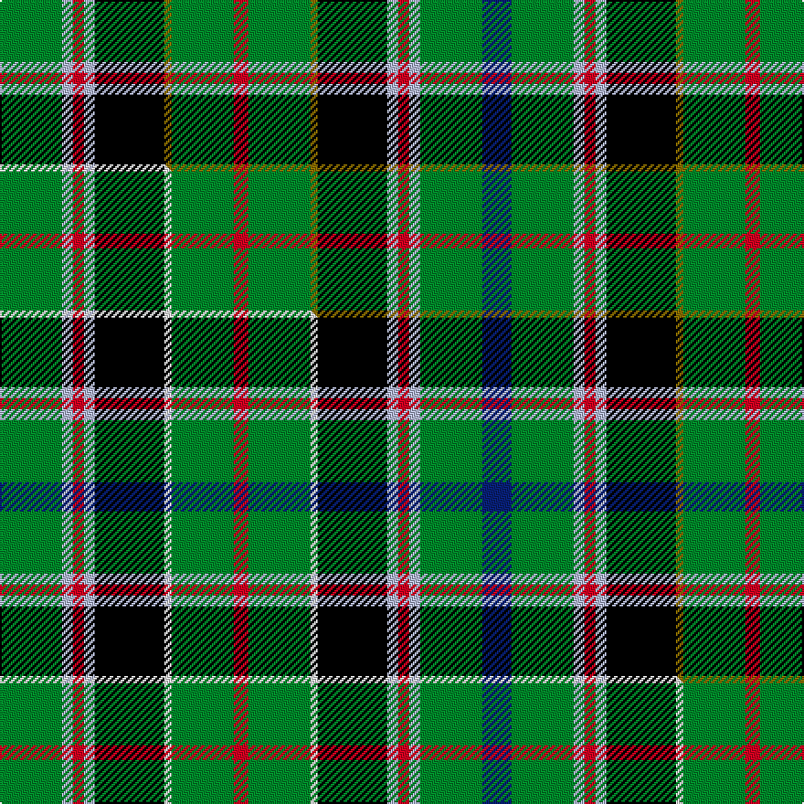

This page is one **sett** — a single exact thread-count. It belongs to the [tartan](/setts/g17lb3r3lb3k19y2g17r4g17y2k19lb3r3lb3g17db8/)
(the same proportion at any scale), whose colour order is pattern [BGWRWKGGRGGKWRWG](/stripes/bgwrwkggrggkwrwg/).

Part of the [Wilson's No.033](/tartans/wilson-s-no-033/) tartan — the named design grouping this sett with its other cloths.

Sourced from register-of-tartans.  It is a [16 stripe tartan](/stripes/stripes16/).

Original link https://www.tartanregister.gov.uk/tartanDetails.aspx?ref=4651

Dataset <small>— provenance for this record, inherited from the source manifest</small>

<dl class="dataset-prov">
<dt>source</dt><dd><a href="/sources/register-of-tartans/">Scottish Register of Tartans</a></dd>
<dt>data captured from</dt><dd><a href="https://github.com/thetartan/tartan-database/blob/master/data/register-of-tartans/data.csv">https://github.com/thetartan/tartan-database/blob/master/data/register-of-tartans/data.csv</a></dd>
<dt>data date</dt><dd>1819 <small>(this record)</small></dd>
<dt>licence</dt><dd><a href="https://www.tartanregister.gov.uk/copyright">Crown copyright</a></dd>
</dl>

Capture chain <small>— the hands this data passed through, oldest first; each capture carries its own licence</small>

<ol class="capture-chain">
<li><a href="https://www.tartanregister.gov.uk/">Scottish Register of Tartans</a> · <a href="https://www.tartanregister.gov.uk/copyright">Crown copyright</a> <small>the living register — still published by National Records of Scotland</small></li>
<li><a href="https://github.com/thetartan/tartan-database">thetartan/tartan-database</a> <small>2016-2017</small> · <a href="https://creativecommons.org/licenses/by-nc-nd/4.0/">CC BY-NC-ND 4.0</a> <small>Levko Kravets's frozen compilation — the capture we vendored, and where its CC licence text came from</small></li>
<li>this dictionary <small>captured 2026-06-10 · commit 5bf86c7566</small> <small>each re-capture is a git commit to data/sources</small></li>
</ol>

## Register references

External register numbers recorded for this tartan.

- Scottish Register of Tartans: [4651](https://www.tartanregister.gov.uk/tartanDetails.aspx?ref=4651)
- Scottish Tartans Authority (ITI): 135
- Scottish Tartans World Register: 135

## Thread count
G/34 LB6 R6 LB6 K38 Y4 G34 R8 G34 Y4 K38 LB6 R6 LB6 G34 DB/16

One full sett is **510 threads**.

## Palette
<table><thead><tr><th>Colour</th><th>Shade</th><th>OKLCh</th></tr></thead><tbody><tr><td>LB</td><td><code style="background-color:#B5BBDE;">#B5BBDE</code> <small style="color:#888">#B5BBDE</small></td><td><small style="color:#888">oklch(79.9% 0.050 277.6)</small></td></tr><tr><td>DB</td><td><code style="background-color:#082077;">#082077</code> <small style="color:#888">#082077</small></td><td><small style="color:#888">oklch(30.0% 0.149 265.1)</small></td></tr><tr><td>DG</td><td><code style="background-color:#053819;">#053819</code> <small style="color:#888">#053819</small></td><td><small style="color:#888">oklch(30.0% 0.075 151.3)</small></td></tr><tr><td>G</td><td><code style="background-color:#008B2A;">#008B2A</code> <small style="color:#888">#008B2A</small></td><td><small style="color:#888">oklch(55.4% 0.170 145.9)</small></td></tr><tr><td>K</td><td><code style="background-color:#000000;">#000000</code> <small style="color:#888">#000000</small></td><td><small style="color:#888">oklch(0.0% 0.000 0.0)</small></td></tr><tr><td>R</td><td><code style="background-color:#D60020;">#D60020</code> <small style="color:#888">#D60020</small></td><td><small style="color:#888">oklch(55.2% 0.224 25.5)</small></td></tr><tr><td>Y</td><td><code style="background-color:#8B6E00;">#8B6E00</code> <small style="color:#888">#8B6E00</small></td><td><small style="color:#888">oklch(55.1% 0.113 90.4)</small></td></tr></tbody></table>

# Sample pattern

## Compared to the master

This cloth is one sett of its design; the master sett (the exemplar the design is anchored on) is below for comparison.

Its **ΔTartan distance** from the master is **0.60** — the same measure the nearest-tartans table ranks by (0 is identical; a re-scale of the same cloth is near 0, a recolour or a different proportion further).

<figure class="master-compare" style="margin:0">

this sett
master sett ★

<figcaption style="color:#888;font-size:smaller">One weave of this sett against the <a href="/setts/g17lb3r3lb3k19w2g17r4g17w2k19lb3r3lb3g17db8/">master sett ★</a>, split on the diagonal: a shared proportion runs seamlessly across it with only the shades shifting; a different proportion breaks on it.</figcaption>
</figure>

## Nearest tartan variants

The nearest existing variants by ΔTartan distance, with this cloth at the top so the swatches line up against it.

ΔTartan

Threads

Variant

Sett

—

510

<a href="/variants/s16/g17lb3r3lb3k19y2g17r4g17y2k19lb3r3lb3g17db8~x2/">Wilson's No.033</a>

<a href="/ttd/edit/#slug=g17lb3r3lb3k19w2g17r4g17w2k19lb3r3lb3g17db8~x2&amp;base=g17lb3r3lb3k19y2g17r4g17y2k19lb3r3lb3g17db8~x2" title="compare in the TTD">0.60</a>

510

<a href="/variants/s16/g17lb3r3lb3k19w2g17r4g17w2k19lb3r3lb3g17db8~x2/">Wilson's No.033 #2</a>

<a href="/ttd/edit/#slug=k2g5w1k4y1db4g4k1r6k1g9db2~x4&amp;base=g17lb3r3lb3k19y2g17r4g17y2k19lb3r3lb3g17db8~x2" title="compare in the TTD">2.03</a>

304

<a href="/variants/s12/k2g5w1k4y1db4g4k1r6k1g9db2~x4/">Moskova</a>

<a href="/ttd/edit/#slug=w1r2g10r2g2k8g2db8g2r2g10r2w1~x4&amp;base=g17lb3r3lb3k19y2g17r4g17y2k19lb3r3lb3g17db8~x2" title="compare in the TTD">2.24</a>

408

<a href="/variants/s13/w1r2g10r2g2k8g2db8g2r2g10r2w1~x4/">Reid, Green</a>

<a href="/ttd/edit/#slug=w1r2g10r2g2k8g2db8g2r2g10r2w1~x2&amp;base=g17lb3r3lb3k19y2g17r4g17y2k19lb3r3lb3g17db8~x2" title="compare in the TTD">2.24</a>

204

<a href="/variants/s13/w1r2g10r2g2k8g2db8g2r2g10r2w1~x2/">Reid Family Tartan</a>

<a href="/ttd/edit/#slug=g5k24g12k16g26w4g24w4g26k16db4k4db4k4dbi28g3~db1404245-dbi1406275&amp;base=g17lb3r3lb3k19y2g17r4g17y2k19lb3r3lb3g17db8~x2" title="compare in the TTD">2.28</a>

400

<a href="/variants/s16/g5k24g12k16g26w4g24w4g26k16db4k4db4k4dbi28g3~db1404245-dbi1406275/">O'Conner Irish Family Tartan</a>

<a href="/ttd/edit/#slug=k3g3dr2g3y2g2y2g11db3k3db3k3db3k3db3g20r3~x2&amp;base=g17lb3r3lb3k19y2g17r4g17y2k19lb3r3lb3g17db8~x2" title="compare in the TTD">2.33</a>

276

<a href="/variants/s17/k3g3dr2g3y2g2y2g11db3k3db3k3db3k3db3g20r3~x2/">Myron</a>

<a href="/ttd/edit/#slug=dp2k2g6lb4k2db5k4g20k4lb5k2lb4g6k2dp2~x2&amp;base=g17lb3r3lb3k19y2g17r4g17y2k19lb3r3lb3g17db8~x2" title="compare in the TTD">2.42</a>

272

<a href="/variants/s15/dp2k2g6lb4k2db5k4g20k4lb5k2lb4g6k2dp2~x2/">Letham Hunting (Name)</a>

<a href="/ttd/edit/#slug=dr4g2y2g24k2g3k3g3k10dp10w2dp4~x2&amp;base=g17lb3r3lb3k19y2g17r4g17y2k19lb3r3lb3g17db8~x2" title="compare in the TTD">2.48</a>

260

<a href="/variants/s12/dr4g2y2g24k2g3k3g3k10dp10w2dp4~x2/">Kerby (Personal)</a>

<a href="/ttd/edit/#slug=db14g2db2g14k2g14k2g2k9r2k8y2k9g2k2g14k2g14db2g2db14w2~x2&amp;base=g17lb3r3lb3k19y2g17r4g17y2k19lb3r3lb3g17db8~x2" title="compare in the TTD">2.49</a>

512

<a href="/variants/s22/db14g2db2g14k2g14k2g2k9r2k8y2k9g2k2g14k2g14db2g2db14w2~x2/">Dow - Aerlift</a>

<a href="/ttd/edit/#slug=g30w3g4y5g4w3g6k14lb3k14db18w4~x2&amp;base=g17lb3r3lb3k19y2g17r4g17y2k19lb3r3lb3g17db8~x2" title="compare in the TTD">2.50</a>

364

<a href="/variants/s12/g30w3g4y5g4w3g6k14lb3k14db18w4~x2/">MacKellar</a>

## Neighbour map

Every grey dot is one of 13620 variants placed by the first two principal components of the ΔTartan feature space (42% of its variance). Red is this tartan; blue dots are its nearest — click one to open its page.

<svg viewBox="0 0 640 380" role="img" style="max-width:100%;height:auto;border:1px solid #e0e0e0;border-radius:4px;display:block" xmlns="http://www.w3.org/2000/svg"><image href="/nn/cloud.v1.png" width="640" height="380"/><a href="/variants/s16/g17lb3r3lb3k19w2g17r4g17w2k19lb3r3lb3g17db8~x2/"><circle cx="139.8" cy="138.6" r="4" fill="#3465a4"><title>Wilson's No.033 #2</title></circle></a><a href="/variants/s12/k2g5w1k4y1db4g4k1r6k1g9db2~x4/"><circle cx="110.8" cy="152.2" r="4" fill="#3465a4"><title>Moskova</title></circle></a><a href="/variants/s13/w1r2g10r2g2k8g2db8g2r2g10r2w1~x4/"><circle cx="169.2" cy="149.3" r="4" fill="#3465a4"><title>Reid, Green</title></circle></a><a href="/variants/s13/w1r2g10r2g2k8g2db8g2r2g10r2w1~x2/"><circle cx="169.2" cy="149.3" r="4" fill="#3465a4"><title>Reid Family Tartan</title></circle></a><a href="/variants/s16/g5k24g12k16g26w4g24w4g26k16db4k4db4k4dbi28g3~db1404245-dbi1406275/"><circle cx="145.2" cy="152.6" r="4" fill="#3465a4"><title>O'Conner Irish Family Tartan</title></circle></a><a href="/variants/s17/k3g3dr2g3y2g2y2g11db3k3db3k3db3k3db3g20r3~x2/"><circle cx="188.4" cy="113.9" r="4" fill="#3465a4"><title>Myron</title></circle></a><a href="/variants/s15/dp2k2g6lb4k2db5k4g20k4lb5k2lb4g6k2dp2~x2/"><circle cx="142.8" cy="137.2" r="4" fill="#3465a4"><title>Letham Hunting (Name)</title></circle></a><a href="/variants/s12/dr4g2y2g24k2g3k3g3k10dp10w2dp4~x2/"><circle cx="159.9" cy="91.1" r="4" fill="#3465a4"><title>Kerby (Personal)</title></circle></a><a href="/variants/s22/db14g2db2g14k2g14k2g2k9r2k8y2k9g2k2g14k2g14db2g2db14w2~x2/"><circle cx="122.4" cy="128.4" r="4" fill="#3465a4"><title>Dow - Aerlift</title></circle></a><a href="/variants/s12/g30w3g4y5g4w3g6k14lb3k14db18w4~x2/"><circle cx="102.2" cy="136.7" r="4" fill="#3465a4"><title>MacKellar</title></circle></a><circle cx="133.6" cy="133.1" r="5" fill="#c00000"/><text x="320" y="376" text-anchor="middle" font-size="11" fill="#999">ground</text><text x="11" y="190" text-anchor="middle" font-size="11" fill="#999" transform="rotate(-90 11 190)">complexity</text></svg>

ID: /variants/s16/g17lb3r3lb3k19y2g17r4g17y2k19lb3r3lb3g17db8~x2/
