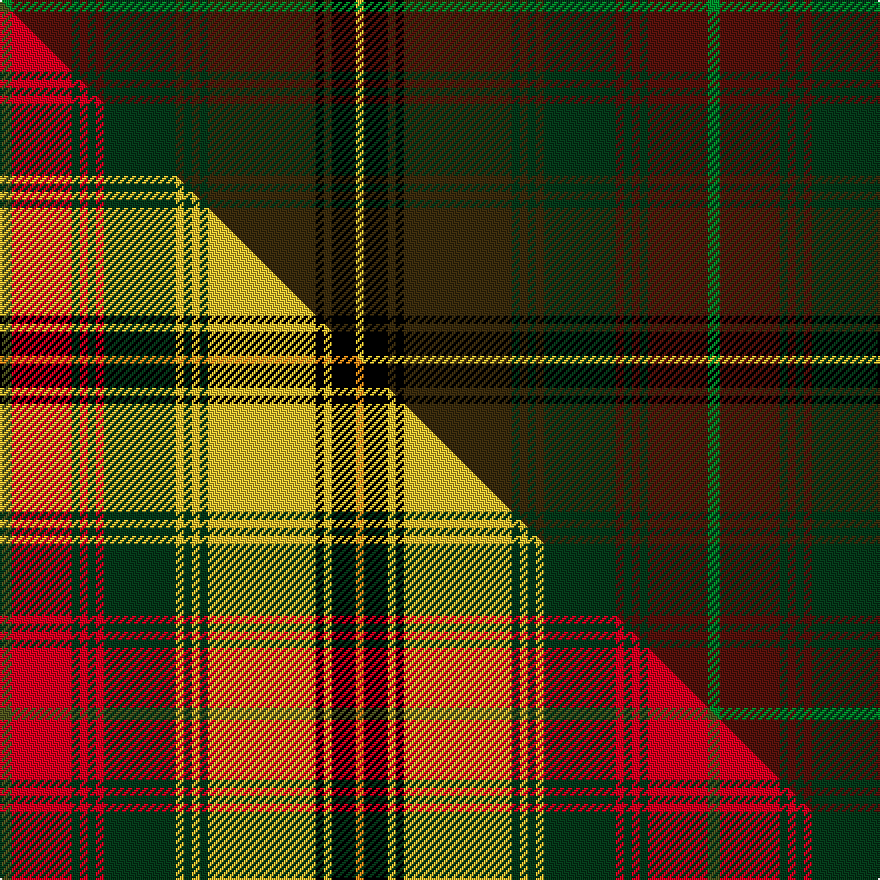

This page is one **sett** — a single exact thread-count. It belongs to the [tartan](/setts/g3dr15dg2dr2dg2dr2dg18dy2dg2dy2dg2dy27k2dy2k6ly2/)
(the same proportion at any scale), whose colour order is pattern [GBGBGBGGGGGGKGKY](/stripes/gbgbgbggggggkgky/).

Part of the [Strathmore](/tartans/strathmore/) tartan — the named design grouping this sett with its other cloths.

Sourced from tartans-authority.  It is a [16 stripe tartan](/stripes/stripes16/).

Original link http://www.tartansauthority.com/tartan-ferret/display/10118/

## Register references

External register numbers recorded for this tartan.

- Scottish Register of Tartans: [10118](https://www.tartanregister.gov.uk/tartanDetails?ref=10118)
- Scottish Tartans Authority (ITI): 10118

## Thread count
G/6 DR30 DG4 DR4 DG4 DR4 DG36 DY4 DG4 DY4 DG4 DY54 K4 DY4 K12 LY/4

One full sett is **354 threads**.

## Palette
<table><thead><tr><th>Colour</th><th>Shade</th><th>OKLCh</th></tr></thead><tbody><tr><td>DR</td><td><code style="background-color:#55120C;">#55120C</code> <small style="color:#888">#55120C</small></td><td><small style="color:#888">oklch(30.0% 0.099 29.3)</small></td></tr><tr><td>LY</td><td><code style="background-color:#DCBC32;">#DCBC32</code> <small style="color:#888">#DCBC32</small></td><td><small style="color:#888">oklch(80.0% 0.150 95.2)</small></td></tr><tr><td>G</td><td><code style="background-color:#008B2A;">#008B2A</code> <small style="color:#888">#008B2A</small></td><td><small style="color:#888">oklch(55.4% 0.170 145.9)</small></td></tr><tr><td>DG</td><td><code style="background-color:#053819;">#053819</code> <small style="color:#888">#053819</small></td><td><small style="color:#888">oklch(30.0% 0.075 151.3)</small></td></tr><tr><td>K</td><td><code style="background-color:#000000;">#000000</code> <small style="color:#888">#000000</small></td><td><small style="color:#888">oklch(0.0% 0.000 0.0)</small></td></tr><tr><td>DY</td><td><code style="background-color:#3A2B0D;">#3A2B0D</code> <small style="color:#888">#3A2B0D</small></td><td><small style="color:#888">oklch(30.0% 0.049 82.0)</small></td></tr></tbody></table>

# Sample pattern

## Compared to the master

This cloth is one sett of its design; the master sett (the exemplar the design is anchored on) is below for comparison.

Its **ΔTartan distance** from the master is **5.22** — the same measure the nearest-tartans table ranks by (0 is identical; a re-scale of the same cloth is near 0, a recolour or a different proportion further).

<figure class="master-compare" style="margin:0">

this sett
master sett ★

<figcaption style="color:#888;font-size:smaller">One weave of this sett against the <a href="/setts/dgi3r15dg2r2dg2r2dg18ly2dg2ly2dg2ly27k2ly2k6lo2/">master sett ★</a>, split on the diagonal: a shared proportion runs seamlessly across it with only the shades shifting; a different proportion breaks on it.</figcaption>
</figure>

ID: /variants/s16/g3dr15dg2dr2dg2dr2dg18dy2dg2dy2dg2dy27k2dy2k6ly2~x2/
