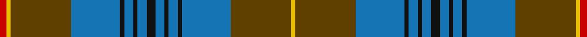

This page is one **sett** — a single exact thread-count. It belongs to the [tartan](/setts/k4b4k2b4k2b22dy27ly2r3/)
(the same proportion at any scale), whose colour order is pattern [RYGBKBKBKBKBKBGY](/stripes/rygbkbkbkbkbkbgy/).

Sourced from house-of-tartan.  It is a [16 stripe tartan](/stripes/stripes16/).

Original link http://www.house-of-tartan.scotland.net/house/TartanViewjs.asp?colr=Def&tnam=2347

## Provenance

Earliest known date: 1989 The original Falkirk "Tartan" , now in the National Museum of Scotland, has a place in history as one of the earliest examples of Scottish cloth in existence. It is a direct link back to the Roman occupation of the area around 250 A.D.and was found stuffed into a pot filled with over 2000 silver coins. This early Celtic tweed used undyed yarn to give a herringbone pattern in brown hues and is considered to be a "poor man's plaid". The Falkirk District Tartan is alive with vibrant colour to reflect that part of Scotland as it is seen today. It was the winning entry by Jim McGeorge (aided by Tony Murray of Stirling) in a public competition run by Falkirk Town Centre Management to create a new image for an area that was rising from the ashes of its former industrial glory. Brown - represents the dominant colour of the original cloth; blue - links Falkirk district with sea via the River Forth and the canals. It is also the colour of the Falkirk "Bairns." Red - is the colour of the blast furnace flames from the Falkirk foundries and yellow - signifies wealth and prosperity. Black - the black lines intersect on blue to show Falkirk at the crossroads of all roads through the region.

## Thread count
R/6 Y4 T54 B44 K4 B8 K4 B8 K8 B8 K4 B8 K4 B44 T54 Y/4

One full sett is **522 threads**.

## Palette

Palette: <strong>Tartan Register</strong> <small style="color:#888">(7 of 8 colours)</small>
<table><thead><tr><th>Colour</th><th>Threads</th><th>Shade</th><th>Base</th><th>OKLCh</th></tr></thead><tbody><tr><td>R/</td><td style="text-align:right;font-variant-numeric:tabular-nums">6</td><td><code style="background-color:#C80000;">#C80000</code> <small style="color:#888">#C80000</small></td><td>R <code style="background-color:#CC0000;">#CC0000</code></td><td><small style="color:#888">oklch(52.3% 0.215 29.2)</small></td></tr><tr><td>Y</td><td style="text-align:right;font-variant-numeric:tabular-nums">4</td><td><code style="background-color:#E8C000;">#E8C000</code> <small style="color:#888">#E8C000</small></td><td>Y <code style="background-color:#F2BF00;">#F2BF00</code></td><td><small style="color:#888">oklch(81.9% 0.168 93.7)</small></td></tr><tr><td>T</td><td style="text-align:right;font-variant-numeric:tabular-nums">54</td><td><code style="background-color:#604000;">#604000</code> <small style="color:#888">#604000</small></td><td>G <code style="background-color:#006100;">#006100</code></td><td><small style="color:#888">oklch(39.8% 0.083 76.8)</small></td></tr><tr><td>B</td><td style="text-align:right;font-variant-numeric:tabular-nums">44</td><td><code style="background-color:#1474B4;">#1474B4</code> <small style="color:#888">#1474B4</small></td><td>B <code style="background-color:#2A418A;">#2A418A</code></td><td><small style="color:#888">oklch(54.0% 0.129 245.1)</small></td></tr><tr><td>K</td><td style="text-align:right;font-variant-numeric:tabular-nums">4</td><td><code style="background-color:#101010;">#101010</code> <small style="color:#888">#101010</small></td><td>K <code style="background-color:#000000;">#000000</code></td><td><small style="color:#888">oklch(17.3% 0.000 89.9)</small></td></tr><tr><td>B</td><td style="text-align:right;font-variant-numeric:tabular-nums">8</td><td><code style="background-color:#1474B4;">#1474B4</code> <small style="color:#888">#1474B4</small></td><td>B <code style="background-color:#2A418A;">#2A418A</code></td><td><small style="color:#888">oklch(54.0% 0.129 245.1)</small></td></tr><tr><td>K</td><td style="text-align:right;font-variant-numeric:tabular-nums">4</td><td><code style="background-color:#101010;">#101010</code> <small style="color:#888">#101010</small></td><td>K <code style="background-color:#000000;">#000000</code></td><td><small style="color:#888">oklch(17.3% 0.000 89.9)</small></td></tr><tr><td>B</td><td style="text-align:right;font-variant-numeric:tabular-nums">8</td><td><code style="background-color:#1474B4;">#1474B4</code> <small style="color:#888">#1474B4</small></td><td>B <code style="background-color:#2A418A;">#2A418A</code></td><td><small style="color:#888">oklch(54.0% 0.129 245.1)</small></td></tr><tr><td>K</td><td style="text-align:right;font-variant-numeric:tabular-nums">8</td><td><code style="background-color:#101010;">#101010</code> <small style="color:#888">#101010</small></td><td>K <code style="background-color:#000000;">#000000</code></td><td><small style="color:#888">oklch(17.3% 0.000 89.9)</small></td></tr><tr><td>B</td><td style="text-align:right;font-variant-numeric:tabular-nums">8</td><td><code style="background-color:#1474B4;">#1474B4</code> <small style="color:#888">#1474B4</small></td><td>B <code style="background-color:#2A418A;">#2A418A</code></td><td><small style="color:#888">oklch(54.0% 0.129 245.1)</small></td></tr><tr><td>K</td><td style="text-align:right;font-variant-numeric:tabular-nums">4</td><td><code style="background-color:#101010;">#101010</code> <small style="color:#888">#101010</small></td><td>K <code style="background-color:#000000;">#000000</code></td><td><small style="color:#888">oklch(17.3% 0.000 89.9)</small></td></tr><tr><td>B</td><td style="text-align:right;font-variant-numeric:tabular-nums">8</td><td><code style="background-color:#1474B4;">#1474B4</code> <small style="color:#888">#1474B4</small></td><td>B <code style="background-color:#2A418A;">#2A418A</code></td><td><small style="color:#888">oklch(54.0% 0.129 245.1)</small></td></tr><tr><td>K</td><td style="text-align:right;font-variant-numeric:tabular-nums">4</td><td><code style="background-color:#101010;">#101010</code> <small style="color:#888">#101010</small></td><td>K <code style="background-color:#000000;">#000000</code></td><td><small style="color:#888">oklch(17.3% 0.000 89.9)</small></td></tr><tr><td>B</td><td style="text-align:right;font-variant-numeric:tabular-nums">44</td><td><code style="background-color:#1474B4;">#1474B4</code> <small style="color:#888">#1474B4</small></td><td>B <code style="background-color:#2A418A;">#2A418A</code></td><td><small style="color:#888">oklch(54.0% 0.129 245.1)</small></td></tr><tr><td>T</td><td style="text-align:right;font-variant-numeric:tabular-nums">54</td><td><code style="background-color:#604000;">#604000</code> <small style="color:#888">#604000</small></td><td>G <code style="background-color:#006100;">#006100</code></td><td><small style="color:#888">oklch(39.8% 0.083 76.8)</small></td></tr><tr><td>Y/</td><td style="text-align:right;font-variant-numeric:tabular-nums">4</td><td><code style="background-color:#E8C000;">#E8C000</code> <small style="color:#888">#E8C000</small></td><td>Y <code style="background-color:#F2BF00;">#F2BF00</code></td><td><small style="color:#888">oklch(81.9% 0.168 93.7)</small></td></tr></tbody></table>

## Nearest tartans

The nearest existing variants by ΔTartan distance, with this tartan at the top so the swatches line up against it.

ΔTartan

Tartan

Sett

—

<a href="/ttd/edit/#slug=k4b4k2b4k2b22dy27ly2r3~x2">Falkirk District Tartan</a> <a class="nn-out" href="/variants/s16/k4b4k2b4k2b22dy27ly2r3~x2/" title="open its dictionary page">↗</a>

0.63

<a href="/ttd/edit/#slug=g3db2ri1db17r2g8r4t1db8r2g17r2ri1db3t1~x2&amp;base=k4b4k2b4k2b22dy27ly2r3~x2">Glenorchy - National Archives</a> <a class="nn-out" href="/variants/s15/g3db2ri1db17r2g8r4t1db8r2g17r2ri1db3t1~x2/" title="open its dictionary page">↗</a>

0.68

<a href="/ttd/edit/#slug=gi24dp4gi3dp8k3t8dp2t2dp4t2dp2t8k3dp8gi3dp4gi24g2~x2&amp;base=k4b4k2b4k2b22dy27ly2r3~x2">Jones Hunting</a> <a class="nn-out" href="/variants/s18/gi24dp4gi3dp8k3t8dp2t2dp4t2dp2t8k3dp8gi3dp4gi24g2~x2/" title="open its dictionary page">↗</a>

0.94

<a href="/ttd/edit/#slug=db36dg10r2dg10w2dg10r2dg10k14r2db12r3db2r2db4w2~x2&amp;base=k4b4k2b4k2b22dy27ly2r3~x2">Rankin</a> <a class="nn-out" href="/variants/s16/db36dg10r2dg10w2dg10r2dg10k14r2db12r3db2r2db4w2~x2/" title="open its dictionary page">↗</a>

0.99

<a href="/ttd/edit/#slug=g3ri2r1db18ri2g8ri4t1db8ri2g18ri2r1db3t1~x2&amp;base=k4b4k2b4k2b22dy27ly2r3~x2">Glen Orchy</a> <a class="nn-out" href="/variants/s15/g3ri2r1db18ri2g8ri4t1db8ri2g18ri2r1db3t1~x2/" title="open its dictionary page">↗</a>

1.08

<a href="/ttd/edit/#slug=dg25o2db25ly5dg3dp3dg3ly5db25o2dg27dp5dg2~x2&amp;base=k4b4k2b4k2b22dy27ly2r3~x2">Kilkenny Irish County Tartan</a> <a class="nn-out" href="/variants/s13/dg25o2db25ly5dg3dp3dg3ly5db25o2dg27dp5dg2~x2/" title="open its dictionary page">↗</a>

1.08

<a href="/ttd/edit/#slug=db8o27ly2r3ly2o27db22k2db4k2db4k4~x2&amp;base=k4b4k2b4k2b22dy27ly2r3~x2">Falkirk</a> <a class="nn-out" href="/variants/s12/db8o27ly2r3ly2o27db22k2db4k2db4k4~x2/" title="open its dictionary page">↗</a>

1.13

<a href="/ttd/edit/#slug=o16k2o3k2o4k10n27lr2n8lr2n27k10o4k2o3k2o16n2~x2&amp;base=k4b4k2b4k2b22dy27ly2r3~x2">Highland Granite Weavers Tartan</a> <a class="nn-out" href="/variants/s18/o16k2o3k2o4k10n27lr2n8lr2n27k10o4k2o3k2o16n2~x2/" title="open its dictionary page">↗</a>

1.14

<a href="/ttd/edit/#slug=db24y4db3y4db24y6lb3y4r3y8lo3y8r3y4lb3y6~x2&amp;base=k4b4k2b4k2b22dy27ly2r3~x2">Scottish Borders Tourist Board</a> <a class="nn-out" href="/variants/s16/db24y4db3y4db24y6lb3y4r3y8lo3y8r3y4lb3y6~x2/" title="open its dictionary page">↗</a>

1.15

<a href="/ttd/edit/#slug=g5db20g20db2g2db2g25r2g2r17k8g2w2~x2&amp;base=k4b4k2b4k2b22dy27ly2r3~x2">Boyle, Cameron (Personal)</a> <a class="nn-out" href="/variants/s13/g5db20g20db2g2db2g25r2g2r17k8g2w2~x2/" title="open its dictionary page">↗</a>

1.15

<a href="/ttd/edit/#slug=dy4w2dy2r3dy19t6db3t2db2t2db15dy3~x2&amp;base=k4b4k2b4k2b22dy27ly2r3~x2">Cailean (Scotch House)</a> <a class="nn-out" href="/variants/s12/dy4w2dy2r3dy19t6db3t2db2t2db15dy3~x2/" title="open its dictionary page">↗</a>

## Neighbour map

Every grey dot is one of 14360 variants placed by the first two principal components of the ΔTartan feature space (44% of its variance). Red is this tartan; blue dots are its nearest — click one to open its page.

<svg viewBox="0 0 640 380" role="img" style="max-width:100%;height:auto;border:1px solid #e0e0e0;border-radius:4px;display:block" xmlns="http://www.w3.org/2000/svg"><image href="/nn/cloud.v1.png" width="640" height="380"/><a href="/variants/s15/g3db2ri1db17r2g8r4t1db8r2g17r2ri1db3t1~x2/"><circle cx="249.0" cy="132.3" r="4" fill="#3465a4"><title>Glenorchy - National Archives</title></circle></a><a href="/variants/s18/gi24dp4gi3dp8k3t8dp2t2dp4t2dp2t8k3dp8gi3dp4gi24g2~x2/"><circle cx="238.5" cy="138.4" r="4" fill="#3465a4"><title>Jones Hunting</title></circle></a><a href="/variants/s16/db36dg10r2dg10w2dg10r2dg10k14r2db12r3db2r2db4w2~x2/"><circle cx="250.7" cy="131.6" r="4" fill="#3465a4"><title>Rankin</title></circle></a><a href="/variants/s15/g3ri2r1db18ri2g8ri4t1db8ri2g18ri2r1db3t1~x2/"><circle cx="241.2" cy="127.0" r="4" fill="#3465a4"><title>Glen Orchy</title></circle></a><a href="/variants/s13/dg25o2db25ly5dg3dp3dg3ly5db25o2dg27dp5dg2~x2/"><circle cx="263.5" cy="162.1" r="4" fill="#3465a4"><title>Kilkenny Irish County Tartan</title></circle></a><a href="/variants/s12/db8o27ly2r3ly2o27db22k2db4k2db4k4~x2/"><circle cx="291.5" cy="147.4" r="4" fill="#3465a4"><title>Falkirk</title></circle></a><a href="/variants/s18/o16k2o3k2o4k10n27lr2n8lr2n27k10o4k2o3k2o16n2~x2/"><circle cx="272.7" cy="155.4" r="4" fill="#3465a4"><title>Highland Granite Weavers Tartan</title></circle></a><a href="/variants/s16/db24y4db3y4db24y6lb3y4r3y8lo3y8r3y4lb3y6~x2/"><circle cx="233.1" cy="160.0" r="4" fill="#3465a4"><title>Scottish Borders Tourist Board</title></circle></a><a href="/variants/s13/g5db20g20db2g2db2g25r2g2r17k8g2w2~x2/"><circle cx="270.8" cy="161.1" r="4" fill="#3465a4"><title>Boyle, Cameron (Personal)</title></circle></a><a href="/variants/s12/dy4w2dy2r3dy19t6db3t2db2t2db15dy3~x2/"><circle cx="238.9" cy="166.4" r="4" fill="#3465a4"><title>Cailean (Scotch House)</title></circle></a><circle cx="267.9" cy="137.2" r="5" fill="#c00000"/></svg>

ID: /variants/s16/k4b4k2b4k2b22dy27ly2r3~x2/
