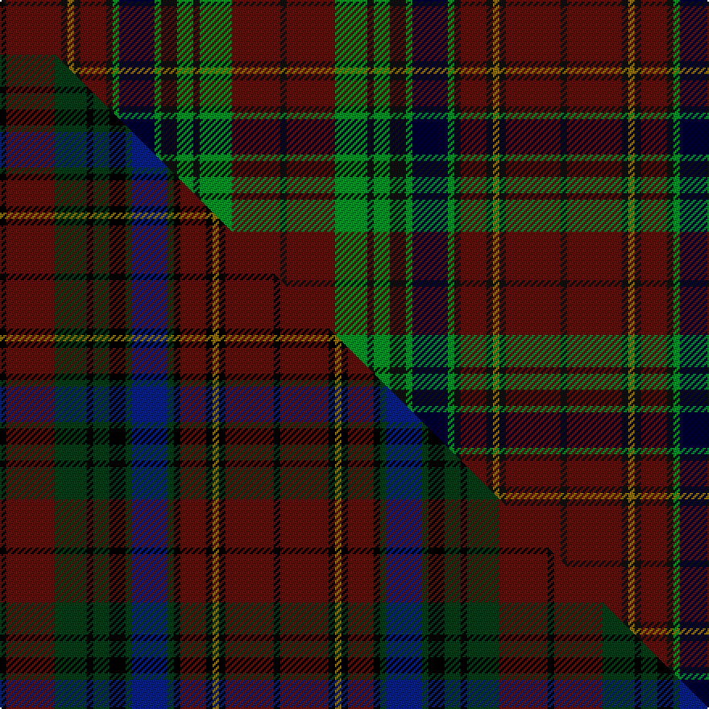

This page is one **sett** — a single exact thread-count. It belongs to the [tartan](/setts/ki2dr17ki2y2ki2dr8ki2g2k11g2ki5g5ki2g10dr15ki2/)
(the same proportion at any scale), whose colour order is pattern [KBGKGKGKGKBKGKBK](/stripes/kbgkgkgkgkbkgkbk/).

Part of the [Large](/tartans/large/) tartan — the named design grouping this sett with its other cloths.

Sourced from tartans-authority.  It is a [16 stripe tartan](/stripes/stripes16/).

Original link http://www.tartansauthority.com/tartan-ferret/display/10016/

## Provenance

Earliest known date: Mar. 2009 A family tartan for the Large family. A wedding gift for the castle-crazy daughter who is getting married in Leeds Castle, Kent in October and to welcome her new husband to the family. Aslo for her sister who is hoping to get her own 'castle' in the near future. Restricted to weaving via The House of Tartan, Comrie, Perthshire.

2 attestations — the source records this cloth was collapsed from (oldest owns this page)

<ul>
<li>Mar. 2009 — Large (Personal) (tartans-authority, <a href="http://www.tartansauthority.com/tartan-ferret/display/10016/">record</a>)  <em>A family tartan for the Large family. A wedding gift for the castle-crazy daughter who is getting married in Leeds Castle, Kent in October and to welcome her new husband to the family. Aslo for her sister who is hoping to get her own 'castle' in the near future. Restricted to weaving via The House of Tartan, Comrie, Perthshire.</em></li>
<li>undated — Large Personal Tartan (house-of-tartan, <a href="http://www.house-of-tartan.scotland.net/house/TartanViewjs.asp?colr=Def&tnam=10016">record</a>) </li>
</ul>

## Register references

External register numbers recorded for this tartan.

- Scottish Register of Tartans: [10016](https://www.tartanregister.gov.uk/tartanDetails?ref=10016)
- Scottish Tartans Authority (ITI): 10016

## Thread count
Ki/4 DR34 Ki4 Y4 Ki4 DR16 Ki4 G4 K22 G4 Ki10 G10 Ki4 G20 DR30 Ki/4

One full sett is **348 threads**.

## Palette
<table><thead><tr><th>Colour</th><th>Shade</th><th>OKLCh</th></tr></thead><tbody><tr><td>K</td><td><code style="background-color:#00002C;">#00002C</code> <small style="color:#888">#00002C</small></td><td><small style="color:#888">oklch(13.2% 0.092 264.1)</small></td></tr><tr><td>DR</td><td><code style="background-color:#55120C;">#55120C</code> <small style="color:#888">#55120C</small></td><td><small style="color:#888">oklch(30.0% 0.099 29.3)</small></td></tr><tr><td>G</td><td><code style="background-color:#008B2A;">#008B2A</code> <small style="color:#888">#008B2A</small></td><td><small style="color:#888">oklch(55.4% 0.170 145.9)</small></td></tr><tr><td>K</td><td><code style="background-color:#101010;">#101010</code> <small style="color:#888">#101010</small></td><td><small style="color:#888">oklch(17.3% 0.000 89.9)</small></td></tr><tr><td>Y</td><td><code style="background-color:#8B6E00;">#8B6E00</code> <small style="color:#888">#8B6E00</small></td><td><small style="color:#888">oklch(55.1% 0.113 90.4)</small></td></tr></tbody></table>

# Sample pattern

## Compared to the master

This cloth is one sett of its design; the master sett (the exemplar the design is anchored on) is below for comparison.

Its **ΔTartan distance** from the master is **1.15** — the same measure the nearest-tartans table ranks by (0 is identical; a re-scale of the same cloth is near 0, a recolour or a different proportion further).

<figure class="master-compare" style="margin:0">

this sett
master sett ★

<figcaption style="color:#888;font-size:smaller">One weave of this sett against the <a href="/setts/k2dr15dg10k2dg5k5dg2db11dg2k2dr8k2y2k2dr15k2/">master sett ★</a>, split on the diagonal: a shared proportion runs seamlessly across it with only the shades shifting; a different proportion breaks on it.</figcaption>
</figure>

## Nearest tartan variants

The nearest existing variants by ΔTartan distance, with this cloth at the top so the swatches line up against it.

ΔTartan

Threads

Variant

Sett

—

348

<a href="/variants/s16/ki2dr17ki2y2ki2dr8ki2g2k11g2ki5g5ki2g10dr15ki2~x2~ki0700000-k0504259/">Large (Personal)</a>

<a href="/ttd/edit/#slug=k2dr15dg10k2dg5k5dg2db11dg2k2dr8k2y2k2dr15k2~x2&amp;base=ki2dr17ki2y2ki2dr8ki2g2k11g2ki5g5ki2g10dr15ki2~x2~ki0700000-k0504259" title="compare in the TTD">0.06</a>

340

<a href="/variants/s16/k2dr15dg10k2dg5k5dg2db11dg2k2dr8k2y2k2dr15k2~x2/">Large (Personal)</a>

## Neighbour map

Every grey dot is one of 13620 variants placed by the first two principal components of the ΔTartan feature space (42% of its variance). Red is this tartan; blue dots are its nearest — click one to open its page.

<svg viewBox="0 0 640 380" role="img" style="max-width:100%;height:auto;border:1px solid #e0e0e0;border-radius:4px;display:block" xmlns="http://www.w3.org/2000/svg"><image href="/nn/cloud.v1.png" width="640" height="380"/><a href="/variants/s16/k2dr15dg10k2dg5k5dg2db11dg2k2dr8k2y2k2dr15k2~x2/"><circle cx="223.4" cy="174.5" r="4" fill="#3465a4"><title>Large (Personal)</title></circle></a><circle cx="204.0" cy="158.7" r="5" fill="#c00000"/><text x="320" y="376" text-anchor="middle" font-size="11" fill="#999">ground</text><text x="11" y="190" text-anchor="middle" font-size="11" fill="#999" transform="rotate(-90 11 190)">complexity</text></svg>

ID: /variants/s16/ki2dr17ki2y2ki2dr8ki2g2k11g2ki5g5ki2g10dr15ki2~x2~ki0700000-k0504259/
