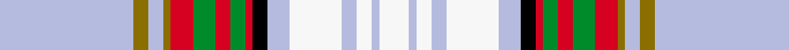

This page is one **sett** — a single exact thread-count. It belongs to the [tartan](/setts/lb18y2lb2y1r3g3r2g2r1k2lb3w7lb2w2lb1w4/)
(the same proportion at any scale), whose colour order is pattern [WGWGRGRGRKWWWWWW](/stripes/wgwgrgrgrkwwwwww/).

Sourced from tartans-authority.  It is a [16 stripe tartan](/stripes/stripes16/).

Original link http://www.tartansauthority.com/tartan-ferret/display/6164/

## Register references

External register numbers recorded for this tartan.

- Scottish Tartans Authority (ITI): 6164

## Thread count
LB/72 Y8 LB8 Y4 R12 G12 R8 G8 R4 K8 LB12 W28 LB8 W8 LB4 W/16

One full sett is **352 threads**.

## Palette
<table><thead><tr><th>Colour</th><th>Shade</th><th>OKLCh</th></tr></thead><tbody><tr><td>G</td><td><code style="background-color:#008B2A;">#008B2A</code> <small style="color:#888">#008B2A</small></td><td><small style="color:#888">oklch(55.4% 0.170 145.9)</small></td></tr><tr><td>K</td><td><code style="background-color:#000000;">#000000</code> <small style="color:#888">#000000</small></td><td><small style="color:#888">oklch(0.0% 0.000 0.0)</small></td></tr><tr><td>LB</td><td><code style="background-color:#B5BBDE;">#B5BBDE</code> <small style="color:#888">#B5BBDE</small></td><td><small style="color:#888">oklch(79.9% 0.050 277.6)</small></td></tr><tr><td>LN</td><td><code style="background-color:#F7F7F7;">#F7F7F7</code> <small style="color:#888">#F7F7F7</small></td><td><small style="color:#888">oklch(97.6% 0.000 89.9)</small></td></tr><tr><td>R</td><td><code style="background-color:#D60020;">#D60020</code> <small style="color:#888">#D60020</small></td><td><small style="color:#888">oklch(55.2% 0.224 25.5)</small></td></tr><tr><td>Y</td><td><code style="background-color:#8B6E00;">#8B6E00</code> <small style="color:#888">#8B6E00</small></td><td><small style="color:#888">oklch(55.1% 0.113 90.4)</small></td></tr></tbody></table>

# Sample pattern

## Nearest variants

The nearest existing variants by ΔTartan distance, with this cloth at the top so the swatches line up against it.

ΔTartan

Threads

Variant

Sett

—

352

<a href="/variants/s16/lb18y2lb2y1r3g3r2g2r1k2lb3w7lb2w2lb1w4~x4/">Inverness County (Canada) (District)</a>

<a href="/ttd/edit/#slug=lb18y2lb2y1r3g3r2g2r1k2lb3w7lb2w2lb1w4~x4~w3600000&amp;base=lb18y2lb2y1r3g3r2g2r1k2lb3w7lb2w2lb1w4~x4" title="compare in the TTD">0.00</a>

352

<a href="/variants/s16/lb18y2lb2y1r3g3r2g2r1k2lb3w7lb2w2lb1w4~x4~w3600000/">Inverness County (Canada)</a>

## Neighbour map

Every grey dot is one of 13620 variants placed by the first two principal components of the ΔTartan feature space (42% of its variance). Red is this tartan; blue dots are its nearest — click one to open its page.

<svg viewBox="0 0 640 380" role="img" style="max-width:100%;height:auto;border:1px solid #e0e0e0;border-radius:4px;display:block" xmlns="http://www.w3.org/2000/svg"><image href="/nn/cloud.v1.png" width="640" height="380"/><a href="/variants/s16/lb18y2lb2y1r3g3r2g2r1k2lb3w7lb2w2lb1w4~x4~w3600000/"><circle cx="207.8" cy="93.6" r="4" fill="#3465a4"><title>Inverness County (Canada)</title></circle></a><circle cx="195.0" cy="89.0" r="5" fill="#c00000"/><text x="320" y="376" text-anchor="middle" font-size="11" fill="#999">ground</text><text x="11" y="190" text-anchor="middle" font-size="11" fill="#999" transform="rotate(-90 11 190)">complexity</text></svg>

ID: /variants/s16/lb18y2lb2y1r3g3r2g2r1k2lb3w7lb2w2lb1w4~x4/
