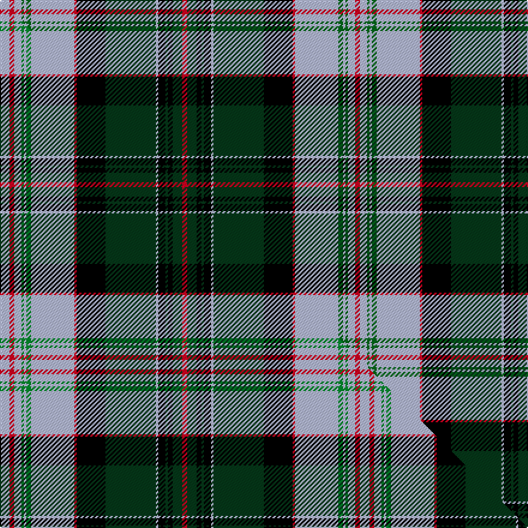

This is one **variant** — a specific cloth: this exact thread count and colourway, with its own
provenance below. It is one weaving of the [sett](/setts/lb4r2lb3dgi1lb1dgi2lb18r1k12dg21lb1k3dg1k2dg4r2/) (the scale-free proportion — the
same cloth at any scale or shade), whose colour order is pattern [RWGWGWRKGWKGKGRGKGKWGKRWGWGWRW](/stripes/rwgwgwrkgwkgkgrgkgkwgkrwgwgwrw/).

Part of the [Munster](/tartans/m/mu/munster/) tartan — the named design grouping this sett with its other cloths.

Sourced from house-of-tartan.  It is a [30 stripe tartan](/stripes/stripes30/).

Original link [http://www.house-of-tartan.scotland.net/house/TartanViewjs.asp?colr=Def&tnam=4061](http://www.house-of-tartan.scotland.net/house/TartanViewjs.asp?colr=Def&tnam=4061)

## Provenance

Earliest known date: 1997 One of the Irish district tartans produced in 1997 by Lochcarron to acknowledge the early historical and cultural links between the Scots and the Irish. Munster covers the southwest counties of Ireland and encompasses the principal cities of Cork, Limerick and Waterford.

Dataset <small>— provenance for this record, inherited from the source manifest</small>

<dl class="dataset-prov">
<dt>source</dt><dd><a href="/sources/house-of-tartan/">House of Tartan</a></dd>
<dt>data captured from</dt><dd><a href="https://github.com/thetartan/tartan-database/blob/master/data/house-of-tartan/data.csv">https://github.com/thetartan/tartan-database/blob/master/data/house-of-tartan/data.csv</a></dd>
<dt>data date</dt><dd>1997 <small>(this record)</small></dd>
<dt>licence</dt><dd><a href="https://creativecommons.org/licenses/by-nc-nd/4.0/">CC BY-NC-ND 4.0</a></dd>
</dl>

Capture chain <small>— the hands this data passed through, oldest first; each capture carries its own licence</small>

<ol class="capture-chain">
<li><a href="http://www.house-of-tartan.scotland.net/">House of Tartan</a> <small>the weaver/retailer's database — the site is now offline; the URL is kept as the ultimate source's identity</small></li>
<li><a href="https://github.com/thetartan/tartan-database">thetartan/tartan-database</a> <small>2016-2017</small> · <a href="https://creativecommons.org/licenses/by-nc-nd/4.0/">CC BY-NC-ND 4.0</a> <small>Levko Kravets's frozen compilation — the capture we vendored, and where its CC licence text came from</small></li>
<li>this dictionary <small>captured 2026-06-10 · commit 5bf86c7566</small> <small>each re-capture is a git commit to data/sources</small></li>
</ol>

## Thread count
LB/8 R4 LB6 DGi2 LB2 DGi4 LB36 R2 K24 DG42 LB2 K6 DG2 K4 DG8 R4 DG8 K4 DG2 K6 LB2 DG42 K24 R2 LB36 DGi4 LB2 DGi2 LB6 R/4

One full sett is **588 threads**.

## Palette
<table><thead><tr><th>Colour</th><th>Shade</th><th>OKLCh</th></tr></thead><tbody><tr><td>LB</td><td><code style="background-color:#B5BBDE;">#B5BBDE</code> <small style="color:#888">#B5BBDE</small></td><td><small style="color:#888">oklch(79.9% 0.050 277.6)</small></td></tr><tr><td>DG</td><td><code style="background-color:#006818;">#006818</code> <small style="color:#888">#006818</small></td><td><small style="color:#888">oklch(45.0% 0.142 145.0)</small></td></tr><tr><td>G</td><td><code style="background-color:#408060;">#408060</code> <small style="color:#888">#408060</small></td><td><small style="color:#888">oklch(54.8% 0.084 160.1)</small></td></tr><tr><td>DG</td><td><code style="background-color:#053819;">#053819</code> <small style="color:#888">#053819</small></td><td><small style="color:#888">oklch(30.0% 0.075 151.3)</small></td></tr><tr><td>K</td><td><code style="background-color:#000000;">#000000</code> <small style="color:#888">#000000</small></td><td><small style="color:#888">oklch(0.0% 0.000 0.0)</small></td></tr><tr><td>R</td><td><code style="background-color:#D60020;">#D60020</code> <small style="color:#888">#D60020</small></td><td><small style="color:#888">oklch(55.2% 0.224 25.5)</small></td></tr></tbody></table>

# Sample pattern

## Compared to the master

This cloth is one sett of its design; the master sett (the exemplar the design is anchored on) is below for comparison.

Its **ΔTartan distance** from the master is **0.01** — the same measure the nearest-tartans table ranks by (0 is identical; a re-scale of the same cloth is near 0, a recolour or a different proportion further).

<figure class="master-compare" style="margin:0">

this sett
master sett ★

<figcaption style="color:#888;font-size:smaller">One weave of this sett against the <a href="/setts/lb4r2lb3g1lb1g2lb18r1k12dg21lb1k3dg1k2dg4r2/">master sett ★</a>, split on the diagonal: a shared proportion runs seamlessly across it with only the shades shifting; a different proportion breaks on it.</figcaption>
</figure>

## Nearest tartan variants

The nearest existing variants by ΔTartan distance, with this cloth at the top so the swatches line up against it.

ΔTartan

Threads

Variant

Sett

—

588

<a href="/variants/s16/lb4r2lb3dgi1lb1dgi2lb18r1k12dg21lb1k3dg1k2dg4r2~x2~dgi1806142/">Munster Irish District Tartan</a>

<a href="/ttd/edit/#slug=lb4r2lb3g1lb1g2lb18r1k12dg21lb1k3dg1k2dg4r2~x2&amp;base=lb4r2lb3dgi1lb1dgi2lb18r1k12dg21lb1k3dg1k2dg4r2~x2~dgi1806142" title="compare in the TTD">0.01</a>

300

<a href="/variants/s16/lb4r2lb3g1lb1g2lb18r1k12dg21lb1k3dg1k2dg4r2~x2/">Munster</a>

<a href="/ttd/edit/#slug=g20k1g1k6w1k6dp1k1dp4r3dp14r3dp4k1dp1k6w1k6g1k1g8~x2&amp;base=lb4r2lb3dgi1lb1dgi2lb18r1k12dg21lb1k3dg1k2dg4r2~x2~dgi1806142" title="compare in the TTD">2.45</a>

304

<a href="/variants/s21/g20k1g1k6w1k6dp1k1dp4r3dp14r3dp4k1dp1k6w1k6g1k1g8~x2/">New Hampshire District Tartan</a>

<a href="/ttd/edit/#slug=g6w2g24k12db3k2db2k2db12r1db1r3~x2~w4000000-db1406275&amp;base=lb4r2lb3dgi1lb1dgi2lb18r1k12dg21lb1k3dg1k2dg4r2~x2~dgi1806142" title="compare in the TTD">2.53</a>

262

<a href="/variants/s12/g6w2g24k12db3k2db2k2db12r1db1r3~x2~w4000000-db1406275/">Sutherland</a>

<a href="/ttd/edit/#slug=db10k10g10k1db2k1g10k10w2db2w24db2w2db2w24db2w2k10g10k1db2k1g10k10db10k2r3k2db10k10w2db2w24db2w2db2~x2&amp;base=lb4r2lb3dgi1lb1dgi2lb18r1k12dg21lb1k3dg1k2dg4r2~x2~dgi1806142" title="compare in the TTD">2.54</a>

900

<a href="/variants/s36/db10k10g10k1db2k1g10k10w2db2w24db2w2db2w24db2w2k10g10k1db2k1g10k10db10k2r3k2db10k10w2db2w24db2w2db2~x2/">Campbell of Cawdor Dress Trade Tartan</a>

<a href="/ttd/edit/#slug=db15k1db1k1db1k12g9r1g9k1w1k1g9r1g9k12r1db9r2db1r1db6w1~x2&amp;base=lb4r2lb3dgi1lb1dgi2lb18r1k12dg21lb1k3dg1k2dg4r2~x2~dgi1806142" title="compare in the TTD">2.83</a>

388

<a href="/variants/s23/db15k1db1k1db1k12g9r1g9k1w1k1g9r1g9k12r1db9r2db1r1db6w1~x2/">Rankine</a>

<a href="/ttd/edit/#slug=dy29g17k1w3k1ly2k10lb8dy4lb8k10ly2k1w3dy29~x2~w4000000&amp;base=lb4r2lb3dgi1lb1dgi2lb18r1k12dg21lb1k3dg1k2dg4r2~x2~dgi1806142" title="compare in the TTD">2.88</a>

396

<a href="/variants/s15/dy29g17k1w3k1ly2k10lb8dy4lb8k10ly2k1w3dy29~x2~w4000000/">Wilson's No.171</a>

<a href="/ttd/edit/#slug=r10db6r3db3r3db28k22g28r2k2ly4k2r2g28k22db28r3db3r3db6r5~x2&amp;base=lb4r2lb3dgi1lb1dgi2lb18r1k12dg21lb1k3dg1k2dg4r2~x2~dgi1806142" title="compare in the TTD">2.91</a>

822

<a href="/variants/s21/r10db6r3db3r3db28k22g28r2k2ly4k2r2g28k22db28r3db3r3db6r5~x2/">Logan</a>

<a href="/ttd/edit/#slug=db36k5r2k5g15r2g10w2g10r2g15k5r2k5db10r2db2r2db4w2~x2~db1404245&amp;base=lb4r2lb3dgi1lb1dgi2lb18r1k12dg21lb1k3dg1k2dg4r2~x2~dgi1806142" title="compare in the TTD">2.91</a>

476

<a href="/variants/s20/db36k5r2k5g15r2g10w2g10r2g15k5r2k5db10r2db2r2db4w2~x2~db1404245/">Ranking Corporate Tartan</a>

<a href="/ttd/edit/#slug=db33k3r2k3g9r2g7w2g7r2g9k3r2k3db7r2db2r2db3w2~x2&amp;base=lb4r2lb3dgi1lb1dgi2lb18r1k12dg21lb1k3dg1k2dg4r2~x2~dgi1806142" title="compare in the TTD">2.93</a>

350

<a href="/variants/s20/db33k3r2k3g9r2g7w2g7r2g9k3r2k3db7r2db2r2db3w2~x2/">Ranking (Personal)</a>

<a href="/ttd/edit/#slug=w4db4w60db5w5k30db27k5db30k27g4lb5g66lb5g4k30w5db5w57db4w4&amp;base=lb4r2lb3dgi1lb1dgi2lb18r1k12dg21lb1k3dg1k2dg4r2~x2~dgi1806142" title="compare in the TTD">2.94</a>

764

<a href="/variants/s21/w4db4w60db5w5k30db27k5db30k27g4lb5g66lb5g4k30w5db5w57db4w4/">Graham Dress</a>

## Neighbour map

Every grey dot is one of 13621 variants placed by the first two principal components of the ΔTartan feature space (42% of its variance). Red is this tartan; blue dots are its nearest — click one to open its page. The map is a flat projection of a many-dimensional space — [how to read it](/posts/neighbourhood-maps/).

<svg viewBox="0 0 640 380" role="img" style="max-width:100%;height:auto;border:1px solid #e0e0e0;border-radius:4px;display:block" xmlns="http://www.w3.org/2000/svg"><image href="/nn/cloud.v1.png" width="640" height="380"/><a href="/variants/s16/lb4r2lb3g1lb1g2lb18r1k12dg21lb1k3dg1k2dg4r2~x2/"><circle cx="140.6" cy="82.8" r="4" fill="#3465a4"><title>Munster</title></circle></a><a href="/variants/s21/g20k1g1k6w1k6dp1k1dp4r3dp14r3dp4k1dp1k6w1k6g1k1g8~x2/"><circle cx="132.6" cy="84.6" r="4" fill="#3465a4"><title>New Hampshire District Tartan</title></circle></a><a href="/variants/s12/g6w2g24k12db3k2db2k2db12r1db1r3~x2~w4000000-db1406275/"><circle cx="171.1" cy="77.8" r="4" fill="#3465a4"><title>Sutherland</title></circle></a><a href="/variants/s36/db10k10g10k1db2k1g10k10w2db2w24db2w2db2w24db2w2k10g10k1db2k1g10k10db10k2r3k2db10k10w2db2w24db2w2db2~x2/"><circle cx="92.1" cy="58.0" r="4" fill="#3465a4"><title>Campbell of Cawdor Dress Trade Tartan</title></circle></a><a href="/variants/s23/db15k1db1k1db1k12g9r1g9k1w1k1g9r1g9k12r1db9r2db1r1db6w1~x2/"><circle cx="119.4" cy="101.5" r="4" fill="#3465a4"><title>Rankine</title></circle></a><a href="/variants/s15/dy29g17k1w3k1ly2k10lb8dy4lb8k10ly2k1w3dy29~x2~w4000000/"><circle cx="88.4" cy="49.1" r="4" fill="#3465a4"><title>Wilson's No.171</title></circle></a><a href="/variants/s21/r10db6r3db3r3db28k22g28r2k2ly4k2r2g28k22db28r3db3r3db6r5~x2/"><circle cx="115.2" cy="105.0" r="4" fill="#3465a4"><title>Logan</title></circle></a><a href="/variants/s20/db36k5r2k5g15r2g10w2g10r2g15k5r2k5db10r2db2r2db4w2~x2~db1404245/"><circle cx="159.8" cy="94.9" r="4" fill="#3465a4"><title>Ranking Corporate Tartan</title></circle></a><a href="/variants/s20/db33k3r2k3g9r2g7w2g7r2g9k3r2k3db7r2db2r2db3w2~x2/"><circle cx="174.2" cy="83.1" r="4" fill="#3465a4"><title>Ranking (Personal)</title></circle></a><a href="/variants/s21/w4db4w60db5w5k30db27k5db30k27g4lb5g66lb5g4k30w5db5w57db4w4/"><circle cx="99.8" cy="91.9" r="4" fill="#3465a4"><title>Graham Dress</title></circle></a><circle cx="127.5" cy="58.5" r="5" fill="#c00000"/><text x="320" y="376" text-anchor="middle" font-size="11" fill="#999">ground</text><text x="11" y="190" text-anchor="middle" font-size="11" fill="#999" transform="rotate(-90 11 190)">complexity</text></svg>

ID: /variants/s16/lb4r2lb3dgi1lb1dgi2lb18r1k12dg21lb1k3dg1k2dg4r2~x2~dgi1806142/
