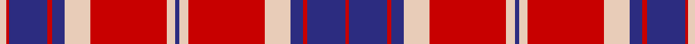

This page is one **sett** — a single exact thread-count. It belongs to the [tartan](/setts/lb6r3db36r4db12lb24r72lb8db4/)
(the same proportion at any scale), whose colour order is pattern [RBRBWRWBWRWBRBRW](/stripes/rbrbwrwbwrwbrbrw/).

Sourced from register-of-tartans.  It is a [16 stripe tartan](/stripes/stripes16/).

Original link https://www.tartanregister.gov.uk/tartanDetails.aspx?ref=3828

## Register references

External register numbers recorded for this tartan.

- Scottish Register of Tartans: [3828](https://www.tartanregister.gov.uk/tartanDetails.aspx?ref=3828)
- Scottish Tartans Authority (ITI): 6102

## Thread count
LR/6 R3 DB36 R4 DB12 LR24 R72 LR8 DB4 LR8 R72 LR24 DB12 R4 DB36 R/3

One full sett is **647 threads**.

## Palette

Palette: <strong>Tartan Register</strong>
<table><thead><tr><th>Colour</th><th>Threads</th><th>Shade</th><th>Base</th><th>OKLCh</th></tr></thead><tbody><tr><td>LR/</td><td style="text-align:right;font-variant-numeric:tabular-nums">6</td><td><code style="background-color:#E8CCB8;">#E8CCB8</code> <small style="color:#888">#E8CCB8</small></td><td>W <code style="background-color:#F7F7F7;">#F7F7F7</code></td><td><small style="color:#888">oklch(86.3% 0.042 57.7)</small></td></tr><tr><td>R</td><td style="text-align:right;font-variant-numeric:tabular-nums">3</td><td><code style="background-color:#C80000;">#C80000</code> <small style="color:#888">#C80000</small></td><td>R <code style="background-color:#CC0000;">#CC0000</code></td><td><small style="color:#888">oklch(52.3% 0.215 29.2)</small></td></tr><tr><td>DB</td><td style="text-align:right;font-variant-numeric:tabular-nums">36</td><td><code style="background-color:#2C2C80;">#2C2C80</code> <small style="color:#888">#2C2C80</small></td><td>B <code style="background-color:#2A418A;">#2A418A</code></td><td><small style="color:#888">oklch(35.0% 0.138 276.6)</small></td></tr><tr><td>R</td><td style="text-align:right;font-variant-numeric:tabular-nums">4</td><td><code style="background-color:#C80000;">#C80000</code> <small style="color:#888">#C80000</small></td><td>R <code style="background-color:#CC0000;">#CC0000</code></td><td><small style="color:#888">oklch(52.3% 0.215 29.2)</small></td></tr><tr><td>DB</td><td style="text-align:right;font-variant-numeric:tabular-nums">12</td><td><code style="background-color:#2C2C80;">#2C2C80</code> <small style="color:#888">#2C2C80</small></td><td>B <code style="background-color:#2A418A;">#2A418A</code></td><td><small style="color:#888">oklch(35.0% 0.138 276.6)</small></td></tr><tr><td>LR</td><td style="text-align:right;font-variant-numeric:tabular-nums">24</td><td><code style="background-color:#E8CCB8;">#E8CCB8</code> <small style="color:#888">#E8CCB8</small></td><td>W <code style="background-color:#F7F7F7;">#F7F7F7</code></td><td><small style="color:#888">oklch(86.3% 0.042 57.7)</small></td></tr><tr><td>R</td><td style="text-align:right;font-variant-numeric:tabular-nums">72</td><td><code style="background-color:#C80000;">#C80000</code> <small style="color:#888">#C80000</small></td><td>R <code style="background-color:#CC0000;">#CC0000</code></td><td><small style="color:#888">oklch(52.3% 0.215 29.2)</small></td></tr><tr><td>LR</td><td style="text-align:right;font-variant-numeric:tabular-nums">8</td><td><code style="background-color:#E8CCB8;">#E8CCB8</code> <small style="color:#888">#E8CCB8</small></td><td>W <code style="background-color:#F7F7F7;">#F7F7F7</code></td><td><small style="color:#888">oklch(86.3% 0.042 57.7)</small></td></tr><tr><td>DB</td><td style="text-align:right;font-variant-numeric:tabular-nums">4</td><td><code style="background-color:#2C2C80;">#2C2C80</code> <small style="color:#888">#2C2C80</small></td><td>B <code style="background-color:#2A418A;">#2A418A</code></td><td><small style="color:#888">oklch(35.0% 0.138 276.6)</small></td></tr><tr><td>LR</td><td style="text-align:right;font-variant-numeric:tabular-nums">8</td><td><code style="background-color:#E8CCB8;">#E8CCB8</code> <small style="color:#888">#E8CCB8</small></td><td>W <code style="background-color:#F7F7F7;">#F7F7F7</code></td><td><small style="color:#888">oklch(86.3% 0.042 57.7)</small></td></tr><tr><td>R</td><td style="text-align:right;font-variant-numeric:tabular-nums">72</td><td><code style="background-color:#C80000;">#C80000</code> <small style="color:#888">#C80000</small></td><td>R <code style="background-color:#CC0000;">#CC0000</code></td><td><small style="color:#888">oklch(52.3% 0.215 29.2)</small></td></tr><tr><td>LR</td><td style="text-align:right;font-variant-numeric:tabular-nums">24</td><td><code style="background-color:#E8CCB8;">#E8CCB8</code> <small style="color:#888">#E8CCB8</small></td><td>W <code style="background-color:#F7F7F7;">#F7F7F7</code></td><td><small style="color:#888">oklch(86.3% 0.042 57.7)</small></td></tr><tr><td>DB</td><td style="text-align:right;font-variant-numeric:tabular-nums">12</td><td><code style="background-color:#2C2C80;">#2C2C80</code> <small style="color:#888">#2C2C80</small></td><td>B <code style="background-color:#2A418A;">#2A418A</code></td><td><small style="color:#888">oklch(35.0% 0.138 276.6)</small></td></tr><tr><td>R</td><td style="text-align:right;font-variant-numeric:tabular-nums">4</td><td><code style="background-color:#C80000;">#C80000</code> <small style="color:#888">#C80000</small></td><td>R <code style="background-color:#CC0000;">#CC0000</code></td><td><small style="color:#888">oklch(52.3% 0.215 29.2)</small></td></tr><tr><td>DB</td><td style="text-align:right;font-variant-numeric:tabular-nums">36</td><td><code style="background-color:#2C2C80;">#2C2C80</code> <small style="color:#888">#2C2C80</small></td><td>B <code style="background-color:#2A418A;">#2A418A</code></td><td><small style="color:#888">oklch(35.0% 0.138 276.6)</small></td></tr><tr><td>R/</td><td style="text-align:right;font-variant-numeric:tabular-nums">3</td><td><code style="background-color:#C80000;">#C80000</code> <small style="color:#888">#C80000</small></td><td>R <code style="background-color:#CC0000;">#CC0000</code></td><td><small style="color:#888">oklch(52.3% 0.215 29.2)</small></td></tr></tbody></table>

## Nearest tartans

The nearest existing variants by ΔTartan distance, with this tartan at the top so the swatches line up against it.

ΔTartan

Tartan

Sett

—

<a href="/ttd/edit/#slug=lb6r3db36r4db12lb24r72lb8db4">Snoozzzeee</a> <a class="nn-out" href="/variants/s16/lb6r3db36r4db12lb24r72lb8db4/" title="open its dictionary page">↗</a>

1.19

<a href="/ttd/edit/#slug=lb6r3db36r4db12lb24r72lb8db4">Snoozzzeee (Corporate)</a> <a class="nn-out" href="/variants/s9/lb6r3db36r4db12lb24r72lb8db4/" title="open its dictionary page">↗</a>

1.31

<a href="/ttd/edit/#slug=db4r1db1r4db12r4db1r1dg4r1db1r26db26r4dg4r26dg21r13db6r5dg1~x2&amp;base=lb6r3db36r4db12lb24r72lb8db4">Murray of Tullibardine (plaid)</a> <a class="nn-out" href="/variants/s21/db4r1db1r4db12r4db1r1dg4r1db1r26db26r4dg4r26dg21r13db6r5dg1~x2/" title="open its dictionary page">↗</a>

1.32

<a href="/ttd/edit/#slug=w5dr1r20dr4w2dr4w2dr24o2dr1o4dr4~x2&amp;base=lb6r3db36r4db12lb24r72lb8db4">Chrysanthemum (Japanese Four Seasons)</a> <a class="nn-out" href="/variants/s12/w5dr1r20dr4w2dr4w2dr24o2dr1o4dr4~x2/" title="open its dictionary page">↗</a>

1.32

<a href="/ttd/edit/#slug=w8k1r24k2r4k2r1k2r4k2db20k1w5~x2&amp;base=lb6r3db36r4db12lb24r72lb8db4">Danish</a> <a class="nn-out" href="/variants/s13/w8k1r24k2r4k2r1k2r4k2db20k1w5~x2/" title="open its dictionary page">↗</a>

1.34

<a href="/ttd/edit/#slug=w4db16w2db1w2db8k1r4k2r4k2r24k1w8r2~x2&amp;base=lb6r3db36r4db12lb24r72lb8db4">Missouri</a> <a class="nn-out" href="/variants/s15/w4db16w2db1w2db8k1r4k2r4k2r24k1w8r2~x2/" title="open its dictionary page">↗</a>

1.36

<a href="/ttd/edit/#slug=db2r21db1w4db7w2db2w2r2~x2&amp;base=lb6r3db36r4db12lb24r72lb8db4">31, Tartan (The.. )</a> <a class="nn-out" href="/variants/s9/db2r21db1w4db7w2db2w2r2~x2/" title="open its dictionary page">↗</a>

1.40

<a href="/ttd/edit/#slug=r2w2db6r2db2r2db1r20ly1r2ly2r2ly6w2ly2~x2&amp;base=lb6r3db36r4db12lb24r72lb8db4">Winthrop University</a> <a class="nn-out" href="/variants/s15/r2w2db6r2db2r2db1r20ly1r2ly2r2ly6w2ly2~x2/" title="open its dictionary page">↗</a>

1.47

<a href="/ttd/edit/#slug=lr4r1lr2r3lr24dr5r3dr1r1dr1r20lr2~x2&amp;base=lb6r3db36r4db12lb24r72lb8db4">Menzies VS</a> <a class="nn-out" href="/variants/s12/lr4r1lr2r3lr24dr5r3dr1r1dr1r20lr2~x2/" title="open its dictionary page">↗</a>

1.47

<a href="/ttd/edit/#slug=lr4r1lr2r3lr24dr5r3dr1r1dr1r20lr2&amp;base=lb6r3db36r4db12lb24r72lb8db4">Menzies VS</a> <a class="nn-out" href="/variants/s12/lr4r1lr2r3lr24dr5r3dr1r1dr1r20lr2/" title="open its dictionary page">↗</a>

1.48

<a href="/ttd/edit/#slug=dg18r2dg18r18dg2r4dg2r18db18r2db18r18db1r1db2r1db1r18~x2&amp;base=lb6r3db36r4db12lb24r72lb8db4">Ross #5</a> <a class="nn-out" href="/variants/s18/dg18r2dg18r18dg2r4dg2r18db18r2db18r18db1r1db2r1db1r18~x2/" title="open its dictionary page">↗</a>

## Neighbour map

Every grey dot is one of 14360 variants placed by the first two principal components of the ΔTartan feature space (44% of its variance). Red is this tartan; blue dots are its nearest — click one to open its page.

<svg viewBox="0 0 640 380" role="img" style="max-width:100%;height:auto;border:1px solid #e0e0e0;border-radius:4px;display:block" xmlns="http://www.w3.org/2000/svg"><image href="/nn/cloud.v1.png" width="640" height="380"/><a href="/variants/s9/lb6r3db36r4db12lb24r72lb8db4/"><circle cx="306.3" cy="129.7" r="4" fill="#3465a4"><title>Snoozzzeee (Corporate)</title></circle></a><a href="/variants/s21/db4r1db1r4db12r4db1r1dg4r1db1r26db26r4dg4r26dg21r13db6r5dg1~x2/"><circle cx="343.1" cy="113.3" r="4" fill="#3465a4"><title>Murray of Tullibardine (plaid)</title></circle></a><a href="/variants/s12/w5dr1r20dr4w2dr4w2dr24o2dr1o4dr4~x2/"><circle cx="318.7" cy="105.5" r="4" fill="#3465a4"><title>Chrysanthemum (Japanese Four Seasons)</title></circle></a><a href="/variants/s13/w8k1r24k2r4k2r1k2r4k2db20k1w5~x2/"><circle cx="244.9" cy="90.6" r="4" fill="#3465a4"><title>Danish</title></circle></a><a href="/variants/s15/w4db16w2db1w2db8k1r4k2r4k2r24k1w8r2~x2/"><circle cx="232.4" cy="87.0" r="4" fill="#3465a4"><title>Missouri</title></circle></a><a href="/variants/s9/db2r21db1w4db7w2db2w2r2~x2/"><circle cx="346.4" cy="130.9" r="4" fill="#3465a4"><title>31, Tartan (The.. )</title></circle></a><a href="/variants/s15/r2w2db6r2db2r2db1r20ly1r2ly2r2ly6w2ly2~x2/"><circle cx="302.9" cy="89.2" r="4" fill="#3465a4"><title>Winthrop University</title></circle></a><a href="/variants/s12/lr4r1lr2r3lr24dr5r3dr1r1dr1r20lr2~x2/"><circle cx="355.3" cy="120.1" r="4" fill="#3465a4"><title>Menzies VS</title></circle></a><a href="/variants/s12/lr4r1lr2r3lr24dr5r3dr1r1dr1r20lr2/"><circle cx="355.3" cy="120.1" r="4" fill="#3465a4"><title>Menzies VS</title></circle></a><a href="/variants/s18/dg18r2dg18r18dg2r4dg2r18db18r2db18r18db1r1db2r1db1r18~x2/"><circle cx="311.0" cy="148.3" r="4" fill="#3465a4"><title>Ross #5</title></circle></a><circle cx="299.5" cy="110.2" r="5" fill="#c00000"/></svg>

ID: /variants/s16/lb6r3db36r4db12lb24r72lb8db4/
