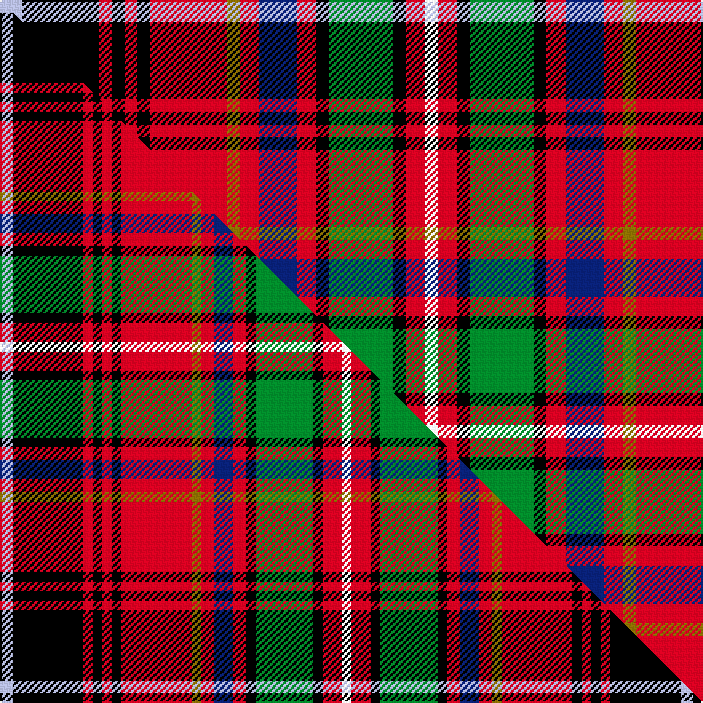

This page is one **sett** — a single exact thread-count. It belongs to the [tartan](/setts/lb7k24r4k4r4k4r24y4r6db12r6k4g20k4r6w4/)
(the same proportion at any scale), whose colour order is pattern [WKRKRKRGRBRKGKRW](/stripes/wkrkrkrgrbrkgkrw/).

Part of the [Innes](/tartans/innes/) tartan — the named design grouping this sett with its other cloths.

Sourced from weddslist.  It is a [16 stripe tartan](/stripes/stripes16/).

Original link [http://www.weddslist.com/cgi-bin/tartans/pg.pl?source=tinsel](http://www.weddslist.com/cgi-bin/tartans/pg.pl?source=tinsel)

Dataset <small>— provenance for this record, inherited from the source manifest</small>

<dl class="dataset-prov">
<dt>source</dt><dd><a href="/sources/weddslist/">Weddslist</a></dd>
<dt>data captured from</dt><dd><a href="https://github.com/thetartan/tartan-database/blob/master/data/weddslist/data.csv">https://github.com/thetartan/tartan-database/blob/master/data/weddslist/data.csv</a></dd>
<dt>data date</dt><dd>2016-11-17 <small>(dataset default)</small></dd>
<dt>licence</dt><dd><a href="https://creativecommons.org/licenses/by-nc-nd/4.0/">CC BY-NC-ND 4.0</a></dd>
</dl>

Capture chain <small>— the hands this data passed through, oldest first; each capture carries its own licence</small>

<ol class="capture-chain">
<li><a href="https://www.weddslist.com/tartans/">Weddslist</a> <small>the living privately compiled reference</small></li>
<li><a href="https://github.com/thetartan/tartan-database">thetartan/tartan-database</a> <small>2016-2017</small> · <a href="https://creativecommons.org/licenses/by-nc-nd/4.0/">CC BY-NC-ND 4.0</a> <small>Levko Kravets's frozen compilation — the capture we vendored, and where its CC licence text came from</small></li>
<li>this dictionary <small>captured 2026-06-10 · commit 5bf86c7566</small> <small>each re-capture is a git commit to data/sources</small></li>
</ol>

## Thread count
LB/14 K48 R8 K8 R8 K8 R48 Y8 R12 DB24 R12 K8 G40 K8 R12 W/8

One full sett is **526 threads**.

## Palette
<table><thead><tr><th>Colour</th><th>Shade</th><th>OKLCh</th></tr></thead><tbody><tr><td>LB</td><td><code style="background-color:#B5BBDE;">#B5BBDE</code> <small style="color:#888">#B5BBDE</small></td><td><small style="color:#888">oklch(79.9% 0.050 277.6)</small></td></tr><tr><td>DB</td><td><code style="background-color:#082077;">#082077</code> <small style="color:#888">#082077</small></td><td><small style="color:#888">oklch(30.0% 0.149 265.1)</small></td></tr><tr><td>G</td><td><code style="background-color:#008B2A;">#008B2A</code> <small style="color:#888">#008B2A</small></td><td><small style="color:#888">oklch(55.4% 0.170 145.9)</small></td></tr><tr><td>R</td><td><code style="background-color:#D60020;">#D60020</code> <small style="color:#888">#D60020</small></td><td><small style="color:#888">oklch(55.2% 0.224 25.5)</small></td></tr><tr><td>K</td><td><code style="background-color:#000000;">#000000</code> <small style="color:#888">#000000</small></td><td><small style="color:#888">oklch(0.0% 0.000 0.0)</small></td></tr><tr><td>Y</td><td><code style="background-color:#8B6E00;">#8B6E00</code> <small style="color:#888">#8B6E00</small></td><td><small style="color:#888">oklch(55.1% 0.113 90.4)</small></td></tr><tr><td>W</td><td><code style="background-color:#F7F7F7;">#F7F7F7</code> <small style="color:#888">#F7F7F7</small></td><td><small style="color:#888">oklch(97.6% 0.000 89.9)</small></td></tr></tbody></table>

# Sample pattern

## Compared to the master

This cloth is one sett of its design; the master sett (the exemplar the design is anchored on) is below for comparison.

Its **ΔTartan distance** from the master is **0.21** — the same measure the nearest-tartans table ranks by (0 is identical; a re-scale of the same cloth is near 0, a recolour or a different proportion further).

<figure class="master-compare" style="margin:0">

this sett
master sett ★

<figcaption style="color:#888;font-size:smaller">One weave of this sett against the <a href="/setts/lb4k22r3k3r3k3r22y3r4db6r4k3g18k3r6w3/">master sett ★</a>, split on the diagonal: a shared proportion runs seamlessly across it with only the shades shifting; a different proportion breaks on it.</figcaption>
</figure>

## Nearest tartan variants

The nearest existing variants by ΔTartan distance, with this cloth at the top so the swatches line up against it.

ΔTartan

Threads

Variant

Sett

—

526

<a href="/variants/s16/lb7k24r4k4r4k4r24y4r6db12r6k4g20k4r6w4~x2/">Innes</a>

<a href="/ttd/edit/#slug=lb7k24r4k4r4k4r24y4r6db12r6k4g20k4r6w4&amp;base=lb7k24r4k4r4k4r24y4r6db12r6k4g20k4r6w4~x2" title="compare in the TTD">0.00</a>

263

<a href="/variants/s16/lb7k24r4k4r4k4r24y4r6db12r6k4g20k4r6w4/">Innes (Seven colours) (Clan)</a>

<a href="/ttd/edit/#slug=lb3k12r2k2r2k2r12y2r3db6r3k2g10k2r3w2~x2&amp;base=lb7k24r4k4r4k4r24y4r6db12r6k4g20k4r6w4~x2" title="compare in the TTD">0.01</a>

262

<a href="/variants/s16/lb3k12r2k2r2k2r12y2r3db6r3k2g10k2r3w2~x2/">Innes D</a>

<a href="/ttd/edit/#slug=lb3k12r2k2r2k2r12y2r3db6r3k2g10k2r3w2&amp;base=lb7k24r4k4r4k4r24y4r6db12r6k4g20k4r6w4~x2" title="compare in the TTD">0.01</a>

131

<a href="/variants/s16/lb3k12r2k2r2k2r12y2r3db6r3k2g10k2r3w2/">Innes D</a>

<a href="/ttd/edit/#slug=lb4k22r3k3r3k3r22y3r4db6r4k3g18k3r6w3~x2&amp;base=lb7k24r4k4r4k4r24y4r6db12r6k4g20k4r6w4~x2" title="compare in the TTD">0.21</a>

426

<a href="/variants/s16/lb4k22r3k3r3k3r22y3r4db6r4k3g18k3r6w3~x2/">Innes (of Moray)</a>

<a href="/ttd/edit/#slug=w3k12r2k2r2k2r12y2r3db6r3k2g10k2r3w2&amp;base=lb7k24r4k4r4k4r24y4r6db12r6k4g20k4r6w4~x2" title="compare in the TTD">0.30</a>

131

<a href="/variants/s16/w3k12r2k2r2k2r12y2r3db6r3k2g10k2r3w2/">Innes D</a>

<a href="/ttd/edit/#slug=w7k24r4k4r4k4r24y4r6db12r6k4g20k4r6w4&amp;base=lb7k24r4k4r4k4r24y4r6db12r6k4g20k4r6w4~x2" title="compare in the TTD">0.30</a>

263

<a href="/variants/s16/w7k24r4k4r4k4r24y4r6db12r6k4g20k4r6w4/">Innes</a>

<a href="/ttd/edit/#slug=r24k4r4k4r4k24lb7k24r4k4r4k4r24y4r6db12r6k4g20k4r6w4&amp;base=lb7k24r4k4r4k4r24y4r6db12r6k4g20k4r6w4~x2" title="compare in the TTD">2.15</a>

374

<a href="/variants/s22/r24k4r4k4r4k24lb7k24r4k4r4k4r24y4r6db12r6k4g20k4r6w4/">Innes</a>

<a href="/ttd/edit/#slug=r14g3r14g13y2k14db6k2db2k2db6r9w2k2r2~x2&amp;base=lb7k24r4k4r4k4r24y4r6db12r6k4g20k4r6w4~x2" title="compare in the TTD">2.21</a>

340

<a href="/variants/s15/r14g3r14g13y2k14db6k2db2k2db6r9w2k2r2~x2/">MacPherson #8</a>

<a href="/ttd/edit/#slug=r6db1r6g8y1k6db4k1db2k1db4r4w1k1r1~x2&amp;base=lb7k24r4k4r4k4r24y4r6db12r6k4g20k4r6w4~x2" title="compare in the TTD">2.34</a>

174

<a href="/variants/s15/r6db1r6g8y1k6db4k1db2k1db4r4w1k1r1~x2/">MacPherson #6</a>

<a href="/ttd/edit/#slug=w3o3k3g15db3o3db8o3y3o18k3o3k4o3k18lb3~x2&amp;base=lb7k24r4k4r4k4r24y4r6db12r6k4g20k4r6w4~x2" title="compare in the TTD">2.44</a>

372

<a href="/variants/s16/w3o3k3g15db3o3db8o3y3o18k3o3k4o3k18lb3~x2/">Innes, hunting</a>

## Neighbour map

Every grey dot is one of 13621 variants placed by the first two principal components of the ΔTartan feature space (42% of its variance). Red is this tartan; blue dots are its nearest — click one to open its page.

<svg viewBox="0 0 640 380" role="img" style="max-width:100%;height:auto;border:1px solid #e0e0e0;border-radius:4px;display:block" xmlns="http://www.w3.org/2000/svg"><image href="/nn/cloud.v1.png" width="640" height="380"/><a href="/variants/s16/lb7k24r4k4r4k4r24y4r6db12r6k4g20k4r6w4/"><circle cx="43.7" cy="123.2" r="4" fill="#3465a4"><title>Innes (Seven colours) (Clan)</title></circle></a><a href="/variants/s16/lb3k12r2k2r2k2r12y2r3db6r3k2g10k2r3w2~x2/"><circle cx="46.3" cy="122.5" r="4" fill="#3465a4"><title>Innes D</title></circle></a><a href="/variants/s16/lb3k12r2k2r2k2r12y2r3db6r3k2g10k2r3w2/"><circle cx="46.3" cy="122.5" r="4" fill="#3465a4"><title>Innes D</title></circle></a><a href="/variants/s16/lb4k22r3k3r3k3r22y3r4db6r4k3g18k3r6w3~x2/"><circle cx="72.0" cy="103.1" r="4" fill="#3465a4"><title>Innes (of Moray)</title></circle></a><a href="/variants/s16/w3k12r2k2r2k2r12y2r3db6r3k2g10k2r3w2/"><circle cx="61.0" cy="135.2" r="4" fill="#3465a4"><title>Innes D</title></circle></a><a href="/variants/s16/w7k24r4k4r4k4r24y4r6db12r6k4g20k4r6w4/"><circle cx="58.2" cy="135.9" r="4" fill="#3465a4"><title>Innes</title></circle></a><a href="/variants/s22/r24k4r4k4r4k24lb7k24r4k4r4k4r24y4r6db12r6k4g20k4r6w4/"><circle cx="72.2" cy="105.3" r="4" fill="#3465a4"><title>Innes</title></circle></a><a href="/variants/s15/r14g3r14g13y2k14db6k2db2k2db6r9w2k2r2~x2/"><circle cx="96.9" cy="137.0" r="4" fill="#3465a4"><title>MacPherson #8</title></circle></a><a href="/variants/s15/r6db1r6g8y1k6db4k1db2k1db4r4w1k1r1~x2/"><circle cx="73.8" cy="139.8" r="4" fill="#3465a4"><title>MacPherson #6</title></circle></a><a href="/variants/s16/w3o3k3g15db3o3db8o3y3o18k3o3k4o3k18lb3~x2/"><circle cx="41.1" cy="124.0" r="4" fill="#3465a4"><title>Innes, hunting</title></circle></a><circle cx="43.7" cy="123.2" r="5" fill="#c00000"/><text x="320" y="376" text-anchor="middle" font-size="11" fill="#999">ground</text><text x="11" y="190" text-anchor="middle" font-size="11" fill="#999" transform="rotate(-90 11 190)">complexity</text></svg>

ID: /variants/s16/lb7k24r4k4r4k4r24y4r6db12r6k4g20k4r6w4~x2/
