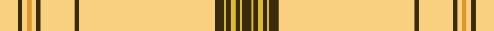

This page is one **sett** — a single exact thread-count. It belongs to the [tartan](/setts/lyi8dy2lyi2lo2lyi2dy2lyi15dy2lyi60dy4ly1dy2ly2dy2ly1dy4/)
(the same proportion at any scale), whose colour order is pattern [GYGYGYGYGYGYYYGY](/stripes/gygygygygygyyygy/).

Sourced from tartans-authority.  It is a [16 stripe tartan](/stripes/stripes16/).

Original link http://www.tartansauthority.com/tartan-ferret/display/10023/

## Register references

External register numbers recorded for this tartan.

- Scottish Register of Tartans: [10023](https://www.tartanregister.gov.uk/tartanDetails?ref=10023)
- Scottish Tartans Authority (ITI): 10023

## Thread count
LYi/16 DY4 LYi4 LO4 LYi4 DY4 LYi30 DY4 LYi120 DY8 LY2 DY4 LY4 DY4 LY2 DY/8

One full sett is **420 threads**.

## Palette
<table><thead><tr><th>Colour</th><th>Shade</th><th>OKLCh</th></tr></thead><tbody><tr><td>DY</td><td><code style="background-color:#3A2B0D;">#3A2B0D</code> <small style="color:#888">#3A2B0D</small></td><td><small style="color:#888">oklch(30.0% 0.049 82.0)</small></td></tr><tr><td>LY</td><td><code style="background-color:#DCBC32;">#DCBC32</code> <small style="color:#888">#DCBC32</small></td><td><small style="color:#888">oklch(80.0% 0.150 95.2)</small></td></tr><tr><td>LY</td><td><code style="background-color:#F8D080;">#F8D080</code> <small style="color:#888">#F8D080</small></td><td><small style="color:#888">oklch(87.5% 0.108 83.7)</small></td></tr><tr><td>LO</td><td><code style="background-color:#DC982C;">#DC982C</code> <small style="color:#888">#DC982C</small></td><td><small style="color:#888">oklch(73.0% 0.141 73.5)</small></td></tr></tbody></table>

# Sample pattern

## Nearest tartan variants

The nearest existing variants by ΔTartan distance, with this cloth at the top so the swatches line up against it.

ΔTartan

Threads

Variant

Sett

—

420

<a href="/variants/s16/lyi8dy2lyi2lo2lyi2dy2lyi15dy2lyi60dy4ly1dy2ly2dy2ly1dy4~x2~lyi3504086-lo2906076/">UPS No. 1 (Corporate)</a>

<a href="/ttd/edit/#slug=w8dy2w2lo2w2dy2w15dy2w60dy4ly1dy2ly2dy2ly1dy4~x2~w3803095-lo2906076&amp;base=lyi8dy2lyi2lo2lyi2dy2lyi15dy2lyi60dy4ly1dy2ly2dy2ly1dy4~x2~lyi3504086-lo2906076" title="compare in the TTD">0.00</a>

420

<a href="/variants/s16/w8dy2w2lo2w2dy2w15dy2w60dy4ly1dy2ly2dy2ly1dy4~x2~w3803095-lo2906076/">UPS No. 2 (Corporate)</a>

<a href="/ttd/edit/#slug=dy2ly8dy4y1dy2y2dy2y1dy4ly60dy2ly15dy2ly2lo2ly2~x2&amp;base=lyi8dy2lyi2lo2lyi2dy2lyi15dy2lyi60dy4ly1dy2ly2dy2ly1dy4~x2~lyi3504086-lo2906076" title="compare in the TTD">0.00</a>

436

<a href="/variants/s16/dy2ly8dy4y1dy2y2dy2y1dy4ly60dy2ly15dy2ly2lo2ly2~x2/">UPS No.2</a>

<a href="/ttd/edit/#slug=dy4ly60dy2ly15dy2ly2lo2dy2ly8dy4y1dy2y2dy2y1~x2&amp;base=lyi8dy2lyi2lo2lyi2dy2lyi15dy2lyi60dy4ly1dy2ly2dy2ly1dy4~x2~lyi3504086-lo2906076" title="compare in the TTD">1.01</a>

426

<a href="/variants/s15/dy4ly60dy2ly15dy2ly2lo2dy2ly8dy4y1dy2y2dy2y1~x2/">UPS No.1</a>

## Neighbour map

Every grey dot is one of 13620 variants placed by the first two principal components of the ΔTartan feature space (42% of its variance). Red is this tartan; blue dots are its nearest — click one to open its page.

<svg viewBox="0 0 640 380" role="img" style="max-width:100%;height:auto;border:1px solid #e0e0e0;border-radius:4px;display:block" xmlns="http://www.w3.org/2000/svg"><image href="/nn/cloud.v1.png" width="640" height="380"/><a href="/variants/s16/w8dy2w2lo2w2dy2w15dy2w60dy4ly1dy2ly2dy2ly1dy4~x2~w3803095-lo2906076/"><circle cx="530.9" cy="63.1" r="4" fill="#3465a4"><title>UPS No. 2 (Corporate)</title></circle></a><a href="/variants/s16/dy2ly8dy4y1dy2y2dy2y1dy4ly60dy2ly15dy2ly2lo2ly2~x2/"><circle cx="553.8" cy="65.5" r="4" fill="#3465a4"><title>UPS No.2</title></circle></a><a href="/variants/s15/dy4ly60dy2ly15dy2ly2lo2dy2ly8dy4y1dy2y2dy2y1~x2/"><circle cx="550.7" cy="69.0" r="4" fill="#3465a4"><title>UPS No.1</title></circle></a><circle cx="548.6" cy="65.1" r="5" fill="#c00000"/><text x="320" y="376" text-anchor="middle" font-size="11" fill="#999">ground</text><text x="11" y="190" text-anchor="middle" font-size="11" fill="#999" transform="rotate(-90 11 190)">complexity</text></svg>

ID: /variants/s16/lyi8dy2lyi2lo2lyi2dy2lyi15dy2lyi60dy4ly1dy2ly2dy2ly1dy4~x2~lyi3504086-lo2906076/
