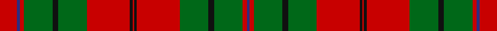

This page is one **sett** — a single exact thread-count. It belongs to the [tartan](/setts/r12db2r3g20k4g20r30k2r1/)
(the same proportion at any scale), whose colour order is pattern [BRGKGRKRKRGKGRBR](/stripes/brgkgrkrkrgkgrbr/).

Sourced from register-of-tartans.  It is a [16 stripe tartan](/stripes/stripes16/).

Original link https://www.tartanregister.gov.uk/tartanDetails.aspx?ref=4817

## Also known as

This cloth is also recorded under:

- Oriel #1

## Register references

External register numbers recorded for this tartan.

- Scottish Register of Tartans: [4817](https://www.tartanregister.gov.uk/tartanDetails.aspx?ref=4817)
- Scottish Tartans Authority (ITI): 2166
- Scottish Tartans World Register: 2166

## Thread count
R/24 DBa4 R6 G40 K8 G40 R60 K4 R2 K4 R60 G40 K8 G40 R6 DBa/4

One full sett is **672 threads**.

## Palette

Palette: <strong>Tartan Register</strong>
<table><thead><tr><th>Colour</th><th>Threads</th><th>Shade</th><th>Base</th><th>OKLCh</th></tr></thead><tbody><tr><td>R/</td><td style="text-align:right;font-variant-numeric:tabular-nums">24</td><td><code style="background-color:#C80000;">#C80000</code> <small style="color:#888">#C80000</small></td><td>R <code style="background-color:#CC0000;">#CC0000</code></td><td><small style="color:#888">oklch(52.3% 0.215 29.2)</small></td></tr><tr><td>DBa</td><td style="text-align:right;font-variant-numeric:tabular-nums">4</td><td><code style="background-color:#2C2C80;">#2C2C80</code> <small style="color:#888">#2C2C80</small></td><td>B <code style="background-color:#2A418A;">#2A418A</code></td><td><small style="color:#888">oklch(35.0% 0.138 276.6)</small></td></tr><tr><td>R</td><td style="text-align:right;font-variant-numeric:tabular-nums">6</td><td><code style="background-color:#C80000;">#C80000</code> <small style="color:#888">#C80000</small></td><td>R <code style="background-color:#CC0000;">#CC0000</code></td><td><small style="color:#888">oklch(52.3% 0.215 29.2)</small></td></tr><tr><td>G</td><td style="text-align:right;font-variant-numeric:tabular-nums">40</td><td><code style="background-color:#006818;">#006818</code> <small style="color:#888">#006818</small></td><td>G <code style="background-color:#006100;">#006100</code></td><td><small style="color:#888">oklch(45.0% 0.142 145.0)</small></td></tr><tr><td>K</td><td style="text-align:right;font-variant-numeric:tabular-nums">8</td><td><code style="background-color:#101010;">#101010</code> <small style="color:#888">#101010</small></td><td>K <code style="background-color:#000000;">#000000</code></td><td><small style="color:#888">oklch(17.3% 0.000 89.9)</small></td></tr><tr><td>G</td><td style="text-align:right;font-variant-numeric:tabular-nums">40</td><td><code style="background-color:#006818;">#006818</code> <small style="color:#888">#006818</small></td><td>G <code style="background-color:#006100;">#006100</code></td><td><small style="color:#888">oklch(45.0% 0.142 145.0)</small></td></tr><tr><td>R</td><td style="text-align:right;font-variant-numeric:tabular-nums">60</td><td><code style="background-color:#C80000;">#C80000</code> <small style="color:#888">#C80000</small></td><td>R <code style="background-color:#CC0000;">#CC0000</code></td><td><small style="color:#888">oklch(52.3% 0.215 29.2)</small></td></tr><tr><td>K</td><td style="text-align:right;font-variant-numeric:tabular-nums">4</td><td><code style="background-color:#101010;">#101010</code> <small style="color:#888">#101010</small></td><td>K <code style="background-color:#000000;">#000000</code></td><td><small style="color:#888">oklch(17.3% 0.000 89.9)</small></td></tr><tr><td>R</td><td style="text-align:right;font-variant-numeric:tabular-nums">2</td><td><code style="background-color:#C80000;">#C80000</code> <small style="color:#888">#C80000</small></td><td>R <code style="background-color:#CC0000;">#CC0000</code></td><td><small style="color:#888">oklch(52.3% 0.215 29.2)</small></td></tr><tr><td>K</td><td style="text-align:right;font-variant-numeric:tabular-nums">4</td><td><code style="background-color:#101010;">#101010</code> <small style="color:#888">#101010</small></td><td>K <code style="background-color:#000000;">#000000</code></td><td><small style="color:#888">oklch(17.3% 0.000 89.9)</small></td></tr><tr><td>R</td><td style="text-align:right;font-variant-numeric:tabular-nums">60</td><td><code style="background-color:#C80000;">#C80000</code> <small style="color:#888">#C80000</small></td><td>R <code style="background-color:#CC0000;">#CC0000</code></td><td><small style="color:#888">oklch(52.3% 0.215 29.2)</small></td></tr><tr><td>G</td><td style="text-align:right;font-variant-numeric:tabular-nums">40</td><td><code style="background-color:#006818;">#006818</code> <small style="color:#888">#006818</small></td><td>G <code style="background-color:#006100;">#006100</code></td><td><small style="color:#888">oklch(45.0% 0.142 145.0)</small></td></tr><tr><td>K</td><td style="text-align:right;font-variant-numeric:tabular-nums">8</td><td><code style="background-color:#101010;">#101010</code> <small style="color:#888">#101010</small></td><td>K <code style="background-color:#000000;">#000000</code></td><td><small style="color:#888">oklch(17.3% 0.000 89.9)</small></td></tr><tr><td>G</td><td style="text-align:right;font-variant-numeric:tabular-nums">40</td><td><code style="background-color:#006818;">#006818</code> <small style="color:#888">#006818</small></td><td>G <code style="background-color:#006100;">#006100</code></td><td><small style="color:#888">oklch(45.0% 0.142 145.0)</small></td></tr><tr><td>R</td><td style="text-align:right;font-variant-numeric:tabular-nums">6</td><td><code style="background-color:#C80000;">#C80000</code> <small style="color:#888">#C80000</small></td><td>R <code style="background-color:#CC0000;">#CC0000</code></td><td><small style="color:#888">oklch(52.3% 0.215 29.2)</small></td></tr><tr><td>DBa/</td><td style="text-align:right;font-variant-numeric:tabular-nums">4</td><td><code style="background-color:#2C2C80;">#2C2C80</code> <small style="color:#888">#2C2C80</small></td><td>B <code style="background-color:#2A418A;">#2A418A</code></td><td><small style="color:#888">oklch(35.0% 0.138 276.6)</small></td></tr></tbody></table>

## Nearest tartans

The nearest existing variants by ΔTartan distance, with this tartan at the top so the swatches line up against it.

ΔTartan

Tartan

Sett

—

<a href="/ttd/edit/#slug=r12db2r3g20k4g20r30k2r1~x2">Oriel #1</a> <a class="nn-out" href="/variants/s16/r12db2r3g20k4g20r30k2r1~x2/" title="open its dictionary page">↗</a>

1.15

<a href="/ttd/edit/#slug=k2r18g7r3g10w1g10r3g10w1g10r3g7r18k1~x4&amp;base=r12db2r3g20k4g20r30k2r1~x2">MacAulay</a> <a class="nn-out" href="/variants/s15/k2r18g7r3g10w1g10r3g10w1g10r3g7r18k1~x4/" title="open its dictionary page">↗</a>

1.15

<a href="/variants/s14/r36g18r4g6k1lb2k1g2~x2/">Strang (Personal)</a>

1.22

<a href="/ttd/edit/#slug=r12db2r3g20k4g20r30k2r1~x2">Oriel #1 (District)</a> <a class="nn-out" href="/variants/s9/r12db2r3g20k4g20r30k2r1~x2/" title="open its dictionary page">↗</a>

1.23

<a href="/ttd/edit/#slug=ri4t2ri50db26ri10g44r4ri10r4g44ri51db2ri4t2~x2&amp;base=r12db2r3g20k4g20r30k2r1~x2">MacQuarrie 1</a> <a class="nn-out" href="/variants/s14/ri4t2ri50db26ri10g44r4ri10r4g44ri51db2ri4t2~x2/" title="open its dictionary page">↗</a>

1.30

<a href="/ttd/edit/#slug=w4r6g4db4r12g32r4db8g4r32g16w4r8w4r8w4g16r32g4db8r4g32r12db4g4r6w1~x2&amp;base=r12db2r3g20k4g20r30k2r1~x2">MacKinnon</a> <a class="nn-out" href="/variants/s27/w4r6g4db4r12g32r4db8g4r32g16w4r8w4r8w4g16r32g4db8r4g32r12db4g4r6w1~x2/" title="open its dictionary page">↗</a>

1.33

<a href="/ttd/edit/#slug=g4r3k1r28g14r4g4w3g4r4g4w3~x2&amp;base=r12db2r3g20k4g20r30k2r1~x2">Scott</a> <a class="nn-out" href="/variants/s12/g4r3k1r28g14r4g4w3g4r4g4w3~x2/" title="open its dictionary page">↗</a>

1.34

<a href="/ttd/edit/#slug=o24k2y8k2o8k1y24db6k2o14y18k4~x2&amp;base=r12db2r3g20k4g20r30k2r1~x2">Grant, Piper to the Laird of</a> <a class="nn-out" href="/variants/s12/o24k2y8k2o8k1y24db6k2o14y18k4~x2/" title="open its dictionary page">↗</a>

1.37

<a href="/ttd/edit/#slug=ly3g30r7g2r1g8r1g2r7g16k18t8r14g8r1g1r7g1r1g8r27ly3~x2&amp;base=r12db2r3g20k4g20r30k2r1~x2">Unidentified</a> <a class="nn-out" href="/variants/s22/ly3g30r7g2r1g8r1g2r7g16k18t8r14g8r1g1r7g1r1g8r27ly3~x2/" title="open its dictionary page">↗</a>

1.38

<a href="/ttd/edit/#slug=g8r4g1r1g1r24db8g4r1g1r1g4r8g1r1g1r1db8g8r2g4~x2&amp;base=r12db2r3g20k4g20r30k2r1~x2">Matheson</a> <a class="nn-out" href="/variants/s21/g8r4g1r1g1r24db8g4r1g1r1g4r8g1r1g1r1db8g8r2g4~x2/" title="open its dictionary page">↗</a>

1.40

<a href="/variants/s18/r26y6dt26r2y26w1r6dt2r6dt13~x2/">Unnamed C18/19th - Antigonish (A)</a>

## Neighbour map

Every grey dot is one of 14360 variants placed by the first two principal components of the ΔTartan feature space (44% of its variance). Red is this tartan; blue dots are its nearest — click one to open its page.

<svg viewBox="0 0 640 380" role="img" style="max-width:100%;height:auto;border:1px solid #e0e0e0;border-radius:4px;display:block" xmlns="http://www.w3.org/2000/svg"><image href="/nn/cloud.v1.png" width="640" height="380"/><a href="/variants/s15/k2r18g7r3g10w1g10r3g10w1g10r3g7r18k1~x4/"><circle cx="321.5" cy="158.3" r="4" fill="#3465a4"><title>MacAulay</title></circle></a><a href="/variants/s14/r36g18r4g6k1lb2k1g2~x2/"><circle cx="359.3" cy="99.6" r="4" fill="#3465a4"><title>Strang (Personal)</title></circle></a><a href="/variants/s9/r12db2r3g20k4g20r30k2r1~x2/"><circle cx="344.2" cy="146.3" r="4" fill="#3465a4"><title>Oriel #1 (District)</title></circle></a><a href="/variants/s14/ri4t2ri50db26ri10g44r4ri10r4g44ri51db2ri4t2~x2/"><circle cx="311.9" cy="110.9" r="4" fill="#3465a4"><title>MacQuarrie 1</title></circle></a><a href="/variants/s27/w4r6g4db4r12g32r4db8g4r32g16w4r8w4r8w4g16r32g4db8r4g32r12db4g4r6w1~x2/"><circle cx="277.0" cy="89.5" r="4" fill="#3465a4"><title>MacKinnon</title></circle></a><a href="/variants/s12/g4r3k1r28g14r4g4w3g4r4g4w3~x2/"><circle cx="333.5" cy="109.2" r="4" fill="#3465a4"><title>Scott</title></circle></a><a href="/variants/s12/o24k2y8k2o8k1y24db6k2o14y18k4~x2/"><circle cx="309.9" cy="160.5" r="4" fill="#3465a4"><title>Grant, Piper to the Laird of</title></circle></a><a href="/variants/s22/ly3g30r7g2r1g8r1g2r7g16k18t8r14g8r1g1r7g1r1g8r27ly3~x2/"><circle cx="253.6" cy="82.9" r="4" fill="#3465a4"><title>Unidentified</title></circle></a><a href="/variants/s21/g8r4g1r1g1r24db8g4r1g1r1g4r8g1r1g1r1db8g8r2g4~x2/"><circle cx="325.2" cy="117.9" r="4" fill="#3465a4"><title>Matheson</title></circle></a><a href="/variants/s18/r26y6dt26r2y26w1r6dt2r6dt13~x2/"><circle cx="255.0" cy="127.8" r="4" fill="#3465a4"><title>Unnamed C18/19th - Antigonish (A)</title></circle></a><circle cx="317.0" cy="124.7" r="5" fill="#c00000"/></svg>

ID: /variants/s16/r12db2r3g20k4g20r30k2r1~x2/
