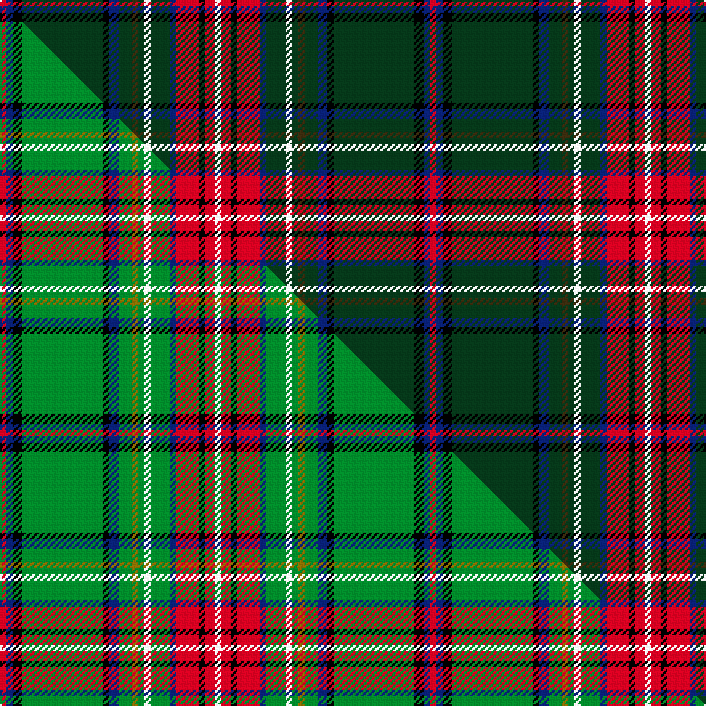

This is one **variant** — a specific cloth: this exact thread count and colourway, with its own
provenance below. It is one weaving of the [sett](/setts/r2db2k3dg25k2db3dg4dy2dg2w2dg6db2r7k2r3w2/) (the scale-free proportion — the
same cloth at any scale or shade), whose colour order is pattern [RBKGKBGGGWGBRKRW](/stripes/rbkgkbgggwgbrkrw/).

Part of the [Hueg Scottish Thistle](/tartans/h/hu/hueg-scottish-thistle/) tartan — the named design grouping this sett with its other cloths.

Sourced from tartans-authority.  It is a [16 stripe tartan](/stripes/stripes16/).

Original link [https://www.tartanregister.gov.uk/tartanDetails.aspx?ref=10736](https://www.tartanregister.gov.uk/tartanDetails.aspx?ref=10736)

Dataset <small>— provenance for this record, inherited from the source manifest</small>

<dl class="dataset-prov">
<dt>source</dt><dd><a href="/sources/tartans-authority/">Scottish Tartans Authority</a></dd>
<dt>data captured from</dt><dd><a href="https://github.com/thetartan/tartan-database/blob/master/data/tartans-authority/data.csv">https://github.com/thetartan/tartan-database/blob/master/data/tartans-authority/data.csv</a></dd>
<dt>data date</dt><dd>09/11/2012 <small>(this record)</small></dd>
<dt>licence</dt><dd><a href="https://creativecommons.org/licenses/by-nc-nd/4.0/">CC BY-NC-ND 4.0</a></dd>
</dl>

Capture chain <small>— the hands this data passed through, oldest first; each capture carries its own licence</small>

<ol class="capture-chain">
<li><a href="https://www.tartansauthority.com/">Scottish Tartans Authority</a> <small>the heritage body's archive — its tartan-ferret record browser is retired (links repaired to the SRT, above)</small></li>
<li><a href="https://github.com/thetartan/tartan-database">thetartan/tartan-database</a> <small>2016-2017</small> · <a href="https://creativecommons.org/licenses/by-nc-nd/4.0/">CC BY-NC-ND 4.0</a> <small>Levko Kravets's frozen compilation — the capture we vendored, and where its CC licence text came from</small></li>
<li>this dictionary <small>captured 2026-06-10 · commit 5bf86c7566</small> <small>each re-capture is a git commit to data/sources</small></li>
</ol>

## Register references

External register numbers recorded for this tartan.

- Scottish Register of Tartans: [10736](https://www.tartanregister.gov.uk/tartanDetails?ref=10736)
- Scottish Tartans Authority (ITI): 10736

## Thread count
R/4 DB4 K6 DG50 K4 DB6 DG8 DY4 DG4 W4 DG12 DB4 R14 K4 R6 W/4

One full sett is **268 threads**.

## Palette
<table><thead><tr><th>Colour</th><th>Shade</th><th>OKLCh</th></tr></thead><tbody><tr><td>DB</td><td><code style="background-color:#082077;">#082077</code> <small style="color:#888">#082077</small></td><td><small style="color:#888">oklch(30.0% 0.149 265.1)</small></td></tr><tr><td>DG</td><td><code style="background-color:#053819;">#053819</code> <small style="color:#888">#053819</small></td><td><small style="color:#888">oklch(30.0% 0.075 151.3)</small></td></tr><tr><td>K</td><td><code style="background-color:#000000;">#000000</code> <small style="color:#888">#000000</small></td><td><small style="color:#888">oklch(0.0% 0.000 0.0)</small></td></tr><tr><td>W</td><td><code style="background-color:#F7F7F7;">#F7F7F7</code> <small style="color:#888">#F7F7F7</small></td><td><small style="color:#888">oklch(97.6% 0.000 89.9)</small></td></tr><tr><td>R</td><td><code style="background-color:#D60020;">#D60020</code> <small style="color:#888">#D60020</small></td><td><small style="color:#888">oklch(55.2% 0.224 25.5)</small></td></tr><tr><td>DY</td><td><code style="background-color:#3A2B0D;">#3A2B0D</code> <small style="color:#888">#3A2B0D</small></td><td><small style="color:#888">oklch(30.0% 0.049 82.0)</small></td></tr></tbody></table>

# Sample pattern

## Compared to the master

This cloth is one sett of its design; the master sett (the exemplar the design is anchored on) is below for comparison.

Its **ΔTartan distance** from the master is **0.20** — the same measure the nearest-tartans table ranks by (0 is identical; a re-scale of the same cloth is near 0, a recolour or a different proportion further).

<figure class="master-compare" style="margin:0">

this sett
master sett ★

<figcaption style="color:#888;font-size:smaller">One weave of this sett against the <a href="/setts/r2db2k3g25k2db3g4y2g2w2g6db2r7k2r3w2/">master sett ★</a>, split on the diagonal: a shared proportion runs seamlessly across it with only the shades shifting; a different proportion breaks on it.</figcaption>
</figure>

## Nearest tartan variants

The nearest existing variants by ΔTartan distance, with this cloth at the top so the swatches line up against it.

ΔTartan

Threads

Variant

Sett

—

268

<a href="/variants/s16/r2db2k3dg25k2db3dg4dy2dg2w2dg6db2r7k2r3w2~x2/">Hueg Scottish Thistle (Personal)</a>

<a href="/ttd/edit/#slug=r2db2k3g25k2db3g4y2g2w2g6db2r7k2r3w2~x2&amp;base=r2db2k3dg25k2db3dg4dy2dg2w2dg6db2r7k2r3w2~x2" title="compare in the TTD">0.20</a>

268

<a href="/variants/s16/r2db2k3g25k2db3g4y2g2w2g6db2r7k2r3w2~x2/">Hueg (Bavaria) Scottish Thistle (Personal)</a>

<a href="/ttd/edit/#slug=n31k4n4k4n4k4n6w5k4o3dp19o3n4r3~x2&amp;base=r2db2k3dg25k2db3dg4dy2dg2w2dg6db2r7k2r3w2~x2" title="compare in the TTD">2.47</a>

324

<a href="/variants/s14/n31k4n4k4n4k4n6w5k4o3dp19o3n4r3~x2/">Sydney Academy</a>

<a href="/ttd/edit/#slug=dg32w2y2dy2y6k2db6y2db2w2db2dg10r5w2r4w2~x2&amp;base=r2db2k3dg25k2db3dg4dy2dg2w2dg6db2r7k2r3w2~x2" title="compare in the TTD">2.49</a>

264

<a href="/variants/s16/dg32w2y2dy2y6k2db6y2db2w2db2dg10r5w2r4w2~x2/">Zinnen of Scene (Luxembourg) (Personal)</a>

<a href="/ttd/edit/#slug=n31k4n4k4n4k4n6w5k4o3db19k3n4r3~x2&amp;base=r2db2k3dg25k2db3dg4dy2dg2w2dg6db2r7k2r3w2~x2" title="compare in the TTD">2.52</a>

324

<a href="/variants/s14/n31k4n4k4n4k4n6w5k4o3db19k3n4r3~x2/">Sydney Academy</a>

<a href="/ttd/edit/#slug=dy34g10dy5r2k8db2w3db2k8r2dy5g10dy28k3~x2&amp;base=r2db2k3dg25k2db3dg4dy2dg2w2dg6db2r7k2r3w2~x2" title="compare in the TTD">2.57</a>

414

<a href="/variants/s14/dy34g10dy5r2k8db2w3db2k8r2dy5g10dy28k3~x2/">Lambert (Front Royal) Hunting</a>

<a href="/ttd/edit/#slug=dg10k3g3k8dr9g3dr10b3dr28g3k3w3k3~x2&amp;base=r2db2k3dg25k2db3dg4dy2dg2w2dg6db2r7k2r3w2~x2" title="compare in the TTD">2.63</a>

330

<a href="/variants/s13/dg10k3g3k8dr9g3dr10b3dr28g3k3w3k3~x2/">Clifford</a>

<a href="/ttd/edit/#slug=dt10r3dt32y12k5y2k4y2k17o4k2lb2~x2~dt1600000-y2200000&amp;base=r2db2k3dg25k2db3dg4dy2dg2w2dg6db2r7k2r3w2~x2" title="compare in the TTD">2.64</a>

356

<a href="/variants/s12/dt10r3dt32y12k5y2k4y2k17o4k2lb2~x2~dt1600000-y2200000/">Scottish Spirit Fashion Tartan</a>

<a href="/ttd/edit/#slug=r4dg2y2dg24k2dg3k3dg3k10b10w2b4~x2&amp;base=r2db2k3dg25k2db3dg4dy2dg2w2dg6db2r7k2r3w2~x2" title="compare in the TTD">2.66</a>

260

<a href="/variants/s12/r4dg2y2dg24k2dg3k3dg3k10b10w2b4~x2/">Kerby, from the Tennessee Cumberland Basin</a>

<a href="/ttd/edit/#slug=n4o3n4o2n4dt8n30k4dt4k36n4r2k4w2~dt1602277-r2109032&amp;base=r2db2k3dg25k2db3dg4dy2dg2w2dg6db2r7k2r3w2~x2" title="compare in the TTD">2.79</a>

216

<a href="/variants/s14/n4o3n4o2n4dt8n30k4dt4k36n4r2k4w2~dt1602277-r2109032/">Capercaillie Corporate Tartan</a>

<a href="/ttd/edit/#slug=dg42k2dg12w2r3k2r3w2k2dp12k4r3w4k3~x2&amp;base=r2db2k3dg25k2db3dg4dy2dg2w2dg6db2r7k2r3w2~x2" title="compare in the TTD">2.80</a>

294

<a href="/variants/s14/dg42k2dg12w2r3k2r3w2k2dp12k4r3w4k3~x2/">MacFarlane Hunting (MacGregor Hastie)</a>

## Neighbour map

Every grey dot is one of 13621 variants placed by the first two principal components of the ΔTartan feature space (42% of its variance). Red is this tartan; blue dots are its nearest — click one to open its page.

<svg viewBox="0 0 640 380" role="img" style="max-width:100%;height:auto;border:1px solid #e0e0e0;border-radius:4px;display:block" xmlns="http://www.w3.org/2000/svg"><image href="/nn/cloud.v1.png" width="640" height="380"/><a href="/variants/s16/r2db2k3g25k2db3g4y2g2w2g6db2r7k2r3w2~x2/"><circle cx="199.3" cy="89.8" r="4" fill="#3465a4"><title>Hueg (Bavaria) Scottish Thistle (Personal)</title></circle></a><a href="/variants/s14/n31k4n4k4n4k4n6w5k4o3dp19o3n4r3~x2/"><circle cx="189.6" cy="111.3" r="4" fill="#3465a4"><title>Sydney Academy</title></circle></a><a href="/variants/s16/dg32w2y2dy2y6k2db6y2db2w2db2dg10r5w2r4w2~x2/"><circle cx="190.3" cy="64.2" r="4" fill="#3465a4"><title>Zinnen of Scene (Luxembourg) (Personal)</title></circle></a><a href="/variants/s14/n31k4n4k4n4k4n6w5k4o3db19k3n4r3~x2/"><circle cx="183.4" cy="111.0" r="4" fill="#3465a4"><title>Sydney Academy</title></circle></a><a href="/variants/s14/dy34g10dy5r2k8db2w3db2k8r2dy5g10dy28k3~x2/"><circle cx="269.0" cy="97.7" r="4" fill="#3465a4"><title>Lambert (Front Royal) Hunting</title></circle></a><a href="/variants/s13/dg10k3g3k8dr9g3dr10b3dr28g3k3w3k3~x2/"><circle cx="207.5" cy="129.0" r="4" fill="#3465a4"><title>Clifford</title></circle></a><a href="/variants/s12/dt10r3dt32y12k5y2k4y2k17o4k2lb2~x2~dt1600000-y2200000/"><circle cx="186.2" cy="104.9" r="4" fill="#3465a4"><title>Scottish Spirit Fashion Tartan</title></circle></a><a href="/variants/s12/r4dg2y2dg24k2dg3k3dg3k10b10w2b4~x2/"><circle cx="172.7" cy="117.9" r="4" fill="#3465a4"><title>Kerby, from the Tennessee Cumberland Basin</title></circle></a><a href="/variants/s14/n4o3n4o2n4dt8n30k4dt4k36n4r2k4w2~dt1602277-r2109032/"><circle cx="185.3" cy="77.7" r="4" fill="#3465a4"><title>Capercaillie Corporate Tartan</title></circle></a><a href="/variants/s14/dg42k2dg12w2r3k2r3w2k2dp12k4r3w4k3~x2/"><circle cx="267.9" cy="75.2" r="4" fill="#3465a4"><title>MacFarlane Hunting (MacGregor Hastie)</title></circle></a><circle cx="214.3" cy="88.7" r="5" fill="#c00000"/><text x="320" y="376" text-anchor="middle" font-size="11" fill="#999">ground</text><text x="11" y="190" text-anchor="middle" font-size="11" fill="#999" transform="rotate(-90 11 190)">complexity</text></svg>

ID: /variants/s16/r2db2k3dg25k2db3dg4dy2dg2w2dg6db2r7k2r3w2~x2/
