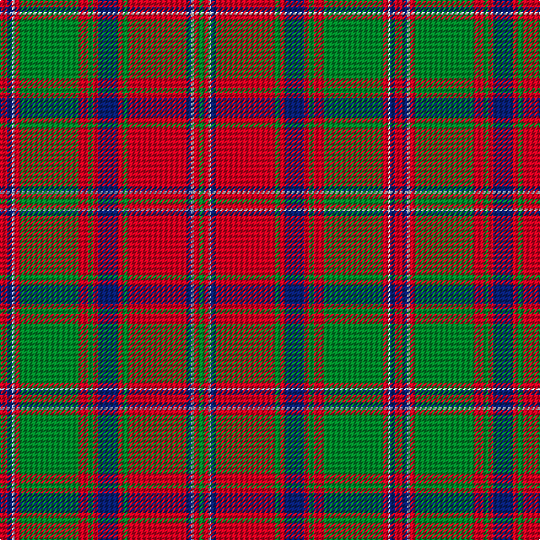

This page is one **sett** — a single exact thread-count. It belongs to the [tartan](/setts/r3db2w1r2g24r4g2r2db8r2g2r24db2w1r2g2/)
(the same proportion at any scale), whose colour order is pattern [GRWBRGRBRGRGRWBR](/stripes/grwbrgrbrgrgrwbr/).

Part of the [Stewart of Appin](/tartans/stewart-of-appin/) tartan — the named design grouping this sett with its other cloths.

Sourced from weddslist.  It is a [16 stripe tartan](/stripes/stripes16/).

Original link http://www.weddslist.com/cgi-bin/tartans/pg.pl?source=rb

## Thread count
R/6 DB4 W2 R4 G48 R8 G4 R4 DB16 R4 G4 R48 DB4 W2 R4 G/4

One full sett is **322 threads**.

## Palette
<table><thead><tr><th>Colour</th><th>Shade</th><th>OKLCh</th></tr></thead><tbody><tr><td>DB</td><td><code style="background-color:#082077;">#082077</code> <small style="color:#888">#082077</small></td><td><small style="color:#888">oklch(30.0% 0.149 265.1)</small></td></tr><tr><td>G</td><td><code style="background-color:#008B2A;">#008B2A</code> <small style="color:#888">#008B2A</small></td><td><small style="color:#888">oklch(55.4% 0.170 145.9)</small></td></tr><tr><td>W</td><td><code style="background-color:#F7F7F7;">#F7F7F7</code> <small style="color:#888">#F7F7F7</small></td><td><small style="color:#888">oklch(97.6% 0.000 89.9)</small></td></tr><tr><td>R</td><td><code style="background-color:#D60020;">#D60020</code> <small style="color:#888">#D60020</small></td><td><small style="color:#888">oklch(55.2% 0.224 25.5)</small></td></tr></tbody></table>

# Sample pattern

## Compared to the master

This cloth is one sett of its design; the master sett (the exemplar the design is anchored on) is below for comparison.

Its **ΔTartan distance** from the master is **0.15** — the same measure the nearest-tartans table ranks by (0 is identical; a re-scale of the same cloth is near 0, a recolour or a different proportion further).

<figure class="master-compare" style="margin:0">

this sett
master sett ★

<figcaption style="color:#888;font-size:smaller">One weave of this sett against the <a href="/setts/r3db2lb1r2g24r4g2r2db8r2g2r24db2lb1r2g2/">master sett ★</a>, split on the diagonal: a shared proportion runs seamlessly across it with only the shades shifting; a different proportion breaks on it.</figcaption>
</figure>

## Nearest variants

The nearest existing variants by ΔTartan distance, with this cloth at the top so the swatches line up against it.

ΔTartan

Threads

Variant

Sett

—

322

<a href="/variants/s16/r3db2w1r2g24r4g2r2db8r2g2r24db2w1r2g2~x2/">Stewart of Appin</a>

<a href="/ttd/edit/#slug=r3db2lb1r2g24r4g2r2db8r2g2r24db2lb1r2g2~x2&amp;base=r3db2w1r2g24r4g2r2db8r2g2r24db2w1r2g2~x2" title="compare in the TTD">0.60</a>

322

<a href="/variants/s16/r3db2lb1r2g24r4g2r2db8r2g2r24db2lb1r2g2~x2/">Stewart of Appin - 1906</a>

<a href="/ttd/edit/#slug=r60db2r2g63r2db2r2db20r2db2r54g2r2g40&amp;base=r3db2w1r2g24r4g2r2db8r2g2r24db2w1r2g2~x2" title="compare in the TTD">2.25</a>

410

<a href="/variants/s14/r60db2r2g63r2db2r2db20r2db2r54g2r2g40/">Bruce - 1819 (Old)</a>

<a href="/ttd/edit/#slug=r24w1db2r4g32r4db2w1r4db6r4w1db2r32g2r3g6~x2&amp;base=r3db2w1r2g24r4g2r2db8r2g2r24db2w1r2g2~x2" title="compare in the TTD">2.68</a>

460

<a href="/variants/s17/r24w1db2r4g32r4db2w1r4db6r4w1db2r32g2r3g6~x2/">Dalzell</a>

<a href="/ttd/edit/#slug=b4r10g7r70g7r4dp21r4g85r4g7r10b4&amp;base=r3db2w1r2g24r4g2r2db8r2g2r24db2w1r2g2~x2" title="compare in the TTD">2.94</a>

466

<a href="/variants/s13/b4r10g7r70g7r4dp21r4g85r4g7r10b4/">Crieff</a>

## Neighbour map

Every grey dot is one of 13620 variants placed by the first two principal components of the ΔTartan feature space (42% of its variance). Red is this tartan; blue dots are its nearest — click one to open its page.

<svg viewBox="0 0 640 380" role="img" style="max-width:100%;height:auto;border:1px solid #e0e0e0;border-radius:4px;display:block" xmlns="http://www.w3.org/2000/svg"><image href="/nn/cloud.v1.png" width="640" height="380"/><a href="/variants/s16/r3db2lb1r2g24r4g2r2db8r2g2r24db2lb1r2g2~x2/"><circle cx="306.6" cy="104.9" r="4" fill="#3465a4"><title>Stewart of Appin - 1906</title></circle></a><a href="/variants/s14/r60db2r2g63r2db2r2db20r2db2r54g2r2g40/"><circle cx="356.7" cy="120.9" r="4" fill="#3465a4"><title>Bruce - 1819 (Old)</title></circle></a><a href="/variants/s17/r24w1db2r4g32r4db2w1r4db6r4w1db2r32g2r3g6~x2/"><circle cx="370.7" cy="90.6" r="4" fill="#3465a4"><title>Dalzell</title></circle></a><a href="/variants/s13/b4r10g7r70g7r4dp21r4g85r4g7r10b4/"><circle cx="321.4" cy="122.6" r="4" fill="#3465a4"><title>Crieff</title></circle></a><circle cx="301.7" cy="103.3" r="5" fill="#c00000"/><text x="320" y="376" text-anchor="middle" font-size="11" fill="#999">ground</text><text x="11" y="190" text-anchor="middle" font-size="11" fill="#999" transform="rotate(-90 11 190)">complexity</text></svg>

ID: /variants/s16/r3db2w1r2g24r4g2r2db8r2g2r24db2w1r2g2~x2/
