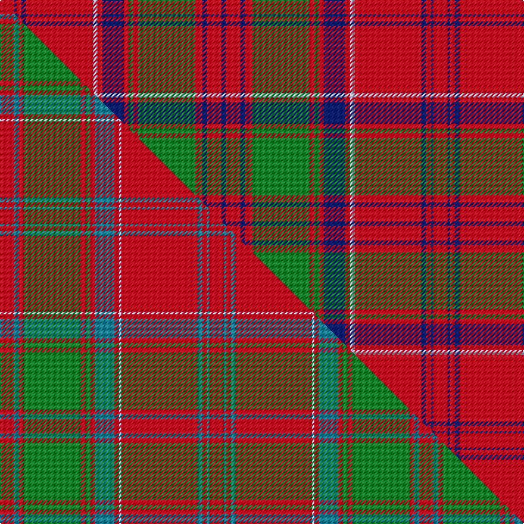

This is one **variant** — a specific cloth: this exact thread count and colourway, with its own
provenance below. It is one weaving of the [sett](/setts/r6db1r2db2r28lb2r2db9r2g2r2g24r3db2r6db2/) (the scale-free proportion — the
same cloth at any scale or shade), whose colour order is pattern [BRBRGRGRBRWRBRBR](/stripes/brbrgrgrbrwrbrbr/).

Part of the [Drummond](/tartans/d/dr/drummond-8/) tartan — the named design grouping this sett with its other cloths.

Sourced from house-of-tartan.  It is a [16 stripe tartan](/stripes/stripes16/).

Original link [http://www.house-of-tartan.scotland.net/house/TartanViewjs.asp?colr=Def&tnam=457](http://www.house-of-tartan.scotland.net/house/TartanViewjs.asp?colr=Def&tnam=457)

## Provenance

Earliest known date: 1822 The sett closely resembles the pattern used by McIan for his Drummond figure, which Logan asserts is in fact a Grant tartan. Nevertheless it is established that the Drummonds wore this sett to meet George IV in Edinburgh in 1822. The illustration here come from a sample in the MacGregor-Hastie Collection. There is also a Drummond of Perth sett.

2 attestations — the source records this cloth was collapsed from (oldest owns this page)

<ul>
<li>1822 — Drummond Clan Tartan (house-of-tartan, <a href="http://www.house-of-tartan.scotland.net/house/TartanViewjs.asp?colr=Def&tnam=457">record</a>) </li>
<li>undated — Drummond (weddslist, <a href="http://www.weddslist.com/cgi-bin/tartans/pg.pl?source=sts">record</a>) </li>
</ul>

Dataset <small>— provenance for this record, inherited from the source manifest</small>

<dl class="dataset-prov">
<dt>source</dt><dd><a href="/sources/house-of-tartan/">House of Tartan</a></dd>
<dt>data captured from</dt><dd><a href="https://github.com/thetartan/tartan-database/blob/master/data/house-of-tartan/data.csv">https://github.com/thetartan/tartan-database/blob/master/data/house-of-tartan/data.csv</a></dd>
<dt>data date</dt><dd>1822 <small>(this record)</small></dd>
<dt>licence</dt><dd><a href="https://creativecommons.org/licenses/by-nc-nd/4.0/">CC BY-NC-ND 4.0</a></dd>
</dl>

Capture chain <small>— the hands this data passed through, oldest first; each capture carries its own licence</small>

<ol class="capture-chain">
<li><a href="http://www.house-of-tartan.scotland.net/">House of Tartan</a> <small>the weaver/retailer's database — the site is now offline; the URL is kept as the ultimate source's identity</small></li>
<li><a href="https://github.com/thetartan/tartan-database">thetartan/tartan-database</a> <small>2016-2017</small> · <a href="https://creativecommons.org/licenses/by-nc-nd/4.0/">CC BY-NC-ND 4.0</a> <small>Levko Kravets's frozen compilation — the capture we vendored, and where its CC licence text came from</small></li>
<li>this dictionary <small>captured 2026-06-10 · commit 5bf86c7566</small> <small>each re-capture is a git commit to data/sources</small></li>
</ol>

## Thread count
R/12 DB2 R4 DB4 R56 LB4 R4 DB18 R4 G4 R4 G48 R6 DB4 R12 DB/4

One full sett is **364 threads**.

## Palette
<table><thead><tr><th>Colour</th><th>Shade</th><th>OKLCh</th></tr></thead><tbody><tr><td>LB</td><td><code style="background-color:#B5BBDE;">#B5BBDE</code> <small style="color:#888">#B5BBDE</small></td><td><small style="color:#888">oklch(79.9% 0.050 277.6)</small></td></tr><tr><td>DB</td><td><code style="background-color:#082077;">#082077</code> <small style="color:#888">#082077</small></td><td><small style="color:#888">oklch(30.0% 0.149 265.1)</small></td></tr><tr><td>G</td><td><code style="background-color:#008B2A;">#008B2A</code> <small style="color:#888">#008B2A</small></td><td><small style="color:#888">oklch(55.4% 0.170 145.9)</small></td></tr><tr><td>R</td><td><code style="background-color:#D60020;">#D60020</code> <small style="color:#888">#D60020</small></td><td><small style="color:#888">oklch(55.2% 0.224 25.5)</small></td></tr></tbody></table>

# Sample pattern

## Compared to the master

This cloth is one sett of its design; the master sett (the exemplar the design is anchored on) is below for comparison.

Its **ΔTartan distance** from the master is **1.13** — the same measure the nearest-tartans table ranks by (0 is identical; a re-scale of the same cloth is near 0, a recolour or a different proportion further).

<figure class="master-compare" style="margin:0">

this sett
master sett ★

<figcaption style="color:#888;font-size:smaller">One weave of this sett against the <a href="/setts/r6t2r2g24r2g2r2t8r2lb1r32t2r2t1r6/">master sett ★</a>, split on the diagonal: a shared proportion runs seamlessly across it with only the shades shifting; a different proportion breaks on it.</figcaption>
</figure>

## Nearest tartan variants

The nearest existing variants by ΔTartan distance, with this cloth at the top so the swatches line up against it.

ΔTartan

Threads

Variant

Sett

—

364

<a href="/variants/s16/r6db1r2db2r28lb2r2db9r2g2r2g24r3db2r6db2~x2/">Drummond Clan Tartan</a>

<a href="/ttd/edit/#slug=r6db2r2g24r2g2r2db8r2lb2r32db2r2db1r6~x2&amp;base=r6db1r2db2r28lb2r2db9r2g2r2g24r3db2r6db2~x2" title="compare in the TTD">1.12</a>

356

<a href="/variants/s15/r6db2r2g24r2g2r2db8r2lb2r32db2r2db1r6~x2/">Grant or Drummond Clan Tartan</a>

<a href="/ttd/edit/#slug=r6db2r2g24r2g2r2db8r2lb1r32db2r2db1r6~x2&amp;base=r6db1r2db2r28lb2r2db9r2g2r2g24r3db2r6db2~x2" title="compare in the TTD">1.13</a>

352

<a href="/variants/s15/r6db2r2g24r2g2r2db8r2lb1r32db2r2db1r6~x2/">Grant, or Drummond</a>

<a href="/ttd/edit/#slug=r6t2r2g24r2g2r2t8r2lb1r32t2r2t1r6~x2&amp;base=r6db1r2db2r28lb2r2db9r2g2r2g24r3db2r6db2~x2" title="compare in the TTD">1.13</a>

352

<a href="/variants/s15/r6t2r2g24r2g2r2t8r2lb1r32t2r2t1r6~x2/">Drummond</a>

<a href="/ttd/edit/#slug=r12db3r4db4r36lb6r4db18r4dg2r4dg36r4db4r8~r2109032-db0906265-lb3203246-dg1405139&amp;base=r6db1r2db2r28lb2r2db9r2g2r2g24r3db2r6db2~x2" title="compare in the TTD">1.30</a>

278

<a href="/variants/s15/r12db3r4db4r36lb6r4db18r4dg2r4dg36r4db4r8~r2109032-db0906265-lb3203246-dg1405139/">Drummond of Megginch - 1969 Carpet</a>

<a href="/ttd/edit/#slug=r7db1r2db2r35lb2r2db10r2dg2r2dg37r3db2r6~x2~r2109032-db0906265-lb3203246-dg1405139&amp;base=r6db1r2db2r28lb2r2db9r2g2r2g24r3db2r6db2~x2" title="compare in the TTD">1.38</a>

434

<a href="/variants/s15/r7db1r2db2r35lb2r2db10r2dg2r2dg37r3db2r6~x2~r2109032-db0906265-lb3203246-dg1405139/">Drummond of Megginch - 1849 Kilt</a>

<a href="/ttd/edit/#slug=r8db2r2db2r32lb2r2db8r2g2r2g27r2db2r2~x2&amp;base=r6db1r2db2r28lb2r2db9r2g2r2g24r3db2r6db2~x2" title="compare in the TTD">1.53</a>

368

<a href="/variants/s15/r8db2r2db2r32lb2r2db8r2g2r2g27r2db2r2~x2/">Grant (Official)</a>

<a href="/ttd/edit/#slug=r4lb1db1r32lb2r2db12r2g16r4lb1r4db2~x2&amp;base=r6db1r2db2r28lb2r2db9r2g2r2g24r3db2r6db2~x2" title="compare in the TTD">1.55</a>

320

<a href="/variants/s13/r4lb1db1r32lb2r2db12r2g16r4lb1r4db2~x2/">MacGillivray Clan Tartan</a>

<a href="/ttd/edit/#slug=r4lb1db1r32lb2r2db12r2g16r4lb1r4db2&amp;base=r6db1r2db2r28lb2r2db9r2g2r2g24r3db2r6db2~x2" title="compare in the TTD">1.55</a>

160

<a href="/variants/s13/r4lb1db1r32lb2r2db12r2g16r4lb1r4db2/">MacGillivray</a>

<a href="/ttd/edit/#slug=r3db1r1g10r1g1r1db3r1lb1r12db1r1db1r3~x4&amp;base=r6db1r2db2r28lb2r2db9r2g2r2g24r3db2r6db2~x2" title="compare in the TTD">1.55</a>

304

<a href="/variants/s15/r3db1r1g10r1g1r1db3r1lb1r12db1r1db1r3~x4/">Grant D</a>

<a href="/ttd/edit/#slug=r3db1r1g10r1g1r1db3r1lb1r12db1r1db1r3~x2&amp;base=r6db1r2db2r28lb2r2db9r2g2r2g24r3db2r6db2~x2" title="compare in the TTD">1.55</a>

152

<a href="/variants/s15/r3db1r1g10r1g1r1db3r1lb1r12db1r1db1r3~x2/">Grant D</a>

## Neighbour map

Every grey dot is one of 13621 variants placed by the first two principal components of the ΔTartan feature space (42% of its variance). Red is this tartan; blue dots are its nearest — click one to open its page. The map is a flat projection of a many-dimensional space — [how to read it](/posts/neighbourhood-maps/).

<svg viewBox="0 0 640 380" role="img" style="max-width:100%;height:auto;border:1px solid #e0e0e0;border-radius:4px;display:block" xmlns="http://www.w3.org/2000/svg"><image href="/nn/cloud.v1.png" width="640" height="380"/><a href="/variants/s15/r6db2r2g24r2g2r2db8r2lb2r32db2r2db1r6~x2/"><circle cx="364.8" cy="91.2" r="4" fill="#3465a4"><title>Grant or Drummond Clan Tartan</title></circle></a><a href="/variants/s15/r6db2r2g24r2g2r2db8r2lb1r32db2r2db1r6~x2/"><circle cx="371.3" cy="90.2" r="4" fill="#3465a4"><title>Grant, or Drummond</title></circle></a><a href="/variants/s15/r6t2r2g24r2g2r2t8r2lb1r32t2r2t1r6~x2/"><circle cx="396.2" cy="100.2" r="4" fill="#3465a4"><title>Drummond</title></circle></a><a href="/variants/s15/r12db3r4db4r36lb6r4db18r4dg2r4dg36r4db4r8~r2109032-db0906265-lb3203246-dg1405139/"><circle cx="289.0" cy="127.8" r="4" fill="#3465a4"><title>Drummond of Megginch - 1969 Carpet</title></circle></a><a href="/variants/s15/r7db1r2db2r35lb2r2db10r2dg2r2dg37r3db2r6~x2~r2109032-db0906265-lb3203246-dg1405139/"><circle cx="350.1" cy="84.3" r="4" fill="#3465a4"><title>Drummond of Megginch - 1849 Kilt</title></circle></a><a href="/variants/s15/r8db2r2db2r32lb2r2db8r2g2r2g27r2db2r2~x2/"><circle cx="326.3" cy="115.7" r="4" fill="#3465a4"><title>Grant (Official)</title></circle></a><a href="/variants/s13/r4lb1db1r32lb2r2db12r2g16r4lb1r4db2~x2/"><circle cx="364.2" cy="97.9" r="4" fill="#3465a4"><title>MacGillivray Clan Tartan</title></circle></a><a href="/variants/s13/r4lb1db1r32lb2r2db12r2g16r4lb1r4db2/"><circle cx="364.2" cy="97.9" r="4" fill="#3465a4"><title>MacGillivray</title></circle></a><a href="/variants/s15/r3db1r1g10r1g1r1db3r1lb1r12db1r1db1r3~x4/"><circle cx="320.9" cy="136.2" r="4" fill="#3465a4"><title>Grant D</title></circle></a><a href="/variants/s15/r3db1r1g10r1g1r1db3r1lb1r12db1r1db1r3~x2/"><circle cx="320.9" cy="136.2" r="4" fill="#3465a4"><title>Grant D</title></circle></a><circle cx="336.3" cy="98.8" r="5" fill="#c00000"/><text x="320" y="376" text-anchor="middle" font-size="11" fill="#999">ground</text><text x="11" y="190" text-anchor="middle" font-size="11" fill="#999" transform="rotate(-90 11 190)">complexity</text></svg>

ID: /variants/s16/r6db1r2db2r28lb2r2db9r2g2r2g24r3db2r6db2~x2/
