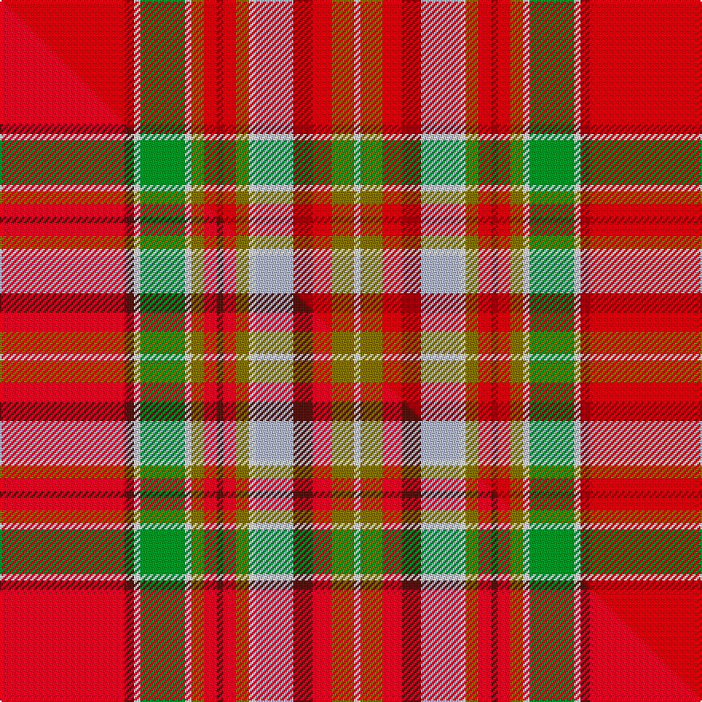

This is one **variant** — a specific cloth: this exact thread count and colourway, with its own
provenance below. It is one weaving of the [sett](/setts/ri39r3w2g14w2y4ri4r2ri4y4w2lb12r6ri6y7w2/) (the scale-free proportion — the
same cloth at any scale or shade), whose colour order is pattern [RRWGWGRRRGWWRRGW](/stripes/rrwgwgrrrgwwrrgw/).

Part of the [North West Mounted Police](/tartans/n/no/north-west-mounted-police-2/) tartan — the named design grouping this sett with its other cloths.

Sourced from weddslist.  It is a [16 stripe tartan](/stripes/stripes16/).

Original link [http://www.weddslist.com/cgi-bin/tartans/pg.pl?source=sts](http://www.weddslist.com/cgi-bin/tartans/pg.pl?source=sts)

Dataset <small>— provenance for this record, inherited from the source manifest</small>

<dl class="dataset-prov">
<dt>source</dt><dd><a href="/sources/weddslist/">Weddslist</a></dd>
<dt>data captured from</dt><dd><a href="https://github.com/thetartan/tartan-database/blob/master/data/weddslist/data.csv">https://github.com/thetartan/tartan-database/blob/master/data/weddslist/data.csv</a></dd>
<dt>data date</dt><dd>2016-11-17 <small>(dataset default)</small></dd>
<dt>licence</dt><dd><a href="https://creativecommons.org/licenses/by-nc-nd/4.0/">CC BY-NC-ND 4.0</a></dd>
</dl>

Capture chain <small>— the hands this data passed through, oldest first; each capture carries its own licence</small>

<ol class="capture-chain">
<li><a href="https://www.weddslist.com/tartans/">Weddslist</a> <small>the living privately compiled reference</small></li>
<li><a href="https://github.com/thetartan/tartan-database">thetartan/tartan-database</a> <small>2016-2017</small> · <a href="https://creativecommons.org/licenses/by-nc-nd/4.0/">CC BY-NC-ND 4.0</a> <small>Levko Kravets's frozen compilation — the capture we vendored, and where its CC licence text came from</small></li>
<li>this dictionary <small>captured 2026-06-10 · commit 5bf86c7566</small> <small>each re-capture is a git commit to data/sources</small></li>
</ol>

## Thread count
Ri/78 R6 W4 G28 W4 Y8 Ri8 R4 Ri8 Y8 W4 LB24 R12 Ri12 Y14 W/4

One full sett is **370 threads**.

## Palette
<table><thead><tr><th>Colour</th><th>Shade</th><th>OKLCh</th></tr></thead><tbody><tr><td>LB</td><td><code style="background-color:#B5BBDE;">#B5BBDE</code> <small style="color:#888">#B5BBDE</small></td><td><small style="color:#888">oklch(79.9% 0.050 277.6)</small></td></tr><tr><td>R</td><td><code style="background-color:#800000;">#800000</code> <small style="color:#888">#800000</small></td><td><small style="color:#888">oklch(37.7% 0.155 29.2)</small></td></tr><tr><td>G</td><td><code style="background-color:#008B2A;">#008B2A</code> <small style="color:#888">#008B2A</small></td><td><small style="color:#888">oklch(55.4% 0.170 145.9)</small></td></tr><tr><td>W</td><td><code style="background-color:#F7F7F7;">#F7F7F7</code> <small style="color:#888">#F7F7F7</small></td><td><small style="color:#888">oklch(97.6% 0.000 89.9)</small></td></tr><tr><td>R</td><td><code style="background-color:#C00000;">#C00000</code> <small style="color:#888">#C00000</small></td><td><small style="color:#888">oklch(50.7% 0.208 29.2)</small></td></tr><tr><td>Y</td><td><code style="background-color:#8B6E00;">#8B6E00</code> <small style="color:#888">#8B6E00</small></td><td><small style="color:#888">oklch(55.1% 0.113 90.4)</small></td></tr></tbody></table>

# Sample pattern

## Compared to the master

This cloth is one sett of its design; the master sett (the exemplar the design is anchored on) is below for comparison.

Its **ΔTartan distance** from the master is **0.07** — the same measure the nearest-tartans table ranks by (0 is identical; a re-scale of the same cloth is near 0, a recolour or a different proportion further).

<figure class="master-compare" style="margin:0">

this sett
master sett ★

<figcaption style="color:#888;font-size:smaller">One weave of this sett against the <a href="/setts/r39dr3w2g14w2y4r4dr2r4y4w2lb12dr6r6y7w2/">master sett ★</a>, split on the diagonal: a shared proportion runs seamlessly across it with only the shades shifting; a different proportion breaks on it.</figcaption>
</figure>

## Nearest tartan variants

The nearest existing variants by ΔTartan distance, with this cloth at the top so the swatches line up against it.

ΔTartan

Threads

Variant

Sett

—

370

<a href="/variants/s16/ri39r3w2g14w2y4ri4r2ri4y4w2lb12r6ri6y7w2~x2~ri2008029-r1506028/">North West, Mounted Police</a>

<a href="/ttd/edit/#slug=r39dr3w2g14w2y4r4dr2r4y4w2lb12dr6r6y7w2~x2&amp;base=ri39r3w2g14w2y4ri4r2ri4y4w2lb12r6ri6y7w2~x2~ri2008029-r1506028" title="compare in the TTD">0.07</a>

370

<a href="/variants/s16/r39dr3w2g14w2y4r4dr2r4y4w2lb12dr6r6y7w2~x2/">North West Mounted Police Corporate Tartan</a>

<a href="/ttd/edit/#slug=ri6dr4r2ri3g34dr3r2ri4r2dr3dp8lb2ri40dr4r2ri6~x2~ri2209032-r2208029&amp;base=ri39r3w2g14w2y4ri4r2ri4y4w2lb12r6ri6y7w2~x2~ri2008029-r1506028" title="compare in the TTD">1.51</a>

476

<a href="/variants/s16/ri6dr4r2ri3g34dr3r2ri4r2dr3dp8lb2ri40dr4r2ri6~x2~ri2209032-r2208029/">MacDougall #9</a>

<a href="/ttd/edit/#slug=ri6r4b2ri3g34r3b2ri4b2r3dp8lb2ri40r4b2ri6~x2~ri2008029-r1506028&amp;base=ri39r3w2g14w2y4ri4r2ri4y4w2lb12r6ri6y7w2~x2~ri2008029-r1506028" title="compare in the TTD">1.95</a>

476

<a href="/variants/s16/ri6r4b2ri3g34r3b2ri4b2r3dp8lb2ri40r4b2ri6~x2~ri2008029-r1506028/">MacDougall 4</a>

<a href="/ttd/edit/#slug=r25do3w2o25w3y5r4do2r4y5w3db4do5r6w1db1~x2&amp;base=ri39r3w2g14w2y4ri4r2ri4y4w2lb12r6ri6y7w2~x2~ri2008029-r1506028" title="compare in the TTD">2.03</a>

340

<a href="/variants/s16/r25do3w2o25w3y5r4do2r4y5w3db4do5r6w1db1~x2/">MacGlashan</a>

<a href="/ttd/edit/#slug=r25do3w2ly25w3y5r4do2r4y5w3db4do5r6w1db1~x2&amp;base=ri39r3w2g14w2y4ri4r2ri4y4w2lb12r6ri6y7w2~x2~ri2008029-r1506028" title="compare in the TTD">2.53</a>

340

<a href="/variants/s16/r25do3w2ly25w3y5r4do2r4y5w3db4do5r6w1db1~x2/">MacGlashan Clan Tartan</a>

<a href="/ttd/edit/#slug=lb4dp8w2g32w2r8ri4dp2ri4r8w2dp16r65w2dp8lb4w2~x2~w3600000-r2109032-ri2406019&amp;base=ri39r3w2g14w2y4ri4r2ri4y4w2lb12r6ri6y7w2~x2~ri2008029-r1506028" title="compare in the TTD">2.59</a>

680

<a href="/variants/s17/lb4dp8w2g32w2r8ri4dp2ri4r8w2dp16r65w2dp8lb4w2~x2~w3600000-r2109032-ri2406019/">Birral/Burrell</a>

<a href="/ttd/edit/#slug=lb1r4ri2rii2g27rii4g2rii4dp10r3ri2rii2ri2r3g10rii10g10rii2dp2rii26r3ri2rii3lb1~x2~r2109013-ri2208029-rii2209032&amp;base=ri39r3w2g14w2y4ri4r2ri4y4w2lb12r6ri6y7w2~x2~ri2008029-r1506028" title="compare in the TTD">2.69</a>

544

<a href="/variants/s24/lb1r4ri2rii2g27rii4g2rii4dp10r3ri2rii2ri2r3g10rii10g10rii2dp2rii26r3ri2rii3lb1~x2~r2109013-ri2208029-rii2209032/">MacDougall (Wilson)</a>

<a href="/ttd/edit/#slug=r65w2dp8lb4w2lb4dp8w2g32w2r8ri4dp2ri4r8w2dp16~x2~r2109032-ri2406019&amp;base=ri39r3w2g14w2y4ri4r2ri4y4w2lb12r6ri6y7w2~x2~ri2008029-r1506028" title="compare in the TTD">2.70</a>

530

<a href="/variants/s17/r65w2dp8lb4w2lb4dp8w2g32w2r8ri4dp2ri4r8w2dp16~x2~r2109032-ri2406019/">Birral (Clan)</a>

<a href="/ttd/edit/#slug=lb1r5ri2rii3g24rii5g2rii5db11r3ri2rii2ri2r3g11rii11g11rii2db2rii25r3ri2rii5lb1~x2~r1707016-ri2208029-rii2209032&amp;base=ri39r3w2g14w2y4ri4r2ri4y4w2lb12r6ri6y7w2~x2~ri2008029-r1506028" title="compare in the TTD">2.72</a>

568

<a href="/variants/s24/lb1r5ri2rii3g24rii5g2rii5db11r3ri2rii2ri2r3g11rii11g11rii2db2rii25r3ri2rii5lb1~x2~r1707016-ri2208029-rii2209032/">MacDougall #2</a>

<a href="/ttd/edit/#slug=n12b2o4y2o3w3o3w19r30n2r4o2~x2&amp;base=ri39r3w2g14w2y4ri4r2ri4y4w2lb12r6ri6y7w2~x2~ri2008029-r1506028" title="compare in the TTD">2.87</a>

316

<a href="/variants/s12/n12b2o4y2o3w3o3w19r30n2r4o2~x2/">MacLean of Duart, dress</a>

## Neighbour map

Every grey dot is one of 13621 variants placed by the first two principal components of the ΔTartan feature space (42% of its variance). Red is this tartan; blue dots are its nearest — click one to open its page.

<svg viewBox="0 0 640 380" role="img" style="max-width:100%;height:auto;border:1px solid #e0e0e0;border-radius:4px;display:block" xmlns="http://www.w3.org/2000/svg"><image href="/nn/cloud.v1.png" width="640" height="380"/><a href="/variants/s16/r39dr3w2g14w2y4r4dr2r4y4w2lb12dr6r6y7w2~x2/"><circle cx="240.5" cy="93.4" r="4" fill="#3465a4"><title>North West Mounted Police Corporate Tartan</title></circle></a><a href="/variants/s16/ri6dr4r2ri3g34dr3r2ri4r2dr3dp8lb2ri40dr4r2ri6~x2~ri2209032-r2208029/"><circle cx="273.7" cy="84.8" r="4" fill="#3465a4"><title>MacDougall #9</title></circle></a><a href="/variants/s16/ri6r4b2ri3g34r3b2ri4b2r3dp8lb2ri40r4b2ri6~x2~ri2008029-r1506028/"><circle cx="281.5" cy="89.3" r="4" fill="#3465a4"><title>MacDougall 4</title></circle></a><a href="/variants/s16/r25do3w2o25w3y5r4do2r4y5w3db4do5r6w1db1~x2/"><circle cx="234.1" cy="96.0" r="4" fill="#3465a4"><title>MacGlashan</title></circle></a><a href="/variants/s16/r25do3w2ly25w3y5r4do2r4y5w3db4do5r6w1db1~x2/"><circle cx="197.2" cy="85.7" r="4" fill="#3465a4"><title>MacGlashan Clan Tartan</title></circle></a><a href="/variants/s17/lb4dp8w2g32w2r8ri4dp2ri4r8w2dp16r65w2dp8lb4w2~x2~w3600000-r2109032-ri2406019/"><circle cx="264.8" cy="54.2" r="4" fill="#3465a4"><title>Birral/Burrell</title></circle></a><a href="/variants/s24/lb1r4ri2rii2g27rii4g2rii4dp10r3ri2rii2ri2r3g10rii10g10rii2dp2rii26r3ri2rii3lb1~x2~r2109013-ri2208029-rii2209032/"><circle cx="232.3" cy="75.2" r="4" fill="#3465a4"><title>MacDougall (Wilson)</title></circle></a><a href="/variants/s17/r65w2dp8lb4w2lb4dp8w2g32w2r8ri4dp2ri4r8w2dp16~x2~r2109032-ri2406019/"><circle cx="259.2" cy="52.3" r="4" fill="#3465a4"><title>Birral (Clan)</title></circle></a><a href="/variants/s24/lb1r5ri2rii3g24rii5g2rii5db11r3ri2rii2ri2r3g11rii11g11rii2db2rii25r3ri2rii5lb1~x2~r1707016-ri2208029-rii2209032/"><circle cx="220.8" cy="83.2" r="4" fill="#3465a4"><title>MacDougall #2</title></circle></a><a href="/variants/s12/n12b2o4y2o3w3o3w19r30n2r4o2~x2/"><circle cx="196.2" cy="115.4" r="4" fill="#3465a4"><title>MacLean of Duart, dress</title></circle></a><circle cx="244.1" cy="93.6" r="5" fill="#c00000"/><text x="320" y="376" text-anchor="middle" font-size="11" fill="#999">ground</text><text x="11" y="190" text-anchor="middle" font-size="11" fill="#999" transform="rotate(-90 11 190)">complexity</text></svg>

ID: /variants/s16/ri39r3w2g14w2y4ri4r2ri4y4w2lb12r6ri6y7w2~x2~ri2008029-r1506028/
