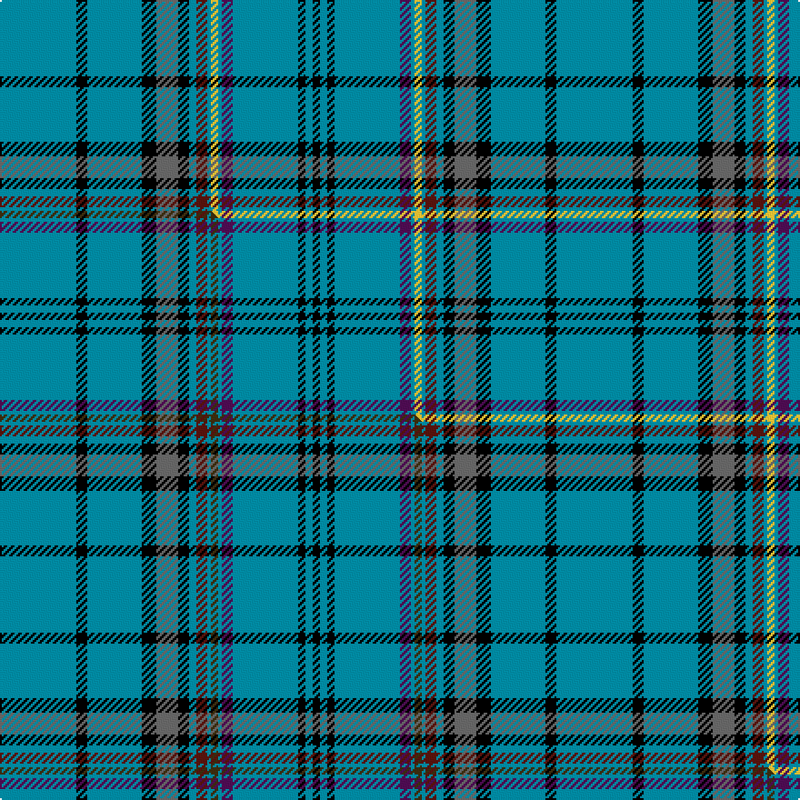

This page is one **sett** — a single exact thread-count. It belongs to the [tartan](/setts/t21k3t15k4n6k3t2dr3t1ly2t1dp3t18k2t2k2/)
(the same proportion at any scale), whose colour order is pattern [BKBKBKBBBYBBBKBK](/stripes/bkbkbkbbbybbbkbk/).

Part of the [Pounds](/tartans/pounds/) tartan — the named design grouping this sett with its other cloths.

Sourced from tartans-authority.  It is a [16 stripe tartan](/stripes/stripes16/).

Original link [https://www.tartanregister.gov.uk/tartanDetails.aspx?ref=10070](https://www.tartanregister.gov.uk/tartanDetails.aspx?ref=10070)

## Provenance

Earliest known date: 5th August 2009 For anyone of the name.

2 attestations — the source records this cloth was collapsed from (oldest owns this page)

<ul>
<li>5th August 2009 — Pounds (Name) (tartans-authority, <a href="https://www.tartanregister.gov.uk/tartanDetails.aspx?ref=10070">record</a>)  <em>For anyone of the name.</em></li>
<li>undated — Pounds Name Tartan (house-of-tartan, <a href="http://www.house-of-tartan.scotland.net/house/TartanViewjs.asp?colr=Def&tnam=10070">record</a>) </li>
</ul>

Dataset <small>— provenance for this record, inherited from the source manifest</small>

<dl class="dataset-prov">
<dt>source</dt><dd><a href="/sources/tartans-authority/">Scottish Tartans Authority</a></dd>
<dt>data captured from</dt><dd><a href="https://github.com/thetartan/tartan-database/blob/master/data/tartans-authority/data.csv">https://github.com/thetartan/tartan-database/blob/master/data/tartans-authority/data.csv</a></dd>
<dt>data date</dt><dd>5th August 2009 <small>(this record)</small></dd>
<dt>licence</dt><dd><a href="https://creativecommons.org/licenses/by-nc-nd/4.0/">CC BY-NC-ND 4.0</a></dd>
</dl>

Capture chain <small>— the hands this data passed through, oldest first; each capture carries its own licence</small>

<ol class="capture-chain">
<li><a href="https://www.tartansauthority.com/">Scottish Tartans Authority</a> <small>the heritage body's archive — its tartan-ferret record browser is retired (links repaired to the SRT, above)</small></li>
<li><a href="https://github.com/thetartan/tartan-database">thetartan/tartan-database</a> <small>2016-2017</small> · <a href="https://creativecommons.org/licenses/by-nc-nd/4.0/">CC BY-NC-ND 4.0</a> <small>Levko Kravets's frozen compilation — the capture we vendored, and where its CC licence text came from</small></li>
<li>this dictionary <small>captured 2026-06-10 · commit 5bf86c7566</small> <small>each re-capture is a git commit to data/sources</small></li>
</ol>

## Register references

External register numbers recorded for this tartan.

- Scottish Register of Tartans: [10070](https://www.tartanregister.gov.uk/tartanDetails?ref=10070)
- Scottish Tartans Authority (ITI): 10070

## Thread count
T/42 K6 T30 K8 N12 K6 T4 DR6 T2 LY4 T2 DP6 T36 K4 T4 K/4

One full sett is **306 threads**.

## Palette
<table><thead><tr><th>Colour</th><th>Shade</th><th>OKLCh</th></tr></thead><tbody><tr><td>DR</td><td><code style="background-color:#55120C;">#55120C</code> <small style="color:#888">#55120C</small></td><td><small style="color:#888">oklch(30.0% 0.099 29.3)</small></td></tr><tr><td>LY</td><td><code style="background-color:#DCBC32;">#DCBC32</code> <small style="color:#888">#DCBC32</small></td><td><small style="color:#888">oklch(80.0% 0.150 95.2)</small></td></tr><tr><td>K</td><td><code style="background-color:#000000;">#000000</code> <small style="color:#888">#000000</small></td><td><small style="color:#888">oklch(0.0% 0.000 0.0)</small></td></tr><tr><td>T</td><td><code style="background-color:#00879F;">#00879F</code> <small style="color:#888">#00879F</small></td><td><small style="color:#888">oklch(57.4% 0.102 216.1)</small></td></tr><tr><td>N</td><td><code style="background-color:#636363;">#636363</code> <small style="color:#888">#636363</small></td><td><small style="color:#888">oklch(50.0% 0.000 89.9)</small></td></tr><tr><td>DP</td><td><code style="background-color:#4B0B4F;">#4B0B4F</code> <small style="color:#888">#4B0B4F</small></td><td><small style="color:#888">oklch(30.1% 0.125 325.4)</small></td></tr></tbody></table>

# Sample pattern

## Compared to the master

This cloth is one sett of its design; the master sett (the exemplar the design is anchored on) is below for comparison.

Its **ΔTartan distance** from the master is **0.03** — the same measure the nearest-tartans table ranks by (0 is identical; a re-scale of the same cloth is near 0, a recolour or a different proportion further).

<figure class="master-compare" style="margin:0">

this sett
master sett ★

<figcaption style="color:#888;font-size:smaller">One weave of this sett against the <a href="/setts/t21k3t15k4n6k3t2dr3t1dy2t1dp3t18k2t2k2/">master sett ★</a>, split on the diagonal: a shared proportion runs seamlessly across it with only the shades shifting; a different proportion breaks on it.</figcaption>
</figure>

## Nearest tartan variants

The nearest existing variants by ΔTartan distance, with this cloth at the top so the swatches line up against it.

ΔTartan

Threads

Variant

Sett

—

306

<a href="/variants/s16/t21k3t15k4n6k3t2dr3t1ly2t1dp3t18k2t2k2~x2/">Pounds (Name)</a>

<a href="/ttd/edit/#slug=t21k3t15k4n6k3t2dr3t1dy2t1dp3t18k2t2k2~x2&amp;base=t21k3t15k4n6k3t2dr3t1ly2t1dp3t18k2t2k2~x2" title="compare in the TTD">0.03</a>

306

<a href="/variants/s16/t21k3t15k4n6k3t2dr3t1dy2t1dp3t18k2t2k2~x2/">Pounds</a>

<a href="/ttd/edit/#slug=db25w2k2db15y2db1y2db15k2w2g16r1~x2&amp;base=t21k3t15k4n6k3t2dr3t1ly2t1dp3t18k2t2k2~x2" title="compare in the TTD">2.62</a>

288

<a href="/variants/s12/db25w2k2db15y2db1y2db15k2w2g16r1~x2/">Quigley of Knockcroghery (Modern)</a>

<a href="/ttd/edit/#slug=t34g10t5r2k8dy2w3dy2k8r2t5g10t28k3~x2&amp;base=t21k3t15k4n6k3t2dr3t1ly2t1dp3t18k2t2k2~x2" title="compare in the TTD">2.96</a>

414

<a href="/variants/s14/t34g10t5r2k8dy2w3dy2k8r2t5g10t28k3~x2/">Lambert Dress (Personal)</a>

<a href="/ttd/edit/#slug=db58g28dy4w18db14r3db8k4db8r3db14w18dy4g28db58w4&amp;base=t21k3t15k4n6k3t2dr3t1ly2t1dp3t18k2t2k2~x2" title="compare in the TTD">3.12</a>

486

<a href="/variants/s16/db58g28dy4w18db14r3db8k4db8r3db14w18dy4g28db58w4/">Scotia (EWM)</a>

<a href="/ttd/edit/#slug=db73k4lb6k4db73g73r4g73db73k4lb4k4db73g73y4&amp;base=t21k3t15k4n6k3t2dr3t1ly2t1dp3t18k2t2k2~x2" title="compare in the TTD">3.17</a>

1013

<a href="/variants/s15/db73k4lb6k4db73g73r4g73db73k4lb4k4db73g73y4/">Cambridge</a>

<a href="/ttd/edit/#slug=r3g1db2g4db30k2db4k2db30g27y3k3w3~x2&amp;base=t21k3t15k4n6k3t2dr3t1ly2t1dp3t18k2t2k2~x2" title="compare in the TTD">3.19</a>

444

<a href="/variants/s13/r3g1db2g4db30k2db4k2db30g27y3k3w3~x2/">Joss</a>

<a href="/ttd/edit/#slug=b19k1lyi1b10k4y9dp4b9lyi1k1ly2~x4~b2206256-lyi2602166&amp;base=t21k3t15k4n6k3t2dr3t1ly2t1dp3t18k2t2k2~x2" title="compare in the TTD">3.36</a>

404

<a href="/variants/s11/b19k1yi1b10k4y9dp4b9yi1k1ly2~x4~b2206256-yi2602166/">Cian of Ely (Clan)</a>

<a href="/ttd/edit/#slug=db25w2k2db15ly2db1ly2db15k2w2dg16r1~x2&amp;base=t21k3t15k4n6k3t2dr3t1ly2t1dp3t18k2t2k2~x2" title="compare in the TTD">3.43</a>

288

<a href="/variants/s12/db25w2k2db15ly2db1ly2db15k2w2dg16r1~x2/">Quigley of Knockcroghery (Pers)</a>

<a href="/ttd/edit/#slug=dp8g8w3g8dp8w3t40r3k3t40w3~x2&amp;base=t21k3t15k4n6k3t2dr3t1ly2t1dp3t18k2t2k2~x2" title="compare in the TTD">3.45</a>

486

<a href="/variants/s11/dp8g8w3g8dp8w3t40r3k3t40w3~x2/">World Peace (Fashion)</a>

<a href="/ttd/edit/#slug=r4db11lg4w3lg4ly6db3k3db4k1db30w3~x2&amp;base=t21k3t15k4n6k3t2dr3t1ly2t1dp3t18k2t2k2~x2" title="compare in the TTD">3.56</a>

290

<a href="/variants/s12/r4db11lg4w3lg4ly6db3k3db4k1db30w3~x2/">Murison, Ina</a>

## Neighbour map

Every grey dot is one of 13621 variants placed by the first two principal components of the ΔTartan feature space (42% of its variance). Red is this tartan; blue dots are its nearest — click one to open its page.

<svg viewBox="0 0 640 380" role="img" style="max-width:100%;height:auto;border:1px solid #e0e0e0;border-radius:4px;display:block" xmlns="http://www.w3.org/2000/svg"><image href="/nn/cloud.v1.png" width="640" height="380"/><a href="/variants/s16/t21k3t15k4n6k3t2dr3t1dy2t1dp3t18k2t2k2~x2/"><circle cx="326.7" cy="86.8" r="4" fill="#3465a4"><title>Pounds</title></circle></a><a href="/variants/s12/db25w2k2db15y2db1y2db15k2w2g16r1~x2/"><circle cx="325.1" cy="90.4" r="4" fill="#3465a4"><title>Quigley of Knockcroghery (Modern)</title></circle></a><a href="/variants/s14/t34g10t5r2k8dy2w3dy2k8r2t5g10t28k3~x2/"><circle cx="247.6" cy="99.6" r="4" fill="#3465a4"><title>Lambert Dress (Personal)</title></circle></a><a href="/variants/s16/db58g28dy4w18db14r3db8k4db8r3db14w18dy4g28db58w4/"><circle cx="236.5" cy="91.1" r="4" fill="#3465a4"><title>Scotia (EWM)</title></circle></a><a href="/variants/s15/db73k4lb6k4db73g73r4g73db73k4lb4k4db73g73y4/"><circle cx="264.7" cy="115.5" r="4" fill="#3465a4"><title>Cambridge</title></circle></a><a href="/variants/s13/r3g1db2g4db30k2db4k2db30g27y3k3w3~x2/"><circle cx="289.3" cy="72.3" r="4" fill="#3465a4"><title>Joss</title></circle></a><a href="/variants/s11/b19k1yi1b10k4y9dp4b9yi1k1ly2~x4~b2206256-yi2602166/"><circle cx="292.4" cy="115.9" r="4" fill="#3465a4"><title>Cian of Ely (Clan)</title></circle></a><a href="/variants/s12/db25w2k2db15ly2db1ly2db15k2w2dg16r1~x2/"><circle cx="336.1" cy="92.9" r="4" fill="#3465a4"><title>Quigley of Knockcroghery (Pers)</title></circle></a><a href="/variants/s11/dp8g8w3g8dp8w3t40r3k3t40w3~x2/"><circle cx="303.1" cy="121.3" r="4" fill="#3465a4"><title>World Peace (Fashion)</title></circle></a><a href="/variants/s12/r4db11lg4w3lg4ly6db3k3db4k1db30w3~x2/"><circle cx="282.3" cy="69.4" r="4" fill="#3465a4"><title>Murison, Ina</title></circle></a><circle cx="323.1" cy="85.7" r="5" fill="#c00000"/><text x="320" y="376" text-anchor="middle" font-size="11" fill="#999">ground</text><text x="11" y="190" text-anchor="middle" font-size="11" fill="#999" transform="rotate(-90 11 190)">complexity</text></svg>

ID: /variants/s16/t21k3t15k4n6k3t2dr3t1ly2t1dp3t18k2t2k2~x2/
