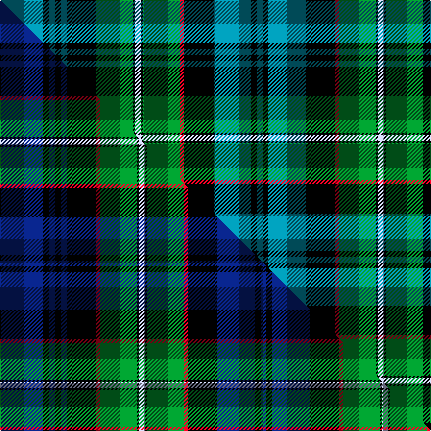

This page is one **sett** — a single exact thread-count. It belongs to the [tartan](/setts/t22k3t3k3t3k15g19k1lb3k1g19r2k15t19k3t3/)
(the same proportion at any scale), whose colour order is pattern [BKBKBKGKWKGRKBKB](/stripes/bkbkbkgkwkgrkbkb/).

Part of the [Sempill](/tartans/sempill/) tartan — the named design grouping this sett with its other cloths.

Sourced from tartans-authority.  It is a [16 stripe tartan](/stripes/stripes16/).

Original link http://www.tartansauthority.com/tartan-ferret/display/2420/

## Register references

External register numbers recorded for this tartan.

- Scottish Tartans Authority (ITI): 2420

## Thread count
T/44 K6 T6 K6 T6 K30 G38 K2 LB6 K2 G38 R4 K30 T38 K6 T/6

One full sett is **486 threads**.

## Palette
<table><thead><tr><th>Colour</th><th>Shade</th><th>OKLCh</th></tr></thead><tbody><tr><td>T</td><td><code style="background-color:#00879F;">#00879F</code> <small style="color:#888">#00879F</small></td><td><small style="color:#888">oklch(57.4% 0.102 216.1)</small></td></tr><tr><td>G</td><td><code style="background-color:#008B2A;">#008B2A</code> <small style="color:#888">#008B2A</small></td><td><small style="color:#888">oklch(55.4% 0.170 145.9)</small></td></tr><tr><td>K</td><td><code style="background-color:#000000;">#000000</code> <small style="color:#888">#000000</small></td><td><small style="color:#888">oklch(0.0% 0.000 0.0)</small></td></tr><tr><td>LB</td><td><code style="background-color:#B5BBDE;">#B5BBDE</code> <small style="color:#888">#B5BBDE</small></td><td><small style="color:#888">oklch(79.9% 0.050 277.6)</small></td></tr><tr><td>R</td><td><code style="background-color:#D60020;">#D60020</code> <small style="color:#888">#D60020</small></td><td><small style="color:#888">oklch(55.2% 0.224 25.5)</small></td></tr></tbody></table>

# Sample pattern

## Compared to the master

This cloth is one sett of its design; the master sett (the exemplar the design is anchored on) is below for comparison.

Its **ΔTartan distance** from the master is **1.17** — the same measure the nearest-tartans table ranks by (0 is identical; a re-scale of the same cloth is near 0, a recolour or a different proportion further).

<figure class="master-compare" style="margin:0">

this sett
master sett ★

<figcaption style="color:#888;font-size:smaller">One weave of this sett against the <a href="/setts/db22k3db3k3db3k15r2g19k1lb3k1g19r2k15db19k3db3/">master sett ★</a>, split on the diagonal: a shared proportion runs seamlessly across it with only the shades shifting; a different proportion breaks on it.</figcaption>
</figure>

## Nearest variants

The nearest existing variants by ΔTartan distance, with this cloth at the top so the swatches line up against it.

ΔTartan

Threads

Variant

Sett

—

486

<a href="/variants/s16/t22k3t3k3t3k15g19k1lb3k1g19r2k15t19k3t3~x2/">Sempill (Clan)</a>

<a href="/ttd/edit/#slug=db22k3db3k3db3k15r2g19k1lb3k1g19r2k15db19k3db3~x2&amp;base=t22k3t3k3t3k15g19k1lb3k1g19r2k15t19k3t3~x2" title="compare in the TTD">0.30</a>

494

<a href="/variants/s17/db22k3db3k3db3k15r2g19k1lb3k1g19r2k15db19k3db3~x2/">Sempill</a>

<a href="/ttd/edit/#slug=db24k2db2k2db2k12g16k1r3k1g16k12db12k1w3~x2&amp;base=t22k3t3k3t3k15g19k1lb3k1g19r2k15t19k3t3~x2" title="compare in the TTD">1.91</a>

382

<a href="/variants/s15/db24k2db2k2db2k12g16k1r3k1g16k12db12k1w3~x2/">Robertson Htg - 1816 (Clan)</a>

<a href="/ttd/edit/#slug=db24k2db2k2db2k12g16k1r2k1g16k12db12k1w3~x2&amp;base=t22k3t3k3t3k15g19k1lb3k1g19r2k15t19k3t3~x2" title="compare in the TTD">1.91</a>

378

<a href="/variants/s15/db24k2db2k2db2k12g16k1r2k1g16k12db12k1w3~x2/">Robertson Hunting</a>

<a href="/ttd/edit/#slug=db12k2db2k2db2k12g16k1r2k1g16k12db12k1w3~x2&amp;base=t22k3t3k3t3k15g19k1lb3k1g19r2k15t19k3t3~x2" title="compare in the TTD">2.10</a>

354

<a href="/variants/s15/db12k2db2k2db2k12g16k1r2k1g16k12db12k1w3~x2/">Robertson of Kindeace</a>

<a href="/ttd/edit/#slug=db12k2db2k2db2k12g16k1r3k1g16k12db12k1w3~x2&amp;base=t22k3t3k3t3k15g19k1lb3k1g19r2k15t19k3t3~x2" title="compare in the TTD">2.10</a>

358

<a href="/variants/s15/db12k2db2k2db2k12g16k1r3k1g16k12db12k1w3~x2/">Robertson of Kindeace</a>

## Neighbour map

Every grey dot is one of 13620 variants placed by the first two principal components of the ΔTartan feature space (42% of its variance). Red is this tartan; blue dots are its nearest — click one to open its page.

<svg viewBox="0 0 640 380" role="img" style="max-width:100%;height:auto;border:1px solid #e0e0e0;border-radius:4px;display:block" xmlns="http://www.w3.org/2000/svg"><image href="/nn/cloud.v1.png" width="640" height="380"/><a href="/variants/s17/db22k3db3k3db3k15r2g19k1lb3k1g19r2k15db19k3db3~x2/"><circle cx="152.4" cy="103.1" r="4" fill="#3465a4"><title>Sempill</title></circle></a><a href="/variants/s15/db24k2db2k2db2k12g16k1r3k1g16k12db12k1w3~x2/"><circle cx="152.8" cy="101.4" r="4" fill="#3465a4"><title>Robertson Htg - 1816 (Clan)</title></circle></a><a href="/variants/s15/db24k2db2k2db2k12g16k1r2k1g16k12db12k1w3~x2/"><circle cx="156.6" cy="100.5" r="4" fill="#3465a4"><title>Robertson Hunting</title></circle></a><a href="/variants/s15/db12k2db2k2db2k12g16k1r2k1g16k12db12k1w3~x2/"><circle cx="121.0" cy="122.1" r="4" fill="#3465a4"><title>Robertson of Kindeace</title></circle></a><a href="/variants/s15/db12k2db2k2db2k12g16k1r3k1g16k12db12k1w3~x2/"><circle cx="116.9" cy="123.2" r="4" fill="#3465a4"><title>Robertson of Kindeace</title></circle></a><circle cx="147.1" cy="109.5" r="5" fill="#c00000"/><text x="320" y="376" text-anchor="middle" font-size="11" fill="#999">ground</text><text x="11" y="190" text-anchor="middle" font-size="11" fill="#999" transform="rotate(-90 11 190)">complexity</text></svg>

ID: /variants/s16/t22k3t3k3t3k15g19k1lb3k1g19r2k15t19k3t3~x2/
