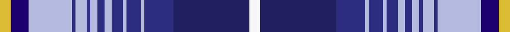

This is one **variant** — a specific cloth: this exact thread count and colourway, with its own
provenance below. It is one weaving of the [sett](/tartans/r/ry/ryder-cup-2014/) (the scale-free proportion — the
same cloth at any scale or shade), whose colour order is pattern [WBBWBWBWBWBWBWBY](/stripes/wbbwbwbwbwbwbwby/).

Part of the [Ryder Cup 2014](/tartans/r/ry/ryder-cup-2014/) tartan — the named design grouping this sett with its other cloths.

Sourced from tartans-authority.  It is a [16 stripe tartan](/stripes/stripes16/).

Original link <code>http://www.tartansauthority.com/tartan-ferret/display/10855/</code> — retired · [Internet Archive copy](https://web.archive.org/web/*/http://www.tartansauthority.com/tartan-ferret/display/10855/*)

Dataset <small>— provenance for this record, inherited from the source manifest</small>

<dl class="dataset-prov">
<dt>source</dt><dd><a href="/sources/tartans-authority/">Scottish Tartans Authority</a></dd>
<dt>data captured from</dt><dd><a href="https://github.com/thetartan/tartan-database/blob/master/data/tartans-authority/data.csv">https://github.com/thetartan/tartan-database/blob/master/data/tartans-authority/data.csv</a></dd>
<dt>data date</dt><dd>14/02/2013 <small>(this record)</small></dd>
<dt>licence</dt><dd><a href="https://creativecommons.org/licenses/by-nc-nd/4.0/">CC BY-NC-ND 4.0</a></dd>
</dl>

Capture chain <small>— the hands this data passed through, oldest first; each capture carries its own licence</small>

<ol class="capture-chain">
<li><a href="https://www.tartansauthority.com/">Scottish Tartans Authority</a> <small>the heritage body’s archive — its tartan-ferret record browser is retired; dead record links are shown unlinked, with an Internet Archive copy (ITI numbers are not SRT references)</small></li>
<li><a href="https://github.com/thetartan/tartan-database">thetartan/tartan-database</a> <small>2016-2017</small> · <a href="https://creativecommons.org/licenses/by-nc-nd/4.0/">CC BY-NC-ND 4.0</a> <small>Levko Kravets's frozen compilation — the capture we vendored, and where its CC licence text came from</small></li>
<li>this dictionary <small>captured 2026-06-10 · commit 5bf86c7566</small> <small>each re-capture is a git commit to data/sources</small></li>
</ol>

## Register references

External register numbers recorded for this tartan.

- Scottish Register of Tartans: [10855](https://www.tartanregister.gov.uk/tartanDetails?ref=10855)
- Scottish Tartans Authority (ITI): 10855

## Thread count
LY/6 DB10 LB24 DBii2 LB6 DBii2 LB4 DBii4 LB4 DBii6 LB2 DBii8 LB2 DBii16 DBi42 W/6

One full sett is **276 threads**.

## Palette
<table><thead><tr><th>Colour</th><th>Shade</th><th>OKLCh</th></tr></thead><tbody><tr><td>LB</td><td><code style="background-color:#B5BBDE;">#B5BBDE</code> <small style="color:#888">#B5BBDE</small></td><td><small style="color:#888">oklch(79.9% 0.050 277.6)</small></td></tr><tr><td>DB</td><td><code style="background-color:#2C2C80;">#2C2C80</code> <small style="color:#888">#2C2C80</small></td><td><small style="color:#888">oklch(35.0% 0.138 276.6)</small></td></tr><tr><td>DB</td><td><code style="background-color:#202060;">#202060</code> <small style="color:#888">#202060</small></td><td><small style="color:#888">oklch(28.9% 0.111 276.9)</small></td></tr><tr><td>DB</td><td><code style="background-color:#1C0070;">#1C0070</code> <small style="color:#888">#1C0070</small></td><td><small style="color:#888">oklch(26.3% 0.162 277.1)</small></td></tr><tr><td>W</td><td><code style="background-color:#F7F7F7;">#F7F7F7</code> <small style="color:#888">#F7F7F7</small></td><td><small style="color:#888">oklch(97.6% 0.000 89.9)</small></td></tr><tr><td>LY</td><td><code style="background-color:#DCBC32;">#DCBC32</code> <small style="color:#888">#DCBC32</small></td><td><small style="color:#888">oklch(80.0% 0.150 95.2)</small></td></tr></tbody></table>

# Sample pattern

## Nearest tartan variants

The nearest existing variants by ΔTartan distance, with this cloth at the top so the swatches line up against it.

ΔTartan

Threads

Variant

Sett

—

276

<a href="/variants/s16/w3dbi21dbii8lb1dbii4lb1dbii3lb2dbii2lb2dbii1lb3dbii1lb12db5ly3~x2~dbi2911276-dbii3514276-db2616276/">Ryder Cup 2014 (Corporate)</a>

<a href="/ttd/edit/#slug=y3db5lb12t1lb3t1lb2t2lb2t3lb1t4lb1t8dbi21w3~x2~db2616276-t5810240-dbi3409246&amp;base=w3dbi21dbii8lb1dbii4lb1dbii3lb2dbii2lb2dbii1lb3dbii1lb12db5ly3~x2~dbi2911276-dbii3514276-db2616276" title="compare in the TTD">0.16</a>

276

<a href="/variants/s16/y3db5lb12t1lb3t1lb2t2lb2t3lb1t4lb1t8dbi21w3~x2~db2616276-t5810240-dbi3409246/">Ryder Cup, The</a>

<a href="/ttd/edit/#slug=db48lb12ly3w3ly3dr11db5dr2ly7w2~x2&amp;base=w3dbi21dbii8lb1dbii4lb1dbii3lb2dbii2lb2dbii1lb3dbii1lb12db5ly3~x2~dbi2911276-dbii3514276-db2616276" title="compare in the TTD">3.88</a>

284

<a href="/variants/s10/db48lb12ly3w3ly3dr11db5dr2ly7w2~x2/">Holyrood Golden Jubilee II</a>

## Neighbour map

Every grey dot is one of 13662 variants placed by the first two principal components of the ΔTartan feature space (42% of its variance). Red is this tartan; blue dots are its nearest — click one to open its page. The map is a flat projection of a many-dimensional space — [how to read it](/posts/neighbourhood-maps/).

<svg viewBox="0 0 640 380" role="img" style="max-width:100%;height:auto;border:1px solid #e0e0e0;border-radius:4px;display:block" xmlns="http://www.w3.org/2000/svg"><image href="/nn/cloud.v1.png" width="640" height="380"/><a href="/variants/s16/y3db5lb12t1lb3t1lb2t2lb2t3lb1t4lb1t8dbi21w3~x2~db2616276-t5810240-dbi3409246/"><circle cx="183.1" cy="128.2" r="4" fill="#3465a4"><title>Ryder Cup, The</title></circle></a><a href="/variants/s10/db48lb12ly3w3ly3dr11db5dr2ly7w2~x2/"><circle cx="234.0" cy="114.9" r="4" fill="#3465a4"><title>Holyrood Golden Jubilee II</title></circle></a><circle cx="184.7" cy="131.1" r="5" fill="#c00000"/><text x="320" y="376" text-anchor="middle" font-size="11" fill="#999">ground</text><text x="11" y="190" text-anchor="middle" font-size="11" fill="#999" transform="rotate(-90 11 190)">complexity</text></svg>

ID: /variants/s16/w3dbi21dbii8lb1dbii4lb1dbii3lb2dbii2lb2dbii1lb3dbii1lb12db5ly3~x2~dbi2911276-dbii3514276-db2616276/
