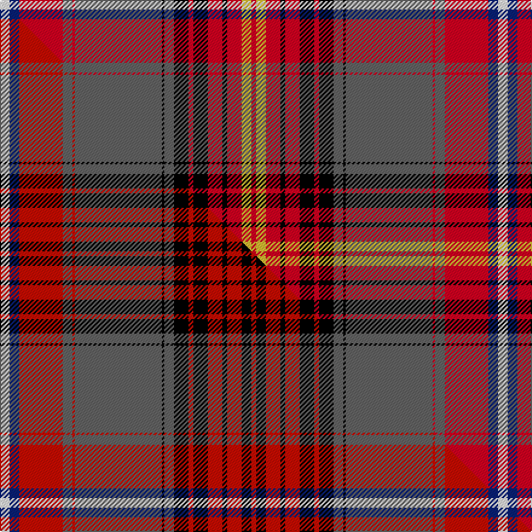

This is one **variant** — a specific cloth: this exact thread count and colourway, with its own
provenance below. It is one weaving of the [sett](/tartans/m/me/mehrtens/) (the scale-free proportion — the
same cloth at any scale or shade), whose colour order is pattern [RYRKRKRKBKBRBRBW](/stripes/ryrkrkrkbkbrbrbw/).

Part of the [Mehrtens](/tartans/m/me/mehrtens/) tartan — the named design grouping this sett with its other cloths.

Sourced from tartans-authority.  It is a [16 stripe tartan](/stripes/stripes16/).

Original link <code>http://www.tartansauthority.com/tartan-ferret/display/6878/</code> — retired · [Internet Archive copy](https://web.archive.org/web/*/http://www.tartansauthority.com/tartan-ferret/display/6878/*)

Dataset <small>— provenance for this record, inherited from the source manifest</small>

<dl class="dataset-prov">
<dt>source</dt><dd><a href="/sources/tartans-authority/">Scottish Tartans Authority</a></dd>
<dt>data captured from</dt><dd><a href="https://github.com/thetartan/tartan-database/blob/master/data/tartans-authority/data.csv">https://github.com/thetartan/tartan-database/blob/master/data/tartans-authority/data.csv</a></dd>
<dt>data date</dt><dd>Dec. 2005 <small>(this record)</small></dd>
<dt>licence</dt><dd><a href="https://creativecommons.org/licenses/by-nc-nd/4.0/">CC BY-NC-ND 4.0</a></dd>
</dl>

Capture chain <small>— the hands this data passed through, oldest first; each capture carries its own licence</small>

<ol class="capture-chain">
<li><a href="https://www.tartansauthority.com/">Scottish Tartans Authority</a> <small>the heritage body’s archive — its tartan-ferret record browser is retired; dead record links are shown unlinked, with an Internet Archive copy (ITI numbers are not SRT references)</small></li>
<li><a href="https://github.com/thetartan/tartan-database">thetartan/tartan-database</a> <small>2016-2017</small> · <a href="https://creativecommons.org/licenses/by-nc-nd/4.0/">CC BY-NC-ND 4.0</a> <small>Levko Kravets's frozen compilation — the capture we vendored, and where its CC licence text came from</small></li>
<li>this dictionary <small>captured 2026-06-10 · commit 5bf86c7566</small> <small>each re-capture is a git commit to data/sources</small></li>
</ol>

## Register references

External register numbers recorded for this tartan.

- Scottish Tartans Authority (ITI): 6878

## Thread count
W/8 DB8 R36 N8 R2 N72 K2 N8 K12 R4 K12 R12 K4 R12 LY8 R/4

One full sett is **412 threads**.

## Palette
<table><thead><tr><th>Colour</th><th>Shade</th><th>OKLCh</th></tr></thead><tbody><tr><td>DB</td><td><code style="background-color:#082077;">#082077</code> <small style="color:#888">#082077</small></td><td><small style="color:#888">oklch(30.0% 0.149 265.1)</small></td></tr><tr><td>K</td><td><code style="background-color:#000000;">#000000</code> <small style="color:#888">#000000</small></td><td><small style="color:#888">oklch(0.0% 0.000 0.0)</small></td></tr><tr><td>N</td><td><code style="background-color:#636363;">#636363</code> <small style="color:#888">#636363</small></td><td><small style="color:#888">oklch(50.0% 0.000 89.9)</small></td></tr><tr><td>R</td><td><code style="background-color:#D60020;">#D60020</code> <small style="color:#888">#D60020</small></td><td><small style="color:#888">oklch(55.2% 0.224 25.5)</small></td></tr><tr><td>W</td><td><code style="background-color:#F7F7F7;">#F7F7F7</code> <small style="color:#888">#F7F7F7</small></td><td><small style="color:#888">oklch(97.6% 0.000 89.9)</small></td></tr><tr><td>LY</td><td><code style="background-color:#DCBC32;">#DCBC32</code> <small style="color:#888">#DCBC32</small></td><td><small style="color:#888">oklch(80.0% 0.150 95.2)</small></td></tr></tbody></table>

# Sample pattern

## Compared to the master

This cloth is one sett of its design; the master sett (the exemplar the design is anchored on) is below for comparison.

Its **ΔTartan distance** from the master is **1.00** — the same measure the nearest-tartans table ranks by (0 is identical; a re-scale of the same cloth is near 0, a recolour or a different proportion further).

<figure class="master-compare" style="margin:0">

this sett
master sett ★

<figcaption style="color:#888;font-size:smaller">One weave of this sett against the <a href="/setts/w4db4r18n4r1n36k1n4k6r2k6r6k2r6k4r2/">master sett ★</a>, split on the diagonal: a shared proportion runs seamlessly across it with only the shades shifting; a different proportion breaks on it.</figcaption>
</figure>

## Nearest tartan variants

The nearest existing variants by ΔTartan distance, with this cloth at the top so the swatches line up against it.

ΔTartan

Threads

Variant

Sett

—

412

<a href="/variants/s16/w4db4r18n4r1n36k1n4k6r2k6r6k2r6ly4r2~x2/">Mehrtens (Personal)</a>

<a href="/ttd/edit/#slug=w4db4r18n4r1n36k1n4k6r2k6r6k2r6k4r2~x2~r2109032&amp;base=w4db4r18n4r1n36k1n4k6r2k6r6k2r6ly4r2~x2" title="compare in the TTD">1.00</a>

412

<a href="/variants/s16/w4db4r18n4r1n36k1n4k6r2k6r6k2r6k4r2~x2~r2109032/">Mehrtens (Personal)</a>

<a href="/ttd/edit/#slug=w4db4r18n4r1n36k1n4k6r2k6r6k4r2~x2&amp;base=w4db4r18n4r1n36k1n4k6r2k6r6k2r6ly4r2~x2" title="compare in the TTD">1.05</a>

380

<a href="/variants/s14/w4db4r18n4r1n36k1n4k6r2k6r6k4r2~x2/">Mehrtens variant (Personal)</a>

<a href="/ttd/edit/#slug=w4db4r18n4r1n36k1n4k6r2k6r6ly4r2~x2&amp;base=w4db4r18n4r1n36k1n4k6r2k6r6k2r6ly4r2~x2" title="compare in the TTD">1.51</a>

380

<a href="/variants/s14/w4db4r18n4r1n36k1n4k6r2k6r6ly4r2~x2/">Mehrtens variant (Personal)</a>

<a href="/ttd/edit/#slug=db3r2db2r35dy2db3k2db5k4g13k1w3~x2&amp;base=w4db4r18n4r1n36k1n4k6r2k6r6k2r6ly4r2~x2" title="compare in the TTD">2.14</a>

288

<a href="/variants/s12/db3r2db2r35dy2db3k2db5k4g13k1w3~x2/">Celtic Nations</a>

<a href="/ttd/edit/#slug=db3r2db2r35ly2db3k2db5k4g13k1w3~x2&amp;base=w4db4r18n4r1n36k1n4k6r2k6r6k2r6ly4r2~x2" title="compare in the TTD">2.20</a>

288

<a href="/variants/s12/db3r2db2r35ly2db3k2db5k4g13k1w3~x2/">Celtic Nations (Fashion)</a>

<a href="/ttd/edit/#slug=r28g10k7w2y2r1y2w2db5k2r2y2w3~x4&amp;base=w4db4r18n4r1n36k1n4k6r2k6r6k2r6ly4r2~x2" title="compare in the TTD">2.23</a>

420

<a href="/variants/s13/r28g10k7w2y2r1y2w2db5k2r2y2w3~x4/">MacGill</a>

<a href="/ttd/edit/#slug=r40k2w1o40k3w2k3r5db22r3w1k3r7~x2~o2503076&amp;base=w4db4r18n4r1n36k1n4k6r2k6r6k2r6ly4r2~x2" title="compare in the TTD">2.30</a>

434

<a href="/variants/s13/r40k2w1ly40k3w2k3r5db22r3w1k3r7~x2~ly2503076/">K9</a>

<a href="/ttd/edit/#slug=k4r6t4r44g20k4w6k4ly2k8t14k8ly2k4w6k4g20r44t4r6k1~x2&amp;base=w4db4r18n4r1n36k1n4k6r2k6r6k2r6ly4r2~x2" title="compare in the TTD">2.34</a>

850

<a href="/variants/s21/k4r6t4r44g20k4w6k4ly2k8t14k8ly2k4w6k4g20r44t4r6k1~x2/">MacLean</a>

<a href="/ttd/edit/#slug=r8k3n15k1w3k1n8k1w3k1r19k2ly2k2g2k2r2k2~x2&amp;base=w4db4r18n4r1n36k1n4k6r2k6r6k2r6ly4r2~x2" title="compare in the TTD">2.58</a>

288

<a href="/variants/s18/r8k3n15k1w3k1n8k1w3k1r19k2ly2k2g2k2r2k2~x2/">Canadian Dental Association (Corp.)</a>

<a href="/ttd/edit/#slug=g4r4b1k1r19k1lb1r2db5r2lb1k1r2g24r5b1k1lb3~x2&amp;base=w4db4r18n4r1n36k1n4k6r2k6r6k2r6ly4r2~x2" title="compare in the TTD">2.62</a>

298

<a href="/variants/s18/g4r4b1k1r19k1lb1r2db5r2lb1k1r2g24r5b1k1lb3~x2/">Dundas, (Red)</a>

## Neighbour map

Every grey dot is one of 13656 variants placed by the first two principal components of the ΔTartan feature space (42% of its variance). Red is this tartan; blue dots are its nearest — click one to open its page. The map is a flat projection of a many-dimensional space — [how to read it](/posts/neighbourhood-maps/).

<svg viewBox="0 0 640 380" role="img" style="max-width:100%;height:auto;border:1px solid #e0e0e0;border-radius:4px;display:block" xmlns="http://www.w3.org/2000/svg"><image href="/nn/cloud.v1.png" width="640" height="380"/><a href="/variants/s16/w4db4r18n4r1n36k1n4k6r2k6r6k2r6k4r2~x2~r2109032/"><circle cx="198.7" cy="45.8" r="4" fill="#3465a4"><title>Mehrtens (Personal)</title></circle></a><a href="/variants/s14/w4db4r18n4r1n36k1n4k6r2k6r6k4r2~x2/"><circle cx="211.6" cy="49.5" r="4" fill="#3465a4"><title>Mehrtens variant (Personal)</title></circle></a><a href="/variants/s14/w4db4r18n4r1n36k1n4k6r2k6r6ly4r2~x2/"><circle cx="214.4" cy="50.8" r="4" fill="#3465a4"><title>Mehrtens variant (Personal)</title></circle></a><a href="/variants/s12/db3r2db2r35dy2db3k2db5k4g13k1w3~x2/"><circle cx="234.4" cy="44.7" r="4" fill="#3465a4"><title>Celtic Nations</title></circle></a><a href="/variants/s12/db3r2db2r35ly2db3k2db5k4g13k1w3~x2/"><circle cx="232.4" cy="44.2" r="4" fill="#3465a4"><title>Celtic Nations (Fashion)</title></circle></a><a href="/variants/s13/r28g10k7w2y2r1y2w2db5k2r2y2w3~x4/"><circle cx="183.4" cy="53.4" r="4" fill="#3465a4"><title>MacGill</title></circle></a><a href="/variants/s13/r40k2w1ly40k3w2k3r5db22r3w1k3r7~x2~ly2503076/"><circle cx="229.7" cy="58.7" r="4" fill="#3465a4"><title>K9</title></circle></a><a href="/variants/s21/k4r6t4r44g20k4w6k4ly2k8t14k8ly2k4w6k4g20r44t4r6k1~x2/"><circle cx="184.0" cy="25.5" r="4" fill="#3465a4"><title>MacLean</title></circle></a><a href="/variants/s18/r8k3n15k1w3k1n8k1w3k1r19k2ly2k2g2k2r2k2~x2/"><circle cx="134.1" cy="66.6" r="4" fill="#3465a4"><title>Canadian Dental Association (Corp.)</title></circle></a><a href="/variants/s18/g4r4b1k1r19k1lb1r2db5r2lb1k1r2g24r5b1k1lb3~x2/"><circle cx="209.8" cy="52.0" r="4" fill="#3465a4"><title>Dundas, (Red)</title></circle></a><circle cx="198.3" cy="45.4" r="5" fill="#c00000"/><text x="320" y="376" text-anchor="middle" font-size="11" fill="#999">ground</text><text x="11" y="190" text-anchor="middle" font-size="11" fill="#999" transform="rotate(-90 11 190)">complexity</text></svg>

ID: /variants/s16/w4db4r18n4r1n36k1n4k6r2k6r6k2r6ly4r2~x2/
