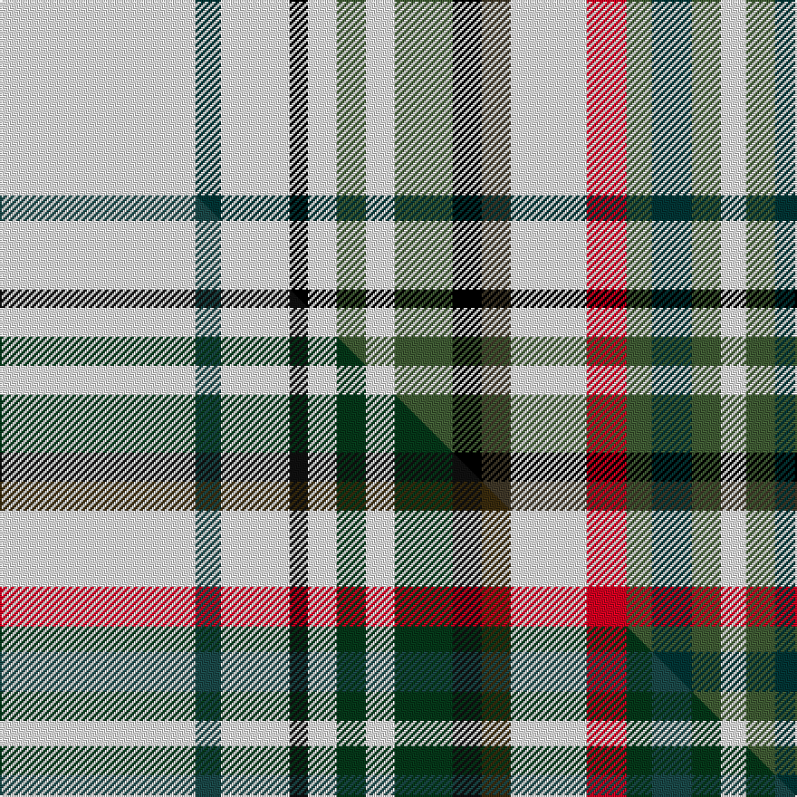

This page is one **sett** — a single exact thread-count. It belongs to the [tartan](/setts/w54dt7w19k5w8dgi8w8dgi16k8dg8w21r11dgi7dt11dgi8w7/)
(the same proportion at any scale), whose colour order is pattern [WBWKWGWGKGWRGBGW](/stripes/wbwkwgwgkgwrgbgw/).

Part of the [Beckett Beaumont](/tartans/beckett-beaumont/) tartan — the named design grouping this sett with its other cloths.

Sourced from house-of-tartan.  It is a [16 stripe tartan](/stripes/stripes16/).

Original link http://www.house-of-tartan.scotland.net/house/TartanViewjs.asp?colr=Def&tnam=7039

## Provenance

Earliest known date: 2006 This design is an experiment which uses the lines, colour and spacing of tartan to visually depict information. In this sense the original districts, distinguishable, for example, through the colours of the local flora and fauna, become elements in the key of a map. This process is informed through research in various techniques of analysis and concurrent visual languages. The tartan is to be displayed at the Beurofriedrich, Berlin as part of an art exhibition, as a series of banners, in the context of other visualizations of information. The Beckett Beaumont will also be available as neckties to the visiting public. This exhibition will be the official launch of the tartan. The first white stripe on the selvege is 54 threads. The repeat should cover two thirds of the 28 inch width of the cloth, approx. The repeat size is 20 inches at 40 tpi.

## Thread count
W/108 DT14 W38 K10 W16 DGi16 W16 DGi32 K16 DG16 W42 R22 DGi14 DT22 DGi16 W/14

One full sett is **702 threads**.

## Palette
<table><thead><tr><th>Colour</th><th>Shade</th><th>OKLCh</th></tr></thead><tbody><tr><td>DG</td><td><code style="background-color:#405C34;">#405C34</code> <small style="color:#888">#405C34</small></td><td><small style="color:#888">oklch(44.1% 0.071 136.8)</small></td></tr><tr><td>DT</td><td><code style="background-color:#023535;">#023535</code> <small style="color:#888">#023535</small></td><td><small style="color:#888">oklch(29.8% 0.050 194.8)</small></td></tr><tr><td>K</td><td><code style="background-color:#000000;">#000000</code> <small style="color:#888">#000000</small></td><td><small style="color:#888">oklch(0.0% 0.000 0.0)</small></td></tr><tr><td>W</td><td><code style="background-color:#F7F7F7;">#F7F7F7</code> <small style="color:#888">#F7F7F7</small></td><td><small style="color:#888">oklch(97.6% 0.000 89.9)</small></td></tr><tr><td>R</td><td><code style="background-color:#D60020;">#D60020</code> <small style="color:#888">#D60020</small></td><td><small style="color:#888">oklch(55.2% 0.224 25.5)</small></td></tr><tr><td>DG</td><td><code style="background-color:#403828;">#403828</code> <small style="color:#888">#403828</small></td><td><small style="color:#888">oklch(34.4% 0.029 84.4)</small></td></tr></tbody></table>

# Sample pattern

## Compared to the master

This cloth is one sett of its design; the master sett (the exemplar the design is anchored on) is below for comparison.

Its **ΔTartan distance** from the master is **0.10** — the same measure the nearest-tartans table ranks by (0 is identical; a re-scale of the same cloth is near 0, a recolour or a different proportion further).

<figure class="master-compare" style="margin:0">

this sett
master sett ★

<figcaption style="color:#888;font-size:smaller">One weave of this sett against the <a href="/setts/w54dt7w19k5w8dg8w8dg16k8dy8w21r11dg7dt11dg8w7/">master sett ★</a>, split on the diagonal: a shared proportion runs seamlessly across it with only the shades shifting; a different proportion breaks on it.</figcaption>
</figure>

ID: /variants/s16/w54dt7w19k5w8dgi8w8dgi16k8dg8w21r11dgi7dt11dgi8w7~x2~dgi1803133-dg1401060/
