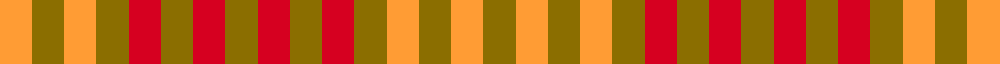

This page is one **sett** — a single exact thread-count. It belongs to the [tartan](/setts/y1lo1y1lo1y1r1y1r1y1r1y1r1y1lo1y1lo1/)
(the same proportion at any scale), whose colour order is pattern [GYGYGRGRGRGRGYGY](/stripes/gygygrgrgrgrgygy/).

Sourced from register-of-tartans.  It is a [16 stripe tartan](/stripes/stripes16/).

Original link https://www.tartanregister.gov.uk/tartanDetails.aspx?ref=726

## Register references

External register numbers recorded for this tartan.

- Scottish Register of Tartans: [726](https://www.tartanregister.gov.uk/tartanDetails.aspx?ref=726)
- Scottish Tartans Authority (ITI): 1888
- Scottish Tartans World Register: 1888

## Thread count
LO/6 Y6 LO6 Y6 R6 Y6 R6 Y6 R6 Y6 R6 Y6 LO6 Y6 LO6 Y/6

One full sett is **180 threads**.

## Palette
<table><thead><tr><th>Colour</th><th>Shade</th><th>OKLCh</th></tr></thead><tbody><tr><td>LO</td><td><code style="background-color:#FF9C34;">#FF9C34</code> <small style="color:#888">#FF9C34</small></td><td><small style="color:#888">oklch(77.9% 0.161 61.8)</small></td></tr><tr><td>R</td><td><code style="background-color:#D60020;">#D60020</code> <small style="color:#888">#D60020</small></td><td><small style="color:#888">oklch(55.2% 0.224 25.5)</small></td></tr><tr><td>Y</td><td><code style="background-color:#8B6E00;">#8B6E00</code> <small style="color:#888">#8B6E00</small></td><td><small style="color:#888">oklch(55.1% 0.113 90.4)</small></td></tr></tbody></table>

# Sample pattern

ID: /variants/s16/y1lo1y1lo1y1r1y1r1y1r1y1r1y1lo1y1lo1~x6/
