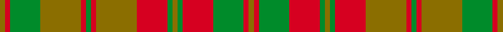

This page is one **sett** — a single exact thread-count. It belongs to the [tartan](/setts/y1r1g6y8r1g1r1y8r6g1y1g1r6g6r1y1/)
(the same proportion at any scale), whose colour order is pattern [GRGGRGRGRGGGRGRG](/stripes/grggrgrgrgggrgrg/).

Sourced from weddslist.  It is a [16 stripe tartan](/stripes/stripes16/).

Original link http://www.weddslist.com/cgi-bin/tartans/pg.pl?source=sts

## Provenance

Earliest known date: 1812 Ref: The Setts No. 244 The Strathearn tartan is said to have been worn by the father of Queen Victoria H.R.H. Edward, Duke of Kent, who was also Duke of Strathearn. As Colonel of the Royal Scots Regiment 1801-1821, he apparently sent a sample to Wilson's of Bannockburn with a view to 'dressing the gallant corps'. It it also the adopted tartan of the Comrie Pipe Band who regularly march past the Scottish Tartans Museum in village main street.

2 attestations — the source records this cloth was collapsed from (oldest owns this page)

<ul>
<li>undated — Strathearn (weddslist, <a href="http://www.weddslist.com/cgi-bin/tartans/pg.pl?source=sts">record</a>) </li>
<li>undated — Strathearn District Tartan (house-of-tartan, <a href="http://www.house-of-tartan.scotland.net/house/TartanViewjs.asp?colr=Def&tnam=1890">record</a>) </li>
</ul>

## Thread count
Y/2 R2 G12 Y16 R2 G2 R2 Y16 R12 G2 Y2 G2 R12 G12 R2 Y/2

One full sett is **196 threads**.

## Palette
<table><thead><tr><th>Colour</th><th>Shade</th><th>OKLCh</th></tr></thead><tbody><tr><td>G</td><td><code style="background-color:#008B2A;">#008B2A</code> <small style="color:#888">#008B2A</small></td><td><small style="color:#888">oklch(55.4% 0.170 145.9)</small></td></tr><tr><td>R</td><td><code style="background-color:#D60020;">#D60020</code> <small style="color:#888">#D60020</small></td><td><small style="color:#888">oklch(55.2% 0.224 25.5)</small></td></tr><tr><td>Y</td><td><code style="background-color:#8B6E00;">#8B6E00</code> <small style="color:#888">#8B6E00</small></td><td><small style="color:#888">oklch(55.1% 0.113 90.4)</small></td></tr></tbody></table>

# Sample pattern

## Nearest tartan variants

The nearest existing variants by ΔTartan distance, with this cloth at the top so the swatches line up against it.

ΔTartan

Threads

Variant

Sett

—

196

<a href="/variants/s16/y1r1g6y8r1g1r1y8r6g1y1g1r6g6r1y1~x2/">Strathearn</a>

<a href="/ttd/edit/#slug=r1g6r6g1y1g1r6y8r1g1r1y8g6r1y1r1g6y8r1g1r1y8r6g1y1g1r6g6r1y1~x2&amp;base=y1r1g6y8r1g1r1y8r6g1y1g1r6g6r1y1~x2" title="compare in the TTD">2.75</a>

388

<a href="/variants/s30/r1g6r6g1y1g1r6y8r1g1r1y8g6r1y1r1g6y8r1g1r1y8r6g1y1g1r6g6r1y1~x2/">Strathearn</a>

<a href="/ttd/edit/#slug=g8r1g1r1g1r6ri8r1ri8r6g7r1g1~x2~r1707016-ri2008029&amp;base=y1r1g6y8r1g1r1y8r6g1y1g1r6g6r1y1~x2" title="compare in the TTD">3.70</a>

182

<a href="/variants/s13/g8r1g1r1g1r6ri8r1ri8r6g7r1g1~x2~r1707016-ri2008029/">MacNab 3</a>

## Neighbour map

Every grey dot is one of 13620 variants placed by the first two principal components of the ΔTartan feature space (42% of its variance). Red is this tartan; blue dots are its nearest — click one to open its page.

<svg viewBox="0 0 640 380" role="img" style="max-width:100%;height:auto;border:1px solid #e0e0e0;border-radius:4px;display:block" xmlns="http://www.w3.org/2000/svg"><image href="/nn/cloud.v1.png" width="640" height="380"/><a href="/variants/s30/r1g6r6g1y1g1r6y8r1g1r1y8g6r1y1r1g6y8r1g1r1y8r6g1y1g1r6g6r1y1~x2/"><circle cx="292.6" cy="205.8" r="4" fill="#3465a4"><title>Strathearn</title></circle></a><a href="/variants/s13/g8r1g1r1g1r6ri8r1ri8r6g7r1g1~x2~r1707016-ri2008029/"><circle cx="265.6" cy="222.2" r="4" fill="#3465a4"><title>MacNab 3</title></circle></a><circle cx="316.0" cy="228.3" r="5" fill="#c00000"/><text x="320" y="376" text-anchor="middle" font-size="11" fill="#999">ground</text><text x="11" y="190" text-anchor="middle" font-size="11" fill="#999" transform="rotate(-90 11 190)">complexity</text></svg>

ID: /variants/s16/y1r1g6y8r1g1r1y8r6g1y1g1r6g6r1y1~x2/
