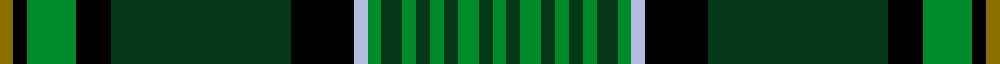

This is one **variant** — a specific cloth: this exact thread count and colourway, with its own
provenance below. It is one weaving of the [sett](/setts/y2k2g7k5dg26k9lb2g2dg3g2dg2g2dg2g3dg2g2/) (the scale-free proportion — the
same cloth at any scale or shade), whose colour order is pattern [GGGGGGGGGWKGKGKG](/stripes/gggggggggwkgkgkg/).

Part of the [Hanly](/tartans/h/ha/hanly/) tartan — the named design grouping this sett with its other cloths.

Sourced from register-of-tartans.  It is a [16 stripe tartan](/stripes/stripes16/).

Original link [https://www.tartanregister.gov.uk/tartanDetails.aspx?ref=10027](https://www.tartanregister.gov.uk/tartanDetails.aspx?ref=10027)

## Provenance

Earliest known date: 2009 About a year and a half ago Peter Hanly started looking into Hanly history and traditions and became quite interested in finding a tartan common to Hanlys. Hanly, from the Gaelic O'hAinle, has its roots in Ireland, and did not have a family tartan. Coming from Canada, and having no real connection to County Roscommon, Ireland (where the name Hanly originates) I decided to create a family tartan. The colours are based on the Hanly family coat of arms, a green shield with a silver boar passant between two silver arrows barways, the hooves, mane and arrowheads being of gold. Having had my grandfather, father and myself serve in the military (British Army, Canadian Army and Royal Canadian Airforce respectively), I have a strong connection to the military and thus tried to incorporate the thin green stripe design from the RCAF tartan.

3 attestations — the source records this cloth was collapsed from (oldest owns this page)

<ul>
<li>14/01/2009 — Hanly (register-of-tartans, <a href="https://www.tartanregister.gov.uk/tartanDetails.aspx?ref=10027">record</a>)  <em>Hanly, from the Gaelic O'hAinle, has its roots in Ireland, and as such there is no associated family tartan. Coming from Canada, and thus having no real connection to County Roscommon, Ireland (the area of Ireland where the name Hanly originates), the designer (Peter Hanly) decided to create a family tartan. The colours are based on the Hanly family coat of arms which is a green shield with a silver boar passant, between two silver arrows barways, the hooves, mane and arrowheads being of gold.</em></li>
<li>Jan. 2009 — Hanly (Personal) (tartans-authority, <a href="https://www.tartanregister.gov.uk/tartanDetails.aspx?ref=10027">record</a>)  <em>Designed by Peter Hanly of Kingston Ontario. The surname Hanly is from the Gaelic O'hAinle and has its roots in Ireland. Coming from Canada, and thus having no real connection to County Roscommon, Ireland (the area of Ireland where the name Hanly originates) Peter Hanly decided to create a family tartan with colours based on the Hanly family coat of arms which is a green shield with a silver boar passant, between two silver arrows barways, the hooves, mane and arrowheads being of gold. Three generations of the family served in the military (British Army, Canadian Army and Royal Canadian Airforce ) and the designer incorporated the thin green stripe from RCAF tartan.</em></li>
<li>2009 — Hanly Name Tartan (house-of-tartan, <a href="http://www.house-of-tartan.scotland.net/house/TartanViewjs.asp?colr=Def&tnam=9027">record</a>) </li>
</ul>

Dataset <small>— provenance for this record, inherited from the source manifest</small>

<dl class="dataset-prov">
<dt>source</dt><dd><a href="/sources/register-of-tartans/">Scottish Register of Tartans</a></dd>
<dt>data captured from</dt><dd><a href="https://github.com/thetartan/tartan-database/blob/master/data/register-of-tartans/data.csv">https://github.com/thetartan/tartan-database/blob/master/data/register-of-tartans/data.csv</a></dd>
<dt>data date</dt><dd>14/01/2009 <small>(this record)</small></dd>
<dt>licence</dt><dd><a href="https://www.tartanregister.gov.uk/copyright">Crown copyright</a></dd>
</dl>

Capture chain <small>— the hands this data passed through, oldest first; each capture carries its own licence</small>

<ol class="capture-chain">
<li><a href="https://www.tartanregister.gov.uk/">Scottish Register of Tartans</a> · <a href="https://www.tartanregister.gov.uk/copyright">Crown copyright</a> <small>the living register — still published by National Records of Scotland</small></li>
<li><a href="https://github.com/thetartan/tartan-database">thetartan/tartan-database</a> <small>2016-2017</small> · <a href="https://creativecommons.org/licenses/by-nc-nd/4.0/">CC BY-NC-ND 4.0</a> <small>Levko Kravets's frozen compilation — the capture we vendored, and where its CC licence text came from</small></li>
<li>this dictionary <small>captured 2026-06-10 · commit 5bf86c7566</small> <small>each re-capture is a git commit to data/sources</small></li>
</ol>

## Register references

External register numbers recorded for this tartan.

- Scottish Register of Tartans: [10027](https://www.tartanregister.gov.uk/tartanDetails?ref=10027)
- Scottish Tartans Authority (ITI): 10027

## Thread count
Y/4 K4 G14 K10 DG52 K18 LB4 G4 DG6 G4 DG4 G4 DG4 G6 DG4 G/4

One full sett is **284 threads**.

## Palette
<table><thead><tr><th>Colour</th><th>Shade</th><th>OKLCh</th></tr></thead><tbody><tr><td>DG</td><td><code style="background-color:#053819;">#053819</code> <small style="color:#888">#053819</small></td><td><small style="color:#888">oklch(30.0% 0.075 151.3)</small></td></tr><tr><td>G</td><td><code style="background-color:#008B2A;">#008B2A</code> <small style="color:#888">#008B2A</small></td><td><small style="color:#888">oklch(55.4% 0.170 145.9)</small></td></tr><tr><td>K</td><td><code style="background-color:#000000;">#000000</code> <small style="color:#888">#000000</small></td><td><small style="color:#888">oklch(0.0% 0.000 0.0)</small></td></tr><tr><td>LB</td><td><code style="background-color:#B5BBDE;">#B5BBDE</code> <small style="color:#888">#B5BBDE</small></td><td><small style="color:#888">oklch(79.9% 0.050 277.6)</small></td></tr><tr><td>Y</td><td><code style="background-color:#8B6E00;">#8B6E00</code> <small style="color:#888">#8B6E00</small></td><td><small style="color:#888">oklch(55.1% 0.113 90.4)</small></td></tr></tbody></table>

# Sample pattern

## Nearest tartan variants

The nearest existing variants by ΔTartan distance, with this cloth at the top so the swatches line up against it.

ΔTartan

Threads

Variant

Sett

—

284

<a href="/variants/s16/y2k2g7k5dg26k9lb2g2dg3g2dg2g2dg2g3dg2g2~x2/">Hanly</a>

<a href="/ttd/edit/#slug=dr1k2n2g1y1n17k1g14k1dr2n2k1n2k1n2k2g2k2dr1~x4&amp;base=y2k2g7k5dg26k9lb2g2dg3g2dg2g2dg2g3dg2g2~x2" title="compare in the TTD">2.61</a>

448

<a href="/variants/s19/dr1k2n2g1y1n17k1g14k1dr2n2k1n2k1n2k2g2k2dr1~x4/">Craig</a>

<a href="/ttd/edit/#slug=k10y1g2k1n2k1g2y1k1n2k3n1k17g18y1g2k1dg2~x2&amp;base=y2k2g7k5dg26k9lb2g2dg3g2dg2g2dg2g3dg2g2~x2" title="compare in the TTD">2.67</a>

248

<a href="/variants/s18/k10y1g2k1n2k1g2y1k1n2k3n1k17g18y1g2k1dg2~x2/">Raznotravie</a>

<a href="/ttd/edit/#slug=t11k3t3k3t4k15g36w3g36k15t4k3t3k3t11r4~x2&amp;base=y2k2g7k5dg26k9lb2g2dg3g2dg2g2dg2g3dg2g2~x2" title="compare in the TTD">2.68</a>

598

<a href="/variants/s16/t11k3t3k3t4k15g36w3g36k15t4k3t3k3t11r4~x2/">Semple</a>

<a href="/ttd/edit/#slug=g34r4g4r2g4r2g3r4g17k17r2db17r4db4y3~x2&amp;base=y2k2g7k5dg26k9lb2g2dg3g2dg2g2dg2g3dg2g2~x2" title="compare in the TTD">2.75</a>

410

<a href="/variants/s15/g34r4g4r2g4r2g3r4g17k17r2db17r4db4y3~x2/">Cochrane (1984) Clan Tartan</a>

<a href="/ttd/edit/#slug=db10g5db5g60db13g10dt67g5k5g5k5g13y10~db1106275-dt1204274&amp;base=y2k2g7k5dg26k9lb2g2dg3g2dg2g2dg2g3dg2g2~x2" title="compare in the TTD">2.80</a>

406

<a href="/variants/s13/db10g5db5g60db13g10dbi67g5k5g5k5g13y10~db1106275-dbi1204274/">Princess Beatrice Hunting</a>

<a href="/ttd/edit/#slug=g5db20g2db2g2db2g25dr2g2dr17k8g2w2~x2&amp;base=y2k2g7k5dg26k9lb2g2dg3g2dg2g2dg2g3dg2g2~x2" title="compare in the TTD">2.84</a>

350

<a href="/variants/s13/g5db20g2db2g2db2g25dr2g2dr17k8g2w2~x2/">Cameron Boyle, The (Personal)</a>

<a href="/ttd/edit/#slug=g34r4g3r2g4r2g3r4g17k17r2db17r4db4ly3~x2&amp;base=y2k2g7k5dg26k9lb2g2dg3g2dg2g2dg2g3dg2g2~x2" title="compare in the TTD">2.86</a>

406

<a href="/variants/s15/g34r4g3r2g4r2g3r4g17k17r2db17r4db4ly3~x2/">Cochrane</a>

<a href="/ttd/edit/#slug=db30lo2db2lo2db5g5k15db5g20dr2k3dr2g20db5k15g5db20lo2db2~x2~db1403246&amp;base=y2k2g7k5dg26k9lb2g2dg3g2dg2g2dg2g3dg2g2~x2" title="compare in the TTD">2.87</a>

584

<a href="/variants/s19/db30lo2db2lo2db5g5k15db5g20dr2k3dr2g20db5k15g5db20lo2db2~x2~db1403246/">Pennsylvania American District Tartan</a>

<a href="/ttd/edit/#slug=db15k18g3k2g2k2g44y4g44k2g2k2g3k18db15r4~x2&amp;base=y2k2g7k5dg26k9lb2g2dg3g2dg2g2dg2g3dg2g2~x2" title="compare in the TTD">2.91</a>

682

<a href="/variants/s16/db15k18g3k2g2k2g44y4g44k2g2k2g3k18db15r4~x2/">Sarafilovic</a>

<a href="/ttd/edit/#slug=dg6g3dg24k2dg4k16o5dg2w4dg2g21dg2k2y3~x2&amp;base=y2k2g7k5dg26k9lb2g2dg3g2dg2g2dg2g3dg2g2~x2" title="compare in the TTD">2.92</a>

366

<a href="/variants/s14/dg6g3dg24k2dg4k16o5dg2w4dg2g21dg2k2y3~x2/">Celtic F.C.</a>

## Neighbour map

Every grey dot is one of 13621 variants placed by the first two principal components of the ΔTartan feature space (42% of its variance). Red is this tartan; blue dots are its nearest — click one to open its page.

<svg viewBox="0 0 640 380" role="img" style="max-width:100%;height:auto;border:1px solid #e0e0e0;border-radius:4px;display:block" xmlns="http://www.w3.org/2000/svg"><image href="/nn/cloud.v1.png" width="640" height="380"/><a href="/variants/s19/dr1k2n2g1y1n17k1g14k1dr2n2k1n2k1n2k2g2k2dr1~x4/"><circle cx="219.2" cy="88.6" r="4" fill="#3465a4"><title>Craig</title></circle></a><a href="/variants/s18/k10y1g2k1n2k1g2y1k1n2k3n1k17g18y1g2k1dg2~x2/"><circle cx="224.6" cy="77.6" r="4" fill="#3465a4"><title>Raznotravie</title></circle></a><a href="/variants/s16/t11k3t3k3t4k15g36w3g36k15t4k3t3k3t11r4~x2/"><circle cx="175.7" cy="122.1" r="4" fill="#3465a4"><title>Semple</title></circle></a><a href="/variants/s15/g34r4g4r2g4r2g3r4g17k17r2db17r4db4y3~x2/"><circle cx="211.6" cy="107.3" r="4" fill="#3465a4"><title>Cochrane (1984) Clan Tartan</title></circle></a><a href="/variants/s13/db10g5db5g60db13g10dbi67g5k5g5k5g13y10~db1106275-dbi1204274/"><circle cx="226.2" cy="125.6" r="4" fill="#3465a4"><title>Princess Beatrice Hunting</title></circle></a><a href="/variants/s13/g5db20g2db2g2db2g25dr2g2dr17k8g2w2~x2/"><circle cx="180.5" cy="131.5" r="4" fill="#3465a4"><title>Cameron Boyle, The (Personal)</title></circle></a><a href="/variants/s15/g34r4g3r2g4r2g3r4g17k17r2db17r4db4ly3~x2/"><circle cx="206.9" cy="105.5" r="4" fill="#3465a4"><title>Cochrane</title></circle></a><a href="/variants/s19/db30lo2db2lo2db5g5k15db5g20dr2k3dr2g20db5k15g5db20lo2db2~x2~db1403246/"><circle cx="177.6" cy="118.9" r="4" fill="#3465a4"><title>Pennsylvania American District Tartan</title></circle></a><a href="/variants/s16/db15k18g3k2g2k2g44y4g44k2g2k2g3k18db15r4~x2/"><circle cx="244.1" cy="88.2" r="4" fill="#3465a4"><title>Sarafilovic</title></circle></a><a href="/variants/s14/dg6g3dg24k2dg4k16o5dg2w4dg2g21dg2k2y3~x2/"><circle cx="141.3" cy="115.8" r="4" fill="#3465a4"><title>Celtic F.C.</title></circle></a><circle cx="221.9" cy="112.0" r="5" fill="#c00000"/><text x="320" y="376" text-anchor="middle" font-size="11" fill="#999">ground</text><text x="11" y="190" text-anchor="middle" font-size="11" fill="#999" transform="rotate(-90 11 190)">complexity</text></svg>

ID: /variants/s16/y2k2g7k5dg26k9lb2g2dg3g2dg2g2dg2g3dg2g2~x2/
