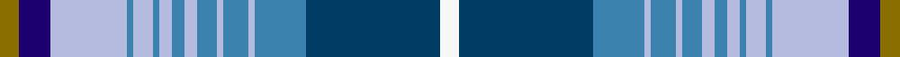

This is one **variant** — a specific cloth: this exact thread count and colourway, with its own
provenance below. It is one weaving of the [sett](/tartans/r/ry/ryder-cup-the/) (the scale-free proportion — the
same cloth at any scale or shade), whose colour order is pattern [GBWBWBWBWBWBWBBW](/stripes/gbwbwbwbwbwbwbbw/).

Part of the [Ryder Cup, The](/tartans/r/ry/ryder-cup-the/) tartan — the named design grouping this sett with its other cloths.

Sourced from register-of-tartans.  It is a [16 stripe tartan](/stripes/stripes16/).

Original link [https://www.tartanregister.gov.uk/tartanDetails.aspx?ref=10855](https://www.tartanregister.gov.uk/tartanDetails.aspx?ref=10855)

Dataset <small>— provenance for this record, inherited from the source manifest</small>

<dl class="dataset-prov">
<dt>source</dt><dd><a href="/sources/register-of-tartans/">Scottish Register of Tartans</a></dd>
<dt>data captured from</dt><dd><a href="https://github.com/thetartan/tartan-database/blob/master/data/register-of-tartans/data.csv">https://github.com/thetartan/tartan-database/blob/master/data/register-of-tartans/data.csv</a></dd>
<dt>data date</dt><dd>14/02/2013 <small>(this record)</small></dd>
<dt>licence</dt><dd><a href="https://www.tartanregister.gov.uk/copyright">Crown copyright</a></dd>
</dl>

Capture chain <small>— the hands this data passed through, oldest first; each capture carries its own licence</small>

<ol class="capture-chain">
<li><a href="https://www.tartanregister.gov.uk/">Scottish Register of Tartans</a> · <a href="https://www.tartanregister.gov.uk/copyright">Crown copyright</a> <small>the living register — still published by National Records of Scotland</small></li>
<li><a href="https://github.com/thetartan/tartan-database">thetartan/tartan-database</a> <small>2016-2017</small> · <a href="https://creativecommons.org/licenses/by-nc-nd/4.0/">CC BY-NC-ND 4.0</a> <small>Levko Kravets's frozen compilation — the capture we vendored, and where its CC licence text came from</small></li>
<li>this dictionary <small>captured 2026-06-10 · commit 5bf86c7566</small> <small>each re-capture is a git commit to data/sources</small></li>
</ol>

## Register references

External register numbers recorded for this tartan.

- Scottish Register of Tartans: [10855](https://www.tartanregister.gov.uk/tartanDetails.aspx?ref=10855)

## Thread count
Y/6 DB10 LB24 T2 LB6 T2 LB4 T4 LB4 T6 LB2 T8 LB2 T16 DBi42 W/6

One full sett is **276 threads**.

## Palette
<table><thead><tr><th>Colour</th><th>Shade</th><th>OKLCh</th></tr></thead><tbody><tr><td>T</td><td><code style="background-color:#3C82AF;">#3C82AF</code> <small style="color:#888">#3C82AF</small></td><td><small style="color:#888">oklch(58.1% 0.099 239.8)</small></td></tr><tr><td>DB</td><td><code style="background-color:#003C64;">#003C64</code> <small style="color:#888">#003C64</small></td><td><small style="color:#888">oklch(34.5% 0.089 246.0)</small></td></tr><tr><td>DB</td><td><code style="background-color:#1C0070;">#1C0070</code> <small style="color:#888">#1C0070</small></td><td><small style="color:#888">oklch(26.3% 0.162 277.1)</small></td></tr><tr><td>LB</td><td><code style="background-color:#B5BBDE;">#B5BBDE</code> <small style="color:#888">#B5BBDE</small></td><td><small style="color:#888">oklch(79.9% 0.050 277.6)</small></td></tr><tr><td>W</td><td><code style="background-color:#F7F7F7;">#F7F7F7</code> <small style="color:#888">#F7F7F7</small></td><td><small style="color:#888">oklch(97.6% 0.000 89.9)</small></td></tr><tr><td>Y</td><td><code style="background-color:#8B6E00;">#8B6E00</code> <small style="color:#888">#8B6E00</small></td><td><small style="color:#888">oklch(55.1% 0.113 90.4)</small></td></tr></tbody></table>

# Sample pattern

## Nearest tartan variants

The nearest existing variants by ΔTartan distance, with this cloth at the top so the swatches line up against it.

ΔTartan

Threads

Variant

Sett

—

276

<a href="/variants/s16/y3db5lb12t1lb3t1lb2t2lb2t3lb1t4lb1t8dbi21w3~x2~db1106275-t2304245-dbi1404245/">Ryder Cup, The</a>

<a href="/ttd/edit/#slug=w3dt21dbi8lb1dbi4lb1dbi3lb2dbi2lb2dbi1lb3dbi1lb12db5ly3~x2~dt1204274-dbi1406275-db1106275&amp;base=y3db5lb12t1lb3t1lb2t2lb2t3lb1t4lb1t8dbi21w3~x2~db1106275-t2304245-dbi1404245" title="compare in the TTD">0.16</a>

276

<a href="/variants/s16/w3dbi21dbii8lb1dbii4lb1dbii3lb2dbii2lb2dbii1lb3dbii1lb12db5ly3~x2~dbi1204274-dbii1406275-db1106275/">Ryder Cup 2014 (Corporate)</a>

<a href="/ttd/edit/#slug=db16n8dy1n1w1n1lb6g3n1g3w1~x4~db1003265-n2203265&amp;base=y3db5lb12t1lb3t1lb2t2lb2t3lb1t4lb1t8dbi21w3~x2~db1106275-t2304245-dbi1404245" title="compare in the TTD">3.09</a>

268

<a href="/variants/s11/db16n8dy1n1w1n1lb6g3n1g3w1~x4~db1003265-n2203265/">Brighton &amp; Hove</a>

<a href="/ttd/edit/#slug=db40lb3db3lb3db3lb4dg8g8n8w2~x2&amp;base=y3db5lb12t1lb3t1lb2t2lb2t3lb1t4lb1t8dbi21w3~x2~db1106275-t2304245-dbi1404245" title="compare in the TTD">3.12</a>

244

<a href="/variants/s10/db40lb3db3lb3db3lb4dg8g8n8w2~x2/">Greenshields (Personal)</a>

<a href="/ttd/edit/#slug=ly3g4n14dp3n2dp18lb16g14n2dp3lb3n2lr1~x2&amp;base=y3db5lb12t1lb3t1lb2t2lb2t3lb1t4lb1t8dbi21w3~x2~db1106275-t2304245-dbi1404245" title="compare in the TTD">3.32</a>

332

<a href="/variants/s13/ly3g4n14dp3n2dp18lb16g14n2dp3lb3n2lr1~x2/">Enable (Corporate)</a>

<a href="/ttd/edit/#slug=db4w2db2w1lb5b5g5w1g20w1db4lb4o3w1o3lb4db4w1b30db2lb2w1lb2db2~x2&amp;base=y3db5lb12t1lb3t1lb2t2lb2t3lb1t4lb1t8dbi21w3~x2~db1106275-t2304245-dbi1404245" title="compare in the TTD">3.37</a>

424

<a href="/variants/s24/db4w2db2w1lb5b5g5w1g20w1db4lb4o3w1o3lb4db4w1b30db2lb2w1lb2db2~x2/">Stewart, Silk</a>

<a href="/ttd/edit/#slug=db1lb12b6w1dy3db14t18w1~x2&amp;base=y3db5lb12t1lb3t1lb2t2lb2t3lb1t4lb1t8dbi21w3~x2~db1106275-t2304245-dbi1404245" title="compare in the TTD">3.51</a>

220

<a href="/variants/s8/db1lb12b6w1dy3db14t18w1~x2/">Ancient Gathering</a>

<a href="/ttd/edit/#slug=dy1lb3dp14w2db22w2g14dy3lb1~x2~db1406275&amp;base=y3db5lb12t1lb3t1lb2t2lb2t3lb1t4lb1t8dbi21w3~x2~db1106275-t2304245-dbi1404245" title="compare in the TTD">3.62</a>

244

<a href="/variants/s9/dy1lb3dp14w2db22w2g14dy3lb1~x2~db1406275/">Yule Name Tartan</a>

<a href="/ttd/edit/#slug=db40lb3db3lb3db3lb4dg8g8n8w2~x2~db1404245&amp;base=y3db5lb12t1lb3t1lb2t2lb2t3lb1t4lb1t8dbi21w3~x2~db1106275-t2304245-dbi1404245" title="compare in the TTD">3.64</a>

244

<a href="/variants/s10/db40lb3db3lb3db3lb4dg8g8n8w2~x2~db1404245/">Greenshields Family Tartan</a>

<a href="/ttd/edit/#slug=lp66db2lo14db2ly5b8db12dg60g60lp2db25~dg1806142-g2304202&amp;base=y3db5lb12t1lb3t1lb2t2lb2t3lb1t4lb1t8dbi21w3~x2~db1106275-t2304245-dbi1404245" title="compare in the TTD">3.72</a>

421

<a href="/variants/s11/lp66db2lo14db2ly5b8db12dg60g60lp2db25~dg1806142-g2304202/">Dundee Carers' Centre</a>

<a href="/ttd/edit/#slug=dy1lb3dp14w2db22w2g14dy3lb1~x2&amp;base=y3db5lb12t1lb3t1lb2t2lb2t3lb1t4lb1t8dbi21w3~x2~db1106275-t2304245-dbi1404245" title="compare in the TTD">3.73</a>

244

<a href="/variants/s9/dy1lb3dp14w2db22w2g14dy3lb1~x2/">Yule (Name)</a>

## Neighbour map

Every grey dot is one of 13656 variants placed by the first two principal components of the ΔTartan feature space (42% of its variance). Red is this tartan; blue dots are its nearest — click one to open its page. The map is a flat projection of a many-dimensional space — [how to read it](/posts/neighbourhood-maps/).

<svg viewBox="0 0 640 380" role="img" style="max-width:100%;height:auto;border:1px solid #e0e0e0;border-radius:4px;display:block" xmlns="http://www.w3.org/2000/svg"><image href="/nn/cloud.v1.png" width="640" height="380"/><a href="/variants/s16/w3dbi21dbii8lb1dbii4lb1dbii3lb2dbii2lb2dbii1lb3dbii1lb12db5ly3~x2~dbi1204274-dbii1406275-db1106275/"><circle cx="184.7" cy="131.0" r="4" fill="#3465a4"><title>Ryder Cup 2014 (Corporate)</title></circle></a><a href="/variants/s11/db16n8dy1n1w1n1lb6g3n1g3w1~x4~db1003265-n2203265/"><circle cx="199.2" cy="141.0" r="4" fill="#3465a4"><title>Brighton &amp; Hove</title></circle></a><a href="/variants/s10/db40lb3db3lb3db3lb4dg8g8n8w2~x2/"><circle cx="217.3" cy="110.7" r="4" fill="#3465a4"><title>Greenshields (Personal)</title></circle></a><a href="/variants/s13/ly3g4n14dp3n2dp18lb16g14n2dp3lb3n2lr1~x2/"><circle cx="162.7" cy="152.1" r="4" fill="#3465a4"><title>Enable (Corporate)</title></circle></a><a href="/variants/s24/db4w2db2w1lb5b5g5w1g20w1db4lb4o3w1o3lb4db4w1b30db2lb2w1lb2db2~x2/"><circle cx="175.7" cy="72.4" r="4" fill="#3465a4"><title>Stewart, Silk</title></circle></a><a href="/variants/s8/db1lb12b6w1dy3db14t18w1~x2/"><circle cx="188.9" cy="177.8" r="4" fill="#3465a4"><title>Ancient Gathering</title></circle></a><a href="/variants/s9/dy1lb3dp14w2db22w2g14dy3lb1~x2~db1406275/"><circle cx="199.4" cy="143.8" r="4" fill="#3465a4"><title>Yule Name Tartan</title></circle></a><a href="/variants/s10/db40lb3db3lb3db3lb4dg8g8n8w2~x2~db1404245/"><circle cx="236.6" cy="119.0" r="4" fill="#3465a4"><title>Greenshields Family Tartan</title></circle></a><a href="/variants/s11/lp66db2lo14db2ly5b8db12dg60g60lp2db25~dg1806142-g2304202/"><circle cx="158.1" cy="114.9" r="4" fill="#3465a4"><title>Dundee Carers' Centre</title></circle></a><a href="/variants/s9/dy1lb3dp14w2db22w2g14dy3lb1~x2/"><circle cx="191.9" cy="142.2" r="4" fill="#3465a4"><title>Yule (Name)</title></circle></a><circle cx="183.2" cy="128.1" r="5" fill="#c00000"/><text x="320" y="376" text-anchor="middle" font-size="11" fill="#999">ground</text><text x="11" y="190" text-anchor="middle" font-size="11" fill="#999" transform="rotate(-90 11 190)">complexity</text></svg>

ID: /variants/s16/y3db5lb12t1lb3t1lb2t2lb2t3lb1t4lb1t8dbi21w3~x2~db1106275-t2304245-dbi1404245/
