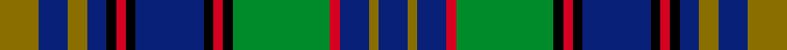

This page is one **sett** — a single exact thread-count. It belongs to the [tartan](/setts/y4db3y2db2k1r1k1db7k1r1k1g10r1db3y1db3/)
(the same proportion at any scale), whose colour order is pattern [BGBRGKRKBKRKBGBG](/stripes/bgbrgkrkbkrkbgbg/).

Sourced from register-of-tartans.  It is a [16 stripe tartan](/stripes/stripes16/).

Original link https://www.tartanregister.gov.uk/tartanDetails.aspx?ref=4074

2 attestations — the source records this cloth was collapsed from (oldest owns this page)

<ul>
<li>01/01/2007 — Tartan de Longueuil (register-of-tartans, <a href="https://www.tartanregister.gov.uk/tartanDetails.aspx?ref=4074">record</a>)  <em>Designed by Marie-France Bolduc Quirion and Marthe Roy of the Cercle de Fermieres de Longueuil in Quebec to commemorate the 350th anniversary of the City. The colours were inspired by the city's coat of arms and those of the merged municipalities of Greenfeld Park and Saint-Gubert that are now part of Longueuil. Blue symobolises the tranquility of life in Longueuil and the proximity of the River Lawrence. Yellow is for the richness of the region's farmlands. Green symbolises the municipality's future and its determination to be recongnised for its international 'scope.' Black is for the wealth of our history. Woven by the designers on a 36-inch Leclerc Fanny loom</em></li>
<li>pre 2007 — Tartan de Longueuil (District) (tartans-authority, <a href="http://www.tartansauthority.com/tartan-ferret/display/7171/">record</a>)  <em>Designed by Marie-France Bolduc Quirion and Marthe Roy of the Cercle de Fermi?res de Longueuil in Qu?bec to commemorate the 350th anniversary of the town. The colours were inspired by the town's coat of arms and those of the merged municipalities of Greenfeld Park and Saint-Gubert that are now part of Longueuil. Blue symobolises the tranquility of life in Longueuil and the proximity of the River Lawrence. Yellow is for the richness of the region's farmlands. Green symbolises the municipality's future and its determination to be recongnised for its international 'scope.' Black is for the wealth of our history. Red symbolises the dynamism of the town. Woven by the designers on a 36-inch Leclerc Fanny loom</em></li>
</ul>

## Register references

External register numbers recorded for this tartan.

- Scottish Register of Tartans: [4074](https://www.tartanregister.gov.uk/tartanDetails.aspx?ref=4074)
- Scottish Tartans Authority (ITI): 7171

## Thread count
Y/8 DB6 Y4 DB4 K2 R2 K2 DB14 K2 R2 K2 G20 R2 DB6 Y2 DB/6

One full sett is **154 threads**.

## Palette
<table><thead><tr><th>Colour</th><th>Shade</th><th>OKLCh</th></tr></thead><tbody><tr><td>DB</td><td><code style="background-color:#082077;">#082077</code> <small style="color:#888">#082077</small></td><td><small style="color:#888">oklch(30.0% 0.149 265.1)</small></td></tr><tr><td>G</td><td><code style="background-color:#008B2A;">#008B2A</code> <small style="color:#888">#008B2A</small></td><td><small style="color:#888">oklch(55.4% 0.170 145.9)</small></td></tr><tr><td>K</td><td><code style="background-color:#000000;">#000000</code> <small style="color:#888">#000000</small></td><td><small style="color:#888">oklch(0.0% 0.000 0.0)</small></td></tr><tr><td>R</td><td><code style="background-color:#D60020;">#D60020</code> <small style="color:#888">#D60020</small></td><td><small style="color:#888">oklch(55.2% 0.224 25.5)</small></td></tr><tr><td>Y</td><td><code style="background-color:#8B6E00;">#8B6E00</code> <small style="color:#888">#8B6E00</small></td><td><small style="color:#888">oklch(55.1% 0.113 90.4)</small></td></tr></tbody></table>

# Sample pattern

ID: /variants/s16/y4db3y2db2k1r1k1db7k1r1k1g10r1db3y1db3~x2/
