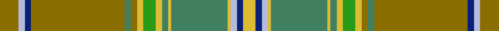

This page is one **sett** — a single exact thread-count. It belongs to the [tartan](/setts/y6lb2db2y30g2y2ly2gi4ly2g2ly1g18ly1lb2db2ly4/)
(the same proportion at any scale), whose colour order is pattern [GWBGGGYGYGYGYWBY](/stripes/gwbgggygygygywby/).

Sourced from tartans-authority.  It is a [16 stripe tartan](/stripes/stripes16/).

Original link http://www.tartansauthority.com/tartan-ferret/display/4066/

## Register references

External register numbers recorded for this tartan.

- Scottish Tartans Authority (ITI): 4066

## Thread count
Y/12 LB4 DB4 Y60 G4 Y4 LY4 Gi8 LY4 G4 LY2 G36 LY2 LB4 DB4 LY/8

One full sett is **308 threads**.

## Palette
<table><thead><tr><th>Colour</th><th>Shade</th><th>OKLCh</th></tr></thead><tbody><tr><td>Y</td><td><code style="background-color:#8B6E00;">#8B6E00</code> <small style="color:#888">#8B6E00</small></td><td><small style="color:#888">oklch(55.1% 0.113 90.4)</small></td></tr><tr><td>DB</td><td><code style="background-color:#082077;">#082077</code> <small style="color:#888">#082077</small></td><td><small style="color:#888">oklch(30.0% 0.149 265.1)</small></td></tr><tr><td>LY</td><td><code style="background-color:#DCBC32;">#DCBC32</code> <small style="color:#888">#DCBC32</small></td><td><small style="color:#888">oklch(80.0% 0.150 95.2)</small></td></tr><tr><td>G</td><td><code style="background-color:#408060;">#408060</code> <small style="color:#888">#408060</small></td><td><small style="color:#888">oklch(54.8% 0.084 160.1)</small></td></tr><tr><td>G</td><td><code style="background-color:#289C18;">#289C18</code> <small style="color:#888">#289C18</small></td><td><small style="color:#888">oklch(60.6% 0.191 141.6)</small></td></tr><tr><td>LB</td><td><code style="background-color:#B5BBDE;">#B5BBDE</code> <small style="color:#888">#B5BBDE</small></td><td><small style="color:#888">oklch(79.9% 0.050 277.6)</small></td></tr></tbody></table>

# Sample pattern

## Nearest tartan variants

The nearest existing variants by ΔTartan distance, with this cloth at the top so the swatches line up against it.

ΔTartan

Threads

Variant

Sett

—

308

<a href="/variants/s16/y6lb2db2y30g2y2ly2gi4ly2g2ly1g18ly1lb2db2ly4~x2~g2203152-gi2408144/">All Ireland Blue (Fashion)</a>

<a href="/ttd/edit/#slug=t5w1o9t5r4t5g20y1g1y1~x4&amp;base=y6lb2db2y30g2y2ly2gi4ly2g2ly1g18ly1lb2db2ly4~x2~g2203152-gi2408144" title="compare in the TTD">3.57</a>

392

<a href="/variants/s10/t5w1o9t5r4t5g20y1g1y1~x4/">Hobkirk</a>

<a href="/ttd/edit/#slug=n6lb2db2n30g2n2ly2gi4ly2g2ly1g18ly1lb2db2ly4~x2~lb3203246-db1406275-g2203152-gi2408144&amp;base=y6lb2db2y30g2y2ly2gi4ly2g2ly1g18ly1lb2db2ly4~x2~g2203152-gi2408144" title="compare in the TTD">3.69</a>

308

<a href="/variants/s16/n6lb2db2n30g2n2ly2gi4ly2g2ly1g18ly1lb2db2ly4~x2~lb3203246-db1406275-g2203152-gi2408144/">All Irish Blue Irish District Tartan</a>

<a href="/ttd/edit/#slug=do5ly1g27o9dr6do5ly1o23do3o5~x2~ly2705081-o2503076&amp;base=y6lb2db2y30g2y2ly2gi4ly2g2ly1g18ly1lb2db2ly4~x2~g2203152-gi2408144" title="compare in the TTD">3.70</a>

320

<a href="/variants/s10/do5lyi1g27ly9dr6do5lyi1ly23do3ly5~x2~lyi2705081-ly2503076/">Satisfashion Argyll</a>

<a href="/ttd/edit/#slug=y15r3y3r1y35g5w2db2g35r1g3r3g15y5w2db2~x2&amp;base=y6lb2db2y30g2y2ly2gi4ly2g2ly1g18ly1lb2db2ly4~x2~g2203152-gi2408144" title="compare in the TTD">3.88</a>

494

<a href="/variants/s16/y15r3y3r1y35g5w2db2g35r1g3r3g15y5w2db2~x2/">Keilar (2013)</a>

## Neighbour map

Every grey dot is one of 13620 variants placed by the first two principal components of the ΔTartan feature space (42% of its variance). Red is this tartan; blue dots are its nearest — click one to open its page.

<svg viewBox="0 0 640 380" role="img" style="max-width:100%;height:auto;border:1px solid #e0e0e0;border-radius:4px;display:block" xmlns="http://www.w3.org/2000/svg"><image href="/nn/cloud.v1.png" width="640" height="380"/><a href="/variants/s10/t5w1o9t5r4t5g20y1g1y1~x4/"><circle cx="290.7" cy="144.9" r="4" fill="#3465a4"><title>Hobkirk</title></circle></a><a href="/variants/s16/n6lb2db2n30g2n2ly2gi4ly2g2ly1g18ly1lb2db2ly4~x2~lb3203246-db1406275-g2203152-gi2408144/"><circle cx="358.1" cy="100.3" r="4" fill="#3465a4"><title>All Irish Blue Irish District Tartan</title></circle></a><a href="/variants/s10/do5lyi1g27ly9dr6do5lyi1ly23do3ly5~x2~lyi2705081-ly2503076/"><circle cx="332.0" cy="157.1" r="4" fill="#3465a4"><title>Satisfashion Argyll</title></circle></a><a href="/variants/s16/y15r3y3r1y35g5w2db2g35r1g3r3g15y5w2db2~x2/"><circle cx="386.3" cy="126.9" r="4" fill="#3465a4"><title>Keilar (2013)</title></circle></a><circle cx="364.9" cy="121.3" r="5" fill="#c00000"/><text x="320" y="376" text-anchor="middle" font-size="11" fill="#999">ground</text><text x="11" y="190" text-anchor="middle" font-size="11" fill="#999" transform="rotate(-90 11 190)">complexity</text></svg>

ID: /variants/s16/y6lb2db2y30g2y2ly2gi4ly2g2ly1g18ly1lb2db2ly4~x2~g2203152-gi2408144/
