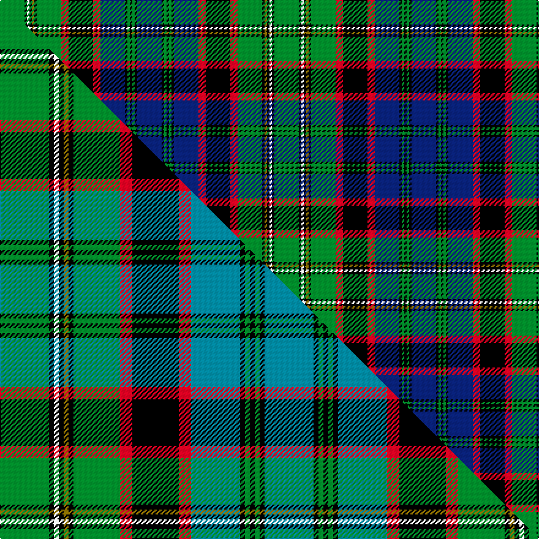

This page is one **sett** — a single exact thread-count. It belongs to the [tartan](/setts/db10k1g1k1g1k1db10r3k10r3g10k1y1k1w1k1g10/)
(the same proportion at any scale), whose colour order is pattern [BKGKGKBRKRGKGKWKG](/stripes/bkgkgkbrkrgkgkwkg/).

Part of the [MacNicol Hunting](/tartans/macnicol-hunting/) tartan — the named design grouping this sett with its other cloths.

Sourced from weddslist.  It is a [17 stripe tartan](/stripes/stripes17/).

Original link http://www.weddslist.com/cgi-bin/tartans/pg.pl?source=sts

## Provenance

Earliest known date: Aberdeen From a kilt in the possession of the Aberdeen kiltmakers, Alex Scott and Company.

5 attestations — the source records this cloth was collapsed from (oldest owns this page)

<ul>
<li>undated — Cunningham, hunting (weddslist, <a href="http://www.weddslist.com/cgi-bin/tartans/pg.pl?source=sts">record</a>) </li>
<li>undated — Nicolson, MacNicol (weddslist, <a href="http://www.weddslist.com/cgi-bin/tartans/pg.pl?source=sts">record</a>) </li>
<li>undated — MacNicol Hunting (weddslist, <a href="http://www.weddslist.com/cgi-bin/tartans/pg.pl?source=tinsel">record</a>) </li>
<li>undated — MacNicol Hunting (weddslist, <a href="http://www.weddslist.com/cgi-bin/tartans/pg.pl?source=x">record</a>) </li>
<li>undated — Nicolson Hunting Clan Tartan (house-of-tartan, <a href="http://www.house-of-tartan.scotland.net/house/TartanViewjs.asp?colr=Def&tnam=322">record</a>) </li>
</ul>

## Thread count
G/20 K2 W2 K2 Y2 K2 G20 R6 K20 R6 DB20 K2 G2 K2 G2 K2 DB/20

One full sett is **224 threads**.

## Palette
<table><thead><tr><th>Colour</th><th>Shade</th><th>OKLCh</th></tr></thead><tbody><tr><td>DB</td><td><code style="background-color:#082077;">#082077</code> <small style="color:#888">#082077</small></td><td><small style="color:#888">oklch(30.0% 0.149 265.1)</small></td></tr><tr><td>G</td><td><code style="background-color:#008B2A;">#008B2A</code> <small style="color:#888">#008B2A</small></td><td><small style="color:#888">oklch(55.4% 0.170 145.9)</small></td></tr><tr><td>K</td><td><code style="background-color:#000000;">#000000</code> <small style="color:#888">#000000</small></td><td><small style="color:#888">oklch(0.0% 0.000 0.0)</small></td></tr><tr><td>W</td><td><code style="background-color:#F7F7F7;">#F7F7F7</code> <small style="color:#888">#F7F7F7</small></td><td><small style="color:#888">oklch(97.6% 0.000 89.9)</small></td></tr><tr><td>R</td><td><code style="background-color:#D60020;">#D60020</code> <small style="color:#888">#D60020</small></td><td><small style="color:#888">oklch(55.2% 0.224 25.5)</small></td></tr><tr><td>Y</td><td><code style="background-color:#8B6E00;">#8B6E00</code> <small style="color:#888">#8B6E00</small></td><td><small style="color:#888">oklch(55.1% 0.113 90.4)</small></td></tr></tbody></table>

# Sample pattern

## Compared to the master

This cloth is one sett of its design; the master sett (the exemplar the design is anchored on) is below for comparison.

Its **ΔTartan distance** from the master is **0.95** — the same measure the nearest-tartans table ranks by (0 is identical; a re-scale of the same cloth is near 0, a recolour or a different proportion further).

<figure class="master-compare" style="margin:0">

this sett
master sett ★

<figcaption style="color:#888;font-size:smaller">One weave of this sett against the <a href="/setts/g20k2w2k2y2k2g19r5k19r5t20k2g2k2g2k2t20/">master sett ★</a>, split on the diagonal: a shared proportion runs seamlessly across it with only the shades shifting; a different proportion breaks on it.</figcaption>
</figure>

## Nearest tartan variants

The nearest existing variants by ΔTartan distance, with this cloth at the top so the swatches line up against it.

ΔTartan

Threads

Variant

Sett

—

224

<a href="/variants/s17/db10k1g1k1g1k1db10r3k10r3g10k1y1k1w1k1g10~x2/">Cunningham, hunting</a>

<a href="/ttd/edit/#slug=db10k1g1k1g1k1db10r3k10r3g10k1y1k1w1k1g10&amp;base=db10k1g1k1g1k1db10r3k10r3g10k1y1k1w1k1g10~x2" title="compare in the TTD">0.00</a>

112

<a href="/variants/s17/db10k1g1k1g1k1db10r3k10r3g10k1y1k1w1k1g10/">MacNicol Hunting</a>

<a href="/ttd/edit/#slug=g20k2w2k2y2k2g19r5k19r5t20k2g2k2g2k2t20~x2&amp;base=db10k1g1k1g1k1db10r3k10r3g10k1y1k1w1k1g10~x2" title="compare in the TTD">0.06</a>

432

<a href="/variants/s17/g20k2w2k2y2k2g19r5k19r5t20k2g2k2g2k2t20~x2/">MacNicol Htg (Clan)</a>

<a href="/ttd/edit/#slug=db12k1g1k1g1k1db9dr2k18dr2g9k1lo1k1lb1k1g12~x2&amp;base=db10k1g1k1g1k1db10r3k10r3g10k1y1k1w1k1g10~x2" title="compare in the TTD">0.86</a>

248

<a href="/variants/s17/db12k1g1k1g1k1db9dr2k18dr2g9k1lo1k1lb1k1g12~x2/">Nicolson Green Hunting</a>

<a href="/ttd/edit/#slug=db12k2g2k2g2k2db13dr6k10dr6g13k2lo2k2lb2k2g12~x2&amp;base=db10k1g1k1g1k1db10r3k10r3g10k1y1k1w1k1g10~x2" title="compare in the TTD">1.01</a>

320

<a href="/variants/s17/db12k2g2k2g2k2db13dr6k10dr6g13k2lo2k2lb2k2g12~x2/">Cunningham Hunting</a>

## Neighbour map

Every grey dot is one of 13620 variants placed by the first two principal components of the ΔTartan feature space (42% of its variance). Red is this tartan; blue dots are its nearest — click one to open its page.

<svg viewBox="0 0 640 380" role="img" style="max-width:100%;height:auto;border:1px solid #e0e0e0;border-radius:4px;display:block" xmlns="http://www.w3.org/2000/svg"><image href="/nn/cloud.v1.png" width="640" height="380"/><a href="/variants/s17/db10k1g1k1g1k1db10r3k10r3g10k1y1k1w1k1g10/"><circle cx="89.6" cy="112.7" r="4" fill="#3465a4"><title>MacNicol Hunting</title></circle></a><a href="/variants/s17/g20k2w2k2y2k2g19r5k19r5t20k2g2k2g2k2t20~x2/"><circle cx="91.2" cy="115.2" r="4" fill="#3465a4"><title>MacNicol Htg (Clan)</title></circle></a><a href="/variants/s17/db12k1g1k1g1k1db9dr2k18dr2g9k1lo1k1lb1k1g12~x2/"><circle cx="124.4" cy="82.9" r="4" fill="#3465a4"><title>Nicolson Green Hunting</title></circle></a><a href="/variants/s17/db12k2g2k2g2k2db13dr6k10dr6g13k2lo2k2lb2k2g12~x2/"><circle cx="59.3" cy="148.5" r="4" fill="#3465a4"><title>Cunningham Hunting</title></circle></a><circle cx="89.6" cy="112.7" r="5" fill="#c00000"/><text x="320" y="376" text-anchor="middle" font-size="11" fill="#999">ground</text><text x="11" y="190" text-anchor="middle" font-size="11" fill="#999" transform="rotate(-90 11 190)">complexity</text></svg>

ID: /variants/s17/db10k1g1k1g1k1db10r3k10r3g10k1y1k1w1k1g10~x2/
