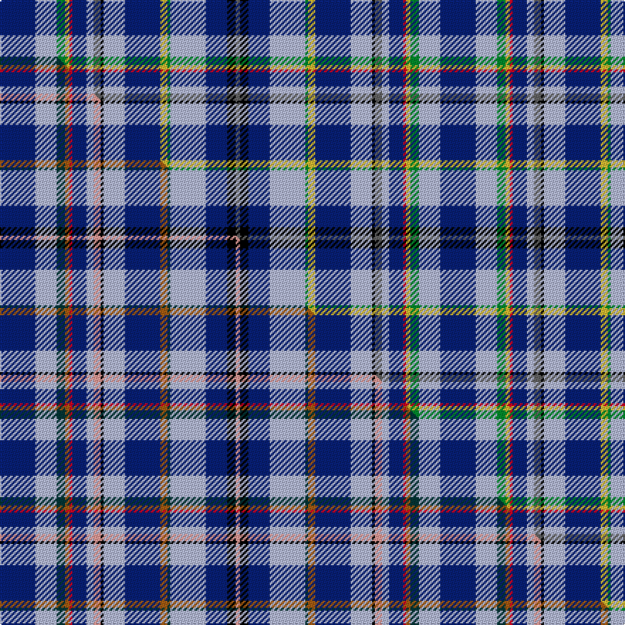

This page is one **sett** — a single exact thread-count. It belongs to the [tartan](/setts/db25lb15g6ly3r2db10lb5n5k2lb15db25ly5g2lb25db15k6n3/)
(the same proportion at any scale), whose colour order is pattern [BKBWGYBWKBWBRYGWB](/stripes/bkbwgybwkbwbrygwb/).

Part of the [Kennewell](/tartans/kennewell/) tartan — the named design grouping this sett with its other cloths.

Sourced from tartans-authority.  It is a [17 stripe tartan](/stripes/stripes17/).

Original link [https://www.tartanregister.gov.uk/tartanDetails.aspx?ref=10039](https://www.tartanregister.gov.uk/tartanDetails.aspx?ref=10039)

Dataset <small>— provenance for this record, inherited from the source manifest</small>

<dl class="dataset-prov">
<dt>source</dt><dd><a href="/sources/tartans-authority/">Scottish Tartans Authority</a></dd>
<dt>data captured from</dt><dd><a href="https://github.com/thetartan/tartan-database/blob/master/data/tartans-authority/data.csv">https://github.com/thetartan/tartan-database/blob/master/data/tartans-authority/data.csv</a></dd>
<dt>data date</dt><dd>Nov. 2008 <small>(this record)</small></dd>
<dt>licence</dt><dd><a href="https://creativecommons.org/licenses/by-nc-nd/4.0/">CC BY-NC-ND 4.0</a></dd>
</dl>

Capture chain <small>— the hands this data passed through, oldest first; each capture carries its own licence</small>

<ol class="capture-chain">
<li><a href="https://www.tartansauthority.com/">Scottish Tartans Authority</a> <small>the heritage body's archive — its tartan-ferret record browser is retired (links repaired to the SRT, above)</small></li>
<li><a href="https://github.com/thetartan/tartan-database">thetartan/tartan-database</a> <small>2016-2017</small> · <a href="https://creativecommons.org/licenses/by-nc-nd/4.0/">CC BY-NC-ND 4.0</a> <small>Levko Kravets's frozen compilation — the capture we vendored, and where its CC licence text came from</small></li>
<li>this dictionary <small>captured 2026-06-10 · commit 5bf86c7566</small> <small>each re-capture is a git commit to data/sources</small></li>
</ol>

## Register references

External register numbers recorded for this tartan.

- Scottish Tartans Authority (ITI): 10039

## Thread count
DB/25 LB15 G6 LY3 R2 DB10 LB5 N5 K2 LB15 DB25 LY5 G2 LB25 DB15 K6 N/3

One full sett is **310 threads**.

## Palette
<table><thead><tr><th>Colour</th><th>Shade</th><th>OKLCh</th></tr></thead><tbody><tr><td>LB</td><td><code style="background-color:#B5BBDE;">#B5BBDE</code> <small style="color:#888">#B5BBDE</small></td><td><small style="color:#888">oklch(79.9% 0.050 277.6)</small></td></tr><tr><td>DB</td><td><code style="background-color:#082077;">#082077</code> <small style="color:#888">#082077</small></td><td><small style="color:#888">oklch(30.0% 0.149 265.1)</small></td></tr><tr><td>LY</td><td><code style="background-color:#DCBC32;">#DCBC32</code> <small style="color:#888">#DCBC32</small></td><td><small style="color:#888">oklch(80.0% 0.150 95.2)</small></td></tr><tr><td>G</td><td><code style="background-color:#008B2A;">#008B2A</code> <small style="color:#888">#008B2A</small></td><td><small style="color:#888">oklch(55.4% 0.170 145.9)</small></td></tr><tr><td>K</td><td><code style="background-color:#000000;">#000000</code> <small style="color:#888">#000000</small></td><td><small style="color:#888">oklch(0.0% 0.000 0.0)</small></td></tr><tr><td>N</td><td><code style="background-color:#636363;">#636363</code> <small style="color:#888">#636363</small></td><td><small style="color:#888">oklch(50.0% 0.000 89.9)</small></td></tr><tr><td>R</td><td><code style="background-color:#D60020;">#D60020</code> <small style="color:#888">#D60020</small></td><td><small style="color:#888">oklch(55.2% 0.224 25.5)</small></td></tr></tbody></table>

# Sample pattern

## Compared to the master

This cloth is one sett of its design; the master sett (the exemplar the design is anchored on) is below for comparison.

Its **ΔTartan distance** from the master is **1.20** — the same measure the nearest-tartans table ranks by (0 is identical; a re-scale of the same cloth is near 0, a recolour or a different proportion further).

<figure class="master-compare" style="margin:0">

this sett
master sett ★

<figcaption style="color:#888;font-size:smaller">One weave of this sett against the <a href="/setts/db25lb15dt6o3r2db10lb5lr5k2lb15db25o5dt2lb25db15k6lr3/">master sett ★</a>, split on the diagonal: a shared proportion runs seamlessly across it with only the shades shifting; a different proportion breaks on it.</figcaption>
</figure>

## Nearest tartan variants

The nearest existing variants by ΔTartan distance, with this cloth at the top so the swatches line up against it.

ΔTartan

Threads

Variant

Sett

—

310

<a href="/variants/s17/db25lb15g6ly3r2db10lb5n5k2lb15db25ly5g2lb25db15k6n3/">Kennewell (Personal)</a>

<a href="/ttd/edit/#slug=db25lb15dt6o3r2db10lb5lr5k2lb15db25o5dt2lb25db15k6lr3&amp;base=db25lb15g6ly3r2db10lb5n5k2lb15db25ly5g2lb25db15k6n3" title="compare in the TTD">1.20</a>

310

<a href="/variants/s17/db25lb15dt6o3r2db10lb5lr5k2lb15db25o5dt2lb25db15k6lr3/">Kennewell (Personal)</a>

<a href="/ttd/edit/#slug=g12db3n3w2n3db3g5k8db31lb5db8w4r6~x2&amp;base=db25lb15g6ly3r2db10lb5n5k2lb15db25ly5g2lb25db15k6n3" title="compare in the TTD">2.82</a>

336

<a href="/variants/s13/g12db3n3w2n3db3g5k8db31lb5db8w4r6~x2/">Twenty First Century</a>

<a href="/ttd/edit/#slug=b12db3n3w2n3db3b5k8db31lb5db8w4r6~x2&amp;base=db25lb15g6ly3r2db10lb5n5k2lb15db25ly5g2lb25db15k6n3" title="compare in the TTD">2.97</a>

336

<a href="/variants/s13/b12db3n3w2n3db3b5k8db31lb5db8w4r6~x2/">Twenty First Century</a>

<a href="/ttd/edit/#slug=r3k2lb18db10lr3db2lr2db5lr2db2lr3db10lb18k2y3~x2&amp;base=db25lb15g6ly3r2db10lb5n5k2lb15db25ly5g2lb25db15k6n3" title="compare in the TTD">3.04</a>

328

<a href="/variants/s15/r3k2lb18db10lr3db2lr2db5lr2db2lr3db10lb18k2y3~x2/">Citadel Military Academy</a>

<a href="/ttd/edit/#slug=r3k2lb18dt11w3dt2w2dt5w2dt2w3dt11lb18k2y3~x2~dt1204274&amp;base=db25lb15g6ly3r2db10lb5n5k2lb15db25ly5g2lb25db15k6n3" title="compare in the TTD">3.14</a>

336

<a href="/variants/s15/r3k2lb18db11w3db2w2db5w2db2w3db11lb18k2y3~x2~db1204274/">Citadel Military Academy Regimental Tartan</a>

<a href="/ttd/edit/#slug=db21w2o3w2o2w2k12w2g6db15r2ly4~x2~o2503076-ly3407090&amp;base=db25lb15g6ly3r2db10lb5n5k2lb15db25ly5g2lb25db15k6n3" title="compare in the TTD">3.14</a>

242

<a href="/variants/s12/db21w2ly3w2ly2w2k12w2g6db15r2lyi4~x2~ly2503076-lyi3407090/">Robitaille, Jean-Francois (Personal)</a>

<a href="/ttd/edit/#slug=db20dr3k10lo2lb15w2lb4w2lb15lo2k10dr3db20~x2&amp;base=db25lb15g6ly3r2db10lb5n5k2lb15db25ly5g2lb25db15k6n3" title="compare in the TTD">3.16</a>

352

<a href="/variants/s13/db20dr3k10lo2lb15w2lb4w2lb15lo2k10dr3db20~x2/">U.S. Forces Thurso</a>

<a href="/ttd/edit/#slug=db21w2ly3w2ly2w2k12w2g6db15r2y4~x2&amp;base=db25lb15g6ly3r2db10lb5n5k2lb15db25ly5g2lb25db15k6n3" title="compare in the TTD">3.20</a>

242

<a href="/variants/s12/db21w2ly3w2ly2w2k12w2g6db15r2y4~x2/">Robitaille, Jean-Francois (Personal)</a>

<a href="/ttd/edit/#slug=w4db8dr3db25k13b4lb29db3lb8db2dr3~x2&amp;base=db25lb15g6ly3r2db10lb5n5k2lb15db25ly5g2lb25db15k6n3" title="compare in the TTD">3.28</a>

394

<a href="/variants/s11/w4db8dr3db25k13b4lb29db3lb8db2dr3~x2/">Air Force</a>

<a href="/ttd/edit/#slug=db24y4n4dp4db24r4w3k18w9r4k3w2~x2&amp;base=db25lb15g6ly3r2db10lb5n5k2lb15db25ly5g2lb25db15k6n3" title="compare in the TTD">3.29</a>

360

<a href="/variants/s12/db24y4n4dp4db24r4w3k18w9r4k3w2~x2/">Queen Mary RMS</a>

## Neighbour map

Every grey dot is one of 13621 variants placed by the first two principal components of the ΔTartan feature space (42% of its variance). Red is this tartan; blue dots are its nearest — click one to open its page.

<svg viewBox="0 0 640 380" role="img" style="max-width:100%;height:auto;border:1px solid #e0e0e0;border-radius:4px;display:block" xmlns="http://www.w3.org/2000/svg"><image href="/nn/cloud.v1.png" width="640" height="380"/><a href="/variants/s17/db25lb15dt6o3r2db10lb5lr5k2lb15db25o5dt2lb25db15k6lr3/"><circle cx="133.1" cy="108.9" r="4" fill="#3465a4"><title>Kennewell (Personal)</title></circle></a><a href="/variants/s13/g12db3n3w2n3db3g5k8db31lb5db8w4r6~x2/"><circle cx="152.6" cy="93.3" r="4" fill="#3465a4"><title>Twenty First Century</title></circle></a><a href="/variants/s13/b12db3n3w2n3db3b5k8db31lb5db8w4r6~x2/"><circle cx="165.9" cy="96.4" r="4" fill="#3465a4"><title>Twenty First Century</title></circle></a><a href="/variants/s15/r3k2lb18db10lr3db2lr2db5lr2db2lr3db10lb18k2y3~x2/"><circle cx="130.6" cy="121.6" r="4" fill="#3465a4"><title>Citadel Military Academy</title></circle></a><a href="/variants/s15/r3k2lb18db11w3db2w2db5w2db2w3db11lb18k2y3~x2~db1204274/"><circle cx="121.4" cy="120.5" r="4" fill="#3465a4"><title>Citadel Military Academy Regimental Tartan</title></circle></a><a href="/variants/s12/db21w2ly3w2ly2w2k12w2g6db15r2lyi4~x2~ly2503076-lyi3407090/"><circle cx="141.4" cy="112.9" r="4" fill="#3465a4"><title>Robitaille, Jean-Francois (Personal)</title></circle></a><a href="/variants/s13/db20dr3k10lo2lb15w2lb4w2lb15lo2k10dr3db20~x2/"><circle cx="92.8" cy="137.5" r="4" fill="#3465a4"><title>U.S. Forces Thurso</title></circle></a><a href="/variants/s12/db21w2ly3w2ly2w2k12w2g6db15r2y4~x2/"><circle cx="142.4" cy="113.3" r="4" fill="#3465a4"><title>Robitaille, Jean-Francois (Personal)</title></circle></a><a href="/variants/s11/w4db8dr3db25k13b4lb29db3lb8db2dr3~x2/"><circle cx="127.6" cy="120.5" r="4" fill="#3465a4"><title>Air Force</title></circle></a><a href="/variants/s12/db24y4n4dp4db24r4w3k18w9r4k3w2~x2/"><circle cx="122.4" cy="104.1" r="4" fill="#3465a4"><title>Queen Mary RMS</title></circle></a><circle cx="130.8" cy="109.5" r="5" fill="#c00000"/><text x="320" y="376" text-anchor="middle" font-size="11" fill="#999">ground</text><text x="11" y="190" text-anchor="middle" font-size="11" fill="#999" transform="rotate(-90 11 190)">complexity</text></svg>

ID: /variants/s17/db25lb15g6ly3r2db10lb5n5k2lb15db25ly5g2lb25db15k6n3/
