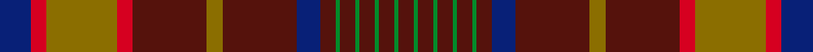

This page is one **sett** — a single exact thread-count. It belongs to the [tartan](/setts/db8r4y18r4dr19y4dr19db6dr4g1dr4g1dr4g1dr4g1dr4/)
(the same proportion at any scale), whose colour order is pattern [BGBGBGBGBBBGBRGRB](/stripes/bgbgbgbgbbbgbrgrb/).

Sourced from register-of-tartans.  It is a [17 stripe tartan](/stripes/stripes17/).

Original link https://www.tartanregister.gov.uk/tartanDetails.aspx?ref=736

2 attestations — the source records this cloth was collapsed from (oldest owns this page)

<ul>
<li>01/01/2003 — Confrerie de Vouvray (register-of-tartans, <a href="https://www.tartanregister.gov.uk/tartanDetails.aspx?ref=736">record</a>)  <em>The Confrerie de Vouvray tartan was created for the French Order of Wine Growers by the Chevaliers Ecossais de la Chantepleure de Vouvray. The red, yellow and maroon are the colours of the French order and the grid pattern of green lines depict the rows of vines of the Chenin Blanc grape. The tartan was presented as a gift to the Grand Council at the 2nd Scottish Confrerie, held in Dundee in May 2003.</em></li>
<li>2003 — Confrerie de Vouvray (Corporate) (tartans-authority, <a href="https://www.tartanregister.gov.uk/tartanDetails.aspx?ref=5802">record</a>)  <em>The Confrerie de Vouvray tartan was created for the French Order of Wine Growers by the Chevaliers Ecossais de la Chantepleure de Vouvray. The red, yellow and maroon are the colours of the French order and the grid pattern of green lines depict the rows of vines of the Chenin Blanc grape. The tartan was presented as a gift to the Grand Council at the 2nd Scottish Confrerie, held in Dundee in May 2003.</em></li>
</ul>

Dataset <small>— provenance for this record, inherited from the source manifest</small>

<dl class="dataset-prov">
<dt>source</dt><dd><a href="/sources/register-of-tartans/">Scottish Register of Tartans</a></dd>
<dt>data captured from</dt><dd><a href="https://github.com/thetartan/tartan-database/blob/master/data/register-of-tartans/data.csv">https://github.com/thetartan/tartan-database/blob/master/data/register-of-tartans/data.csv</a></dd>
<dt>data date</dt><dd>2003 <small>(this record)</small></dd>
<dt>licence</dt><dd><a href="https://www.tartanregister.gov.uk/copyright">Crown copyright</a></dd>
</dl>

Capture chain <small>— the hands this data passed through, oldest first; each capture carries its own licence</small>

<ol class="capture-chain">
<li><a href="https://www.tartanregister.gov.uk/">Scottish Register of Tartans</a> · <a href="https://www.tartanregister.gov.uk/copyright">Crown copyright</a> <small>the living register — still published by National Records of Scotland</small></li>
<li><a href="https://github.com/thetartan/tartan-database">thetartan/tartan-database</a> <small>2016-2017</small> · <a href="https://creativecommons.org/licenses/by-nc-nd/4.0/">CC BY-NC-ND 4.0</a> <small>Levko Kravets's frozen compilation — the capture we vendored, and where its CC licence text came from</small></li>
<li>this dictionary <small>captured 2026-06-10 · commit 5bf86c7566</small> <small>each re-capture is a git commit to data/sources</small></li>
</ol>

## Register references

External register numbers recorded for this tartan.

- Scottish Register of Tartans: [736](https://www.tartanregister.gov.uk/tartanDetails.aspx?ref=736)
- Scottish Tartans Authority (ITI): 5802

## Thread count
DB/16 R8 Y36 R8 DR38 Y8 DR38 DB12 DR8 G2 DR8 G2 DR8 G2 DR8 G2 DR/8

One full sett is **400 threads**.

## Palette
<table><thead><tr><th>Colour</th><th>Shade</th><th>OKLCh</th></tr></thead><tbody><tr><td>DB</td><td><code style="background-color:#082077;">#082077</code> <small style="color:#888">#082077</small></td><td><small style="color:#888">oklch(30.0% 0.149 265.1)</small></td></tr><tr><td>DR</td><td><code style="background-color:#55120C;">#55120C</code> <small style="color:#888">#55120C</small></td><td><small style="color:#888">oklch(30.0% 0.099 29.3)</small></td></tr><tr><td>G</td><td><code style="background-color:#008B2A;">#008B2A</code> <small style="color:#888">#008B2A</small></td><td><small style="color:#888">oklch(55.4% 0.170 145.9)</small></td></tr><tr><td>R</td><td><code style="background-color:#D60020;">#D60020</code> <small style="color:#888">#D60020</small></td><td><small style="color:#888">oklch(55.2% 0.224 25.5)</small></td></tr><tr><td>Y</td><td><code style="background-color:#8B6E00;">#8B6E00</code> <small style="color:#888">#8B6E00</small></td><td><small style="color:#888">oklch(55.1% 0.113 90.4)</small></td></tr></tbody></table>

# Sample pattern

## Nearest tartan variants

The nearest existing variants by ΔTartan distance, with this cloth at the top so the swatches line up against it.

ΔTartan

Threads

Variant

Sett

—

400

<a href="/variants/s17/db8r4y18r4dr19y4dr19db6dr4g1dr4g1dr4g1dr4g1dr4~x2/">Confrerie de Vouvray</a>

<a href="/ttd/edit/#slug=db6r3y14r3dr15y3dr15db5dr3g1dr3g1dr3g1dr3g1dr3g1dr3g1dr3g1dr3g1dr3g1dr3db5dr15y3dr19r3y14r3~x2&amp;base=db8r4y18r4dr19y4dr19db6dr4g1dr4g1dr4g1dr4g1dr4~x2" title="compare in the TTD">3.10</a>

642

<a href="/variants/s34/db6r3y14r3dr15y3dr15db5dr3g1dr3g1dr3g1dr3g1dr3g1dr3g1dr3g1dr3g1dr3g1dr3db5dr15y3dr19r3y14r3~x2/">Confrerie de Vouvray Corporate Tartan</a>

<a href="/ttd/edit/#slug=o8db3o3dg20o3dg3o3db6o3b3o20db3o3db2o6~x2~o1305035-dg1806142&amp;base=db8r4y18r4dr19y4dr19db6dr4g1dr4g1dr4g1dr4g1dr4~x2" title="compare in the TTD">3.21</a>

328

<a href="/variants/s15/o8db3o3dg20o3dg3o3db6o3b3o20db3o3db2o6~x2~o1305035-dg1806142/">Glenfarclas Distillery</a>

<a href="/ttd/edit/#slug=r31db2r3db2r3dg12r3db2r3db2r31dy4dg19dy36dg19dy4~x2&amp;base=db8r4y18r4dr19y4dr19db6dr4g1dr4g1dr4g1dr4g1dr4~x2" title="compare in the TTD">3.35</a>

634

<a href="/variants/s16/r31db2r3db2r3dg12r3db2r3db2r31dy4dg19dy36dg19dy4~x2/">O'Brian #1 (Fashion)</a>

<a href="/ttd/edit/#slug=r24y1db1r3g16r3db1y1r3db6r3y1db1r16g2dr2g2~x2~r1908029&amp;base=db8r4y18r4dr19y4dr19db6dr4g1dr4g1dr4g1dr4g1dr4~x2" title="compare in the TTD">3.37</a>

292

<a href="/variants/s17/r24y1db1r3g16r3db1y1r3db6r3y1db1r16g2dr2g2~x2~r1908029/">Munro</a>

<a href="/ttd/edit/#slug=do12r1do2r1do2lb2do3n9r1n2r1n3~x4&amp;base=db8r4y18r4dr19y4dr19db6dr4g1dr4g1dr4g1dr4g1dr4~x2" title="compare in the TTD">3.37</a>

252

<a href="/variants/s12/do12r1do2r1do2lb2do3n9r1n2r1n3~x4/">Shieldhall (Fashion)</a>

<a href="/ttd/edit/#slug=n19do2r1dr3w1dr1w1dr1do6n3dr1do3w1~x4&amp;base=db8r4y18r4dr19y4dr19db6dr4g1dr4g1dr4g1dr4g1dr4~x2" title="compare in the TTD">3.63</a>

264

<a href="/variants/s13/n19do2r1dr3w1dr1w1dr1do6n3dr1do3w1~x4/">Leando Hunting (Personal)</a>

<a href="/ttd/edit/#slug=do17dy3do2dy1do1dy1do1dy1r3ly2do1ly2ri1~x4~do1103038-dy1402055-r1506019-ri2806019&amp;base=db8r4y18r4dr19y4dr19db6dr4g1dr4g1dr4g1dr4g1dr4~x2" title="compare in the TTD">3.64</a>

216

<a href="/variants/s13/do17doi3do2doi1do1doi1do1doi1r3ly2do1ly2ri1~x4~do1103038-doi1402055-r1506019-ri2806019/">Kinnaird (1984)</a>

<a href="/ttd/edit/#slug=dr6k4dr8dp16dr6lb2dr2dp2dr2lb2dr6dp18g6dp2g1~x2&amp;base=db8r4y18r4dr19y4dr19db6dr4g1dr4g1dr4g1dr4g1dr4~x2" title="compare in the TTD">3.67</a>

318

<a href="/variants/s15/dr6k4dr8dp16dr6lb2dr2dp2dr2lb2dr6dp18g6dp2g1~x2/">McCall (Caithness)</a>

<a href="/ttd/edit/#slug=r7ri2db2r2g32r6db12r41g2r5ri2g5~x2~r1707016-ri2208029&amp;base=db8r4y18r4dr19y4dr19db6dr4g1dr4g1dr4g1dr4g1dr4~x2" title="compare in the TTD">3.68</a>

448

<a href="/variants/s12/r7ri2db2r2g32r6db12r41g2r5ri2g5~x2~r1707016-ri2208029/">MacDougall #5</a>

<a href="/ttd/edit/#slug=r3dg14r3ly1r3dp8r3ly1r3dg14r3ly1~x4~r2109032-dg1605139-dp1105325&amp;base=db8r4y18r4dr19y4dr19db6dr4g1dr4g1dr4g1dr4g1dr4~x2" title="compare in the TTD">3.80</a>

440

<a href="/variants/s12/r3dg14r3ly1r3dp8r3ly1r3dg14r3ly1~x4~r2109032-dg1605139-dp1105325/">Wilson's No.213</a>

## Neighbour map

Every grey dot is one of 13620 variants placed by the first two principal components of the ΔTartan feature space (42% of its variance). Red is this tartan; blue dots are its nearest — click one to open its page.

<svg viewBox="0 0 640 380" role="img" style="max-width:100%;height:auto;border:1px solid #e0e0e0;border-radius:4px;display:block" xmlns="http://www.w3.org/2000/svg"><image href="/nn/cloud.v1.png" width="640" height="380"/><a href="/variants/s34/db6r3y14r3dr15y3dr15db5dr3g1dr3g1dr3g1dr3g1dr3g1dr3g1dr3g1dr3g1dr3g1dr3db5dr15y3dr19r3y14r3~x2/"><circle cx="335.4" cy="105.5" r="4" fill="#3465a4"><title>Confrerie de Vouvray Corporate Tartan</title></circle></a><a href="/variants/s15/o8db3o3dg20o3dg3o3db6o3b3o20db3o3db2o6~x2~o1305035-dg1806142/"><circle cx="353.2" cy="184.3" r="4" fill="#3465a4"><title>Glenfarclas Distillery</title></circle></a><a href="/variants/s16/r31db2r3db2r3dg12r3db2r3db2r31dy4dg19dy36dg19dy4~x2/"><circle cx="284.6" cy="144.1" r="4" fill="#3465a4"><title>O'Brian #1 (Fashion)</title></circle></a><a href="/variants/s17/r24y1db1r3g16r3db1y1r3db6r3y1db1r16g2dr2g2~x2~r1908029/"><circle cx="382.4" cy="99.6" r="4" fill="#3465a4"><title>Munro</title></circle></a><a href="/variants/s12/do12r1do2r1do2lb2do3n9r1n2r1n3~x4/"><circle cx="348.5" cy="187.1" r="4" fill="#3465a4"><title>Shieldhall (Fashion)</title></circle></a><a href="/variants/s13/n19do2r1dr3w1dr1w1dr1do6n3dr1do3w1~x4/"><circle cx="335.0" cy="124.1" r="4" fill="#3465a4"><title>Leando Hunting (Personal)</title></circle></a><a href="/variants/s13/do17doi3do2doi1do1doi1do1doi1r3ly2do1ly2ri1~x4~do1103038-doi1402055-r1506019-ri2806019/"><circle cx="390.0" cy="118.7" r="4" fill="#3465a4"><title>Kinnaird (1984)</title></circle></a><a href="/variants/s15/dr6k4dr8dp16dr6lb2dr2dp2dr2lb2dr6dp18g6dp2g1~x2/"><circle cx="279.1" cy="139.8" r="4" fill="#3465a4"><title>McCall (Caithness)</title></circle></a><a href="/variants/s12/r7ri2db2r2g32r6db12r41g2r5ri2g5~x2~r1707016-ri2208029/"><circle cx="344.6" cy="134.1" r="4" fill="#3465a4"><title>MacDougall #5</title></circle></a><a href="/variants/s12/r3dg14r3ly1r3dp8r3ly1r3dg14r3ly1~x4~r2109032-dg1605139-dp1105325/"><circle cx="300.3" cy="172.0" r="4" fill="#3465a4"><title>Wilson's No.213</title></circle></a><circle cx="333.7" cy="137.8" r="5" fill="#c00000"/><text x="320" y="376" text-anchor="middle" font-size="11" fill="#999">ground</text><text x="11" y="190" text-anchor="middle" font-size="11" fill="#999" transform="rotate(-90 11 190)">complexity</text></svg>

ID: /variants/s17/db8r4y18r4dr19y4dr19db6dr4g1dr4g1dr4g1dr4g1dr4~x2/
