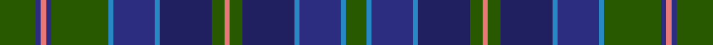

This page is one **sett** — a single exact thread-count. It belongs to the [tartan](/setts/dg14dbi2r2dbi2dg22t2dbi16t2db20dg5r2dg5db20t2dbi16t2dg8/)
(the same proportion at any scale), whose colour order is pattern [GBBBBGRGBBBBGBRBG](/stripes/gbbbbgrgbbbbgbrbg/).

Sourced from register-of-tartans.  It is a [17 stripe tartan](/stripes/stripes17/).

Original link https://www.tartanregister.gov.uk/tartanDetails.aspx?ref=1245

2 attestations — the source records this cloth was collapsed from (oldest owns this page)

<ul>
<li>01/01/2002 — Frangord (register-of-tartans, <a href="https://www.tartanregister.gov.uk/tartanDetails.aspx?ref=1245">record</a>)</li>
<li>pre 2002 — Frangord (Corporate) (tartans-authority, <a href="http://www.tartansauthority.com/tartan-ferret/display/4907/">record</a>)</li>
</ul>

## Register references

External register numbers recorded for this tartan.

- Scottish Register of Tartans: [1245](https://www.tartanregister.gov.uk/tartanDetails.aspx?ref=1245)
- Scottish Tartans Authority (ITI): 4907

## Thread count
G/28 DB4 LR4 DB4 G44 B4 DB32 B4 DBa40 G10 LR4 G10 DBa40 B4 DB32 B4 G/16

One full sett is **524 threads**.

## Palette

Palette: <strong>Tartan Register</strong>
<table><thead><tr><th>Colour</th><th>Threads</th><th>Shade</th><th>Base</th><th>OKLCh</th></tr></thead><tbody><tr><td>G/</td><td style="text-align:right;font-variant-numeric:tabular-nums">28</td><td><code style="background-color:#285800;">#285800</code> <small style="color:#888">#285800</small></td><td>G <code style="background-color:#006100;">#006100</code></td><td><small style="color:#888">oklch(41.0% 0.122 135.8)</small></td></tr><tr><td>DB</td><td style="text-align:right;font-variant-numeric:tabular-nums">4</td><td><code style="background-color:#2C2C80;">#2C2C80</code> <small style="color:#888">#2C2C80</small></td><td>B <code style="background-color:#2A418A;">#2A418A</code></td><td><small style="color:#888">oklch(35.0% 0.138 276.6)</small></td></tr><tr><td>LR</td><td style="text-align:right;font-variant-numeric:tabular-nums">4</td><td><code style="background-color:#E87878;">#E87878</code> <small style="color:#888">#E87878</small></td><td>R <code style="background-color:#CC0000;">#CC0000</code></td><td><small style="color:#888">oklch(70.0% 0.139 21.2)</small></td></tr><tr><td>DB</td><td style="text-align:right;font-variant-numeric:tabular-nums">4</td><td><code style="background-color:#2C2C80;">#2C2C80</code> <small style="color:#888">#2C2C80</small></td><td>B <code style="background-color:#2A418A;">#2A418A</code></td><td><small style="color:#888">oklch(35.0% 0.138 276.6)</small></td></tr><tr><td>G</td><td style="text-align:right;font-variant-numeric:tabular-nums">44</td><td><code style="background-color:#285800;">#285800</code> <small style="color:#888">#285800</small></td><td>G <code style="background-color:#006100;">#006100</code></td><td><small style="color:#888">oklch(41.0% 0.122 135.8)</small></td></tr><tr><td>B</td><td style="text-align:right;font-variant-numeric:tabular-nums">4</td><td><code style="background-color:#2888C4;">#2888C4</code> <small style="color:#888">#2888C4</small></td><td>B <code style="background-color:#2A418A;">#2A418A</code></td><td><small style="color:#888">oklch(60.1% 0.125 241.5)</small></td></tr><tr><td>DB</td><td style="text-align:right;font-variant-numeric:tabular-nums">32</td><td><code style="background-color:#2C2C80;">#2C2C80</code> <small style="color:#888">#2C2C80</small></td><td>B <code style="background-color:#2A418A;">#2A418A</code></td><td><small style="color:#888">oklch(35.0% 0.138 276.6)</small></td></tr><tr><td>B</td><td style="text-align:right;font-variant-numeric:tabular-nums">4</td><td><code style="background-color:#2888C4;">#2888C4</code> <small style="color:#888">#2888C4</small></td><td>B <code style="background-color:#2A418A;">#2A418A</code></td><td><small style="color:#888">oklch(60.1% 0.125 241.5)</small></td></tr><tr><td>DBa</td><td style="text-align:right;font-variant-numeric:tabular-nums">40</td><td><code style="background-color:#202060;">#202060</code> <small style="color:#888">#202060</small></td><td>B <code style="background-color:#2A418A;">#2A418A</code></td><td><small style="color:#888">oklch(28.9% 0.111 276.9)</small></td></tr><tr><td>G</td><td style="text-align:right;font-variant-numeric:tabular-nums">10</td><td><code style="background-color:#285800;">#285800</code> <small style="color:#888">#285800</small></td><td>G <code style="background-color:#006100;">#006100</code></td><td><small style="color:#888">oklch(41.0% 0.122 135.8)</small></td></tr><tr><td>LR</td><td style="text-align:right;font-variant-numeric:tabular-nums">4</td><td><code style="background-color:#E87878;">#E87878</code> <small style="color:#888">#E87878</small></td><td>R <code style="background-color:#CC0000;">#CC0000</code></td><td><small style="color:#888">oklch(70.0% 0.139 21.2)</small></td></tr><tr><td>G</td><td style="text-align:right;font-variant-numeric:tabular-nums">10</td><td><code style="background-color:#285800;">#285800</code> <small style="color:#888">#285800</small></td><td>G <code style="background-color:#006100;">#006100</code></td><td><small style="color:#888">oklch(41.0% 0.122 135.8)</small></td></tr><tr><td>DBa</td><td style="text-align:right;font-variant-numeric:tabular-nums">40</td><td><code style="background-color:#202060;">#202060</code> <small style="color:#888">#202060</small></td><td>B <code style="background-color:#2A418A;">#2A418A</code></td><td><small style="color:#888">oklch(28.9% 0.111 276.9)</small></td></tr><tr><td>B</td><td style="text-align:right;font-variant-numeric:tabular-nums">4</td><td><code style="background-color:#2888C4;">#2888C4</code> <small style="color:#888">#2888C4</small></td><td>B <code style="background-color:#2A418A;">#2A418A</code></td><td><small style="color:#888">oklch(60.1% 0.125 241.5)</small></td></tr><tr><td>DB</td><td style="text-align:right;font-variant-numeric:tabular-nums">32</td><td><code style="background-color:#2C2C80;">#2C2C80</code> <small style="color:#888">#2C2C80</small></td><td>B <code style="background-color:#2A418A;">#2A418A</code></td><td><small style="color:#888">oklch(35.0% 0.138 276.6)</small></td></tr><tr><td>B</td><td style="text-align:right;font-variant-numeric:tabular-nums">4</td><td><code style="background-color:#2888C4;">#2888C4</code> <small style="color:#888">#2888C4</small></td><td>B <code style="background-color:#2A418A;">#2A418A</code></td><td><small style="color:#888">oklch(60.1% 0.125 241.5)</small></td></tr><tr><td>G/</td><td style="text-align:right;font-variant-numeric:tabular-nums">16</td><td><code style="background-color:#285800;">#285800</code> <small style="color:#888">#285800</small></td><td>G <code style="background-color:#006100;">#006100</code></td><td><small style="color:#888">oklch(41.0% 0.122 135.8)</small></td></tr></tbody></table>

## Nearest tartans

The nearest existing variants by ΔTartan distance, with this tartan at the top so the swatches line up against it.

ΔTartan

Tartan

Sett

—

<a href="/ttd/edit/#slug=dg14dbi2r2dbi2dg22t2dbi16t2db20dg5r2dg5db20t2dbi16t2dg8~x2">Frangord</a> <a class="nn-out" href="/variants/s17/dg14dbi2r2dbi2dg22t2dbi16t2db20dg5r2dg5db20t2dbi16t2dg8~x2/" title="open its dictionary page">↗</a>

0.91

<a href="/ttd/edit/#slug=db3r1dbi12dg2dbi2db4dbi2dg2dbi2dg9db1lo2~x4&amp;base=dg14dbi2r2dbi2dg22t2dbi16t2db20dg5r2dg5db20t2dbi16t2dg8~x2">St. Andrew's Soc. of Philadelphia (C</a> <a class="nn-out" href="/variants/s12/db3r1dbi12dg2dbi2db4dbi2dg2dbi2dg9db1lo2~x4/" title="open its dictionary page">↗</a>

0.99

<a href="/variants/s18/b13g19k2b7k2g7k2db18r2b13~x2/">South Australia</a>

1.02

<a href="/ttd/edit/#slug=ly2db4dbi2g25dbi4g2dbi4k10db4g2db4g11dbi2k2dbi24db4dbi2ly2~x2&amp;base=dg14dbi2r2dbi2dg22t2dbi16t2db20dg5r2dg5db20t2dbi16t2dg8~x2">LS Curling</a> <a class="nn-out" href="/variants/s18/ly2db4dbi2g25dbi4g2dbi4k10db4g2db4g11dbi2k2dbi24db4dbi2ly2~x2/" title="open its dictionary page">↗</a>

1.07

<a href="/variants/s20/db6k3db3dt13g13k1g13dt13w1db3k3~x2/">Wacker</a>

1.11

<a href="/ttd/edit/#slug=dg1k1dg8k8db8r1db8k8dg1k1dg1k1dg3w1~x2&amp;base=dg14dbi2r2dbi2dg22t2dbi16t2db20dg5r2dg5db20t2dbi16t2dg8~x2">Urquhart (Brydone)</a> <a class="nn-out" href="/variants/s14/dg1k1dg8k8db8r1db8k8dg1k1dg1k1dg3w1~x2/" title="open its dictionary page">↗</a>

1.16

<a href="/ttd/edit/#slug=dg2k1db9k9dg9k1w1k2w1k1dg9k9db9k1r2~x4&amp;base=dg14dbi2r2dbi2dg22t2dbi16t2db20dg5r2dg5db20t2dbi16t2dg8~x2">Stephenson Htg (Name)</a> <a class="nn-out" href="/variants/s15/dg2k1db9k9dg9k1w1k2w1k1dg9k9db9k1r2~x4/" title="open its dictionary page">↗</a>

1.16

<a href="/ttd/edit/#slug=db6k1db1k1db1k7dg6ly1db1lb1db1ly1dg6k7db7k1db1~x4&amp;base=dg14dbi2r2dbi2dg22t2dbi16t2db20dg5r2dg5db20t2dbi16t2dg8~x2">Polaris Corporate Tartan</a> <a class="nn-out" href="/variants/s17/db6k1db1k1db1k7dg6ly1db1lb1db1ly1dg6k7db7k1db1~x4/" title="open its dictionary page">↗</a>

1.17

<a href="/ttd/edit/#slug=k4dbi11k1dbi2k1dbi11k2db14k2dg14k1r2~x2&amp;base=dg14dbi2r2dbi2dg22t2dbi16t2db20dg5r2dg5db20t2dbi16t2dg8~x2">Brown Ellis (Personal)</a> <a class="nn-out" href="/variants/s12/k4dbi11k1dbi2k1dbi11k2db14k2dg14k1r2~x2/" title="open its dictionary page">↗</a>

1.18

<a href="/ttd/edit/#slug=dg30ly2dg5ly2dg4k15db29r2db29k15dg5ly2dg4ly2dg17~x2&amp;base=dg14dbi2r2dbi2dg22t2dbi16t2db20dg5r2dg5db20t2dbi16t2dg8~x2">Unidentified (Teddy Bear)</a> <a class="nn-out" href="/variants/s15/dg30ly2dg5ly2dg4k15db29r2db29k15dg5ly2dg4ly2dg17~x2/" title="open its dictionary page">↗</a>

1.20

<a href="/ttd/edit/#slug=db17k3db3k3db3k17g17k2w3k2g17k17db17k2r3~x2&amp;base=dg14dbi2r2dbi2dg22t2dbi16t2db20dg5r2dg5db20t2dbi16t2dg8~x2">Cumbernauld District Tartan</a> <a class="nn-out" href="/variants/s15/db17k3db3k3db3k17g17k2w3k2g17k17db17k2r3~x2/" title="open its dictionary page">↗</a>

## Neighbour map

Every grey dot is one of 14360 variants placed by the first two principal components of the ΔTartan feature space (44% of its variance). Red is this tartan; blue dots are its nearest — click one to open its page.

<svg viewBox="0 0 640 380" role="img" style="max-width:100%;height:auto;border:1px solid #e0e0e0;border-radius:4px;display:block" xmlns="http://www.w3.org/2000/svg"><image href="/nn/cloud.v1.png" width="640" height="380"/><a href="/variants/s12/db3r1dbi12dg2dbi2db4dbi2dg2dbi2dg9db1lo2~x4/"><circle cx="256.0" cy="187.2" r="4" fill="#3465a4"><title>St. Andrew's Soc. of Philadelphia (C</title></circle></a><a href="/variants/s18/b13g19k2b7k2g7k2db18r2b13~x2/"><circle cx="170.6" cy="176.9" r="4" fill="#3465a4"><title>South Australia</title></circle></a><a href="/variants/s18/ly2db4dbi2g25dbi4g2dbi4k10db4g2db4g11dbi2k2dbi24db4dbi2ly2~x2/"><circle cx="209.4" cy="146.0" r="4" fill="#3465a4"><title>LS Curling</title></circle></a><a href="/variants/s20/db6k3db3dt13g13k1g13dt13w1db3k3~x2/"><circle cx="224.7" cy="184.8" r="4" fill="#3465a4"><title>Wacker</title></circle></a><a href="/variants/s14/dg1k1dg8k8db8r1db8k8dg1k1dg1k1dg3w1~x2/"><circle cx="200.5" cy="191.7" r="4" fill="#3465a4"><title>Urquhart (Brydone)</title></circle></a><a href="/variants/s15/dg2k1db9k9dg9k1w1k2w1k1dg9k9db9k1r2~x4/"><circle cx="190.8" cy="187.6" r="4" fill="#3465a4"><title>Stephenson Htg (Name)</title></circle></a><a href="/variants/s17/db6k1db1k1db1k7dg6ly1db1lb1db1ly1dg6k7db7k1db1~x4/"><circle cx="187.0" cy="190.5" r="4" fill="#3465a4"><title>Polaris Corporate Tartan</title></circle></a><a href="/variants/s12/k4dbi11k1dbi2k1dbi11k2db14k2dg14k1r2~x2/"><circle cx="237.1" cy="190.2" r="4" fill="#3465a4"><title>Brown Ellis (Personal)</title></circle></a><a href="/variants/s15/dg30ly2dg5ly2dg4k15db29r2db29k15dg5ly2dg4ly2dg17~x2/"><circle cx="230.5" cy="158.2" r="4" fill="#3465a4"><title>Unidentified (Teddy Bear)</title></circle></a><a href="/variants/s15/db17k3db3k3db3k17g17k2w3k2g17k17db17k2r3~x2/"><circle cx="187.2" cy="189.4" r="4" fill="#3465a4"><title>Cumbernauld District Tartan</title></circle></a><circle cx="214.9" cy="178.5" r="5" fill="#c00000"/></svg>

ID: /variants/s17/dg14dbi2r2dbi2dg22t2dbi16t2db20dg5r2dg5db20t2dbi16t2dg8~x2/
