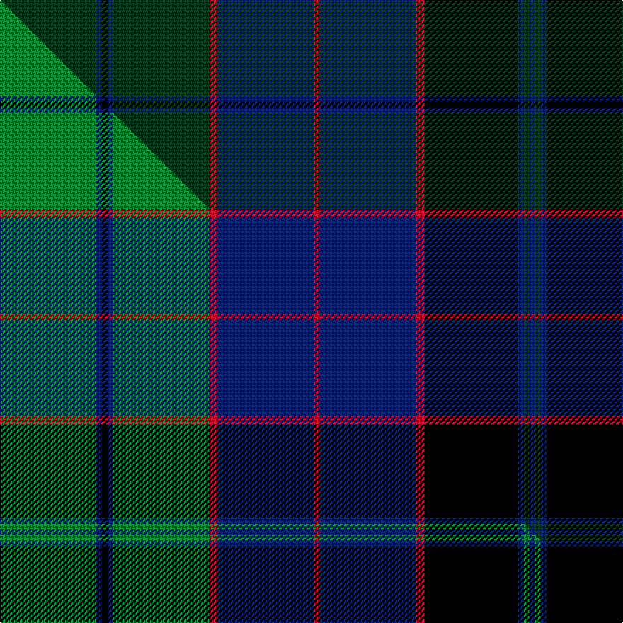

This is one **variant** — a specific cloth: this exact thread count and colourway, with its own
provenance below. It is one weaving of the [sett](/tartans/l/lu/lumsden-hunting/) (the scale-free proportion — the
same cloth at any scale or shade), whose colour order is pattern [GBKBGRBRBRKBGBGBK](/stripes/gbkbgrbrbrkbgbgbk/).

Part of the [Lumsden Hunting](/tartans/l/lu/lumsden-hunting/) tartan — the named design grouping this sett with its other cloths.

Sourced from tartans-authority.  It is a [17 stripe tartan](/stripes/stripes17/).

Original link <code>http://www.tartansauthority.com/tartan-ferret/display/2366/</code> — retired · [Internet Archive copy](https://web.archive.org/web/*/http://www.tartansauthority.com/tartan-ferret/display/2366/*)

Dataset <small>— provenance for this record, inherited from the source manifest</small>

<dl class="dataset-prov">
<dt>source</dt><dd><a href="/sources/tartans-authority/">Scottish Tartans Authority</a></dd>
<dt>data captured from</dt><dd><a href="https://github.com/thetartan/tartan-database/blob/master/data/tartans-authority/data.csv">https://github.com/thetartan/tartan-database/blob/master/data/tartans-authority/data.csv</a></dd>
<dt>data date</dt><dd>1997 <small>(this record)</small></dd>
<dt>licence</dt><dd><a href="https://creativecommons.org/licenses/by-nc-nd/4.0/">CC BY-NC-ND 4.0</a></dd>
</dl>

Capture chain <small>— the hands this data passed through, oldest first; each capture carries its own licence</small>

<ol class="capture-chain">
<li><a href="https://www.tartansauthority.com/">Scottish Tartans Authority</a> <small>the heritage body’s archive — its tartan-ferret record browser is retired; dead record links are shown unlinked, with an Internet Archive copy (ITI numbers are not SRT references)</small></li>
<li><a href="https://github.com/thetartan/tartan-database">thetartan/tartan-database</a> <small>2016-2017</small> · <a href="https://creativecommons.org/licenses/by-nc-nd/4.0/">CC BY-NC-ND 4.0</a> <small>Levko Kravets's frozen compilation — the capture we vendored, and where its CC licence text came from</small></li>
<li>this dictionary <small>captured 2026-06-10 · commit 5bf86c7566</small> <small>each re-capture is a git commit to data/sources</small></li>
</ol>

## Register references

External register numbers recorded for this tartan.

- Scottish Tartans Authority (ITI): 2366

## Thread count
DG/68 DB4 K4 DB4 DG68 R6 DB68 R4 DB68 R6 K66 DB4 DG4 DB4 DG4 DB4 K/66

One full sett is **770 threads**.

## Palette
<table><thead><tr><th>Colour</th><th>Shade</th><th>OKLCh</th></tr></thead><tbody><tr><td>DB</td><td><code style="background-color:#082077;">#082077</code> <small style="color:#888">#082077</small></td><td><small style="color:#888">oklch(30.0% 0.149 265.1)</small></td></tr><tr><td>DG</td><td><code style="background-color:#053819;">#053819</code> <small style="color:#888">#053819</small></td><td><small style="color:#888">oklch(30.0% 0.075 151.3)</small></td></tr><tr><td>K</td><td><code style="background-color:#000000;">#000000</code> <small style="color:#888">#000000</small></td><td><small style="color:#888">oklch(0.0% 0.000 0.0)</small></td></tr><tr><td>R</td><td><code style="background-color:#D60020;">#D60020</code> <small style="color:#888">#D60020</small></td><td><small style="color:#888">oklch(55.2% 0.224 25.5)</small></td></tr></tbody></table>

# Sample pattern

## Compared to the master

This cloth is one sett of its design; the master sett (the exemplar the design is anchored on) is below for comparison.

Its **ΔTartan distance** from the master is **0.14** — the same measure the nearest-tartans table ranks by (0 is identical; a re-scale of the same cloth is near 0, a recolour or a different proportion further).

<figure class="master-compare" style="margin:0">

this sett
master sett ★

<figcaption style="color:#888;font-size:smaller">One weave of this sett against the <a href="/setts/g34db2k2db2g34r3db34r2db34r3k33db2g2db2g2db2k33/">master sett ★</a>, split on the diagonal: a shared proportion runs seamlessly across it with only the shades shifting; a different proportion breaks on it.</figcaption>
</figure>

## Nearest tartan variants

The nearest existing variants by ΔTartan distance, with this cloth at the top so the swatches line up against it.

ΔTartan

Threads

Variant

Sett

—

770

<a href="/variants/s17/dg34db2k2db2dg34r3db34r2db34r3k33db2dg2db2dg2db2k33~x2/">Lumsden Hunting (Clan)</a>

<a href="/ttd/edit/#slug=dg34db2k2db2dg34r3db34r2db34r3k33db2dg2db2dg2db2k33~x2~dg1605139&amp;base=dg34db2k2db2dg34r3db34r2db34r3k33db2dg2db2dg2db2k33~x2" title="compare in the TTD">0.08</a>

770

<a href="/variants/s17/dg34db2k2db2dg34r3db34r2db34r3k33db2dg2db2dg2db2k33~x2~dg1605139/">Lumsden Green Clan Tartan</a>

<a href="/ttd/edit/#slug=g34db2k2db2g34r3db34r2db34r3k33db2g2db2g2db2k33~x2&amp;base=dg34db2k2db2dg34r3db34r2db34r3k33db2dg2db2dg2db2k33~x2" title="compare in the TTD">0.14</a>

770

<a href="/variants/s17/g34db2k2db2g34r3db34r2db34r3k33db2g2db2g2db2k33~x2/">Lumsden Hunting</a>

<a href="/ttd/edit/#slug=dg13db2k2db2dg13g4db14dp2db14g4k12db2dg2db2dg2db2k12~x2&amp;base=dg34db2k2db2dg34r3db34r2db34r3k33db2dg2db2dg2db2k33~x2" title="compare in the TTD">1.50</a>

366

<a href="/variants/s17/dg13db2k2db2dg13g4db14dp2db14g4k12db2dg2db2dg2db2k12~x2/">National Trust for Scotland (Corpora</a>

<a href="/ttd/edit/#slug=dg20r2dg32k32r2db32r6db3r2db20r2db3r6db32r2k32dg32r6dg4r2dg10~x2&amp;base=dg34db2k2db2dg34r3db34r2db34r3k33db2dg2db2dg2db2k33~x2" title="compare in the TTD">2.05</a>

1068

<a href="/variants/s21/dg20r2dg32k32r2db32r6db3r2db20r2db3r6db32r2k32dg32r6dg4r2dg10~x2/">Macdonald of Rossie</a>

<a href="/ttd/edit/#slug=dg19k1g3k1dg3k9db20k1y1k7y1k1db21k12dg2g1~x2&amp;base=dg34db2k2db2dg34r3db34r2db34r3k33db2dg2db2dg2db2k33~x2" title="compare in the TTD">2.22</a>

372

<a href="/variants/s16/dg19k1g3k1dg3k9db20k1y1k7y1k1db21k12dg2g1~x2/">Hope-Vere/Weir (Modern)</a>

<a href="/ttd/edit/#slug=k3dp1n2dp1db6dp1n2dp1k16db16n1dp2n1k6n1dp2n1db3~x2&amp;base=dg34db2k2db2dg34r3db34r2db34r3k33db2dg2db2dg2db2k33~x2" title="compare in the TTD">2.24</a>

252

<a href="/variants/s18/k3dp1n2dp1db6dp1n2dp1k16db16n1dp2n1k6n1dp2n1db3~x2/">Asile</a>

<a href="/ttd/edit/#slug=db21k2db2k2db2k16dg16k2dg16k16db16k2r1~x2&amp;base=dg34db2k2db2dg34r3db34r2db34r3k33db2dg2db2dg2db2k33~x2" title="compare in the TTD">2.26</a>

412

<a href="/variants/s13/db21k2db2k2db2k16dg16k2dg16k16db16k2r1~x2/">Black Watch/Isetan Men's</a>

<a href="/ttd/edit/#slug=db15k2db2k2db2k14dg18k1y2k1dg18k14db18r2~x2&amp;base=dg34db2k2db2dg34r3db34r2db34r3k33db2dg2db2dg2db2k33~x2" title="compare in the TTD">2.40</a>

410

<a href="/variants/s14/db15k2db2k2db2k14dg18k1y2k1dg18k14db18r2~x2/">Bonner (Name)</a>

<a href="/ttd/edit/#slug=dy2k1dg24k16db2k2db2k2db24k2db2k2db2k16dg24k1r2~x2&amp;base=dg34db2k2db2dg34r3db34r2db34r3k33db2dg2db2dg2db2k33~x2" title="compare in the TTD">2.41</a>

496

<a href="/variants/s17/dy2k1dg24k16db2k2db2k2db24k2db2k2db2k16dg24k1r2~x2/">St. Mary's Help of... (School)</a>

<a href="/ttd/edit/#slug=db16k2db2k2db2k12dg13k2dg13k12db12k2r1~x2&amp;base=dg34db2k2db2dg34r3db34r2db34r3k33db2dg2db2dg2db2k33~x2" title="compare in the TTD">2.46</a>

330

<a href="/variants/s13/db16k2db2k2db2k12dg13k2dg13k12db12k2r1~x2/">Black Watch/Isetan Men's</a>

## Neighbour map

Every grey dot is one of 13656 variants placed by the first two principal components of the ΔTartan feature space (42% of its variance). Red is this tartan; blue dots are its nearest — click one to open its page. The map is a flat projection of a many-dimensional space — [how to read it](/posts/neighbourhood-maps/).

<svg viewBox="0 0 640 380" role="img" style="max-width:100%;height:auto;border:1px solid #e0e0e0;border-radius:4px;display:block" xmlns="http://www.w3.org/2000/svg"><image href="/nn/cloud.v1.png" width="640" height="380"/><a href="/variants/s17/dg34db2k2db2dg34r3db34r2db34r3k33db2dg2db2dg2db2k33~x2~dg1605139/"><circle cx="208.0" cy="92.5" r="4" fill="#3465a4"><title>Lumsden Green Clan Tartan</title></circle></a><a href="/variants/s17/g34db2k2db2g34r3db34r2db34r3k33db2g2db2g2db2k33~x2/"><circle cx="167.2" cy="115.6" r="4" fill="#3465a4"><title>Lumsden Hunting</title></circle></a><a href="/variants/s17/dg13db2k2db2dg13g4db14dp2db14g4k12db2dg2db2dg2db2k12~x2/"><circle cx="160.0" cy="174.8" r="4" fill="#3465a4"><title>National Trust for Scotland (Corpora</title></circle></a><a href="/variants/s21/dg20r2dg32k32r2db32r6db3r2db20r2db3r6db32r2k32dg32r6dg4r2dg10~x2/"><circle cx="185.0" cy="132.3" r="4" fill="#3465a4"><title>Macdonald of Rossie</title></circle></a><a href="/variants/s16/dg19k1g3k1dg3k9db20k1y1k7y1k1db21k12dg2g1~x2/"><circle cx="227.1" cy="112.2" r="4" fill="#3465a4"><title>Hope-Vere/Weir (Modern)</title></circle></a><a href="/variants/s18/k3dp1n2dp1db6dp1n2dp1k16db16n1dp2n1k6n1dp2n1db3~x2/"><circle cx="236.7" cy="121.5" r="4" fill="#3465a4"><title>Asile</title></circle></a><a href="/variants/s13/db21k2db2k2db2k16dg16k2dg16k16db16k2r1~x2/"><circle cx="241.6" cy="156.7" r="4" fill="#3465a4"><title>Black Watch/Isetan Men's</title></circle></a><a href="/variants/s14/db15k2db2k2db2k14dg18k1y2k1dg18k14db18r2~x2/"><circle cx="202.5" cy="142.1" r="4" fill="#3465a4"><title>Bonner (Name)</title></circle></a><a href="/variants/s17/dy2k1dg24k16db2k2db2k2db24k2db2k2db2k16dg24k1r2~x2/"><circle cx="244.6" cy="104.0" r="4" fill="#3465a4"><title>St. Mary's Help of... (School)</title></circle></a><a href="/variants/s13/db16k2db2k2db2k12dg13k2dg13k12db12k2r1~x2/"><circle cx="225.1" cy="171.4" r="4" fill="#3465a4"><title>Black Watch/Isetan Men's</title></circle></a><circle cx="225.8" cy="132.1" r="5" fill="#c00000"/><text x="320" y="376" text-anchor="middle" font-size="11" fill="#999">ground</text><text x="11" y="190" text-anchor="middle" font-size="11" fill="#999" transform="rotate(-90 11 190)">complexity</text></svg>

ID: /variants/s17/dg34db2k2db2dg34r3db34r2db34r3k33db2dg2db2dg2db2k33~x2/
