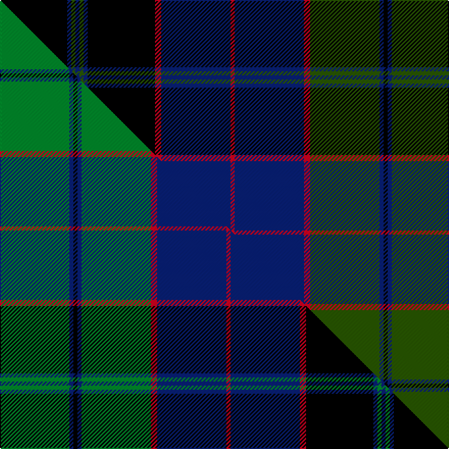

This is one **variant** — a specific cloth: this exact thread count and colourway, with its own
provenance below. It is one weaving of the [sett](/setts/dg34db2k2db2dg34r3db34r2db34r3k33db2dg2db2dg2db2k33/) (the scale-free proportion — the
same cloth at any scale or shade), whose colour order is pattern [BGBGBKRBRBRGBKBGBKBGRBRBRKBGBGBK](/stripes/bgbgbkrbrbrgbkbgbkbgrbrbrkbgbgbk/).

Part of the [Lumsden Hunting](/tartans/l/lu/lumsden-hunting/) tartan — the named design grouping this sett with its other cloths.

Sourced from house-of-tartan.  It is a [32 stripe tartan](/stripes/stripes32/).

Original link [http://www.house-of-tartan.scotland.net/house/TartanViewjs.asp?colr=Def&tnam=2366](http://www.house-of-tartan.scotland.net/house/TartanViewjs.asp?colr=Def&tnam=2366)

## Provenance

Earliest known date: 1997 Designed by Peter MacDonald at the request of David Lumsden of Cushnie to provide a hunting tartan for the clan. Can be worn by all in the Lumsden clan ( House of Lumsden). Medium green used here to show graphic instead of required dark green.

Dataset <small>— provenance for this record, inherited from the source manifest</small>

<dl class="dataset-prov">
<dt>source</dt><dd><a href="/sources/house-of-tartan/">House of Tartan</a></dd>
<dt>data captured from</dt><dd><a href="https://github.com/thetartan/tartan-database/blob/master/data/house-of-tartan/data.csv">https://github.com/thetartan/tartan-database/blob/master/data/house-of-tartan/data.csv</a></dd>
<dt>data date</dt><dd>1997 <small>(this record)</small></dd>
<dt>licence</dt><dd><a href="https://creativecommons.org/licenses/by-nc-nd/4.0/">CC BY-NC-ND 4.0</a></dd>
</dl>

Capture chain <small>— the hands this data passed through, oldest first; each capture carries its own licence</small>

<ol class="capture-chain">
<li><a href="http://www.house-of-tartan.scotland.net/">House of Tartan</a> <small>the weaver/retailer's database — the site is now offline; the URL is kept as the ultimate source's identity</small></li>
<li><a href="https://github.com/thetartan/tartan-database">thetartan/tartan-database</a> <small>2016-2017</small> · <a href="https://creativecommons.org/licenses/by-nc-nd/4.0/">CC BY-NC-ND 4.0</a> <small>Levko Kravets's frozen compilation — the capture we vendored, and where its CC licence text came from</small></li>
<li>this dictionary <small>captured 2026-06-10 · commit 5bf86c7566</small> <small>each re-capture is a git commit to data/sources</small></li>
</ol>

## Thread count
K/66 DB4 DG4 DB4 DG4 DB4 K66 R6 DB68 R4 DB68 R6 DG68 DB4 K4 DB4 DG68 DB4 K4 DB4 DG68 R6 DB68 R4 DB68 R6 K66 DB4 DG4 DB4 DG4 DB/4

One full sett is **1470 threads**.

## Palette
<table><thead><tr><th>Colour</th><th>Shade</th><th>OKLCh</th></tr></thead><tbody><tr><td>DB</td><td><code style="background-color:#082077;">#082077</code> <small style="color:#888">#082077</small></td><td><small style="color:#888">oklch(30.0% 0.149 265.1)</small></td></tr><tr><td>DG</td><td><code style="background-color:#003820;">#003820</code> <small style="color:#888">#003820</small></td><td><small style="color:#888">oklch(30.0% 0.070 158.3)</small></td></tr><tr><td>DG</td><td><code style="background-color:#285800;">#285800</code> <small style="color:#888">#285800</small></td><td><small style="color:#888">oklch(41.0% 0.122 135.8)</small></td></tr><tr><td>K</td><td><code style="background-color:#000000;">#000000</code> <small style="color:#888">#000000</small></td><td><small style="color:#888">oklch(0.0% 0.000 0.0)</small></td></tr><tr><td>R</td><td><code style="background-color:#D60020;">#D60020</code> <small style="color:#888">#D60020</small></td><td><small style="color:#888">oklch(55.2% 0.224 25.5)</small></td></tr></tbody></table>

# Sample pattern

## Compared to the master

This cloth is one sett of its design; the master sett (the exemplar the design is anchored on) is below for comparison.

Its **ΔTartan distance** from the master is **0.10** — the same measure the nearest-tartans table ranks by (0 is identical; a re-scale of the same cloth is near 0, a recolour or a different proportion further).

<figure class="master-compare" style="margin:0">

this sett
master sett ★

<figcaption style="color:#888;font-size:smaller">One weave of this sett against the <a href="/setts/g34db2k2db2g34r3db34r2db34r3k33db2g2db2g2db2k33/">master sett ★</a>, split on the diagonal: a shared proportion runs seamlessly across it with only the shades shifting; a different proportion breaks on it.</figcaption>
</figure>

## Nearest tartan variants

The nearest existing variants by ΔTartan distance, with this cloth at the top so the swatches line up against it.

ΔTartan

Threads

Variant

Sett

—

1470

<a href="/variants/s17/dg34db2k2db2dg34r3db34r2db34r3k33db2dg2db2dg2db2k33~x2~dg1605139/">Lumsden Green Clan Tartan</a>

<a href="/ttd/edit/#slug=dg34db2k2db2dg34r3db34r2db34r3k33db2dg2db2dg2db2k33~x2&amp;base=dg34db2k2db2dg34r3db34r2db34r3k33db2dg2db2dg2db2k33~x2~dg1605139" title="compare in the TTD">0.08</a>

770

<a href="/variants/s17/dg34db2k2db2dg34r3db34r2db34r3k33db2dg2db2dg2db2k33~x2/">Lumsden Hunting (Clan)</a>

<a href="/ttd/edit/#slug=g34db2k2db2g34r3db34r2db34r3k33db2g2db2g2db2k33~x2&amp;base=dg34db2k2db2dg34r3db34r2db34r3k33db2dg2db2dg2db2k33~x2~dg1605139" title="compare in the TTD">0.10</a>

770

<a href="/variants/s17/g34db2k2db2g34r3db34r2db34r3k33db2g2db2g2db2k33~x2/">Lumsden Hunting</a>

<a href="/ttd/edit/#slug=db22w2db3dg3db3dg3db3dg21k3dg3k3dg3k3dg3k3dg21k15dg3db3k6w2k15~x2&amp;base=dg34db2k2db2dg34r3db34r2db34r3k33db2dg2db2dg2db2k33~x2~dg1605139" title="compare in the TTD">2.63</a>

510

<a href="/variants/s22/db22w2db3dg3db3dg3db3dg21k3dg3k3dg3k3dg3k3dg21k15dg3db3k6w2k15~x2/">Wilson-Blyth</a>

<a href="/ttd/edit/#slug=dg20r2dg32k32r2db32r6db3r2db20r2db3r6db32r2k32dg32r6dg4r2dg10~x2&amp;base=dg34db2k2db2dg34r3db34r2db34r3k33db2dg2db2dg2db2k33~x2~dg1605139" title="compare in the TTD">2.85</a>

1068

<a href="/variants/s21/dg20r2dg32k32r2db32r6db3r2db20r2db3r6db32r2k32dg32r6dg4r2dg10~x2/">Macdonald of Rossie</a>

<a href="/ttd/edit/#slug=g18k1lb3k1g3k8db18k1lo1k5lo1k1db18k8g2k1lb2~x2&amp;base=dg34db2k2db2dg34r3db34r2db34r3k33db2dg2db2dg2db2k33~x2~dg1605139" title="compare in the TTD">2.85</a>

328

<a href="/variants/s17/g18k1lb3k1g3k8db18k1lo1k5lo1k1db18k8g2k1lb2~x2/">Weir</a>

<a href="/ttd/edit/#slug=db22w2db3dg3db3dg3db3dg21k3dg3k3dg3k3dg21k15dg3db3k6w2k15~x2&amp;base=dg34db2k2db2dg34r3db34r2db34r3k33db2dg2db2dg2db2k33~x2~dg1605139" title="compare in the TTD">2.91</a>

486

<a href="/variants/s20/db22w2db3dg3db3dg3db3dg21k3dg3k3dg3k3dg21k15dg3db3k6w2k15~x2/">Wilson-Blyth</a>

<a href="/ttd/edit/#slug=r2db14k8g2k1g2k1g4k1g2k1g2db4g2db4g2k1g2k1g4k1g2k1g2k8db14y2~x2&amp;base=dg34db2k2db2dg34r3db34r2db34r3k33db2dg2db2dg2db2k33~x2~dg1605139" title="compare in the TTD">2.92</a>

352

<a href="/variants/s27/r2db14k8g2k1g2k1g4k1g2k1g2db4g2db4g2k1g2k1g4k1g2k1g2k8db14y2~x2/">Duchess of Albany Family Tartan</a>

<a href="/ttd/edit/#slug=r2db24k16g3k2g2k2g12k2g2k2g3db8g2db8g3k2g2k2g12k2g2k2g3k16db22lo2~x2&amp;base=dg34db2k2db2dg34r3db34r2db34r3k33db2dg2db2dg2db2k33~x2~dg1605139" title="compare in the TTD">3.09</a>

632

<a href="/variants/s27/r2db24k16g3k2g2k2g12k2g2k2g3db8g2db8g3k2g2k2g12k2g2k2g3k16db22lo2~x2/">Duchess of Albany</a>

<a href="/ttd/edit/#slug=dg34k2t2k2dg34r3k34r2k34r3t33k2dg2k2dg2k2t33~x2~dg1806142&amp;base=dg34db2k2db2dg34r3db34r2db34r3k33db2dg2db2dg2db2k33~x2~dg1605139" title="compare in the TTD">3.11</a>

770

<a href="/variants/s17/dg34k2t2k2dg34r3k34r2k34r3t33k2dg2k2dg2k2t33~x2~dg1806142/">Stewart of Bute</a>

<a href="/ttd/edit/#slug=ly3k2db2dg24db1k4db2k6dg6ly2dg10ly2dg6k6db2k4db1k24dg2db4ly1~x4&amp;base=dg34db2k2db2dg34r3db34r2db34r3k33db2dg2db2dg2db2k33~x2~dg1605139" title="compare in the TTD">3.17</a>

896

<a href="/variants/s21/ly3k2db2dg24db1k4db2k6dg6ly2dg10ly2dg6k6db2k4db1k24dg2db4ly1~x4/">Wcwm 1538</a>

## Neighbour map

Every grey dot is one of 13656 variants placed by the first two principal components of the ΔTartan feature space (42% of its variance). Red is this tartan; blue dots are its nearest — click one to open its page. The map is a flat projection of a many-dimensional space — [how to read it](/posts/neighbourhood-maps/).

<svg viewBox="0 0 640 380" role="img" style="max-width:100%;height:auto;border:1px solid #e0e0e0;border-radius:4px;display:block" xmlns="http://www.w3.org/2000/svg"><image href="/nn/cloud.v1.png" width="640" height="380"/><a href="/variants/s17/dg34db2k2db2dg34r3db34r2db34r3k33db2dg2db2dg2db2k33~x2/"><circle cx="225.8" cy="132.1" r="4" fill="#3465a4"><title>Lumsden Hunting (Clan)</title></circle></a><a href="/variants/s17/g34db2k2db2g34r3db34r2db34r3k33db2g2db2g2db2k33~x2/"><circle cx="167.2" cy="115.6" r="4" fill="#3465a4"><title>Lumsden Hunting</title></circle></a><a href="/variants/s22/db22w2db3dg3db3dg3db3dg21k3dg3k3dg3k3dg3k3dg21k15dg3db3k6w2k15~x2/"><circle cx="206.5" cy="138.9" r="4" fill="#3465a4"><title>Wilson-Blyth</title></circle></a><a href="/variants/s21/dg20r2dg32k32r2db32r6db3r2db20r2db3r6db32r2k32dg32r6dg4r2dg10~x2/"><circle cx="185.0" cy="132.3" r="4" fill="#3465a4"><title>Macdonald of Rossie</title></circle></a><a href="/variants/s17/g18k1lb3k1g3k8db18k1lo1k5lo1k1db18k8g2k1lb2~x2/"><circle cx="172.7" cy="70.4" r="4" fill="#3465a4"><title>Weir</title></circle></a><a href="/variants/s20/db22w2db3dg3db3dg3db3dg21k3dg3k3dg3k3dg21k15dg3db3k6w2k15~x2/"><circle cx="204.7" cy="143.9" r="4" fill="#3465a4"><title>Wilson-Blyth</title></circle></a><a href="/variants/s27/r2db14k8g2k1g2k1g4k1g2k1g2db4g2db4g2k1g2k1g4k1g2k1g2k8db14y2~x2/"><circle cx="153.3" cy="97.6" r="4" fill="#3465a4"><title>Duchess of Albany Family Tartan</title></circle></a><a href="/variants/s27/r2db24k16g3k2g2k2g12k2g2k2g3db8g2db8g3k2g2k2g12k2g2k2g3k16db22lo2~x2/"><circle cx="146.7" cy="100.2" r="4" fill="#3465a4"><title>Duchess of Albany</title></circle></a><a href="/variants/s17/dg34k2t2k2dg34r3k34r2k34r3t33k2dg2k2dg2k2t33~x2~dg1806142/"><circle cx="168.9" cy="82.1" r="4" fill="#3465a4"><title>Stewart of Bute</title></circle></a><a href="/variants/s21/ly3k2db2dg24db1k4db2k6dg6ly2dg10ly2dg6k6db2k4db1k24dg2db4ly1~x4/"><circle cx="234.7" cy="96.0" r="4" fill="#3465a4"><title>Wcwm 1538</title></circle></a><circle cx="208.0" cy="92.5" r="5" fill="#c00000"/><text x="320" y="376" text-anchor="middle" font-size="11" fill="#999">ground</text><text x="11" y="190" text-anchor="middle" font-size="11" fill="#999" transform="rotate(-90 11 190)">complexity</text></svg>

ID: /variants/s17/dg34db2k2db2dg34r3db34r2db34r3k33db2dg2db2dg2db2k33~x2~dg1605139/
