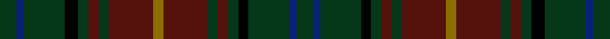

This is one **variant** — a specific cloth: this exact thread count and colourway, with its own
provenance below. It is one weaving of the [sett](/tartans/l/lo/lowland-donnelly/) (the scale-free proportion — the
same cloth at any scale or shade), whose colour order is pattern [GBGKGBGBGBGBGKGBG](/stripes/gbgkgbgbgbgbgkgbg/).

Part of the [Lowland Donnelly](/tartans/l/lo/lowland-donnelly/) tartan — the named design grouping this sett with its other cloths.

Sourced from register-of-tartans.  It is a [17 stripe tartan](/stripes/stripes17/).

Original link [https://www.tartanregister.gov.uk/tartanDetails.aspx?ref=10114](https://www.tartanregister.gov.uk/tartanDetails.aspx?ref=10114)

Dataset <small>— provenance for this record, inherited from the source manifest</small>

<dl class="dataset-prov">
<dt>source</dt><dd><a href="/sources/register-of-tartans/">Scottish Register of Tartans</a></dd>
<dt>data captured from</dt><dd><a href="https://github.com/thetartan/tartan-database/blob/master/data/register-of-tartans/data.csv">https://github.com/thetartan/tartan-database/blob/master/data/register-of-tartans/data.csv</a></dd>
<dt>data date</dt><dd>21/11/2009 <small>(this record)</small></dd>
<dt>licence</dt><dd><a href="https://www.tartanregister.gov.uk/copyright">Crown copyright</a></dd>
</dl>

Capture chain <small>— the hands this data passed through, oldest first; each capture carries its own licence</small>

<ol class="capture-chain">
<li><a href="https://www.tartanregister.gov.uk/">Scottish Register of Tartans</a> · <a href="https://www.tartanregister.gov.uk/copyright">Crown copyright</a> <small>the living register — still published by National Records of Scotland</small></li>
<li><a href="https://github.com/thetartan/tartan-database">thetartan/tartan-database</a> <small>2016-2017</small> · <a href="https://creativecommons.org/licenses/by-nc-nd/4.0/">CC BY-NC-ND 4.0</a> <small>Levko Kravets's frozen compilation — the capture we vendored, and where its CC licence text came from</small></li>
<li>this dictionary <small>captured 2026-06-10 · commit 5bf86c7566</small> <small>each re-capture is a git commit to data/sources</small></li>
</ol>

## Register references

External register numbers recorded for this tartan.

- Scottish Register of Tartans: [10114](https://www.tartanregister.gov.uk/tartanDetails.aspx?ref=10114)

## Thread count
DG/10 DB4 DG24 K8 DG6 DR6 DG6 DR26 Y6 DR26 DG6 DR6 DG6 K6 DG24 DB4 DG/10

One full sett is **348 threads**.

## Palette
<table><thead><tr><th>Colour</th><th>Shade</th><th>OKLCh</th></tr></thead><tbody><tr><td>G</td><td><code style="background-color:#008B2A;">#008B2A</code> <small style="color:#888">#008B2A</small></td><td><small style="color:#888">oklch(55.4% 0.170 145.9)</small></td></tr><tr><td>DB</td><td><code style="background-color:#082077;">#082077</code> <small style="color:#888">#082077</small></td><td><small style="color:#888">oklch(30.0% 0.149 265.1)</small></td></tr><tr><td>DG</td><td><code style="background-color:#053819;">#053819</code> <small style="color:#888">#053819</small></td><td><small style="color:#888">oklch(30.0% 0.075 151.3)</small></td></tr><tr><td>DR</td><td><code style="background-color:#55120C;">#55120C</code> <small style="color:#888">#55120C</small></td><td><small style="color:#888">oklch(30.0% 0.099 29.3)</small></td></tr><tr><td>K</td><td><code style="background-color:#000000;">#000000</code> <small style="color:#888">#000000</small></td><td><small style="color:#888">oklch(0.0% 0.000 0.0)</small></td></tr><tr><td>R</td><td><code style="background-color:#D60020;">#D60020</code> <small style="color:#888">#D60020</small></td><td><small style="color:#888">oklch(55.2% 0.224 25.5)</small></td></tr><tr><td>Y</td><td><code style="background-color:#8B6E00;">#8B6E00</code> <small style="color:#888">#8B6E00</small></td><td><small style="color:#888">oklch(55.1% 0.113 90.4)</small></td></tr></tbody></table>

# Sample pattern

[Sample sheet (PDF)](swatch.pdf) — the woven sample, thread count and palette on one printable A4, rendered on demand (the same sheet the TTD print page downloads).

## Nearest tartan variants

The nearest existing variants by ΔTartan distance, with this cloth at the top so the swatches line up against it.

ΔTartan

Threads

Variant

Sett

—

348

<a href="/variants/s17/dg5db2dg12k4dg3dr3dg3dr13y3dr13dg3dr3dg3k3dg12db2dg5~x2/">Lowland Donnelly (Personal)</a>

<a href="/ttd/edit/#slug=dg18dr3dg3dr15dy13dr14dg3dr3dg18dy5dg2k5dg3dr2dg3db5dg2lg5~x2&amp;base=dg5db2dg12k4dg3dr3dg3dr13y3dr13dg3dr3dg3k3dg12db2dg5~x2" title="compare in the TTD">2.58</a>

442

<a href="/variants/s18/dg18dr3dg3dr15dy13dr14dg3dr3dg18dy5dg2k5dg3dr2dg3db5dg2lg5~x2/">Ben Murad (Personal)</a>

<a href="/ttd/edit/#slug=ly4dg18do3dg3do3dg18k2dr4k2do16dg3do3dg3do16dg3~x2&amp;base=dg5db2dg12k4dg3dr3dg3dr13y3dr13dg3dr3dg3k3dg12db2dg5~x2" title="compare in the TTD">3.51</a>

390

<a href="/variants/s15/ly4dg18do3dg3do3dg18k2dr4k2do16dg3do3dg3do16dg3~x2/">Ontario, Ensign of</a>

<a href="/ttd/edit/#slug=k3g18do3g3do3g3do18dy3do3dy3do3dy12db2dy12do9dy12g2db2~x2&amp;base=dg5db2dg12k4dg3dr3dg3dr13y3dr13dg3dr3dg3k3dg12db2dg5~x2" title="compare in the TTD">3.72</a>

446

<a href="/variants/s18/k3g18do3g3do3g3do18dy3do3dy3do3dy12db2dy12do9dy12g2db2~x2/">Van Ingelgem Hunting (Personal)</a>

<a href="/ttd/edit/#slug=db40dg34r5dg34k6dg34y5dg34db40dbi6db40dg34y5dg34k6dg34r5dg34db40dbi6~db2911276-dbi3514276&amp;base=dg5db2dg12k4dg3dr3dg3dr13y3dr13dg3dr3dg3k3dg12db2dg5~x2" title="compare in the TTD">3.77</a>

906

<a href="/variants/s20/db40dg34r5dg34k6dg34y5dg34db40dbi6db40dg34y5dg34k6dg34r5dg34db40dbi6~db2911276-dbi3514276/">Pendleton dress Corporate Tartan</a>

<a href="/ttd/edit/#slug=lb6dg5dr5dg45k4dy24k4dg5~x2&amp;base=dg5db2dg12k4dg3dr3dg3dr13y3dr13dg3dr3dg3k3dg12db2dg5~x2" title="compare in the TTD">3.93</a>

370

<a href="/variants/s8/lb6dg5dr5dg45k4dy24k4dg5~x2/">O'Neill Clan/Family Tartan</a>

## Neighbour map

Every grey dot is one of 13662 variants placed by the first two principal components of the ΔTartan feature space (42% of its variance). Red is this tartan; blue dots are its nearest — click one to open its page. The map is a flat projection of a many-dimensional space — [how to read it](/posts/neighbourhood-maps/).

<svg viewBox="0 0 640 380" role="img" style="max-width:100%;height:auto;border:1px solid #e0e0e0;border-radius:4px;display:block" xmlns="http://www.w3.org/2000/svg"><image href="/nn/cloud.v1.png" width="640" height="380"/><a href="/variants/s18/dg18dr3dg3dr15dy13dr14dg3dr3dg18dy5dg2k5dg3dr2dg3db5dg2lg5~x2/"><circle cx="254.4" cy="177.4" r="4" fill="#3465a4"><title>Ben Murad (Personal)</title></circle></a><a href="/variants/s15/ly4dg18do3dg3do3dg18k2dr4k2do16dg3do3dg3do16dg3~x2/"><circle cx="358.7" cy="202.2" r="4" fill="#3465a4"><title>Ontario, Ensign of</title></circle></a><a href="/variants/s18/k3g18do3g3do3g3do18dy3do3dy3do3dy12db2dy12do9dy12g2db2~x2/"><circle cx="250.8" cy="190.0" r="4" fill="#3465a4"><title>Van Ingelgem Hunting (Personal)</title></circle></a><a href="/variants/s20/db40dg34r5dg34k6dg34y5dg34db40dbi6db40dg34y5dg34k6dg34r5dg34db40dbi6~db2911276-dbi3514276/"><circle cx="348.8" cy="202.4" r="4" fill="#3465a4"><title>Pendleton dress Corporate Tartan</title></circle></a><a href="/variants/s8/lb6dg5dr5dg45k4dy24k4dg5~x2/"><circle cx="384.4" cy="174.0" r="4" fill="#3465a4"><title>O'Neill Clan/Family Tartan</title></circle></a><circle cx="316.5" cy="212.9" r="5" fill="#c00000"/><text x="320" y="376" text-anchor="middle" font-size="11" fill="#999">ground</text><text x="11" y="190" text-anchor="middle" font-size="11" fill="#999" transform="rotate(-90 11 190)">complexity</text></svg>

ID: /variants/s17/dg5db2dg12k4dg3dr3dg3dr13y3dr13dg3dr3dg3k3dg12db2dg5~x2/
