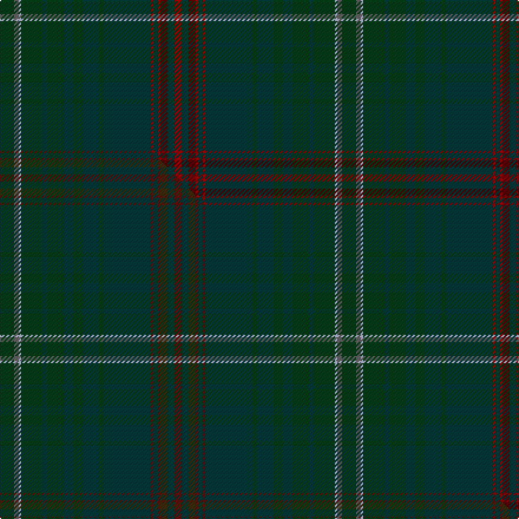

This page is one **sett** — a single exact thread-count. It belongs to the [tartan](/setts/dg6n2lb1dg9dt2dg7dt4dg4dt7dg2dt20r1dt2r1dr3dt3r3/)
(the same proportion at any scale), whose colour order is pattern [GBWGBGBGBGBRBRBBR](/stripes/gbwgbgbgbgbrbrbbr/).

Part of the [Queensferry](/tartans/queensferry/) tartan — the named design grouping this sett with its other cloths.

Sourced from tartans-authority.  It is a [17 stripe tartan](/stripes/stripes17/).

Original link https://www.tartanregister.gov.uk/tartanDetails.aspx?ref=3138

Dataset <small>— provenance for this record, inherited from the source manifest</small>

<dl class="dataset-prov">
<dt>source</dt><dd><a href="/sources/tartans-authority/">Scottish Tartans Authority</a></dd>
<dt>data captured from</dt><dd><a href="https://github.com/thetartan/tartan-database/blob/master/data/tartans-authority/data.csv">https://github.com/thetartan/tartan-database/blob/master/data/tartans-authority/data.csv</a></dd>
<dt>data date</dt><dd>Sep. 2000 <small>(this record)</small></dd>
<dt>licence</dt><dd><a href="https://creativecommons.org/licenses/by-nc-nd/4.0/">CC BY-NC-ND 4.0</a></dd>
</dl>

Capture chain <small>— the hands this data passed through, oldest first; each capture carries its own licence</small>

<ol class="capture-chain">
<li><a href="https://www.tartansauthority.com/">Scottish Tartans Authority</a> <small>the heritage body's archive — its tartan-ferret record browser is retired (links repaired to the SRT, above)</small></li>
<li><a href="https://github.com/thetartan/tartan-database">thetartan/tartan-database</a> <small>2016-2017</small> · <a href="https://creativecommons.org/licenses/by-nc-nd/4.0/">CC BY-NC-ND 4.0</a> <small>Levko Kravets's frozen compilation — the capture we vendored, and where its CC licence text came from</small></li>
<li>this dictionary <small>captured 2026-06-10 · commit 5bf86c7566</small> <small>each re-capture is a git commit to data/sources</small></li>
</ol>

## Register references

External register numbers recorded for this tartan.

- Scottish Tartans Authority (ITI): 3138

## Thread count
DG/12 N4 LB2 DG18 DT4 DG14 DT8 DG8 DT14 DG4 DT40 R2 DT4 R2 DR6 DT6 R/6

One full sett is **290 threads**.

## Palette
<table><thead><tr><th>Colour</th><th>Shade</th><th>OKLCh</th></tr></thead><tbody><tr><td>DG</td><td><code style="background-color:#053819;">#053819</code> <small style="color:#888">#053819</small></td><td><small style="color:#888">oklch(30.0% 0.075 151.3)</small></td></tr><tr><td>DT</td><td><code style="background-color:#023535;">#023535</code> <small style="color:#888">#023535</small></td><td><small style="color:#888">oklch(29.8% 0.050 194.8)</small></td></tr><tr><td>DR</td><td><code style="background-color:#4C0000;">#4C0000</code> <small style="color:#888">#4C0000</small></td><td><small style="color:#888">oklch(26.2% 0.107 29.2)</small></td></tr><tr><td>R</td><td><code style="background-color:#880000;">#880000</code> <small style="color:#888">#880000</small></td><td><small style="color:#888">oklch(39.4% 0.162 29.2)</small></td></tr><tr><td>N</td><td><code style="background-color:#636363;">#636363</code> <small style="color:#888">#636363</small></td><td><small style="color:#888">oklch(50.0% 0.000 89.9)</small></td></tr><tr><td>LB</td><td><code style="background-color:#B5BBDE;">#B5BBDE</code> <small style="color:#888">#B5BBDE</small></td><td><small style="color:#888">oklch(79.9% 0.050 277.6)</small></td></tr></tbody></table>

# Sample pattern

## Compared to the master

This cloth is one sett of its design; the master sett (the exemplar the design is anchored on) is below for comparison.

Its **ΔTartan distance** from the master is **1.20** — the same measure the nearest-tartans table ranks by (0 is identical; a re-scale of the same cloth is near 0, a recolour or a different proportion further).

<figure class="master-compare" style="margin:0">

this sett
master sett ★

<figcaption style="color:#888;font-size:smaller">One weave of this sett against the <a href="/setts/dg6n2lb1dg9dt2dg7dt4dg4dt7dg2dt20dr1dt2dr1dy3dt3dr3/">master sett ★</a>, split on the diagonal: a shared proportion runs seamlessly across it with only the shades shifting; a different proportion breaks on it.</figcaption>
</figure>

## Nearest tartan variants

The nearest existing variants by ΔTartan distance, with this cloth at the top so the swatches line up against it.

ΔTartan

Threads

Variant

Sett

—

290

<a href="/variants/s17/dg6n2lb1dg9dt2dg7dt4dg4dt7dg2dt20r1dt2r1dr3dt3r3~x2~r1606028-dr1004029/">Queensferry (District)</a>

<a href="/ttd/edit/#slug=dg6n2lb1dg9dt2dg7dt4dg4dt7dg2dt20dr1dt2dr1dy3dt3dr3~x2&amp;base=dg6n2lb1dg9dt2dg7dt4dg4dt7dg2dt20r1dt2r1dr3dt3r3~x2~r1606028-dr1004029" title="compare in the TTD">1.20</a>

290

<a href="/variants/s17/dg6n2lb1dg9dt2dg7dt4dg4dt7dg2dt20dr1dt2dr1dy3dt3dr3~x2/">Queensferry</a>

<a href="/ttd/edit/#slug=db9dg2db9dt3db3dt8dg27w1db3w1dg27dt8dg5dt13dg4dt13dg5dt8dg27o4dg27dt8db3dt3~x2&amp;base=dg6n2lb1dg9dt2dg7dt4dg4dt7dg2dt20r1dt2r1dr3dt3r3~x2~r1606028-dr1004029" title="compare in the TTD">3.04</a>

860

<a href="/variants/s24/db9dg2db9dt3db3dt8dg27w1db3w1dg27dt8dg5dt13dg4dt13dg5dt8dg27o4dg27dt8db3dt3~x2/">Barony of Gartly (Personal)</a>

## Neighbour map

Every grey dot is one of 13620 variants placed by the first two principal components of the ΔTartan feature space (42% of its variance). Red is this tartan; blue dots are its nearest — click one to open its page.

<svg viewBox="0 0 640 380" role="img" style="max-width:100%;height:auto;border:1px solid #e0e0e0;border-radius:4px;display:block" xmlns="http://www.w3.org/2000/svg"><image href="/nn/cloud.v1.png" width="640" height="380"/><a href="/variants/s17/dg6n2lb1dg9dt2dg7dt4dg4dt7dg2dt20dr1dt2dr1dy3dt3dr3~x2/"><circle cx="572.9" cy="242.1" r="4" fill="#3465a4"><title>Queensferry</title></circle></a><a href="/variants/s24/db9dg2db9dt3db3dt8dg27w1db3w1dg27dt8dg5dt13dg4dt13dg5dt8dg27o4dg27dt8db3dt3~x2/"><circle cx="523.5" cy="192.9" r="4" fill="#3465a4"><title>Barony of Gartly (Personal)</title></circle></a><circle cx="488.4" cy="202.0" r="5" fill="#c00000"/><text x="320" y="376" text-anchor="middle" font-size="11" fill="#999">ground</text><text x="11" y="190" text-anchor="middle" font-size="11" fill="#999" transform="rotate(-90 11 190)">complexity</text></svg>

ID: /variants/s17/dg6n2lb1dg9dt2dg7dt4dg4dt7dg2dt20r1dt2r1dr3dt3r3~x2~r1606028-dr1004029/
