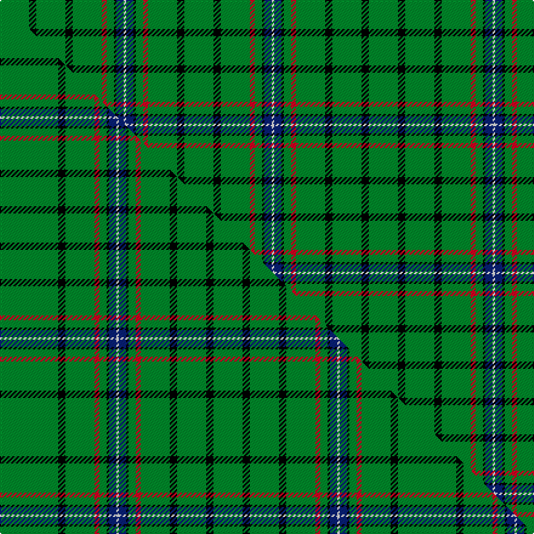

This page is one **sett** — a single exact thread-count. It belongs to the [tartan](/setts/g12k3g12k3g12r2g3k1db3w1db3k1g3r2g12k3g12/)
(the same proportion at any scale), whose colour order is pattern [GKGKGRGKBWBKGRGKG](/stripes/gkgkgrgkbwbkgrgkg/).

Part of the [MacRae](/tartans/macrae/) tartan — the named design grouping this sett with its other cloths.

Sourced from weddslist.  It is a [17 stripe tartan](/stripes/stripes17/).

Original link http://www.weddslist.com/cgi-bin/tartans/pg.pl?source=sts

## Thread count
G/24 K6 G24 K6 G24 R4 G6 K2 DB6 W2 DB6 K2 G6 R4 G24 K6 G/24

One full sett is **304 threads**.

## Palette
<table><thead><tr><th>Colour</th><th>Shade</th><th>OKLCh</th></tr></thead><tbody><tr><td>DB</td><td><code style="background-color:#082077;">#082077</code> <small style="color:#888">#082077</small></td><td><small style="color:#888">oklch(30.0% 0.149 265.1)</small></td></tr><tr><td>G</td><td><code style="background-color:#008B2A;">#008B2A</code> <small style="color:#888">#008B2A</small></td><td><small style="color:#888">oklch(55.4% 0.170 145.9)</small></td></tr><tr><td>K</td><td><code style="background-color:#000000;">#000000</code> <small style="color:#888">#000000</small></td><td><small style="color:#888">oklch(0.0% 0.000 0.0)</small></td></tr><tr><td>W</td><td><code style="background-color:#F7F7F7;">#F7F7F7</code> <small style="color:#888">#F7F7F7</small></td><td><small style="color:#888">oklch(97.6% 0.000 89.9)</small></td></tr><tr><td>R</td><td><code style="background-color:#D60020;">#D60020</code> <small style="color:#888">#D60020</small></td><td><small style="color:#888">oklch(55.2% 0.224 25.5)</small></td></tr></tbody></table>

# Sample pattern

## Compared to the master

This cloth is one sett of its design; the master sett (the exemplar the design is anchored on) is below for comparison.

Its **ΔTartan distance** from the master is **1.27** — the same measure the nearest-tartans table ranks by (0 is identical; a re-scale of the same cloth is near 0, a recolour or a different proportion further).

<figure class="master-compare" style="margin:0">

this sett
master sett ★

<figcaption style="color:#888;font-size:smaller">One weave of this sett against the <a href="/setts/g24k3g12r2g3k1db3w1db3k1g3r2g12k3g12k3g12/">master sett ★</a>, split on the diagonal: a shared proportion runs seamlessly across it with only the shades shifting; a different proportion breaks on it.</figcaption>
</figure>

## Nearest tartan variants

The nearest existing variants by ΔTartan distance, with this cloth at the top so the swatches line up against it.

ΔTartan

Threads

Variant

Sett

—

304

<a href="/variants/s17/g12k3g12k3g12r2g3k1db3w1db3k1g3r2g12k3g12~x2/">MacRae</a>

<a href="/ttd/edit/#slug=g24k3g12r2g3k1db3w1db3k1g3r2g12k3g12k3g12~x2&amp;base=g12k3g12k3g12r2g3k1db3w1db3k1g3r2g12k3g12~x2" title="compare in the TTD">0.13</a>

328

<a href="/variants/s17/g24k3g12r2g3k1db3w1db3k1g3r2g12k3g12k3g12~x2/">MacRae</a>

<a href="/ttd/edit/#slug=g3y1g3r1g14k2g3k1g3b1g2b1g2b3~x4&amp;base=g12k3g12k3g12r2g3k1db3w1db3k1g3r2g12k3g12~x2" title="compare in the TTD">2.96</a>

296

<a href="/variants/s14/g3y1g3r1g14k2g3k1g3b1g2b1g2b3~x4/">New South Wales</a>

<a href="/ttd/edit/#slug=dg5g7dg4g2dg2g3dg4k6dg3k6dg34r2dg4r2~x2~dg1806142-g2408144&amp;base=g12k3g12k3g12r2g3k1db3w1db3k1g3r2g12k3g12~x2" title="compare in the TTD">2.98</a>

322

<a href="/variants/s14/dg5g7dg4g2dg2g3dg4k6dg3k6dg34r2dg4r2~x2~dg1806142-g2408144/">Ross Hunting #3</a>

## Neighbour map

Every grey dot is one of 13620 variants placed by the first two principal components of the ΔTartan feature space (42% of its variance). Red is this tartan; blue dots are its nearest — click one to open its page.

<svg viewBox="0 0 640 380" role="img" style="max-width:100%;height:auto;border:1px solid #e0e0e0;border-radius:4px;display:block" xmlns="http://www.w3.org/2000/svg"><image href="/nn/cloud.v1.png" width="640" height="380"/><a href="/variants/s17/g24k3g12r2g3k1db3w1db3k1g3r2g12k3g12k3g12~x2/"><circle cx="406.3" cy="98.0" r="4" fill="#3465a4"><title>MacRae</title></circle></a><a href="/variants/s14/g3y1g3r1g14k2g3k1g3b1g2b1g2b3~x4/"><circle cx="399.7" cy="129.0" r="4" fill="#3465a4"><title>New South Wales</title></circle></a><a href="/variants/s14/dg5g7dg4g2dg2g3dg4k6dg3k6dg34r2dg4r2~x2~dg1806142-g2408144/"><circle cx="367.4" cy="121.4" r="4" fill="#3465a4"><title>Ross Hunting #3</title></circle></a><circle cx="346.1" cy="135.5" r="5" fill="#c00000"/><text x="320" y="376" text-anchor="middle" font-size="11" fill="#999">ground</text><text x="11" y="190" text-anchor="middle" font-size="11" fill="#999" transform="rotate(-90 11 190)">complexity</text></svg>

ID: /variants/s17/g12k3g12k3g12r2g3k1db3w1db3k1g3r2g12k3g12~x2/
