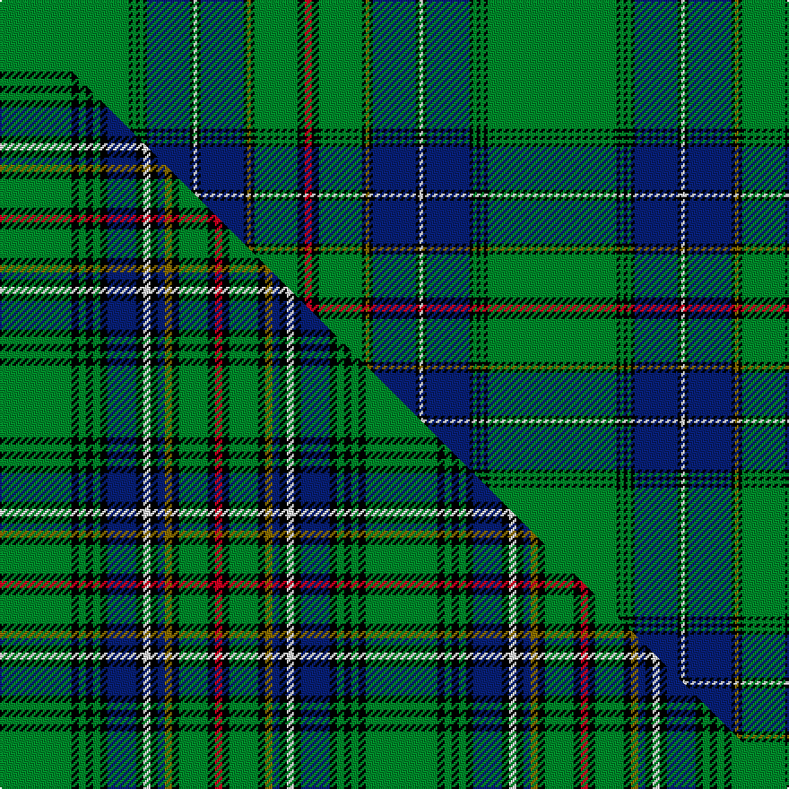

This page is one **sett** — a single exact thread-count. It belongs to the [tartan](/setts/g36k1g1k1g1k1db12k1w1k1db12k1y1k1g12k2r2/)
(the same proportion at any scale), whose colour order is pattern [GKGKGKBKWKBKGKGKR](/stripes/gkgkgkbkwkbkgkgkr/).

Part of the [Cockburn](/tartans/cockburn/) tartan — the named design grouping this sett with its other cloths.

Sourced from weddslist.  It is a [17 stripe tartan](/stripes/stripes17/).

Original link http://www.weddslist.com/cgi-bin/tartans/pg.pl?source=sts

## Provenance

Earliest known date: 1906 A curious mistake, which perhaps throws light on the use of names for tartans, was made in the certification of the Cockburn sett in the 'Cockburn Collection' (1810-15). Sir William Cockburn of Cockburn, himself, signed and sealed a specimen of his own tartan which was later discovered to be the 'MacKenzie', the tartan worn by the 71st Highland Light Infantry in which he served. The label has since been removed and it is fairly certain that a distinct 'Cockburn' sett was in production at the time, recorded later in Wilson's of Bannockburn pattern books. (1819). The sett in use today varies considerably from the old pattern in terms of proportion but retains the distinctive red yellow and white stripes. It was first recorded by W. and A.K. Johnston in 1906.

3 attestations — the source records this cloth was collapsed from (oldest owns this page)

<ul>
<li>undated — Cockburn (weddslist, <a href="http://www.weddslist.com/cgi-bin/tartans/pg.pl?source=sts">record</a>) </li>
<li>undated — Cockburn (weddslist, <a href="http://www.weddslist.com/cgi-bin/tartans/pg.pl?source=tinsel">record</a>) </li>
<li>undated — Cockburn Clan Tartan (house-of-tartan, <a href="http://www.house-of-tartan.scotland.net/house/TartanViewjs.asp?colr=Def&tnam=798">record</a>) </li>
</ul>

## Thread count
G/72 K2 G2 K2 G2 K2 DB24 K2 W2 K2 DB24 K2 Y2 K2 G24 K4 R/4

One full sett is **272 threads**.

## Palette
<table><thead><tr><th>Colour</th><th>Shade</th><th>OKLCh</th></tr></thead><tbody><tr><td>DB</td><td><code style="background-color:#082077;">#082077</code> <small style="color:#888">#082077</small></td><td><small style="color:#888">oklch(30.0% 0.149 265.1)</small></td></tr><tr><td>G</td><td><code style="background-color:#008B2A;">#008B2A</code> <small style="color:#888">#008B2A</small></td><td><small style="color:#888">oklch(55.4% 0.170 145.9)</small></td></tr><tr><td>K</td><td><code style="background-color:#000000;">#000000</code> <small style="color:#888">#000000</small></td><td><small style="color:#888">oklch(0.0% 0.000 0.0)</small></td></tr><tr><td>W</td><td><code style="background-color:#F7F7F7;">#F7F7F7</code> <small style="color:#888">#F7F7F7</small></td><td><small style="color:#888">oklch(97.6% 0.000 89.9)</small></td></tr><tr><td>R</td><td><code style="background-color:#D60020;">#D60020</code> <small style="color:#888">#D60020</small></td><td><small style="color:#888">oklch(55.2% 0.224 25.5)</small></td></tr><tr><td>Y</td><td><code style="background-color:#8B6E00;">#8B6E00</code> <small style="color:#888">#8B6E00</small></td><td><small style="color:#888">oklch(55.1% 0.113 90.4)</small></td></tr></tbody></table>

# Sample pattern

## Compared to the master

This cloth is one sett of its design; the master sett (the exemplar the design is anchored on) is below for comparison.

Its **ΔTartan distance** from the master is **2.41** — the same measure the nearest-tartans table ranks by (0 is identical; a re-scale of the same cloth is near 0, a recolour or a different proportion further).

<figure class="master-compare" style="margin:0">

this sett
master sett ★

<figcaption style="color:#888;font-size:smaller">One weave of this sett against the <a href="/setts/g10k1g1k1g1k1db4k1w1k1db1y1k1g4k1r1/">master sett ★</a>, split on the diagonal: a shared proportion runs seamlessly across it with only the shades shifting; a different proportion breaks on it.</figcaption>
</figure>

## Nearest variants

The nearest existing variants by ΔTartan distance, with this cloth at the top so the swatches line up against it.

ΔTartan

Threads

Variant

Sett

—

272

<a href="/variants/s17/g36k1g1k1g1k1db12k1w1k1db12k1y1k1g12k2r2~x2/">Cockburn</a>

<a href="/ttd/edit/#slug=g36k1g1k1g1k1db12k1w1k1db12k1y1k1g12k2r2&amp;base=g36k1g1k1g1k1db12k1w1k1db12k1y1k1g12k2r2~x2" title="compare in the TTD">0.00</a>

136

<a href="/variants/s17/g36k1g1k1g1k1db12k1w1k1db12k1y1k1g12k2r2/">Cockburn</a>

<a href="/ttd/edit/#slug=dg39k2dg2k2dg2k3t13k2w4k2t13k3dg24y3~x2&amp;base=g36k1g1k1g1k1db12k1w1k1db12k1y1k1g12k2r2~x2" title="compare in the TTD">1.72</a>

372

<a href="/variants/s14/dg39k2dg2k2dg2k3t13k2w4k2t13k3dg24y3~x2/">Proctor (Name)</a>

<a href="/ttd/edit/#slug=g82k2g2k2g2k8db28k1w6k1db28k1dy6k1g32k2r5k2g15w6~x2&amp;base=g36k1g1k1g1k1db12k1w1k1db12k1y1k1g12k2r2~x2" title="compare in the TTD">2.19</a>

752

<a href="/variants/s20/g82k2g2k2g2k8db28k1w6k1db28k1dy6k1g32k2r5k2g15w6~x2/">Unnamed No 38 Artifact Tartan</a>

<a href="/ttd/edit/#slug=g82k2g2k2g2k8db28k1w6k1db28k1y6k1g32k2r5k2g15w6~x2&amp;base=g36k1g1k1g1k1db12k1w1k1db12k1y1k1g12k2r2~x2" title="compare in the TTD">2.19</a>

752

<a href="/variants/s20/g82k2g2k2g2k8db28k1w6k1db28k1y6k1g32k2r5k2g15w6~x2/">Unidentified #30</a>

## Neighbour map

Every grey dot is one of 13620 variants placed by the first two principal components of the ΔTartan feature space (42% of its variance). Red is this tartan; blue dots are its nearest — click one to open its page.

<svg viewBox="0 0 640 380" role="img" style="max-width:100%;height:auto;border:1px solid #e0e0e0;border-radius:4px;display:block" xmlns="http://www.w3.org/2000/svg"><image href="/nn/cloud.v1.png" width="640" height="380"/><a href="/variants/s17/g36k1g1k1g1k1db12k1w1k1db12k1y1k1g12k2r2/"><circle cx="290.5" cy="33.9" r="4" fill="#3465a4"><title>Cockburn</title></circle></a><a href="/variants/s14/dg39k2dg2k2dg2k3t13k2w4k2t13k3dg24y3~x2/"><circle cx="298.7" cy="99.6" r="4" fill="#3465a4"><title>Proctor (Name)</title></circle></a><a href="/variants/s20/g82k2g2k2g2k8db28k1w6k1db28k1dy6k1g32k2r5k2g15w6~x2/"><circle cx="279.3" cy="16.8" r="4" fill="#3465a4"><title>Unnamed No 38 Artifact Tartan</title></circle></a><a href="/variants/s20/g82k2g2k2g2k8db28k1w6k1db28k1y6k1g32k2r5k2g15w6~x2/"><circle cx="279.7" cy="17.1" r="4" fill="#3465a4"><title>Unidentified #30</title></circle></a><circle cx="290.5" cy="33.9" r="5" fill="#c00000"/><text x="320" y="376" text-anchor="middle" font-size="11" fill="#999">ground</text><text x="11" y="190" text-anchor="middle" font-size="11" fill="#999" transform="rotate(-90 11 190)">complexity</text></svg>

ID: /variants/s17/g36k1g1k1g1k1db12k1w1k1db12k1y1k1g12k2r2~x2/
