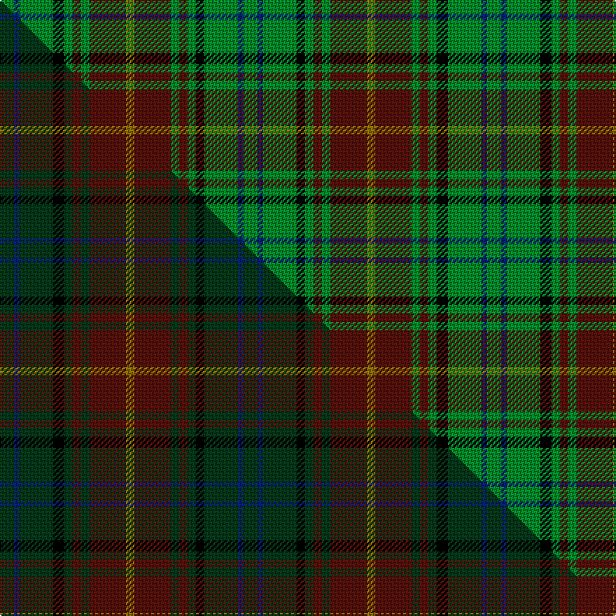

This is one **variant** — a specific cloth: this exact thread count and colourway, with its own
provenance below. It is one weaving of the [sett](/setts/g5db2g12k4g3dr3g3dr13y3dr13g3dr3g3k3g12db2g5/) (the scale-free proportion — the
same cloth at any scale or shade), whose colour order is pattern [GBGKGBGBGBGBGKGBG](/stripes/gbgkgbgbgbgbgkgbg/).

Part of the [Lowland Donnelly](/tartans/l/lo/lowland-donnelly/) tartan — the named design grouping this sett with its other cloths.

Sourced from tartans-authority.  It is a [17 stripe tartan](/stripes/stripes17/).

Original link [https://www.tartanregister.gov.uk/tartanDetails.aspx?ref=10114](https://www.tartanregister.gov.uk/tartanDetails.aspx?ref=10114)

Dataset <small>— provenance for this record, inherited from the source manifest</small>

<dl class="dataset-prov">
<dt>source</dt><dd><a href="/sources/tartans-authority/">Scottish Tartans Authority</a></dd>
<dt>data captured from</dt><dd><a href="https://github.com/thetartan/tartan-database/blob/master/data/tartans-authority/data.csv">https://github.com/thetartan/tartan-database/blob/master/data/tartans-authority/data.csv</a></dd>
<dt>data date</dt><dd>21st Noc. 2009 <small>(this record)</small></dd>
<dt>licence</dt><dd><a href="https://creativecommons.org/licenses/by-nc-nd/4.0/">CC BY-NC-ND 4.0</a></dd>
</dl>

Capture chain <small>— the hands this data passed through, oldest first; each capture carries its own licence</small>

<ol class="capture-chain">
<li><a href="https://www.tartansauthority.com/">Scottish Tartans Authority</a> <small>the heritage body's archive — its tartan-ferret record browser is retired (links repaired to the SRT, above)</small></li>
<li><a href="https://github.com/thetartan/tartan-database">thetartan/tartan-database</a> <small>2016-2017</small> · <a href="https://creativecommons.org/licenses/by-nc-nd/4.0/">CC BY-NC-ND 4.0</a> <small>Levko Kravets's frozen compilation — the capture we vendored, and where its CC licence text came from</small></li>
<li>this dictionary <small>captured 2026-06-10 · commit 5bf86c7566</small> <small>each re-capture is a git commit to data/sources</small></li>
</ol>

## Register references

External register numbers recorded for this tartan.

- Scottish Register of Tartans: [10114](https://www.tartanregister.gov.uk/tartanDetails?ref=10114)
- Scottish Tartans Authority (ITI): 10114

## Thread count
G/10 DB4 G24 K8 G6 DR6 G6 DR26 Y6 DR26 G6 DR6 G6 K6 G24 DB4 G/10

One full sett is **348 threads**.

## Palette
<table><thead><tr><th>Colour</th><th>Shade</th><th>OKLCh</th></tr></thead><tbody><tr><td>DB</td><td><code style="background-color:#082077;">#082077</code> <small style="color:#888">#082077</small></td><td><small style="color:#888">oklch(30.0% 0.149 265.1)</small></td></tr><tr><td>DR</td><td><code style="background-color:#55120C;">#55120C</code> <small style="color:#888">#55120C</small></td><td><small style="color:#888">oklch(30.0% 0.099 29.3)</small></td></tr><tr><td>G</td><td><code style="background-color:#008B2A;">#008B2A</code> <small style="color:#888">#008B2A</small></td><td><small style="color:#888">oklch(55.4% 0.170 145.9)</small></td></tr><tr><td>K</td><td><code style="background-color:#000000;">#000000</code> <small style="color:#888">#000000</small></td><td><small style="color:#888">oklch(0.0% 0.000 0.0)</small></td></tr><tr><td>Y</td><td><code style="background-color:#8B6E00;">#8B6E00</code> <small style="color:#888">#8B6E00</small></td><td><small style="color:#888">oklch(55.1% 0.113 90.4)</small></td></tr></tbody></table>

# Sample pattern

## Compared to the master

This cloth is one sett of its design; the master sett (the exemplar the design is anchored on) is below for comparison.

Its **ΔTartan distance** from the master is **0.19** — the same measure the nearest-tartans table ranks by (0 is identical; a re-scale of the same cloth is near 0, a recolour or a different proportion further).

<figure class="master-compare" style="margin:0">

this sett
master sett ★

<figcaption style="color:#888;font-size:smaller">One weave of this sett against the <a href="/setts/dg5db2dg12k4dg3dr3dg3dr13y3dr13dg3dr3dg3k3dg12db2dg5/">master sett ★</a>, split on the diagonal: a shared proportion runs seamlessly across it with only the shades shifting; a different proportion breaks on it.</figcaption>
</figure>

## Nearest tartan variants

The nearest existing variants by ΔTartan distance, with this cloth at the top so the swatches line up against it.

ΔTartan

Threads

Variant

Sett

—

348

<a href="/variants/s17/g5db2g12k4g3dr3g3dr13y3dr13g3dr3g3k3g12db2g5~x2/">Lowland Donnelly (Personal)</a>

<a href="/ttd/edit/#slug=k1g1dr1g1lo1g1lo1g4db1k1db1k1db1k1db1g7dr1~x4&amp;base=g5db2g12k4g3dr3g3dr13y3dr13g3dr3g3k3g12db2g5~x2" title="compare in the TTD">3.00</a>

200

<a href="/variants/s17/k1g1dr1g1lo1g1lo1g4db1k1db1k1db1k1db1g7dr1~x4/">Myron</a>

<a href="/ttd/edit/#slug=n3g12k5g2k5n2dr2n2k5g12w2n3~x2&amp;base=g5db2g12k4g3dr3g3dr13y3dr13g3dr3g3k3g12db2g5~x2" title="compare in the TTD">3.08</a>

208

<a href="/variants/s12/n3g12k5g2k5n2dr2n2k5g12w2n3~x2/">Wilcox, Yu, Cruikshank Reunion</a>

<a href="/ttd/edit/#slug=k2g10n5g20n5y3n7k3n7k4n4w2~x2&amp;base=g5db2g12k4g3dr3g3dr13y3dr13g3dr3g3k3g12db2g5~x2" title="compare in the TTD">3.08</a>

280

<a href="/variants/s12/k2g10n5g20n5y3n7k3n7k4n4w2~x2/">Aceo</a>

<a href="/ttd/edit/#slug=r4k1dg8g2dg8k4g8k1db2k1g8k4dg8k2dg8k1y2~x2~dg1504144-g2007139&amp;base=g5db2g12k4g3dr3g3dr13y3dr13g3dr3g3k3g12db2g5~x2" title="compare in the TTD">3.19</a>

276

<a href="/variants/s17/r4k1dg8g2dg8k4g8k1db2k1g8k4dg8k2dg8k1y2~x2~dg1504144-g2007139/">Redmond (2014)</a>

<a href="/ttd/edit/#slug=k4g20dy4g20dy26g4k10dr3k16g18dy4g20k4&amp;base=g5db2g12k4g3dr3g3dr13y3dr13g3dr3g3k3g12db2g5~x2" title="compare in the TTD">3.27</a>

298

<a href="/variants/s13/k4g20dy4g20dy26g4k10dr3k16g18dy4g20k4/">Greenshields, Alan (Personal)</a>

<a href="/ttd/edit/#slug=db1dy9g5dy1k5dy1g5dy9w1~x2&amp;base=g5db2g12k4g3dr3g3dr13y3dr13g3dr3g3k3g12db2g5~x2" title="compare in the TTD">3.28</a>

144

<a href="/variants/s9/db1dy9g5dy1k5dy1g5dy9w1~x2/">Duchess of York</a>

<a href="/ttd/edit/#slug=w1r2g10r2g2k8g2db8g2r2g10r2w1~x4&amp;base=g5db2g12k4g3dr3g3dr13y3dr13g3dr3g3k3g12db2g5~x2" title="compare in the TTD">3.29</a>

408

<a href="/variants/s13/w1r2g10r2g2k8g2db8g2r2g10r2w1~x4/">Reid, Green</a>

<a href="/ttd/edit/#slug=w1r2g10r2g2k8g2db8g2r2g10r2w1~x2&amp;base=g5db2g12k4g3dr3g3dr13y3dr13g3dr3g3k3g12db2g5~x2" title="compare in the TTD">3.29</a>

204

<a href="/variants/s13/w1r2g10r2g2k8g2db8g2r2g10r2w1~x2/">Reid Family Tartan</a>

<a href="/ttd/edit/#slug=g20dy4g18k16dr3k10g4dy26g20dy4g20k4g20dy4g20dy26g4k10dr3k16g18dy4g20k4&amp;base=g5db2g12k4g3dr3g3dr13y3dr13g3dr3g3k3g12db2g5~x2" title="compare in the TTD">3.36</a>

572

<a href="/variants/s24/g20dy4g18k16dr3k10g4dy26g20dy4g20k4g20dy4g20dy26g4k10dr3k16g18dy4g20k4/">Greenshields (Personal)</a>

<a href="/ttd/edit/#slug=g4db9k3db3k8g27r8g27k8g5k13g8k13g5k8g27y8g27k8db3k3db9g4&amp;base=g5db2g12k4g3dr3g3dr13y3dr13g3dr3g3k3g12db2g5~x2" title="compare in the TTD">3.37</a>

468

<a href="/variants/s23/g4db9k3db3k8g27r8g27k8g5k13g8k13g5k8g27y8g27k8db3k3db9g4/">Stewart Hunting Early</a>

## Neighbour map

Every grey dot is one of 13656 variants placed by the first two principal components of the ΔTartan feature space (42% of its variance). Red is this tartan; blue dots are its nearest — click one to open its page. The map is a flat projection of a many-dimensional space — [how to read it](/posts/neighbourhood-maps/).

<svg viewBox="0 0 640 380" role="img" style="max-width:100%;height:auto;border:1px solid #e0e0e0;border-radius:4px;display:block" xmlns="http://www.w3.org/2000/svg"><image href="/nn/cloud.v1.png" width="640" height="380"/><a href="/variants/s17/k1g1dr1g1lo1g1lo1g4db1k1db1k1db1k1db1g7dr1~x4/"><circle cx="187.5" cy="143.5" r="4" fill="#3465a4"><title>Myron</title></circle></a><a href="/variants/s12/n3g12k5g2k5n2dr2n2k5g12w2n3~x2/"><circle cx="142.6" cy="179.9" r="4" fill="#3465a4"><title>Wilcox, Yu, Cruikshank Reunion</title></circle></a><a href="/variants/s12/k2g10n5g20n5y3n7k3n7k4n4w2~x2/"><circle cx="186.8" cy="175.0" r="4" fill="#3465a4"><title>Aceo</title></circle></a><a href="/variants/s17/r4k1dg8g2dg8k4g8k1db2k1g8k4dg8k2dg8k1y2~x2~dg1504144-g2007139/"><circle cx="142.8" cy="163.3" r="4" fill="#3465a4"><title>Redmond (2014)</title></circle></a><a href="/variants/s13/k4g20dy4g20dy26g4k10dr3k16g18dy4g20k4/"><circle cx="207.4" cy="184.8" r="4" fill="#3465a4"><title>Greenshields, Alan (Personal)</title></circle></a><a href="/variants/s9/db1dy9g5dy1k5dy1g5dy9w1~x2/"><circle cx="233.4" cy="182.4" r="4" fill="#3465a4"><title>Duchess of York</title></circle></a><a href="/variants/s13/w1r2g10r2g2k8g2db8g2r2g10r2w1~x4/"><circle cx="169.1" cy="149.0" r="4" fill="#3465a4"><title>Reid, Green</title></circle></a><a href="/variants/s13/w1r2g10r2g2k8g2db8g2r2g10r2w1~x2/"><circle cx="169.1" cy="149.0" r="4" fill="#3465a4"><title>Reid Family Tartan</title></circle></a><a href="/variants/s24/g20dy4g18k16dr3k10g4dy26g20dy4g20k4g20dy4g20dy26g4k10dr3k16g18dy4g20k4/"><circle cx="206.6" cy="170.2" r="4" fill="#3465a4"><title>Greenshields (Personal)</title></circle></a><a href="/variants/s23/g4db9k3db3k8g27r8g27k8g5k13g8k13g5k8g27y8g27k8db3k3db9g4/"><circle cx="191.7" cy="137.3" r="4" fill="#3465a4"><title>Stewart Hunting Early</title></circle></a><circle cx="198.0" cy="176.1" r="5" fill="#c00000"/><text x="320" y="376" text-anchor="middle" font-size="11" fill="#999">ground</text><text x="11" y="190" text-anchor="middle" font-size="11" fill="#999" transform="rotate(-90 11 190)">complexity</text></svg>

ID: /variants/s17/g5db2g12k4g3dr3g3dr13y3dr13g3dr3g3k3g12db2g5~x2/
