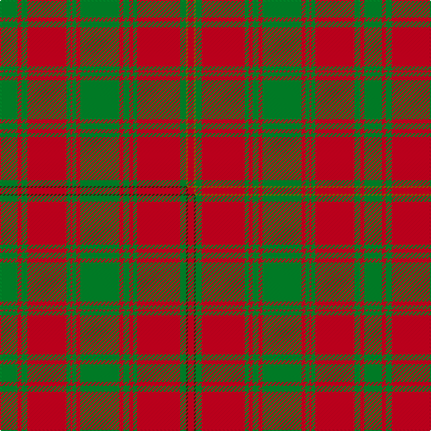

This is one **variant** — a specific cloth: this exact thread count and colourway, with its own
provenance below. It is one weaving of the [sett](/tartans/h/he/hebrides-outer/) (the scale-free proportion — the
same cloth at any scale or shade), whose colour order is pattern [GRGRGRGRGRGRGRGGR](/stripes/grgrgrgrgrgrgrggr/).

Part of the [Hebrides, Outer](/tartans/h/he/hebrides-outer/) tartan — the named design grouping this sett with its other cloths.

Sourced from weddslist.  It is a [17 stripe tartan](/stripes/stripes17/).

Original link [http://www.weddslist.com/cgi-bin/tartans/pg.pl?source=sts](http://www.weddslist.com/cgi-bin/tartans/pg.pl?source=sts)

Dataset <small>— provenance for this record, inherited from the source manifest</small>

<dl class="dataset-prov">
<dt>source</dt><dd><a href="/sources/weddslist/">Weddslist</a></dd>
<dt>data captured from</dt><dd><a href="https://github.com/thetartan/tartan-database/blob/master/data/weddslist/data.csv">https://github.com/thetartan/tartan-database/blob/master/data/weddslist/data.csv</a></dd>
<dt>data date</dt><dd>2016-11-17 <small>(dataset default)</small></dd>
<dt>licence</dt><dd><a href="https://creativecommons.org/licenses/by-nc-nd/4.0/">CC BY-NC-ND 4.0</a></dd>
</dl>

Capture chain <small>— the hands this data passed through, oldest first; each capture carries its own licence</small>

<ol class="capture-chain">
<li><a href="https://www.weddslist.com/tartans/">Weddslist</a> <small>the living privately compiled reference</small></li>
<li><a href="https://github.com/thetartan/tartan-database">thetartan/tartan-database</a> <small>2016-2017</small> · <a href="https://creativecommons.org/licenses/by-nc-nd/4.0/">CC BY-NC-ND 4.0</a> <small>Levko Kravets's frozen compilation — the capture we vendored, and where its CC licence text came from</small></li>
<li>this dictionary <small>captured 2026-06-10 · commit 5bf86c7566</small> <small>each re-capture is a git commit to data/sources</small></li>
</ol>

## Thread count
G/18 R4 G6 R40 G4 R2 G4 R4 G40 R4 G6 R4 G4 R44 G6 Y2 R/6

One full sett is **372 threads**.

## Palette
<table><thead><tr><th>Colour</th><th>Shade</th><th>OKLCh</th></tr></thead><tbody><tr><td>G</td><td><code style="background-color:#008B2A;">#008B2A</code> <small style="color:#888">#008B2A</small></td><td><small style="color:#888">oklch(55.4% 0.170 145.9)</small></td></tr><tr><td>R</td><td><code style="background-color:#D60020;">#D60020</code> <small style="color:#888">#D60020</small></td><td><small style="color:#888">oklch(55.2% 0.224 25.5)</small></td></tr><tr><td>Y</td><td><code style="background-color:#8B6E00;">#8B6E00</code> <small style="color:#888">#8B6E00</small></td><td><small style="color:#888">oklch(55.1% 0.113 90.4)</small></td></tr></tbody></table>

# Sample pattern

## Compared to the master

This cloth is one sett of its design; the master sett (the exemplar the design is anchored on) is below for comparison.

Its **ΔTartan distance** from the master is **0.01** — the same measure the nearest-tartans table ranks by (0 is identical; a re-scale of the same cloth is near 0, a recolour or a different proportion further).

<figure class="master-compare" style="margin:0">

this sett
master sett ★

<figcaption style="color:#888;font-size:smaller">One weave of this sett against the <a href="/setts/g9r2g3r20g2r1g2r2g20r2g3r2g2r22g3dy1r3/">master sett ★</a>, split on the diagonal: a shared proportion runs seamlessly across it with only the shades shifting; a different proportion breaks on it.</figcaption>
</figure>

## Nearest tartan variants

The nearest existing variants by ΔTartan distance, with this cloth at the top so the swatches line up against it.

ΔTartan

Threads

Variant

Sett

—

372

<a href="/variants/s17/g9r2g3r20g2r1g2r2g20r2g3r2g2r22g3y1r3~x2/">Hebrides Outer</a>

<a href="/ttd/edit/#slug=g9r2g3r20g2r1g2r2g20r2g3r2g2r22g3dy1r3~x2&amp;base=g9r2g3r20g2r1g2r2g20r2g3r2g2r22g3y1r3~x2" title="compare in the TTD">0.01</a>

372

<a href="/variants/s17/g9r2g3r20g2r1g2r2g20r2g3r2g2r22g3dy1r3~x2/">Hebrides, Outer</a>

<a href="/ttd/edit/#slug=g20r3g6r6g6r8dp2r2g20r2dp2r46dp3r8~x2&amp;base=g9r2g3r20g2r1g2r2g20r2g3r2g2r22g3y1r3~x2" title="compare in the TTD">1.40</a>

480

<a href="/variants/s14/g20r3g6r6g6r8dp2r2g20r2dp2r46dp3r8~x2/">MacAlister of Glenbarr</a>

<a href="/ttd/edit/#slug=g19r7g7r7g7r14db3r3g19r3db3r66db7r14~x2&amp;base=g9r2g3r20g2r1g2r2g20r2g3r2g2r22g3y1r3~x2" title="compare in the TTD">2.65</a>

650

<a href="/variants/s14/g19r7g7r7g7r14db3r3g19r3db3r66db7r14~x2/">MacGillivray Hunting Clan Tartan</a>

<a href="/ttd/edit/#slug=g15r1g1r1g1r18g24r1g1r18g1r1g1r3~x2&amp;base=g9r2g3r20g2r1g2r2g20r2g3r2g2r22g3y1r3~x2" title="compare in the TTD">2.65</a>

312

<a href="/variants/s14/g15r1g1r1g1r18g24r1g1r18g1r1g1r3~x2/">Robertson - 1746 (Artefact)</a>

<a href="/ttd/edit/#slug=r13g2r13dy2r4dy2r4dy2r42dy2r4dy2r4dy2r13g2r13g8r2g36r2g2~x2&amp;base=g9r2g3r20g2r1g2r2g20r2g3r2g2r22g3y1r3~x2" title="compare in the TTD">2.86</a>

674

<a href="/variants/s22/r13g2r13dy2r4dy2r4dy2r42dy2r4dy2r4dy2r13g2r13g8r2g36r2g2~x2/">Unidentified Cant #05</a>

<a href="/ttd/edit/#slug=r60db2r2g63r2db2r2db20r2db2r54g2r2g40&amp;base=g9r2g3r20g2r1g2r2g20r2g3r2g2r22g3y1r3~x2" title="compare in the TTD">2.94</a>

410

<a href="/variants/s14/r60db2r2g63r2db2r2db20r2db2r54g2r2g40/">Bruce - 1819 (Old)</a>

<a href="/ttd/edit/#slug=r2g1lo1g12r1g1r1g4r17g3r2g1r2lr2~x4&amp;base=g9r2g3r20g2r1g2r2g20r2g3r2g2r22g3y1r3~x2" title="compare in the TTD">2.94</a>

384

<a href="/variants/s14/r2g1lo1g12r1g1r1g4r17g3r2g1r2lr2~x4/">Hayes</a>

<a href="/ttd/edit/#slug=g18r3g2r2db6r2g2r24g1r2g6~x2&amp;base=g9r2g3r20g2r1g2r2g20r2g3r2g2r22g3y1r3~x2" title="compare in the TTD">3.02</a>

224

<a href="/variants/s11/g18r3g2r2db6r2g2r24g1r2g6~x2/">MacDonell of Glengarry #4</a>

<a href="/ttd/edit/#slug=r19y1db1r2g18r2db1y1r2db4r2y1db1r19g2r2g2~x2&amp;base=g9r2g3r20g2r1g2r2g20r2g3r2g2r22g3y1r3~x2" title="compare in the TTD">3.05</a>

278

<a href="/variants/s17/r19y1db1r2g18r2db1y1r2db4r2y1db1r19g2r2g2~x2/">Munro (Logan)</a>

<a href="/ttd/edit/#slug=w4r22g3r3g3r3g13r4g13r3g3r3g3r23w2r2w4~x2&amp;base=g9r2g3r20g2r1g2r2g20r2g3r2g2r22g3y1r3~x2" title="compare in the TTD">3.14</a>

428

<a href="/variants/s17/w4r22g3r3g3r3g13r4g13r3g3r3g3r23w2r2w4~x2/">Rothesay, Duke of</a>

## Neighbour map

Every grey dot is one of 13657 variants placed by the first two principal components of the ΔTartan feature space (42% of its variance). Red is this tartan; blue dots are its nearest — click one to open its page. The map is a flat projection of a many-dimensional space — [how to read it](/posts/neighbourhood-maps/).

<svg viewBox="0 0 640 380" role="img" style="max-width:100%;height:auto;border:1px solid #e0e0e0;border-radius:4px;display:block" xmlns="http://www.w3.org/2000/svg"><image href="/nn/cloud.v1.png" width="640" height="380"/><a href="/variants/s17/g9r2g3r20g2r1g2r2g20r2g3r2g2r22g3dy1r3~x2/"><circle cx="396.0" cy="107.4" r="4" fill="#3465a4"><title>Hebrides, Outer</title></circle></a><a href="/variants/s14/g20r3g6r6g6r8dp2r2g20r2dp2r46dp3r8~x2/"><circle cx="398.2" cy="136.9" r="4" fill="#3465a4"><title>MacAlister of Glenbarr</title></circle></a><a href="/variants/s14/g19r7g7r7g7r14db3r3g19r3db3r66db7r14~x2/"><circle cx="428.2" cy="132.3" r="4" fill="#3465a4"><title>MacGillivray Hunting Clan Tartan</title></circle></a><a href="/variants/s14/g15r1g1r1g1r18g24r1g1r18g1r1g1r3~x2/"><circle cx="417.4" cy="149.9" r="4" fill="#3465a4"><title>Robertson - 1746 (Artefact)</title></circle></a><a href="/variants/s22/r13g2r13dy2r4dy2r4dy2r42dy2r4dy2r4dy2r13g2r13g8r2g36r2g2~x2/"><circle cx="440.7" cy="114.5" r="4" fill="#3465a4"><title>Unidentified Cant #05</title></circle></a><a href="/variants/s14/r60db2r2g63r2db2r2db20r2db2r54g2r2g40/"><circle cx="357.0" cy="120.5" r="4" fill="#3465a4"><title>Bruce - 1819 (Old)</title></circle></a><a href="/variants/s14/r2g1lo1g12r1g1r1g4r17g3r2g1r2lr2~x4/"><circle cx="343.2" cy="111.3" r="4" fill="#3465a4"><title>Hayes</title></circle></a><a href="/variants/s11/g18r3g2r2db6r2g2r24g1r2g6~x2/"><circle cx="352.9" cy="147.8" r="4" fill="#3465a4"><title>MacDonell of Glengarry #4</title></circle></a><a href="/variants/s17/r19y1db1r2g18r2db1y1r2db4r2y1db1r19g2r2g2~x2/"><circle cx="381.6" cy="110.6" r="4" fill="#3465a4"><title>Munro (Logan)</title></circle></a><a href="/variants/s17/w4r22g3r3g3r3g13r4g13r3g3r3g3r23w2r2w4~x2/"><circle cx="337.5" cy="160.8" r="4" fill="#3465a4"><title>Rothesay, Duke of</title></circle></a><circle cx="403.6" cy="135.4" r="5" fill="#c00000"/><text x="320" y="376" text-anchor="middle" font-size="11" fill="#999">ground</text><text x="11" y="190" text-anchor="middle" font-size="11" fill="#999" transform="rotate(-90 11 190)">complexity</text></svg>

ID: /variants/s17/g9r2g3r20g2r1g2r2g20r2g3r2g2r22g3y1r3~x2/
