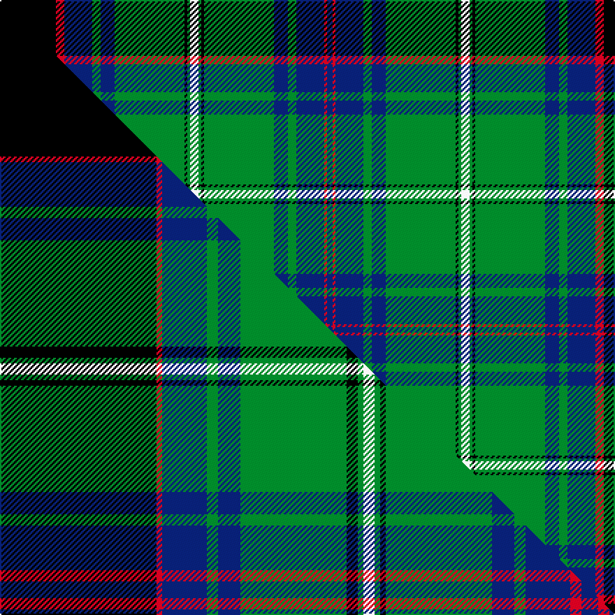

This page is one **sett** — a single exact thread-count. It belongs to the [tartan](/setts/k20r3db10g3db5g25k1g1w3g1k1g25db5g3db10r1db2/)
(the same proportion at any scale), whose colour order is pattern [BRBGBGKGWGKGBGBRK](/stripes/brbgbgkgwgkgbgbrk/).

Part of the [Blairlogie or Blair Athol](/tartans/blairlogie-or-blair-athol/) tartan — the named design grouping this sett with its other cloths.

Sourced from weddslist.  It is a [17 stripe tartan](/stripes/stripes17/).

Original link [http://www.weddslist.com/cgi-bin/tartans/pg.pl?source=sts](http://www.weddslist.com/cgi-bin/tartans/pg.pl?source=sts)

## Provenance

Earliest known date: 1882 Discovered by a STS member in 1967 in the records of D C Dalgleish (Weavers) of Selkirk. Three counts are given in varying widths.

2 attestations — the source records this cloth was collapsed from (oldest owns this page)

<ul>
<li>undated — Blairlogie, or Blair Athol (weddslist, <a href="http://www.weddslist.com/cgi-bin/tartans/pg.pl?source=sts">record</a>) </li>
<li>undated — Blairlogie or Blair Athol District Tartan (house-of-tartan, <a href="http://www.house-of-tartan.scotland.net/house/TartanViewjs.asp?colr=Def&tnam=443">record</a>) </li>
</ul>

Dataset <small>— provenance for this record, inherited from the source manifest</small>

<dl class="dataset-prov">
<dt>source</dt><dd><a href="/sources/weddslist/">Weddslist</a></dd>
<dt>data captured from</dt><dd><a href="https://github.com/thetartan/tartan-database/blob/master/data/weddslist/data.csv">https://github.com/thetartan/tartan-database/blob/master/data/weddslist/data.csv</a></dd>
<dt>data date</dt><dd>2016-11-17 <small>(dataset default)</small></dd>
<dt>licence</dt><dd><a href="https://creativecommons.org/licenses/by-nc-nd/4.0/">CC BY-NC-ND 4.0</a></dd>
</dl>

Capture chain <small>— the hands this data passed through, oldest first; each capture carries its own licence</small>

<ol class="capture-chain">
<li><a href="https://www.weddslist.com/tartans/">Weddslist</a> <small>the living privately compiled reference</small></li>
<li><a href="https://github.com/thetartan/tartan-database">thetartan/tartan-database</a> <small>2016-2017</small> · <a href="https://creativecommons.org/licenses/by-nc-nd/4.0/">CC BY-NC-ND 4.0</a> <small>Levko Kravets's frozen compilation — the capture we vendored, and where its CC licence text came from</small></li>
<li>this dictionary <small>captured 2026-06-10 · commit 5bf86c7566</small> <small>each re-capture is a git commit to data/sources</small></li>
</ol>

## Thread count
K/40 R6 DB20 G6 DB10 G50 K2 G2 W6 G2 K2 G50 DB10 G6 DB20 R2 DB/4

One full sett is **432 threads**.

## Palette
<table><thead><tr><th>Colour</th><th>Shade</th><th>OKLCh</th></tr></thead><tbody><tr><td>DB</td><td><code style="background-color:#082077;">#082077</code> <small style="color:#888">#082077</small></td><td><small style="color:#888">oklch(30.0% 0.149 265.1)</small></td></tr><tr><td>G</td><td><code style="background-color:#008B2A;">#008B2A</code> <small style="color:#888">#008B2A</small></td><td><small style="color:#888">oklch(55.4% 0.170 145.9)</small></td></tr><tr><td>K</td><td><code style="background-color:#000000;">#000000</code> <small style="color:#888">#000000</small></td><td><small style="color:#888">oklch(0.0% 0.000 0.0)</small></td></tr><tr><td>W</td><td><code style="background-color:#F7F7F7;">#F7F7F7</code> <small style="color:#888">#F7F7F7</small></td><td><small style="color:#888">oklch(97.6% 0.000 89.9)</small></td></tr><tr><td>R</td><td><code style="background-color:#D60020;">#D60020</code> <small style="color:#888">#D60020</small></td><td><small style="color:#888">oklch(55.2% 0.224 25.5)</small></td></tr></tbody></table>

# Sample pattern

## Compared to the master

This cloth is one sett of its design; the master sett (the exemplar the design is anchored on) is below for comparison.

Its **ΔTartan distance** from the master is **0.50** — the same measure the nearest-tartans table ranks by (0 is identical; a re-scale of the same cloth is near 0, a recolour or a different proportion further).

<figure class="master-compare" style="margin:0">

this sett
master sett ★

<figcaption style="color:#888;font-size:smaller">One weave of this sett against the <a href="/setts/k28r1db8g2db4g19k2g1w2g1k1g19db4g2db8r2db3/">master sett ★</a>, split on the diagonal: a shared proportion runs seamlessly across it with only the shades shifting; a different proportion breaks on it.</figcaption>
</figure>

## Nearest tartan variants

The nearest existing variants by ΔTartan distance, with this cloth at the top so the swatches line up against it.

ΔTartan

Threads

Variant

Sett

—

432

<a href="/variants/s17/k20r3db10g3db5g25k1g1w3g1k1g25db5g3db10r1db2~x2/">Blairlogie, or Blair Athol</a>

<a href="/ttd/edit/#slug=k28r2db9g2db4g20k1g1w2g1k1g20db4g2db9r1db3~x2&amp;base=k20r3db10g3db5g25k1g1w3g1k1g25db5g3db10r1db2~x2" title="compare in the TTD">0.44</a>

378

<a href="/variants/s17/k28r2db9g2db4g20k1g1w2g1k1g20db4g2db9r1db3~x2/">Blairlogie (District)</a>

<a href="/ttd/edit/#slug=k28r1db8g2db4g19k2g1w2g1k1g19db4g2db8r2db3~x4&amp;base=k20r3db10g3db5g25k1g1w3g1k1g25db5g3db10r1db2~x2" title="compare in the TTD">0.50</a>

732

<a href="/variants/s17/k28r1db8g2db4g19k2g1w2g1k1g19db4g2db8r2db3~x4/">Blairlogie or Blair Athol</a>

<a href="/ttd/edit/#slug=k20y3db10g3db5g25k1g1w3g1k1g25db5g3db10y1db2~x4&amp;base=k20r3db10g3db5g25k1g1w3g1k1g25db5g3db10r1db2~x2" title="compare in the TTD">0.60</a>

864

<a href="/variants/s17/k20y3db10g3db5g25k1g1w3g1k1g25db5g3db10y1db2~x4/">Blairgowrie</a>

<a href="/ttd/edit/#slug=db15k18g3k2g2k2g44y4g44k2g2k2g3k18db15r4~x2&amp;base=k20r3db10g3db5g25k1g1w3g1k1g25db5g3db10r1db2~x2" title="compare in the TTD">1.74</a>

682

<a href="/variants/s16/db15k18g3k2g2k2g44y4g44k2g2k2g3k18db15r4~x2/">Sarafilovic</a>

<a href="/ttd/edit/#slug=dr6g1lb2g24k3g3k3g3k8db8lb2db4~x2&amp;base=k20r3db10g3db5g25k1g1w3g1k1g25db5g3db10r1db2~x2" title="compare in the TTD">1.94</a>

248

<a href="/variants/s12/dr6g1lb2g24k3g3k3g3k8db8lb2db4~x2/">Kerby/Kirby</a>

<a href="/ttd/edit/#slug=g6w2g24k12db3k2db2k2db12r1db1r3~x2~w4000000-db1406275&amp;base=k20r3db10g3db5g25k1g1w3g1k1g25db5g3db10r1db2~x2" title="compare in the TTD">2.14</a>

262

<a href="/variants/s12/g6w2g24k12db3k2db2k2db12r1db1r3~x2~w4000000-db1406275/">Sutherland</a>

<a href="/ttd/edit/#slug=t18db2k2db2k1t2k8g1ly1g6k8t14k2g2~x2&amp;base=k20r3db10g3db5g25k1g1w3g1k1g25db5g3db10r1db2~x2" title="compare in the TTD">2.14</a>

236

<a href="/variants/s14/t18db2k2db2k1t2k8g1ly1g6k8t14k2g2~x2/">Angove, the Black Swan (Name)</a>

<a href="/ttd/edit/#slug=g6w2g24k12db3k2db2k2db12r1db1r3~x2&amp;base=k20r3db10g3db5g25k1g1w3g1k1g25db5g3db10r1db2~x2" title="compare in the TTD">2.16</a>

262

<a href="/variants/s12/g6w2g24k12db3k2db2k2db12r1db1r3~x2/">Sutherland (Clan)</a>

<a href="/ttd/edit/#slug=g6w2g24k12db3k2db2k2db12r1db1r3&amp;base=k20r3db10g3db5g25k1g1w3g1k1g25db5g3db10r1db2~x2" title="compare in the TTD">2.16</a>

131

<a href="/variants/s12/g6w2g24k12db3k2db2k2db12r1db1r3/">Sutherland</a>

<a href="/ttd/edit/#slug=g34r4g4r2g4r2g3r4g17k17r2db17r4db4y3~x2&amp;base=k20r3db10g3db5g25k1g1w3g1k1g25db5g3db10r1db2~x2" title="compare in the TTD">2.29</a>

410

<a href="/variants/s15/g34r4g4r2g4r2g3r4g17k17r2db17r4db4y3~x2/">Cochrane (1984) Clan Tartan</a>

## Neighbour map

Every grey dot is one of 13621 variants placed by the first two principal components of the ΔTartan feature space (42% of its variance). Red is this tartan; blue dots are its nearest — click one to open its page.

<svg viewBox="0 0 640 380" role="img" style="max-width:100%;height:auto;border:1px solid #e0e0e0;border-radius:4px;display:block" xmlns="http://www.w3.org/2000/svg"><image href="/nn/cloud.v1.png" width="640" height="380"/><a href="/variants/s17/k28r2db9g2db4g20k1g1w2g1k1g20db4g2db9r1db3~x2/"><circle cx="187.3" cy="75.1" r="4" fill="#3465a4"><title>Blairlogie (District)</title></circle></a><a href="/variants/s17/k28r1db8g2db4g19k2g1w2g1k1g19db4g2db8r2db3~x4/"><circle cx="183.4" cy="75.2" r="4" fill="#3465a4"><title>Blairlogie or Blair Athol</title></circle></a><a href="/variants/s17/k20y3db10g3db5g25k1g1w3g1k1g25db5g3db10y1db2~x4/"><circle cx="216.2" cy="88.5" r="4" fill="#3465a4"><title>Blairgowrie</title></circle></a><a href="/variants/s16/db15k18g3k2g2k2g44y4g44k2g2k2g3k18db15r4~x2/"><circle cx="244.1" cy="88.4" r="4" fill="#3465a4"><title>Sarafilovic</title></circle></a><a href="/variants/s12/dr6g1lb2g24k3g3k3g3k8db8lb2db4~x2/"><circle cx="193.8" cy="106.7" r="4" fill="#3465a4"><title>Kerby/Kirby</title></circle></a><a href="/variants/s12/g6w2g24k12db3k2db2k2db12r1db1r3~x2~w4000000-db1406275/"><circle cx="171.1" cy="77.9" r="4" fill="#3465a4"><title>Sutherland</title></circle></a><a href="/variants/s14/t18db2k2db2k1t2k8g1ly1g6k8t14k2g2~x2/"><circle cx="206.6" cy="112.9" r="4" fill="#3465a4"><title>Angove, the Black Swan (Name)</title></circle></a><a href="/variants/s12/g6w2g24k12db3k2db2k2db12r1db1r3~x2/"><circle cx="187.9" cy="102.8" r="4" fill="#3465a4"><title>Sutherland (Clan)</title></circle></a><a href="/variants/s12/g6w2g24k12db3k2db2k2db12r1db1r3/"><circle cx="187.9" cy="102.8" r="4" fill="#3465a4"><title>Sutherland</title></circle></a><a href="/variants/s15/g34r4g4r2g4r2g3r4g17k17r2db17r4db4y3~x2/"><circle cx="211.6" cy="107.5" r="4" fill="#3465a4"><title>Cochrane (1984) Clan Tartan</title></circle></a><circle cx="211.5" cy="84.9" r="5" fill="#c00000"/><text x="320" y="376" text-anchor="middle" font-size="11" fill="#999">ground</text><text x="11" y="190" text-anchor="middle" font-size="11" fill="#999" transform="rotate(-90 11 190)">complexity</text></svg>

ID: /variants/s17/k20r3db10g3db5g25k1g1w3g1k1g25db5g3db10r1db2~x2/
