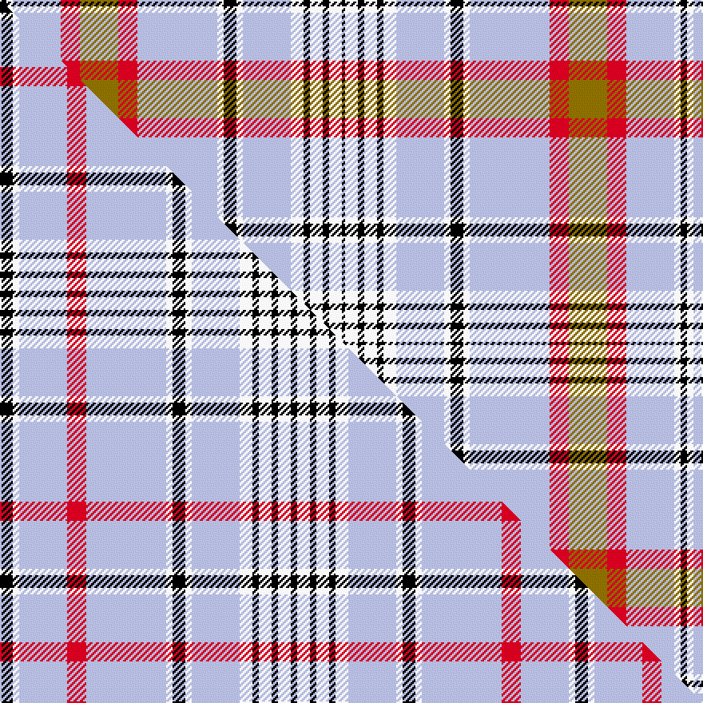

This is one **variant** — a specific cloth: this exact thread count and colourway, with its own
provenance below. It is one weaving of the [sett](/setts/k2w2lb15r6y12r6lb25w2k4w2lb15w4k2w4k2w4k1/) (the scale-free proportion — the
same cloth at any scale or shade), whose colour order is pattern [KWKWKWWWKWWRGRWWK](/stripes/kwkwkwwwkwwrgrwwk/).

Part of the [Beck](/tartans/b/be/beck/) tartan — the named design grouping this sett with its other cloths.

Sourced from tartans-authority.  It is a [17 stripe tartan](/stripes/stripes17/).

Original link [https://www.tartanregister.gov.uk/tartanDetails.aspx?ref=3819](https://www.tartanregister.gov.uk/tartanDetails.aspx?ref=3819)

Dataset <small>— provenance for this record, inherited from the source manifest</small>

<dl class="dataset-prov">
<dt>source</dt><dd><a href="/sources/tartans-authority/">Scottish Tartans Authority</a></dd>
<dt>data captured from</dt><dd><a href="https://github.com/thetartan/tartan-database/blob/master/data/tartans-authority/data.csv">https://github.com/thetartan/tartan-database/blob/master/data/tartans-authority/data.csv</a></dd>
<dt>data date</dt><dd>2002 <small>(this record)</small></dd>
<dt>licence</dt><dd><a href="https://creativecommons.org/licenses/by-nc-nd/4.0/">CC BY-NC-ND 4.0</a></dd>
</dl>

Capture chain <small>— the hands this data passed through, oldest first; each capture carries its own licence</small>

<ol class="capture-chain">
<li><a href="https://www.tartansauthority.com/">Scottish Tartans Authority</a> <small>the heritage body's archive — its tartan-ferret record browser is retired (links repaired to the SRT, above)</small></li>
<li><a href="https://github.com/thetartan/tartan-database">thetartan/tartan-database</a> <small>2016-2017</small> · <a href="https://creativecommons.org/licenses/by-nc-nd/4.0/">CC BY-NC-ND 4.0</a> <small>Levko Kravets's frozen compilation — the capture we vendored, and where its CC licence text came from</small></li>
<li>this dictionary <small>captured 2026-06-10 · commit 5bf86c7566</small> <small>each re-capture is a git commit to data/sources</small></li>
</ol>

## Register references

External register numbers recorded for this tartan.

- Scottish Tartans Authority (ITI): 3819

## Thread count
K/4 W4 LB30 R12 Y24 R12 LB50 W4 K8 W4 LB30 W8 K4 W8 K4 W8 K/2

One full sett is **426 threads**.

## Palette
<table><thead><tr><th>Colour</th><th>Shade</th><th>OKLCh</th></tr></thead><tbody><tr><td>LB</td><td><code style="background-color:#B5BBDE;">#B5BBDE</code> <small style="color:#888">#B5BBDE</small></td><td><small style="color:#888">oklch(79.9% 0.050 277.6)</small></td></tr><tr><td>K</td><td><code style="background-color:#000000;">#000000</code> <small style="color:#888">#000000</small></td><td><small style="color:#888">oklch(0.0% 0.000 0.0)</small></td></tr><tr><td>W</td><td><code style="background-color:#F7F7F7;">#F7F7F7</code> <small style="color:#888">#F7F7F7</small></td><td><small style="color:#888">oklch(97.6% 0.000 89.9)</small></td></tr><tr><td>R</td><td><code style="background-color:#D60020;">#D60020</code> <small style="color:#888">#D60020</small></td><td><small style="color:#888">oklch(55.2% 0.224 25.5)</small></td></tr><tr><td>Y</td><td><code style="background-color:#8B6E00;">#8B6E00</code> <small style="color:#888">#8B6E00</small></td><td><small style="color:#888">oklch(55.1% 0.113 90.4)</small></td></tr></tbody></table>

# Sample pattern

## Compared to the master

This cloth is one sett of its design; the master sett (the exemplar the design is anchored on) is below for comparison.

Its **ΔTartan distance** from the master is **1.08** — the same measure the nearest-tartans table ranks by (0 is identical; a re-scale of the same cloth is near 0, a recolour or a different proportion further).

<figure class="master-compare" style="margin:0">

this sett
master sett ★

<figcaption style="color:#888;font-size:smaller">One weave of this sett against the <a href="/setts/k4w2lb15r6lb25w2k4w2lb15w4k2w4k2w4k2/">master sett ★</a>, split on the diagonal: a shared proportion runs seamlessly across it with only the shades shifting; a different proportion breaks on it.</figcaption>
</figure>

## Nearest tartan variants

The nearest existing variants by ΔTartan distance, with this cloth at the top so the swatches line up against it.

ΔTartan

Threads

Variant

Sett

—

426

<a href="/variants/s17/k2w2lb15r6y12r6lb25w2k4w2lb15w4k2w4k2w4k1~x2/">Beck (Personal)</a>

<a href="/ttd/edit/#slug=k4w2lb15r6lb25w2k4w2lb15w4k2w4k2w4k2~x2&amp;base=k2w2lb15r6y12r6lb25w2k4w2lb15w4k2w4k2w4k1~x2" title="compare in the TTD">1.08</a>

360

<a href="/variants/s15/k4w2lb15r6lb25w2k4w2lb15w4k2w4k2w4k2~x2/">Beck (Personal)</a>

<a href="/ttd/edit/#slug=k4lb2w15r6y12r6w25lb2k4lb2w15lb4k2lb4k2lb4k1~x2&amp;base=k2w2lb15r6y12r6lb25w2k4w2lb15w4k2w4k2w4k1~x2" title="compare in the TTD">1.31</a>

430

<a href="/variants/s17/k4lb2w15r6y12r6w25lb2k4lb2w15lb4k2lb4k2lb4k1~x2/">Beck Dress (Personal)</a>

<a href="/ttd/edit/#slug=dy4lb1dy2lb1dy2lb16k1g8dy8r8k1lb24k1w4~x2&amp;base=k2w2lb15r6y12r6lb25w2k4w2lb15w4k2w4k2w4k1~x2" title="compare in the TTD">2.48</a>

308

<a href="/variants/s14/dy4lb1dy2lb1dy2lb16k1g8dy8r8k1lb24k1w4~x2/">Ethiopia</a>

<a href="/ttd/edit/#slug=w16dy1k2dy1w16g2k1g2r22w4db3w4db3w4db3~x2&amp;base=k2w2lb15r6y12r6lb25w2k4w2lb15w4k2w4k2w4k1~x2" title="compare in the TTD">2.70</a>

298

<a href="/variants/s15/w16dy1k2dy1w16g2k1g2r22w4db3w4db3w4db3~x2/">Salaberry-de-Valleyfield Ceremonial</a>

<a href="/ttd/edit/#slug=k6g4k1w16lb1w4lb6w1lb6w4lb1w16k1g4k6y1~x2&amp;base=k2w2lb15r6y12r6lb25w2k4w2lb15w4k2w4k2w4k1~x2" title="compare in the TTD">2.71</a>

298

<a href="/variants/s16/k6g4k1w16lb1w4lb6w1lb6w4lb1w16k1g4k6y1~x2/">Henderson Dress #1</a>

<a href="/ttd/edit/#slug=w16ly1k2ly1w16g2k1g2r22w4db3w4db3w4db3~x2&amp;base=k2w2lb15r6y12r6lb25w2k4w2lb15w4k2w4k2w4k1~x2" title="compare in the TTD">2.74</a>

298

<a href="/variants/s15/w16ly1k2ly1w16g2k1g2r22w4db3w4db3w4db3~x2/">Salaberry-de-Valleyfield Cer. (Dis )</a>

<a href="/ttd/edit/#slug=lb18y2lb2y1r3g3r2g2r1k2lb3w7lb2w2lb1w4~x4&amp;base=k2w2lb15r6y12r6lb25w2k4w2lb15w4k2w4k2w4k1~x2" title="compare in the TTD">3.04</a>

352

<a href="/variants/s16/lb18y2lb2y1r3g3r2g2r1k2lb3w7lb2w2lb1w4~x4/">Inverness County (Canada) (District)</a>

<a href="/ttd/edit/#slug=w9r5w29k10y2k3w3k3g12r6k3r3w2~x2&amp;base=k2w2lb15r6y12r6lb25w2k4w2lb15w4k2w4k2w4k1~x2" title="compare in the TTD">3.10</a>

338

<a href="/variants/s13/w9r5w29k10y2k3w3k3g12r6k3r3w2~x2/">Hay, or Stewart</a>

<a href="/ttd/edit/#slug=w9r5w29k10y2k3w3k3dg12r6k3r3w2~x2&amp;base=k2w2lb15r6y12r6lb25w2k4w2lb15w4k2w4k2w4k1~x2" title="compare in the TTD">3.13</a>

338

<a href="/variants/s13/w9r5w29k10y2k3w3k3dg12r6k3r3w2~x2/">Hay or Stewart</a>

<a href="/ttd/edit/#slug=w60dt24n3dt5w3dt5o16n8k3n6w4&amp;base=k2w2lb15r6y12r6lb25w2k4w2lb15w4k2w4k2w4k1~x2" title="compare in the TTD">3.19</a>

210

<a href="/variants/s11/w60dt24n3dt5w3dt5o16n8k3n6w4/">Glenmore Pink</a>

## Neighbour map

Every grey dot is one of 13656 variants placed by the first two principal components of the ΔTartan feature space (42% of its variance). Red is this tartan; blue dots are its nearest — click one to open its page. The map is a flat projection of a many-dimensional space — [how to read it](/posts/neighbourhood-maps/).

<svg viewBox="0 0 640 380" role="img" style="max-width:100%;height:auto;border:1px solid #e0e0e0;border-radius:4px;display:block" xmlns="http://www.w3.org/2000/svg"><image href="/nn/cloud.v1.png" width="640" height="380"/><a href="/variants/s15/k4w2lb15r6lb25w2k4w2lb15w4k2w4k2w4k2~x2/"><circle cx="249.9" cy="122.5" r="4" fill="#3465a4"><title>Beck (Personal)</title></circle></a><a href="/variants/s17/k4lb2w15r6y12r6w25lb2k4lb2w15lb4k2lb4k2lb4k1~x2/"><circle cx="184.0" cy="85.2" r="4" fill="#3465a4"><title>Beck Dress (Personal)</title></circle></a><a href="/variants/s14/dy4lb1dy2lb1dy2lb16k1g8dy8r8k1lb24k1w4~x2/"><circle cx="210.1" cy="77.0" r="4" fill="#3465a4"><title>Ethiopia</title></circle></a><a href="/variants/s15/w16dy1k2dy1w16g2k1g2r22w4db3w4db3w4db3~x2/"><circle cx="206.0" cy="70.6" r="4" fill="#3465a4"><title>Salaberry-de-Valleyfield Ceremonial</title></circle></a><a href="/variants/s16/k6g4k1w16lb1w4lb6w1lb6w4lb1w16k1g4k6y1~x2/"><circle cx="184.7" cy="108.9" r="4" fill="#3465a4"><title>Henderson Dress #1</title></circle></a><a href="/variants/s15/w16ly1k2ly1w16g2k1g2r22w4db3w4db3w4db3~x2/"><circle cx="207.3" cy="71.2" r="4" fill="#3465a4"><title>Salaberry-de-Valleyfield Cer. (Dis )</title></circle></a><a href="/variants/s16/lb18y2lb2y1r3g3r2g2r1k2lb3w7lb2w2lb1w4~x4/"><circle cx="195.2" cy="89.0" r="4" fill="#3465a4"><title>Inverness County (Canada) (District)</title></circle></a><a href="/variants/s13/w9r5w29k10y2k3w3k3g12r6k3r3w2~x2/"><circle cx="160.9" cy="110.0" r="4" fill="#3465a4"><title>Hay, or Stewart</title></circle></a><a href="/variants/s13/w9r5w29k10y2k3w3k3dg12r6k3r3w2~x2/"><circle cx="160.8" cy="108.4" r="4" fill="#3465a4"><title>Hay or Stewart</title></circle></a><a href="/variants/s11/w60dt24n3dt5w3dt5o16n8k3n6w4/"><circle cx="214.3" cy="97.4" r="4" fill="#3465a4"><title>Glenmore Pink</title></circle></a><circle cx="203.8" cy="86.5" r="5" fill="#c00000"/><text x="320" y="376" text-anchor="middle" font-size="11" fill="#999">ground</text><text x="11" y="190" text-anchor="middle" font-size="11" fill="#999" transform="rotate(-90 11 190)">complexity</text></svg>

ID: /variants/s17/k2w2lb15r6y12r6lb25w2k4w2lb15w4k2w4k2w4k1~x2/
