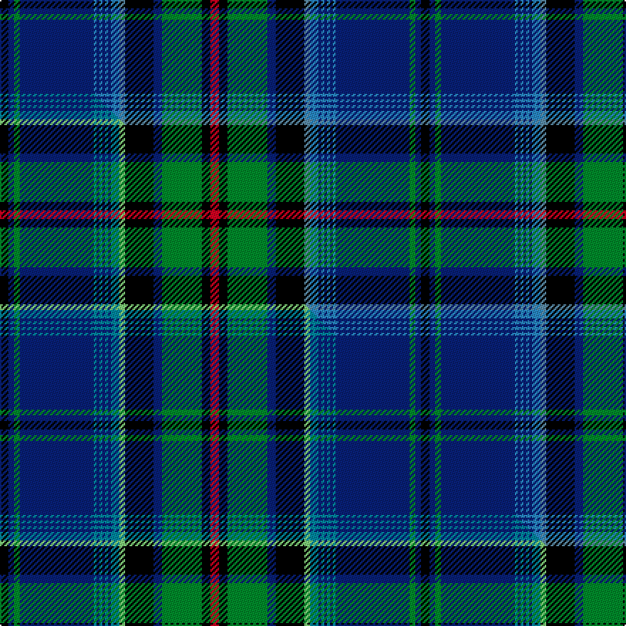

This page is one **sett** — a single exact thread-count. It belongs to the [tartan](/setts/k3db2g2db26t1db1t1db1t1db1t3ti2k10db3g14k3r3/)
(the same proportion at any scale), whose colour order is pattern [KBGBBBBBBBBBKBGKR](/stripes/kbgbbbbbbbbbkbgkr/).

Part of the [St. Lawrence](/tartans/st-lawrence/) tartan — the named design grouping this sett with its other cloths.

Sourced from house-of-tartan.  It is a [17 stripe tartan](/stripes/stripes17/).

Original link http://www.house-of-tartan.scotland.net/house/TartanViewjs.asp?colr=Def&tnam=1030

## Provenance

Earliest known date: pre 1963 Presented to the STS collection by Mr A Yule in 1963. designed by Mrs. Helene Cobb of Clayton and is the registered trademark of the Thousand Islands Museum in Clayton, New York State - www.timuseum.org Woven by Peter MacArthur of Biggar, Scotland. The greens are for the cedars along the shore, the blues are for the St Lawrence River, and the red is the sunset over the Islands. John Fitzpatrick in his review of Canadian tartans in July 2008, pointed out that there were two slightly different thread counts given in the CIDD.

## Thread count
K/6 DB4 G4 DB52 T2 DB2 T2 DB2 T2 DB2 T6 Ti4 K20 DB6 G28 K6 R/6

One full sett is **296 threads**.

## Palette
<table><thead><tr><th>Colour</th><th>Shade</th><th>OKLCh</th></tr></thead><tbody><tr><td>T</td><td><code style="background-color:#5C8CA8;">#5C8CA8</code> <small style="color:#888">#5C8CA8</small></td><td><small style="color:#888">oklch(61.7% 0.067 235.0)</small></td></tr><tr><td>T</td><td><code style="background-color:#2888C4;">#2888C4</code> <small style="color:#888">#2888C4</small></td><td><small style="color:#888">oklch(60.1% 0.125 241.5)</small></td></tr><tr><td>DB</td><td><code style="background-color:#082077;">#082077</code> <small style="color:#888">#082077</small></td><td><small style="color:#888">oklch(30.0% 0.149 265.1)</small></td></tr><tr><td>G</td><td><code style="background-color:#008B2A;">#008B2A</code> <small style="color:#888">#008B2A</small></td><td><small style="color:#888">oklch(55.4% 0.170 145.9)</small></td></tr><tr><td>K</td><td><code style="background-color:#000000;">#000000</code> <small style="color:#888">#000000</small></td><td><small style="color:#888">oklch(0.0% 0.000 0.0)</small></td></tr><tr><td>R</td><td><code style="background-color:#D60020;">#D60020</code> <small style="color:#888">#D60020</small></td><td><small style="color:#888">oklch(55.2% 0.224 25.5)</small></td></tr></tbody></table>

# Sample pattern

## Compared to the master

This cloth is one sett of its design; the master sett (the exemplar the design is anchored on) is below for comparison.

Its **ΔTartan distance** from the master is **0.31** — the same measure the nearest-tartans table ranks by (0 is identical; a re-scale of the same cloth is near 0, a recolour or a different proportion further).

<figure class="master-compare" style="margin:0">

this sett
master sett ★

<figcaption style="color:#888;font-size:smaller">One weave of this sett against the <a href="/setts/k3db2g2db26t1db1t1db1t1db1t3lg2k10db3g14k3r3/">master sett ★</a>, split on the diagonal: a shared proportion runs seamlessly across it with only the shades shifting; a different proportion breaks on it.</figcaption>
</figure>

## Nearest tartan variants

The nearest existing variants by ΔTartan distance, with this cloth at the top so the swatches line up against it.

ΔTartan

Threads

Variant

Sett

—

296

<a href="/variants/s17/k3db2g2db26t1db1t1db1t1db1t3ti2k10db3g14k3r3~x2~t2405244-ti2503227/">St Lawrence District Tartan</a>

<a href="/ttd/edit/#slug=k3db2g2db26b1db1b1db1b1db1b3lb2k10db3g14k3r3~x2&amp;base=k3db2g2db26t1db1t1db1t1db1t3ti2k10db3g14k3r3~x2~t2405244-ti2503227" title="compare in the TTD">0.03</a>

296

<a href="/variants/s17/k3db2g2db26b1db1b1db1b1db1b3lb2k10db3g14k3r3~x2/">St Lawrence</a>

<a href="/ttd/edit/#slug=k3db2g2db26t1db1t1db1t1db1t3lg2k10db3g14k3r3~x2&amp;base=k3db2g2db26t1db1t1db1t1db1t3ti2k10db3g14k3r3~x2~t2405244-ti2503227" title="compare in the TTD">0.31</a>

296

<a href="/variants/s17/k3db2g2db26t1db1t1db1t1db1t3lg2k10db3g14k3r3~x2/">St. Lawrence</a>

<a href="/ttd/edit/#slug=y3db2k1db24k2db2k2db2k2g8dp2g8k1w2~x2&amp;base=k3db2g2db26t1db1t1db1t1db1t3ti2k10db3g14k3r3~x2~t2405244-ti2503227" title="compare in the TTD">1.75</a>

234

<a href="/variants/s14/y3db2k1db24k2db2k2db2k2g8dp2g8k1w2~x2/">Alexander-Johnstone (Personal)</a>

<a href="/ttd/edit/#slug=db7k1r3k1db24k1w3k3g3k3g3dg19k2w4~x2~g1903114-dg1806142&amp;base=k3db2g2db26t1db1t1db1t1db1t3ti2k10db3g14k3r3~x2~t2405244-ti2503227" title="compare in the TTD">2.03</a>

286

<a href="/variants/s14/db7k1r3k1db24k1w3k3g3k3g3dg19k2w4~x2~g1903114-dg1806142/">Strathclyde, University of (Corporat</a>

<a href="/ttd/edit/#slug=db28y6k2y1k2y6w6g2w1g2w6db28n4k5g8k5n4~x2&amp;base=k3db2g2db26t1db1t1db1t1db1t3ti2k10db3g14k3r3~x2~t2405244-ti2503227" title="compare in the TTD">2.10</a>

400

<a href="/variants/s17/db28y6k2y1k2y6w6g2w1g2w6db28n4k5g8k5n4~x2/">Bog Myrtle Corner</a>

<a href="/ttd/edit/#slug=db7k1r3k1db24k1w3k3dg3k3dg3g19k2w4~x2&amp;base=k3db2g2db26t1db1t1db1t1db1t3ti2k10db3g14k3r3~x2~t2405244-ti2503227" title="compare in the TTD">2.23</a>

286

<a href="/variants/s14/db7k1r3k1db24k1w3k3dg3k3dg3g19k2w4~x2/">Strathclyde, University of</a>

<a href="/ttd/edit/#slug=dp4db5dp3db50k15g3k5g32w2g3w2g32k5g5k15db50dp3k5dp3&amp;base=k3db2g2db26t1db1t1db1t1db1t3ti2k10db3g14k3r3~x2~t2405244-ti2503227" title="compare in the TTD">2.30</a>

477

<a href="/variants/s19/dp4db5dp3db50k15g3k5g32w2g3w2g32k5g5k15db50dp3k5dp3/">Spirit of Morningside</a>

<a href="/ttd/edit/#slug=db28k4lb4k4db4k4g26k2y5k2g26k4db40k4r10&amp;base=k3db2g2db26t1db1t1db1t1db1t3ti2k10db3g14k3r3~x2~t2405244-ti2503227" title="compare in the TTD">2.35</a>

296

<a href="/variants/s15/db28k4lb4k4db4k4g26k2y5k2g26k4db40k4r10/">Bailey, The House of</a>

<a href="/ttd/edit/#slug=dr2k2db3lo1db20k1g18k1dr2db2k1db2k1db2k2g2k2dr2~x2&amp;base=k3db2g2db26t1db1t1db1t1db1t3ti2k10db3g14k3r3~x2~t2405244-ti2503227" title="compare in the TTD">2.39</a>

256

<a href="/variants/s18/dr2k2db3lo1db20k1g18k1dr2db2k1db2k1db2k2g2k2dr2~x2/">Craig (Personal)</a>

<a href="/ttd/edit/#slug=db38w2db2k10g2y2g22k3r3k3r3~x2&amp;base=k3db2g2db26t1db1t1db1t1db1t3ti2k10db3g14k3r3~x2~t2405244-ti2503227" title="compare in the TTD">2.41</a>

278

<a href="/variants/s11/db38w2db2k10g2y2g22k3r3k3r3~x2/">Hunnisett, /Edinchip</a>

## Neighbour map

Every grey dot is one of 13620 variants placed by the first two principal components of the ΔTartan feature space (42% of its variance). Red is this tartan; blue dots are its nearest — click one to open its page.

<svg viewBox="0 0 640 380" role="img" style="max-width:100%;height:auto;border:1px solid #e0e0e0;border-radius:4px;display:block" xmlns="http://www.w3.org/2000/svg"><image href="/nn/cloud.v1.png" width="640" height="380"/><a href="/variants/s17/k3db2g2db26b1db1b1db1b1db1b3lb2k10db3g14k3r3~x2/"><circle cx="186.0" cy="55.7" r="4" fill="#3465a4"><title>St Lawrence</title></circle></a><a href="/variants/s17/k3db2g2db26t1db1t1db1t1db1t3lg2k10db3g14k3r3~x2/"><circle cx="184.4" cy="56.2" r="4" fill="#3465a4"><title>St. Lawrence</title></circle></a><a href="/variants/s14/y3db2k1db24k2db2k2db2k2g8dp2g8k1w2~x2/"><circle cx="220.8" cy="73.0" r="4" fill="#3465a4"><title>Alexander-Johnstone (Personal)</title></circle></a><a href="/variants/s14/db7k1r3k1db24k1w3k3g3k3g3dg19k2w4~x2~g1903114-dg1806142/"><circle cx="149.8" cy="74.3" r="4" fill="#3465a4"><title>Strathclyde, University of (Corporat</title></circle></a><a href="/variants/s17/db28y6k2y1k2y6w6g2w1g2w6db28n4k5g8k5n4~x2/"><circle cx="180.2" cy="62.9" r="4" fill="#3465a4"><title>Bog Myrtle Corner</title></circle></a><a href="/variants/s14/db7k1r3k1db24k1w3k3dg3k3dg3g19k2w4~x2/"><circle cx="143.5" cy="73.2" r="4" fill="#3465a4"><title>Strathclyde, University of</title></circle></a><a href="/variants/s19/dp4db5dp3db50k15g3k5g32w2g3w2g32k5g5k15db50dp3k5dp3/"><circle cx="203.1" cy="80.3" r="4" fill="#3465a4"><title>Spirit of Morningside</title></circle></a><a href="/variants/s15/db28k4lb4k4db4k4g26k2y5k2g26k4db40k4r10/"><circle cx="169.8" cy="92.1" r="4" fill="#3465a4"><title>Bailey, The House of</title></circle></a><a href="/variants/s18/dr2k2db3lo1db20k1g18k1dr2db2k1db2k1db2k2g2k2dr2~x2/"><circle cx="215.9" cy="78.5" r="4" fill="#3465a4"><title>Craig (Personal)</title></circle></a><a href="/variants/s11/db38w2db2k10g2y2g22k3r3k3r3~x2/"><circle cx="185.7" cy="85.1" r="4" fill="#3465a4"><title>Hunnisett, /Edinchip</title></circle></a><circle cx="187.8" cy="56.8" r="5" fill="#c00000"/><text x="320" y="376" text-anchor="middle" font-size="11" fill="#999">ground</text><text x="11" y="190" text-anchor="middle" font-size="11" fill="#999" transform="rotate(-90 11 190)">complexity</text></svg>

ID: /variants/s17/k3db2g2db26t1db1t1db1t1db1t3ti2k10db3g14k3r3~x2~t2405244-ti2503227/
